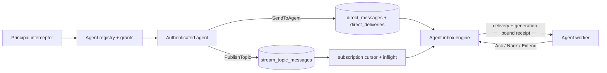

# Agent-First Messaging Infrastructure Implementation Plan

> **For agentic workers:** REQUIRED SUB-SKILL: Use superpowers:subagent-driven-development (recommended) or superpowers:executing-plans to implement this plan task-by-task. Steps use checkbox (`- [ ]`) syntax for tracking.

**Goal:** Turn PlainQ into a production-safe, multi-tenant messaging substrate where an authenticated agent has a durable inbox, can send to itself or another agent, and can publish or subscribe without knowing physical queue identifiers.

**Architecture:** Preserve the published `PlainQService` queue and queue-fan-out RPCs as a compatibility surface, then add an additive `agent.v1` package containing `AgentService`, `PubSubService`, and `SystemService`. Direct messages use shared envelope and delivery tables rather than one SQL table per agent; topics use the approved append-only log plus subscription cursors and leased delivery rows, so publish cost is independent of stored subscriber count. Every durable claim is protected by a rotated opaque receipt stored only as a SHA-256 hash, all resources are tenant-owned, and the same commands, snapshots, limits, and failure semantics apply to SQLite, Turso, PostgreSQL, and SQLite/Raft.

**Tech Stack:** Go 1.26.4, protobuf/gRPC 1.83, Buf, vtprotobuf, SQLite/litekit, Turso/libSQL, PostgreSQL/pgx v5, HashiCorp Raft, cristalhq/jwt v5, VictoriaMetrics metrics, Chi HTTP, Astro/Bun Houston UI, Kubernetes controller-runtime, and the separate `github.com/marsolab/plainq-go-sdk` module.

## Global Constraints

- Delivery is at-least-once. The broker does not claim exactly-once processing or transactional coupling to an agent's external side effects.
- Topic partitions, subscription filters, log compaction, cross-topic transactions, topic dead-letter streams, broker-side priorities, and scheduled/not-before delivery remain excluded from this release; the approved single-stream semantics stay intact.
- Create `schema/agent/v1/messaging.proto` as the versioned agent-first contract. `schema/v1/schema.proto` remains the legacy contract and evolves only with additive receipt/idempotency fields and safe queue RPCs.
- Do not delete, rename, renumber, or change the semantics of any published `PlainQService` field or RPC.
- The legacy queue-fan-out topic API stays available during migration, is explicitly labelled legacy, and is not reused internally by `PubSubService` or `AgentService`.
- New topic storage is an append-only single ordered stream. One publish writes one retained message regardless of the number of durable subscriptions.
- An agent identity owns one logical durable inbox. Multiple processes authenticated as the same agent are competing consumers, not fan-out recipients.
- Topic fan-out is one subscription per recipient. Multiple consumers attached to one durable subscription share work.
- Direct-message order is best-effort FIFO per recipient. Topic dispatch order is offset order; completion order may differ when `max_inflight > 1`.
- A `message_id` is stable across retries and topic consumers. A `delivery_id` and `receipt_handle` are recipient/claim-specific.
- A receipt is accepted only for the authenticated owner, matching source, matching lease generation, and an unexpired current lease. Redelivery invalidates every older receipt.
- A receipt is 32 random bytes encoded with unpadded base64url. Persist/replicate/snapshot only its SHA-256 hash; never write the clear receipt, bootstrap credential, access token, message body, or full attributes to logs, metrics, or audit rows.
- Tenant identity for every `agent.v1` call comes from the authenticated principal, never from a caller-controlled data-plane field. Cross-tenant send, publish, subscribe, receive, and resource lookup are denied. The only exception is the explicitly versioned legacy-v1 compatibility mode completed after the Task 7 tenant migration, which maps anonymous old clients to the fixed migrated legacy tenant and can be disabled.
- Agent APIs deny anonymous access in every mode. An explicit loopback-only development flag may relax transport TLS, but it never bypasses credential exchange, access-token validation, or principal injection.
- Agent bootstrap credentials are high-entropy, shown once, stored only as SHA-256 hashes, independently revocable, and exchanged for five-minute access tokens; configuration may raise the TTL only up to 15 minutes.
- Producer idempotency is scoped by `(tenant_id, principal_kind, principal_id, operation, idempotency_key)`, retained for 24 hours, and rejects key reuse with a different canonical request hash.
- A send or publish batch is atomic. Responses preserve input order. Retrying the same idempotency keys returns the original message IDs and offsets.
- Default limits are: 1 MiB body, 4 MiB total encoded message data per send/publish batch or receive response, 16 KiB total attributes, 64 attributes, 128-byte attribute keys, 1 KiB attribute values, 128-byte kind/idempotency/correlation/causation/conversation fields, 255-byte content type, 100 messages per send/publish batch, 100 deliveries per receive, 20-second long poll, 1,000 inflight deliveries per agent or subscription, 10,000 agents per tenant, 1,000 topics per tenant, 1,000 subscriptions per agent, and 30-day maximum retention.
- Additional defaults are: two active credentials per agent, 100,000 pending direct deliveries or 1 GiB pending direct bytes per agent, 10 GiB stored messaging bytes per tenant, 10 direct delivery attempts before dead-letter, 30-day direct dead-letter retention, 90-day security-audit retention, and 1,000 send/publish message units per tenant per second.
- Client deadlines always bound unary and streaming setup work. A stream is an optimization over the durable claim state machine, not the durability boundary.
- SQLite and PostgreSQL behavior must pass the same conformance suite. Turso uses the SQLite schema and conformance suite with its backend-specific integration job.
- In SQLite/Raft mode, IDs, timestamps, receipt generations, and credential hashes are generated before proposal; every replica applies identical command bytes. New state is included in snapshot and restore tests before the feature can be enabled in a cluster.
- Existing installations migrate forward without rewriting BSR history or silently converting queue-fan-out subscriptions. The migration tool creates new append-log resources only after an explicit apply.
- Each task lands behind `--agent.enable=false` or an internal wiring boundary until its own acceptance checks pass. Do not expose half-built RPCs.
- Preserve the user's existing `.serena/project.yml` modification; it is unrelated to this plan.

---

## Preflight and plan boundaries

This is the coordinating plan for a cross-cutting program. Execute it in dependency order and keep each task in its own reviewed commit. Tasks 1-15 are the server contract and correctness path; Task 16 is the server operations boundary; Tasks 17-18 complete the disabled server-preview product slice. That slice must be reviewed, merged, and immutably published by the blocking checkpoint before Task 19 can consume its schema in the separate SDK repository. Tasks 20-21 then continue deployment and operator work on a fresh post-merge server branch; Tasks 22-23 migrate, document, and prove the release. A task is complete only when its named focused tests and the relevant backend conformance tests pass.

The red/green rule is mandatory for every task: immediately after its first test step, run the narrowest `-run` expression from that task's verification command and record the expected compile/assertion failure before writing implementation. Then implement only enough to turn that test green, rerun it, and continue. Tasks that spell out a separate red step are examples, not exceptions; do not batch-write a task's production code before observing its first failure.

This plan deliberately amends one dated assumption in the approved 2026-04-13 pub/sub design: PlainQ now has SQLite/Raft clustering, so the agent-first state cannot ship as a single-node-only island. Task 15 adds feature-gated commands and snapshot compatibility rather than changing the approved single-stream delivery model.

Create a clean implementation worktree at execution time:

```bash
git worktree add ../plainq-agent-first -b feat/agent-first-messaging origin/main
cd ../plainq-agent-first
go test ./internal/server/service/queue/... ./internal/cluster/...
```

Expected: the focused baseline tests pass and `git status --short` is empty.

The data flow implemented by this plan is:



There is deliberately no publish-time arrow from a topic message to every subscription row.

## File map

### Public contract and generated bindings

- Create `schema/agent/v1/messaging.proto`: additive agent registry, direct messaging, append-log pub/sub, and capabilities contracts.
- Modify `schema/v1/schema.proto`: first add receive receipt fields in Task 2, then add safe queue idempotency and lease RPCs atomically with their implementation in Task 11.
- Modify `schema/buf.gen.yaml`: keep the public/BSR generator set complete for the new package.
- Add `schema/buf.docs.gen.yaml`: generate only the checked-in schema reference locally.
- Modify `internal/server/schema/buf.gen.yaml`: generate server bindings from the local schema source.
- Modify `Makefile`: split local generation from BSR consumption and add compatibility checks.
- Modify `.github/workflows/schema-pr.yaml` and `.github/workflows/schema-release.yaml`: run local/public generation checks, reject generated drift, and keep the existing PR/main breaking baselines.
- Regenerate both `internal/server/schema/agent/v1/messaging*.go` and the changed `internal/server/schema/v1/schema*.go` artifacts.
- Add `internal/server/schema/compat_test.go`: lock field numbers and prove old v1 request bytes still decode.

### Shared principal, receipt, limits, and notification primitives

- Add `internal/server/principal/principal.go` and `principal_test.go`: typed authenticated principal in context.
- Add `internal/server/security/opaque_receipt.go` and `opaque_receipt_test.go`: clear receipt generation and one-way hashing.
- Add `internal/server/security/agenttoken.go` and `agenttoken_test.go`: short-lived agent JWT issue/verify.
- Add `internal/server/interceptor/authn.go`, `authn_test.go`, `authz.go`, and `authz_test.go`: unary/stream authentication, authorization, redaction, and rate admission.
- Add `internal/server/limits/limits.go` and `limits_test.go`: one validated set of server limits.
- Add `internal/server/notify/hub.go` and `hub_test.go`: loss-tolerant keyed wakeups for long poll and streams.
- Modify `internal/server/config/config.go`, `internal/server/config/config_test.go`, and `cmd/server.go`: security, agent, limit, and transport flags.

### Agent service

- Add `internal/server/service/agent/model.go`: backend-neutral records and command inputs.
- Add `internal/server/service/agent/storage.go`: exact storage and state/snapshot interfaces.
- Add `internal/server/service/agent/service.go`, `grpc_transport.go`, `http_transport.go`, and `validation.go`.
- Add `internal/server/service/agent/inbox.go`: fair direct-plus-topic claim orchestration.
- Add `internal/server/service/agent/credentials.go`: bootstrap issue, exchange, rotate, and revoke rules.
- Add focused tests beside every file plus `internal/server/service/agent/conformance/conformance.go`.
- Add SQLite/Turso files under `internal/server/service/agent/litestore/` and PostgreSQL files under `internal/server/service/agent/pgstore/`, each with `queries/agent.sql`, generated `sqlcgen`, storage, claim, idempotency, credentials, audit, state, and conformance tests.

### First-class pub/sub service

- Add `internal/server/service/pubsub/model.go`, `storage.go`, `service.go`, `grpc_transport.go`, `http_transport.go`, `validation.go`, `runtime.go`, `retention.go`, and focused tests.
- Add SQLite/Turso files under `internal/server/service/pubsub/litestore/` and PostgreSQL files under `internal/server/service/pubsub/pgstore/`, each with topic, append, subscription, claim, ack-gap, retention, state, and conformance code.
- Preserve `internal/server/service/queue/pubsub.go`, `litestore/pubsub.go`, and `pgstore/pubsub.go` only as the legacy queue-copy surface; first-class pub/sub must not import or reuse their queue-fan-out records.

### Persistence and clustering

- Rename the existing storage migrations to zero-padded `001_*.sql` through `004_*.sql`, then add `005_agent_messaging.sql`, `006_tenant_security.sql`, `007_legacy_queue_safety.sql`, `008_stream_pubsub.sql`, and `009_agent_operations.sql` to both SQLite and PostgreSQL mutation directories. Stored schema versions remain 1-9; the names prevent version 10 sorting before version 2.
- Modify `internal/server/sqlc/sqlite/schema.sql`, `internal/server/sqlc/postgres/schema.sql`, and the root `sqlc.yaml` generation matrix.
- Modify `internal/cluster/command/command.go`, `internal/cluster/store.go`, `internal/cluster/fsm/fsm.go`, and `internal/cluster/fsm/snapshot.go`.
- Add agent/pubsub state records to `internal/server/service/agent/state.go` and `internal/server/service/pubsub/state.go`.
- Add hashed human-auth state records to `internal/server/service/account/state.go`; clear passwords, refresh tokens, and access tokens never enter Raft or snapshots.
- Add cluster contract tests to `internal/cluster/command/command_test.go`, `internal/cluster/fsm/fsm_test.go`, `internal/cluster/fsm/snapshot_test.go`, and `internal/cluster/cluster_test.go`.

### Server, operations, and product surfaces

- Modify `internal/server/server.go` and `cmd/server.go`: construct and mount services, TLS credentials, gRPC health, readiness, and lifecycle cleanup.
- Add `internal/server/readiness.go` and `readiness_test.go`: storage/consensus transaction probe.
- Add `internal/metrics/agent.go`, `internal/metrics/delivery.go`, and extend `internal/metrics/pubsub.go`.
- Add `cmd/auth.go`, `cmd/agent.go`, `cmd/inbox.go`, `cmd/topic.go`, `cmd/capabilities.go`, and their tests; modify `cmd/schema.go`, `cmd/cli.go`, `cmd/client.go`, and `cmd/output.go`.
- Add Houston agent pages/components and extend the existing Pub/Sub, Access, Metrics, Health, and System surfaces with registry, credential, subscription, dead-letter, and bounded operational views plus component tests. Administrative audit remains in the typed server query layer until a separately scoped UI is designed.
- Modify Helm files under `deploy/helm/plainq/` for secrets, TLS, `/livez`, `/readyz`, limits, and agent flags.
- Add `operator/api/v1alpha1/plainqagent_types.go` and `plainqsubscription_types.go`; add controllers and PlainQ API clients under `operator/internal/`.

### Separate Go SDK repository

Run SDK tasks from `/Users/heartwilltell/Code/Projects/marsolab/plainq-go-sdk`.

- Modify `client.go`, `options.go`, `client_test.go`, `README.md`, and `doc.go`.
- Add `auth.go`, `retry.go`, `agent.go`, `delivery.go`, `pubsub.go`, `worker.go`, and focused tests.
- Add `examples/agent-worker/main.go` and `examples/agent-coordinator/main.go`.
- Regenerate legacy `v1` and new `agent/v1` bindings from the same newly published immutable BSR commit; preserve every existing legacy wrapper and source signature while exposing the additive safe queue RPCs.

### Documentation and release evidence

- Add `docs/guides/agent-messaging.md`, `docs/guides/agent-security.md`, `docs/guides/migrating-to-agent-messaging.md`, and `docs/reference/agent-grpc-api.md`.
- Modify `README.md`, `docs/README.md`, `docs/guides/agents.md`, `docs/guides/grpc-api.md`, `docs/guides/advanced.md`, `docs/reference/cli.md`, and `docs/reference/configuration.md`.
- Add the `tests/agentfirst/` harness plus direct, pub/sub, restart, cluster-failover, security, limits, and migration suites, with k6 workloads under `perf/k6/`.

## Locked public semantics

The implementation may refine internal package structure, but it must not change these behavior contracts:

| Operation | Required result |
|---|---|
| `SendToAgent` | Atomic direct persistence; self-send allowed; no physical queue ID exposed |
| `PublishTopic` | One retained append per input message; zero subscribers still retains data |
| `ReceiveInbox` | Claims direct messages and messages from agent-owned durable subscriptions |
| `ListenInbox` | Uses the same durable claim path; reconnect redelivers expired leases |
| `Ack*` | Completes only the exact current lease generation |
| `Nack*` | Invalidates the receipt and makes delivery available at the requested bounded delay |
| `Extend*` | Extends only a live current lease and never beyond 12 hours from first claim |
| Idempotent retry | Returns original IDs/offsets; mismatched payload is `AlreadyExists` |
| Topic retention overrun | Moves cursor to oldest retained offset and records a visible skip event |
| Message deadline | A live lease may finish; an expired unleased direct delivery dead-letters, while each topic subscription terminally skips that offset with a metric/audit counter |
| Same agent, many processes | Competing consumption |
| Same topic, many subscriptions | Fan-out, one logical copy per subscription |
| Same durable subscription, many consumers | Competing consumption |
| Ephemeral subscription | Connected-only live delivery; disconnect loses messages |
| `PUBSUB_DELIVERY_MODE_PUSH` | Server-stream/SSE delivery through `Listen*`; no broker-initiated webhook callbacks |

## Phase 0: Stabilize the compatibility surface

### Task 1: Repair existing queue correctness and data-loss blockers

**Files:**
- Modify: `internal/shared/pqerr/errors.go`
- Modify: `internal/shared/pqerr/transport.go`
- Modify: `internal/shared/pqerr/transport_test.go`
- Modify: `internal/server/service/queue/litestore/query.go`
- Modify: `internal/server/service/queue/litestore/query_sqlite_test.go`
- Modify: `internal/server/service/queue/litestore/storage.go`
- Modify: `internal/server/service/queue/litestore/storage_test.go`
- Modify: `internal/server/service/queue/litestore/gc.go`
- Modify: `internal/server/service/queue/litestore/gc_test.go`
- Modify: `internal/server/service/queue/pgstore/query.go`
- Modify: `internal/server/service/queue/pgstore/storage.go`
- Modify: `internal/server/service/queue/pgstore/gc.go`
- Modify: `internal/server/service/queue/grpc_transport.go`
- Modify: `internal/server/service/queue/http_transport.go`
- Add: `internal/server/service/queue/pgstore/query_test.go`
- Add: `internal/server/service/queue/pgstore/gc_test.go`

**Interfaces:**
- Consumes: existing `queue.Storage`, `v1.ListQueuesRequest`, and dynamic queue-table layout.
- Produces: `encodeQueueCursor(queueCursor) string`, `decodeQueueCursor(string) (queueCursor, error)`, force-respecting deletion, exact retry cutoff, atomic dead-letter move, and a GC loop that survives per-sweep errors.

- [ ] **Step 1: Write regression tests for cursor injection and non-ID ordering**

Add table-driven tests that pass the literal cursor `x' OR 1=1 --` and verify it is bound as data, then page by `(queue_name, queue_id)` and `(created_at, queue_id)` without skips or duplicates:

```go
func TestListQueuesCursorIsOpaqueAndStable(t *testing.T) {
	t.Parallel()
	ctx := context.Background()
	store := newTestStorage(t)
	createQueueNamed(t, store, "alpha")
	createQueueNamed(t, store, "alpha-2")
	createQueueNamed(t, store, "omega")

	_, err := store.ListQueues(ctx, &v1.ListQueuesRequest{
		Limit: 2, OrderBy: v1.ListQueuesRequest_ORDER_BY_NAME,
		SortBy: v1.ListQueuesRequest_SORT_BY_ASC, Cursor: "x' OR 1=1 --",
	})
		require.ErrorIs(t, err, pqerr.ErrInvalidInput)

	first, err := store.ListQueues(ctx, &v1.ListQueuesRequest{
		Limit: 2, OrderBy: v1.ListQueuesRequest_ORDER_BY_NAME,
		SortBy: v1.ListQueuesRequest_SORT_BY_ASC,
	})
	require.NoError(t, err)
	require.Len(t, first.Queues, 2)
	require.NotEmpty(t, first.NextCursor)

	second, err := store.ListQueues(ctx, &v1.ListQueuesRequest{
		Limit: 2, OrderBy: v1.ListQueuesRequest_ORDER_BY_NAME,
		SortBy: v1.ListQueuesRequest_SORT_BY_ASC, Cursor: first.NextCursor,
	})
	require.NoError(t, err)
	require.Len(t, second.Queues, 1)
	require.NotEqual(t, first.Queues[1].QueueId, second.Queues[0].QueueId)
}
```

- [ ] **Step 2: Run the focused tests and confirm the current failure**

Run: `go test ./internal/server/service/queue/litestore ./internal/server/service/queue/pgstore -run 'TestListQueuesCursorIsOpaqueAndStable' -count=1`

Expected: FAIL because the current cursor is interpolated directly and is incorrectly described as a queue ID for every order mode.

- [ ] **Step 3: Replace raw cursors with a versioned keyset cursor**

Use a fixed allow-list for column/direction and bind both the sort value and ID tiebreaker. The cursor codec is:

```go
type queueCursor struct {
	Version uint8  `json:"v"`
	Order   int32  `json:"o"`
	Value   string `json:"x"`
	ID      string `json:"id"`
}

func encodeQueueCursor(c queueCursor) string {
	b, err := json.Marshal(c)
	if err != nil {
		panic(fmt.Errorf("marshal queue cursor: %w", err))
	}
	return base64.RawURLEncoding.EncodeToString(b)
}

func decodeQueueCursor(raw string) (queueCursor, error) {
	var c queueCursor
	b, err := base64.RawURLEncoding.DecodeString(raw)
	if err != nil {
		return c, fmt.Errorf("%w: invalid queue cursor", pqerr.ErrInvalidInput)
	}
	if err := json.Unmarshal(b, &c); err != nil || c.Version != 1 || c.ID == "" {
		return c, fmt.Errorf("%w: invalid queue cursor", pqerr.ErrInvalidInput)
	}
	return c, nil
}
```

The SQL builder may interpolate only the allow-listed column and `ASC`/`DESC`; cursor values are `?`/`$1` parameters. Include `queue_prefix` in both the page and `COUNT(*)` query and return the real `total_count`.

- [ ] **Step 4: Add force, retry, DLQ, and GC regression tests**

```go
func TestDeleteQueueRequiresForceWhenNonEmpty(t *testing.T) {
	store, queueID := storeWithOneMessage(t)
	_, err := store.DeleteQueue(context.Background(), &v1.DeleteQueueRequest{QueueId: queueID})
	require.ErrorIs(t, err, pqerr.ErrFailedPrecondition)
	_, err = store.DeleteQueue(context.Background(), &v1.DeleteQueueRequest{QueueId: queueID, Force: true})
	require.NoError(t, err)
}

func TestGCContinuesAfterOneQueueFails(t *testing.T) {
	sweeper := &scriptedSweeper{results: []error{errors.New("broken queue"), nil}}
	runSweepBatch(context.Background(), []string{"broken", "healthy"}, sweeper.Sweep, slog.Default())
	require.Equal(t, []string{"broken", "healthy"}, sweeper.seen)
}
```

For PostgreSQL, insert one exhausted source message, sweep, and assert the same message ID exists in the DLQ and no longer exists in the source. Add a claim test proving `max_receive_attempts=1` yields exactly one delivery.

- [ ] **Step 5: Implement the fixes with transaction boundaries**

Use the same rule in both backends:

```go
func canDeleteQueue(force bool, messageCount uint64) error {
	if messageCount > 0 && !force {
		return fmt.Errorf("%w: queue contains %d messages", pqerr.ErrFailedPrecondition, messageCount)
	}
	return nil
}

func runSweepBatch(
	ctx context.Context,
	queueIDs []string,
	sweep func(context.Context, string) error,
	logger *slog.Logger,
) {
	for _, queueID := range queueIDs {
		if err := sweep(ctx, queueID); err != nil {
			logger.Error("queue sweep failed", slog.String("queue_id", queueID), slog.Any("error", err))
		}
	}
}
```

Change receive eligibility to `retries < max_receive_attempts` before increment. Change PostgreSQL dead-letter movement to one transaction that inserts selected rows and deletes those exact source IDs before commit. Return errors from `collect`; recover inside each timer iteration rather than outside the loop.

Add `pqerr.ErrFailedPrecondition`, map it explicitly to gRPC `codes.FailedPrecondition` and HTTP 409 in the queue transports (servekit has no matching sentinel), and lock both mappings in tests. Do not overload `AlreadyExists` or an internal error for policy state.

- [ ] **Step 6: Verify both queue backends**

Run:

```bash
go test ./internal/server/service/queue/litestore ./internal/server/service/queue/pgstore -count=1
go test -race ./internal/server/service/queue/... -count=1
```

Expected: PASS; the PostgreSQL package may skip only tests explicitly requiring `PLAINQ_TEST_POSTGRES_DSN` when it is unset.

- [ ] **Step 7: Commit**

```bash
git add internal/shared/pqerr internal/server/service/queue/litestore internal/server/service/queue/pgstore internal/server/service/queue/grpc_transport.go internal/server/service/queue/http_transport.go
git commit -m "fix: close queue correctness and data-loss gaps"
```

### Task 2: Define the additive protobuf contract and generation guard

**Files:**
- Create: `schema/agent/v1/messaging.proto`
- Modify: `schema/v1/schema.proto`
- Modify: `schema/buf.gen.yaml`
- Add: `schema/buf.docs.gen.yaml`
- Regenerate: `schema/docs/index.html`
- Modify: `internal/server/schema/buf.gen.yaml`
- Modify: `Makefile`
- Modify: `.github/workflows/schema-pr.yaml`
- Modify: `.github/workflows/schema-release.yaml`
- Add: `scripts/check-schema-generation.sh`
- Add: `internal/server/schema/compat_test.go`
- Regenerate: `internal/server/schema/agent/v1/messaging.pb.go`
- Regenerate: `internal/server/schema/agent/v1/messaging.pb.json.go`
- Regenerate: `internal/server/schema/agent/v1/messaging_grpc.pb.go`
- Regenerate: `internal/server/schema/agent/v1/messaging_vtproto.pb.go`
- Regenerate: `internal/server/schema/v1/schema.pb.go`
- Regenerate: `internal/server/schema/v1/schema.pb.json.go`
- Regenerate: `internal/server/schema/v1/schema_grpc.pb.go`
- Regenerate: `internal/server/schema/v1/schema_vtproto.pb.go`

**Interfaces:**
- Consumes: immutable published `v1` field numbers and the local Buf module.
- Produces: non-conflicting `agent.v1.AgentService`, `agent.v1.PubSubService`, `agent.v1.SystemService`, additive legacy receive fields, and all generated Go interfaces used by Tasks 3-10 and 12-23. Task 11 adds the three safe legacy RPCs in the same commit as their server implementations so `PlainQServiceServer` never has a broken intermediate build.

- [ ] **Step 1: Add a failing compatibility/compile test**

```go
func TestAgentFirstContractCompiles(t *testing.T) {
	_ = agentv1.NewAgentServiceClient
	_ = agentv1.NewPubSubServiceClient
	_ = agentv1.NewSystemServiceClient
	_ = (&v1.ReceiveMessage{}).GetReceiptHandle
	_ = (&agentv1.AgentDelivery{}).GetDeliveryAttempt
	_ = (&agentv1.SubscriptionDelivery{}).GetTopicOffset
	_ = (&agentv1.ListAgentSubscriptionsRequest{}).GetAgentId
	_ = (&agentv1.ListAgentDeadLettersRequest{}).GetAgentId
	_ = (&agentv1.ReplayAgentDeadLetterRequest{}).GetAgentId
	methods := map[string]bool{}
	for _, method := range agentv1.AgentService_ServiceDesc.Methods {
		methods[method.MethodName] = true
	}
	for _, name := range []string{"CreateGrant", "ListGrants", "DeleteGrant"} {
		require.Truef(t, methods[name], "missing AgentService method %s", name)
	}
}

func TestLegacySendRequestWireCompatibility(t *testing.T) {
	legacy := []byte{0x0a, 0x01, 'q', 0x12, 0x03, 0x0a, 0x01, 'x'}
	var got v1.SendRequest
	require.NoError(t, proto.Unmarshal(legacy, &got))
	require.Equal(t, "q", got.GetQueueId())
	require.Equal(t, []byte("x"), got.GetMessages()[0].GetBody())
}
```

Buf lint additionally locks unique standard request/response names for every unary and streaming RPC.

- [ ] **Step 2: Run the contract test and confirm it fails**

Run: `go test ./internal/server/schema/... -run 'TestAgentFirstContractCompiles|TestLegacySendRequestWireCompatibility' -count=1`

Expected: FAIL because the three new services and receipt fields do not exist.

- [ ] **Step 3: Create the agent.v1 file and add its service declarations**

Start `schema/agent/v1/messaging.proto` with:

```proto
syntax = "proto3";

package agent.v1;

import "google/protobuf/timestamp.proto";

option go_package = "github.com/plainq/go/agent/v1;agentv1";
```

Add these services to that file without modifying existing `PlainQService` method numbers or message names:

```proto
service AgentService {
  rpc CreateAgent(CreateAgentRequest) returns (CreateAgentResponse) {}
  rpc GetAgent(GetAgentRequest) returns (GetAgentResponse) {}
  rpc ListAgents(ListAgentsRequest) returns (ListAgentsResponse) {}
  rpc SetAgentStatus(SetAgentStatusRequest) returns (SetAgentStatusResponse) {}
  rpc CreateAgentCredential(CreateAgentCredentialRequest) returns (CreateAgentCredentialResponse) {}
  rpc ListAgentCredentials(ListAgentCredentialsRequest) returns (ListAgentCredentialsResponse) {}
  rpc RegisterAgentCredential(RegisterAgentCredentialRequest) returns (RegisterAgentCredentialResponse) {}
  rpc RevokeAgentCredential(RevokeAgentCredentialRequest) returns (RevokeAgentCredentialResponse) {}
  rpc ExchangeAgentCredential(ExchangeAgentCredentialRequest) returns (ExchangeAgentCredentialResponse) {}
  rpc CreateGrant(CreateGrantRequest) returns (CreateGrantResponse) {}
  rpc ListGrants(ListGrantsRequest) returns (ListGrantsResponse) {}
  rpc DeleteGrant(DeleteGrantRequest) returns (DeleteGrantResponse) {}
  rpc SendToAgent(SendToAgentRequest) returns (SendToAgentResponse) {}
  rpc ReceiveInbox(ReceiveInboxRequest) returns (ReceiveInboxResponse) {}
  rpc ListenInbox(ListenInboxRequest) returns (stream ListenInboxResponse) {}
  rpc AckInbox(AckInboxRequest) returns (AckInboxResponse) {}
  rpc NackInbox(NackInboxRequest) returns (NackInboxResponse) {}
  rpc ExtendInboxLease(ExtendInboxLeaseRequest) returns (ExtendInboxLeaseResponse) {}
  rpc SubscribeAgent(SubscribeAgentRequest) returns (SubscribeAgentResponse) {}
  rpc UnsubscribeAgent(UnsubscribeAgentRequest) returns (UnsubscribeAgentResponse) {}
  rpc ListAgentSubscriptions(ListAgentSubscriptionsRequest) returns (ListAgentSubscriptionsResponse) {}
  rpc ListAgentDeadLetters(ListAgentDeadLettersRequest) returns (ListAgentDeadLettersResponse) {}
  rpc ReplayAgentDeadLetter(ReplayAgentDeadLetterRequest) returns (ReplayAgentDeadLetterResponse) {}
}

service PubSubService {
  rpc CreateTopic(CreateTopicRequest) returns (CreateTopicResponse) {}
  rpc GetTopic(GetTopicRequest) returns (GetTopicResponse) {}
  rpc ListTopics(ListTopicsRequest) returns (ListTopicsResponse) {}
  rpc DeleteTopic(DeleteTopicRequest) returns (DeleteTopicResponse) {}
  rpc Publish(PublishRequest) returns (PublishResponse) {}
  rpc CreateSubscription(CreateSubscriptionRequest) returns (CreateSubscriptionResponse) {}
  rpc GetSubscription(GetSubscriptionRequest) returns (GetSubscriptionResponse) {}
  rpc ListSubscriptions(ListSubscriptionsRequest) returns (ListSubscriptionsResponse) {}
  rpc DeleteSubscription(DeleteSubscriptionRequest) returns (DeleteSubscriptionResponse) {}
  rpc SeekSubscription(SeekSubscriptionRequest) returns (SeekSubscriptionResponse) {}
  rpc PullSubscription(PullSubscriptionRequest) returns (PullSubscriptionResponse) {}
  rpc ListenSubscription(ListenSubscriptionRequest) returns (stream ListenSubscriptionResponse) {}
  rpc AckSubscription(AckSubscriptionRequest) returns (AckSubscriptionResponse) {}
  rpc NackSubscription(NackSubscriptionRequest) returns (NackSubscriptionResponse) {}
  rpc ExtendSubscriptionLease(ExtendSubscriptionLeaseRequest) returns (ExtendSubscriptionLeaseResponse) {}
}

service SystemService {
  rpc GetCapabilities(GetCapabilitiesRequest) returns (GetCapabilitiesResponse) {}
}
```

Append to `ReceiveMessage`, preserving fields 1 and 2:

```proto
  string receipt_handle = 3;
  uint32 delivery_attempt = 4;
  google.protobuf.Timestamp lease_expires_at = 5;
```

- [ ] **Step 4: Add the common envelope and delivery messages**

```proto
enum AgentStatus {
  AGENT_STATUS_UNSPECIFIED = 0;
  AGENT_STATUS_ACTIVE = 1;
  AGENT_STATUS_DISABLED = 2;
}

enum MessageSource {
  MESSAGE_SOURCE_UNSPECIFIED = 0;
  MESSAGE_SOURCE_DIRECT = 1;
  MESSAGE_SOURCE_TOPIC = 2;
}

enum PrincipalKind {
  PRINCIPAL_KIND_UNSPECIFIED = 0;
  PRINCIPAL_KIND_HUMAN = 1;
  PRINCIPAL_KIND_AGENT = 2;
}

enum ResourceKind {
  RESOURCE_KIND_UNSPECIFIED = 0;
  RESOURCE_KIND_TENANT = 1;
  RESOURCE_KIND_AGENT = 2;
  RESOURCE_KIND_QUEUE = 3;
  RESOURCE_KIND_TOPIC = 4;
  RESOURCE_KIND_SUBSCRIPTION = 5;
}

enum PubSubSubscriptionType {
  PUBSUB_SUBSCRIPTION_TYPE_UNSPECIFIED = 0;
  PUBSUB_SUBSCRIPTION_TYPE_DURABLE = 1;
  PUBSUB_SUBSCRIPTION_TYPE_EPHEMERAL = 2;
}

enum PubSubDeliveryMode {
  PUBSUB_DELIVERY_MODE_UNSPECIFIED = 0;
  PUBSUB_DELIVERY_MODE_PULL = 1;
  PUBSUB_DELIVERY_MODE_PUSH = 2;
}

enum PubSubStartPosition {
  PUBSUB_START_POSITION_UNSPECIFIED = 0;
  PUBSUB_START_POSITION_LATEST = 1;
  PUBSUB_START_POSITION_EARLIEST = 2;
  PUBSUB_START_POSITION_OFFSET = 3;
}

message OutboundAgentMessage {
  string idempotency_key = 1;
  string kind = 2;
  uint32 schema_version = 3;
  string content_type = 4;
  map<string, string> attributes = 5;
  string correlation_id = 6;
  string causation_id = 7;
  string conversation_id = 8;
  string reply_to_agent_id = 9;
  google.protobuf.Timestamp deadline = 10;
  bytes body = 11;
}

message AgentMessageEnvelope {
  string message_id = 1;
  PrincipalKind sender_principal_kind = 2;
  string sender_principal_id = 3;
  string kind = 4;
  uint32 schema_version = 5;
  string content_type = 6;
  map<string, string> attributes = 7;
  string correlation_id = 8;
  string causation_id = 9;
  string conversation_id = 10;
  string reply_to_agent_id = 11;
  google.protobuf.Timestamp created_at = 12;
  google.protobuf.Timestamp deadline = 13;
  bytes body = 14;
}

message AgentDelivery {
  string delivery_id = 1;
  MessageSource source = 2;
  AgentMessageEnvelope message = 3;
  string receipt_handle = 4;
  uint32 delivery_attempt = 5;
  google.protobuf.Timestamp lease_expires_at = 6;
  string topic_id = 7;
  string subscription_id = 8;
  uint64 topic_offset = 9;
}

message SubscriptionDelivery {
  string delivery_id = 1;
  AgentMessageEnvelope message = 2;
  string receipt_handle = 3;
  uint32 delivery_attempt = 4;
  google.protobuf.Timestamp lease_expires_at = 5;
  string topic_id = 6;
  string subscription_id = 7;
  uint64 topic_offset = 8;
}

message DeliveryReceipt {
  string delivery_id = 1;
  string receipt_handle = 2;
  MessageSource source = 3;
  string subscription_id = 4;
}

message DeliveryFailure {
  string delivery_id = 1;
  string code = 2;
  string message = 3;
}

```

- [ ] **Step 5: Add the complete agent request/response records**

```proto
message Agent {
  string agent_id = 1;
  string agent_name = 2;
  AgentStatus status = 3;
  google.protobuf.Timestamp created_at = 4;
  google.protobuf.Timestamp updated_at = 5;
}

message CreateAgentRequest { string agent_name = 1; }
message CreateAgentResponse { Agent agent = 1; }
message GetAgentRequest { string agent_id = 1; string agent_name = 2; }
message GetAgentResponse { Agent agent = 1; }
message ListAgentsRequest { string name_prefix = 1; uint32 limit = 2; string cursor = 3; }
message ListAgentsResponse { repeated Agent agents = 1; string next_cursor = 2; bool has_more = 3; uint64 total_count = 4; }
message SetAgentStatusRequest { string agent_id = 1; AgentStatus status = 2; }
message SetAgentStatusResponse { Agent agent = 1; }
message CreateAgentCredentialRequest { string agent_id = 1; string credential_name = 2; google.protobuf.Timestamp expires_at = 3; }
message CreateAgentCredentialResponse { string credential_id = 1; string bootstrap_credential = 2; google.protobuf.Timestamp created_at = 3; google.protobuf.Timestamp expires_at = 4; }
message AgentCredential {
  string credential_id = 1;
  string credential_name = 2;
  google.protobuf.Timestamp created_at = 3;
  google.protobuf.Timestamp expires_at = 4;
  google.protobuf.Timestamp last_used_at = 5;
  google.protobuf.Timestamp revoked_at = 6;
}
message ListAgentCredentialsRequest { string agent_id = 1; uint32 limit = 2; string cursor = 3; }
message ListAgentCredentialsResponse { repeated AgentCredential credentials = 1; string next_cursor = 2; bool has_more = 3; }
message RegisterAgentCredentialRequest { string agent_id = 1; string credential_id = 2; string credential_name = 3; bytes secret_sha256 = 4; google.protobuf.Timestamp expires_at = 5; }
message RegisterAgentCredentialResponse { string credential_id = 1; google.protobuf.Timestamp created_at = 2; bool already_existed = 3; google.protobuf.Timestamp expires_at = 4; }
message RevokeAgentCredentialRequest { string agent_id = 1; string credential_id = 2; }
message RevokeAgentCredentialResponse {}
message ExchangeAgentCredentialRequest { string bootstrap_credential = 1; }
message ExchangeAgentCredentialResponse { string access_token = 1; google.protobuf.Timestamp expires_at = 2; Agent agent = 3; }
message ResourceGrant {
  string grant_id = 1;
  PrincipalKind subject_kind = 2;
  string subject_id = 3;
  ResourceKind resource_kind = 4;
  string resource_id = 5;
  string action = 6;
  google.protobuf.Timestamp created_at = 7;
}
message CreateGrantRequest { PrincipalKind subject_kind = 1; string subject_id = 2; ResourceKind resource_kind = 3; string resource_id = 4; string action = 5; }
message CreateGrantResponse { ResourceGrant grant = 1; }
message ListGrantsRequest { PrincipalKind subject_kind = 1; string subject_id = 2; ResourceKind resource_kind = 3; string resource_id = 4; uint32 limit = 5; string cursor = 6; }
message ListGrantsResponse { repeated ResourceGrant grants = 1; string next_cursor = 2; bool has_more = 3; }
message DeleteGrantRequest { string grant_id = 1; }
message DeleteGrantResponse {}

message SendToAgentRequest {
  string target_agent_id = 1;
  string target_agent_name = 2;
  repeated OutboundAgentMessage messages = 3;
}
message SendToAgentResult { string message_id = 1; string delivery_id = 2; bool deduplicated = 3; }
message SendToAgentResponse { repeated SendToAgentResult results = 1; }
message ReceiveInboxRequest { uint32 batch_size = 1; uint32 wait_time_seconds = 2; uint32 lease_seconds = 3; }
message ReceiveInboxResponse { repeated AgentDelivery deliveries = 1; }
message ListenInboxRequest { uint32 batch_size = 1; uint32 lease_seconds = 2; }
message ListenInboxResponse { AgentDelivery delivery = 1; }
message AckInboxRequest { repeated DeliveryReceipt receipts = 1; }
message AckInboxResponse { repeated string successful_delivery_ids = 1; repeated DeliveryFailure failed = 2; }
message NackDelivery { DeliveryReceipt receipt = 1; uint32 available_after_seconds = 2; string reason = 3; }
message NackInboxRequest { repeated NackDelivery deliveries = 1; }
message NackInboxResponse { repeated string successful_delivery_ids = 1; repeated DeliveryFailure failed = 2; }
message ExtendDelivery { DeliveryReceipt receipt = 1; uint32 extension_seconds = 2; }
message ExtendInboxLeaseRequest { repeated ExtendDelivery deliveries = 1; }
message ExtendedDelivery {
  string delivery_id = 1;
  string receipt_handle = 2;
  google.protobuf.Timestamp lease_expires_at = 3;
  MessageSource source = 4;
  string subscription_id = 5;
}
message ExtendInboxLeaseResponse { repeated ExtendedDelivery extended = 1; repeated DeliveryFailure failed = 2; }

message SubscribeAgentRequest {
  string topic_id = 1;
  string owner_agent_id = 2;
  string subscription_name = 3;
  PubSubStartPosition start_position = 4;
  uint64 start_offset = 5;
  uint32 ack_timeout_seconds = 6;
  uint32 max_inflight = 7;
}
message SubscribeAgentResponse { PubSubSubscription subscription = 1; }
message UnsubscribeAgentRequest { string subscription_id = 1; }
message UnsubscribeAgentResponse {}
message ListAgentSubscriptionsRequest { string agent_id = 1; uint32 limit = 2; string cursor = 3; }
message ListAgentSubscriptionsResponse { repeated PubSubSubscription subscriptions = 1; string next_cursor = 2; bool has_more = 3; }
message AgentDeadLetter { string dead_letter_id = 1; string original_delivery_id = 2; AgentMessageEnvelope message = 3; string reason = 4; uint32 delivery_attempt = 5; google.protobuf.Timestamp dead_lettered_at = 6; google.protobuf.Timestamp replayed_at = 7; }
message ListAgentDeadLettersRequest { string agent_id = 1; uint32 limit = 2; string cursor = 3; }
message ListAgentDeadLettersResponse { repeated AgentDeadLetter dead_letters = 1; string next_cursor = 2; bool has_more = 3; }
message ReplayAgentDeadLetterRequest { string agent_id = 1; string dead_letter_id = 2; string idempotency_key = 3; google.protobuf.Timestamp replacement_deadline = 4; bool clear_deadline = 5; }
message ReplayAgentDeadLetterResponse { string message_id = 1; string delivery_id = 2; bool deduplicated = 3; }
```

Only tenant admins may create/list/delete grants or select another agent in `owner_agent_id`/`agent_id`. An agent principal must omit those selectors or provide its own ID; a different or cross-tenant ID is returned as `NotFound`. Human admins must provide the target agent for agent-owned subscription and dead-letter views. Adapters pass these selectors through the application service and never query stores directly.

- [ ] **Step 6: Add the complete append-log pub/sub records**

```proto
message PubSubTopic {
  string topic_id = 1;
  string topic_name = 2;
  uint64 retention_period_seconds = 3;
  uint64 retention_bytes = 4;
  uint64 next_offset = 5;
  google.protobuf.Timestamp created_at = 6;
}

message PubSubSubscription {
  string subscription_id = 1;
  string subscription_name = 2;
  string topic_id = 3;
  string owner_agent_id = 4;
  PubSubSubscriptionType type = 5;
  PubSubDeliveryMode delivery_mode = 6;
  PubSubStartPosition start_position = 7;
  uint64 requested_start_offset = 8;
  uint64 ack_timeout_seconds = 9;
  uint32 max_inflight = 10;
  uint64 acked_through_offset = 11;
  uint64 next_claim_offset = 12;
  uint64 retention_skipped_count = 13;
  google.protobuf.Timestamp retention_skipped_at = 14;
  google.protobuf.Timestamp created_at = 15;
  uint64 deadline_skipped_count = 16;
}

message CreateTopicRequest { string topic_name = 1; uint64 retention_period_seconds = 2; uint64 retention_bytes = 3; }
message CreateTopicResponse { PubSubTopic topic = 1; }
message GetTopicRequest { string topic_id = 1; string topic_name = 2; }
message GetTopicResponse { PubSubTopic topic = 1; }
message ListTopicsRequest { string name_prefix = 1; uint32 limit = 2; string cursor = 3; }
message ListTopicsResponse { repeated PubSubTopic topics = 1; string next_cursor = 2; bool has_more = 3; uint64 total_count = 4; }
message DeleteTopicRequest { string topic_id = 1; bool force = 2; }
message DeleteTopicResponse {}
message PublishRequest { string topic_id = 1; string topic_name = 2; repeated OutboundAgentMessage messages = 3; }
message PublishedTopicMessage { string message_id = 1; uint64 topic_offset = 2; bool deduplicated = 3; }
message PublishResponse { string topic_id = 1; repeated PublishedTopicMessage messages = 2; }

message CreateSubscriptionRequest {
  string topic_id = 1;
  string subscription_name = 2;
  string owner_agent_id = 3;
  PubSubSubscriptionType type = 4;
  PubSubDeliveryMode delivery_mode = 5;
  PubSubStartPosition start_position = 6;
  uint64 start_offset = 7;
  uint32 ack_timeout_seconds = 8;
  uint32 max_inflight = 9;
}
message CreateSubscriptionResponse { PubSubSubscription subscription = 1; }
message GetSubscriptionRequest { string subscription_id = 1; }
message GetSubscriptionResponse { PubSubSubscription subscription = 1; }
message ListSubscriptionsRequest { string topic_id = 1; string owner_agent_id = 2; uint32 limit = 3; string cursor = 4; }
message ListSubscriptionsResponse { repeated PubSubSubscription subscriptions = 1; string next_cursor = 2; bool has_more = 3; }
message DeleteSubscriptionRequest { string subscription_id = 1; }
message DeleteSubscriptionResponse {}
message SeekSubscriptionRequest { string subscription_id = 1; PubSubStartPosition position = 2; uint64 offset = 3; bool force = 4; }
message SeekSubscriptionResponse { PubSubSubscription subscription = 1; }
message PullSubscriptionRequest { string subscription_id = 1; uint32 batch_size = 2; uint32 wait_time_seconds = 3; uint32 lease_seconds = 4; }
message PullSubscriptionResponse { repeated SubscriptionDelivery deliveries = 1; }
message ListenSubscriptionRequest { string subscription_id = 1; uint32 batch_size = 2; uint32 lease_seconds = 3; }
message ListenSubscriptionResponse { SubscriptionDelivery delivery = 1; }
message AckSubscriptionRequest { string subscription_id = 1; repeated DeliveryReceipt receipts = 2; }
message AckSubscriptionResponse { repeated string successful_delivery_ids = 1; repeated DeliveryFailure failed = 2; }
message NackSubscriptionRequest { string subscription_id = 1; repeated NackDelivery deliveries = 2; }
message NackSubscriptionResponse { repeated string successful_delivery_ids = 1; repeated DeliveryFailure failed = 2; }
message ExtendSubscriptionLeaseRequest { string subscription_id = 1; repeated ExtendDelivery deliveries = 2; }
message ExtendSubscriptionLeaseResponse { repeated ExtendedDelivery extended = 1; repeated DeliveryFailure failed = 2; }
```

For every request carrying both an ID and a name selector, validation requires exactly one. Tenant and sender fields do not exist on data-plane requests because they come from the authenticated principal. `owner_agent_id` is accepted only from a tenant admin; an agent-created subscription always derives its owner from `principal.ID` and rejects a different value.

- [ ] **Step 7: Add capabilities to agent.v1 and safe queue records to legacy v1**

Add capabilities to `schema/agent/v1/messaging.proto`:

```proto
message GetCapabilitiesRequest {}
message GetCapabilitiesResponse {
  string server_version = 1;
  repeated string api_services = 2;
  bool agent_auth_required = 3;
  bool transport_secure = 4;
  bool cluster_enabled = 5;
  uint64 max_message_bytes = 6;
  uint32 max_send_batch = 7;
  uint32 max_receive_batch = 8;
  uint32 max_long_poll_seconds = 9;
  uint32 default_lease_seconds = 10;
  uint64 max_batch_bytes = 11;
  uint64 max_attribute_bytes = 12;
  uint32 max_attributes = 13;
  uint32 max_attribute_key_bytes = 14;
  uint32 max_attribute_value_bytes = 15;
  uint32 max_envelope_field_bytes = 16;
  uint32 max_content_type_bytes = 17;
  uint64 max_lease_seconds = 18;
  uint64 max_nack_delay_seconds = 19;
  uint64 max_retention_seconds = 20;
  uint32 max_inflight = 21;
  uint32 max_agents_per_tenant = 22;
  uint32 max_topics_per_tenant = 23;
  uint32 max_subscriptions_per_agent = 24;
  uint32 max_active_credentials = 25;
  uint64 max_pending_messages = 26;
  uint64 max_pending_bytes = 27;
  uint64 max_stored_bytes_per_tenant = 28;
  uint32 max_direct_attempts = 29;
  uint32 message_units_per_second = 30;
  uint64 idempotency_ttl_seconds = 31;
  bool legacy_unsafe_delete_enabled = 32;
  uint64 direct_dead_letter_retention_seconds = 33;
  uint64 security_audit_retention_seconds = 34;
  bool legacy_v1_auth_required = 35;
  bool agent_messaging_feature_active = 36;
}
```

Add independent queue types to `schema/v1/schema.proto`; do not import the agent package into legacy v1:

```proto
message QueueDeliveryReceipt { string message_id = 1; string receipt_handle = 2; }
message QueueDeliveryFailure { string message_id = 1; string code = 2; string message = 3; }
message QueueNackDelivery { QueueDeliveryReceipt receipt = 1; uint32 available_after_seconds = 2; string reason = 3; }
message QueueExtendDelivery { QueueDeliveryReceipt receipt = 1; uint32 extension_seconds = 2; }
message QueueExtendedDelivery { string message_id = 1; string receipt_handle = 2; google.protobuf.Timestamp lease_expires_at = 3; }
message AcknowledgeQueueRequest { string queue_id = 1; repeated QueueDeliveryReceipt receipts = 2; }
message AcknowledgeQueueResponse { repeated string successful_message_ids = 1; repeated QueueDeliveryFailure failed = 2; }
message NackQueueRequest { string queue_id = 1; repeated QueueNackDelivery deliveries = 2; }
message NackQueueResponse { repeated string successful_message_ids = 1; repeated QueueDeliveryFailure failed = 2; }
message ExtendQueueLeaseRequest { string queue_id = 1; repeated QueueExtendDelivery deliveries = 2; }
message ExtendQueueLeaseResponse { repeated QueueExtendedDelivery extended = 1; repeated QueueDeliveryFailure failed = 2; }
```

- [ ] **Step 8: Generate locally and run breaking checks**

Use local schema input rather than pulling BSR `main` while editing:

```make
.PHONY: schema-local
schema-local:
	cd schema && buf lint && buf generate --template buf.docs.gen.yaml
	cd internal/server/schema && buf generate ../../../schema --template buf.gen.yaml

.PHONY: schema-breaking
schema-breaking:
	cd schema && buf breaking --against 'https://github.com/marsolab/plainq.git#branch=main,subdir=schema'
```

Run:

```bash
make schema-local
make schema-breaking
./scripts/check-schema-generation.sh
go test ./internal/server/schema/... -count=1
git diff --check
```

`schema/buf.docs.gen.yaml` contains only the pseudomuto docs plugin with `out: docs`; local generation must not emit an untracked `schema/go` tree. Keep `schema/buf.gen.yaml` complete for BSR/public artifact consumers, with separate protobuf/go and grpc/go plugins. Configure vtprotobuf with only `features=marshal+unmarshal+size+pool+clone+equal`, never gRPC/service generation, so public SDK archives retain the existing `CloneVT`/`EqualVT` source surface without duplicating `ServiceClient` declarations; keep Connect, validation, JSON, and docs plugins separately. `scripts/check-schema-generation.sh` uses `mktemp -d`, traps cleanup, runs `buf generate schema --template schema/buf.gen.yaml --output "$tmp"`, asserts protobuf, `*_grpc.pb.go`, and `*_vtproto.pb.go` outputs for both `v1` and `agent/v1`, and fails if a generated service client symbol appears in more than the grpc file. Update both schema workflows so a clean checkout runs `make schema-local`, then `git diff --exit-code -- schema/docs internal/server/schema`, followed by that script and the schema tests; preserve the PR comparison against repository `main` and the release comparison against the published BSR module. Expected locally: generation succeeds, `buf breaking` reports no breaking changes, both contract tests pass, and the diff has no whitespace errors. Expected in CI after the generated artifacts are committed: regeneration leaves no tracked diff and `git status --short` shows no unexpected generated tree.

Replace the release workflow's `push` job with the following executable handoff. It advances the public `main` label for ordinary compatibility checks, also adds a source-commit-unique label, exports both immutable coordinates as job outputs, and uploads the exact pair for the separate SDK repository. Never hand the SDK only a moving label:

```yaml
push:
  runs-on: ubuntu-latest
  needs: [breaking, lint]
  outputs:
    server_git_sha: ${{ steps.publish.outputs.server_git_sha }}
    schema_bsr_commit: ${{ steps.publish.outputs.schema_bsr_commit }}
  steps:
    - uses: actions/checkout@v4
    - uses: bufbuild/buf-setup-action@v1
    - name: Publish and resolve immutable schema commit
      id: publish
      shell: bash
      env:
        BUF_TOKEN: ${{ secrets.BUF_TOKEN }}
      run: |
        set -euo pipefail
        test -n "${BUF_TOKEN:-}"
        server_git_sha="${GITHUB_SHA:?GITHUB_SHA is required}"
        case "$server_git_sha" in
          (*[!0-9a-f]*|'') echo "invalid server git SHA" >&2; exit 1 ;;
        esac
        test "${#server_git_sha}" -eq 40
        bsr_label="git-${server_git_sha}"
        buf push schema \
          --label main \
          --label "$bsr_label" \
          --source-control-url "https://github.com/marsolab/plainq/commit/${server_git_sha}"
        schema_bsr_commit="$(buf registry module commit resolve \
          "buf.build/plainq/schema:${bsr_label}" --format json | jq -er '.commit')"
        case "$schema_bsr_commit" in
          (*[!0-9a-f]*|'') echo "invalid BSR commit" >&2; exit 1 ;;
        esac
        test "${#schema_bsr_commit}" -eq 32
        test "$(buf registry module commit resolve buf.build/plainq/schema:main \
          --format json | jq -er '.commit')" = "$schema_bsr_commit"
        {
          printf 'server_git_sha=%s\n' "$server_git_sha"
          printf 'schema_bsr_commit=%s\n' "$schema_bsr_commit"
        } >> "$GITHUB_OUTPUT"
        {
          printf 'PLAINQ_SCHEMA_GIT_SHA=%s\n' "$server_git_sha"
          printf 'PLAINQ_SCHEMA_BSR_COMMIT=%s\n' "$schema_bsr_commit"
        } > "$RUNNER_TEMP/plainq-schema-pin.env"
    - name: Upload immutable SDK handoff
      uses: actions/upload-artifact@v4
      with:
        name: plainq-schema-pin-${{ github.sha }}
        path: ${{ runner.temp }}/plainq-schema-pin.env
        if-no-files-found: error
        retention-days: 90
```

The automatically triggered `push` run is the normal producer. A manual `workflow_dispatch` run is allowed only while the requested schema commit is still the exact `main` head; Task 19 verifies that condition before dispatching a missing run.

Use this complete guard script, adjusting only the generated root already declared by the template:

```bash
#!/usr/bin/env bash
set -euo pipefail
tmp_dir="$(mktemp -d)"
trap 'rm -rf "$tmp_dir"' EXIT
buf generate schema --template schema/buf.gen.yaml --output "$tmp_dir"
for pkg in v1 agent/v1; do
  test -n "$(find "$tmp_dir" -path "*/$pkg/*.pb.go" ! -name '*_grpc.pb.go' ! -name '*_vtproto.pb.go' -print -quit)"
  grpc_file="$(find "$tmp_dir" -path "*/$pkg/*_grpc.pb.go" -print -quit)"
  vt_file="$(find "$tmp_dir" -path "*/$pkg/*_vtproto.pb.go" -print -quit)"
  test -n "$grpc_file"
  test -n "$vt_file"
  test "$(rg -l 'type .*ServiceClient interface' "$tmp_dir" --glob "*/$pkg/*.go" | wc -l | tr -d ' ')" -eq 1
  rg -q 'type .*ServiceClient interface' "$grpc_file"
  if rg -q 'type .*ServiceClient interface' "$vt_file"; then exit 1; fi
done
```

- [ ] **Step 9: Commit**

```bash
git add Makefile schema internal/server/schema scripts/check-schema-generation.sh .github/workflows/schema-pr.yaml .github/workflows/schema-release.yaml
git commit -m "feat: define agent-first messaging contracts"
```

## Phase 1: Build the security and persistence foundation

### Task 3: Add principal, limits, and wakeup primitives

**Files:**
- Add: `internal/server/principal/principal.go`
- Add: `internal/server/principal/principal_test.go`
- Add: `internal/server/limits/limits.go`
- Add: `internal/server/limits/limits_test.go`
- Add: `internal/server/notify/hub.go`
- Add: `internal/server/notify/hub_test.go`

**Interfaces:**
- Consumes: `context.Context` and the exact defaults in Global Constraints.
- Produces: `principal.With`, `principal.From`, `principal.Require`, `limits.Default`, `limits.Config.Validate`, and `notify.Hub.Watch/Notify`.

- [ ] **Step 1: Write failing unit tests for identity isolation, limits, and wakeups**

```go
func TestRequirePrincipalRejectsMissingContext(t *testing.T) {
	_, err := Require(context.Background())
	require.ErrorIs(t, err, ErrUnauthenticated)
}

func TestDefaultLimitsAreValid(t *testing.T) {
	got := Default()
	require.NoError(t, got.Validate())
	require.Equal(t, 1<<20, got.MaxMessageBytes)
	require.Equal(t, 20*time.Second, got.MaxLongPoll)
}

func TestHubWatchDoesNotMissNotificationAfterRegistration(t *testing.T) {
	hub := NewHub()
	watch := hub.Watch("agent:tenant-a:agent-a", "topic:tenant-a:topic-a")
	defer watch.Close()
	hub.Notify("topic:tenant-a:topic-a")
	select {
	case <-watch.C():
	case <-time.After(time.Second):
		t.Fatal("notification was lost")
	}
}
```

- [ ] **Step 2: Run the tests and confirm missing packages**

Run: `go test ./internal/server/principal ./internal/server/limits ./internal/server/notify -count=1`

Expected: FAIL because the packages do not exist.

- [ ] **Step 3: Implement typed principal context**

```go
package principal

import (
	"context"
	"errors"
	"time"
)

type Kind string

const (
	KindHuman Kind = "human"
	KindAgent Kind = "agent"
	KindSystem Kind = "system"
)

type Principal struct {
	Kind     Kind
	ID       string
	TenantID string
	Roles    []string
	CredentialID string
	AuthVersion uint64
	TokenID string
	ExpiresAt time.Time
}

type Ref struct { Kind Kind; ID string }
func (p Principal) Ref() Ref { return Ref{Kind: p.Kind, ID: p.ID} }

type contextKey struct{}

func With(ctx context.Context, p Principal) context.Context {
	return context.WithValue(ctx, contextKey{}, p)
}

func From(ctx context.Context) (Principal, bool) {
	p, ok := ctx.Value(contextKey{}).(Principal)
	return p, ok
}

var ErrUnauthenticated = errors.New("principal is required")

func Require(ctx context.Context) (Principal, error) {
	p, ok := From(ctx)
	if !ok || p.ID == "" || p.TenantID == "" {
		return Principal{}, ErrUnauthenticated
	}
	return p, nil
}

func (p Principal) HasRole(want string) bool {
	for _, role := range p.Roles {
		if role == want {
			return true
		}
	}
	return false
}
```

- [ ] **Step 4: Implement and validate one limits object**

```go
type Config struct {
	MaxMessageBytes          int
	MaxBatchBytes            int
	MaxAttributeBytes        int
	MaxAttributes            int
	MaxAttributeKeyBytes     int
	MaxAttributeValueBytes   int
	MaxEnvelopeFieldBytes    int
	MaxContentTypeBytes      int
	MaxSendBatch             int
	MaxReceiveBatch          int
	MaxLongPoll              time.Duration
	DefaultLease             time.Duration
	MaxLease                 time.Duration
	MaxNackDelay             time.Duration
	MaxRetention             time.Duration
	MaxInflight              int
	MaxAgentsPerTenant       int
	MaxTopicsPerTenant       int
	MaxSubscriptionsPerAgent int
	MaxActiveCredentials     int
	MaxPendingMessages       int
	MaxPendingBytes          int64
	MaxStoredBytesPerTenant  int64
	MaxDirectAttempts        int
	MessageUnitsPerSecond    int
	IdempotencyTTL           time.Duration
	DirectDeadLetterRetention time.Duration
	SecurityAuditRetention   time.Duration
}

func Default() Config {
	return Config{
		MaxMessageBytes: 1 << 20, MaxBatchBytes: 4 << 20,
		MaxAttributeBytes: 16 << 10, MaxAttributes: 64,
		MaxAttributeKeyBytes: 128, MaxAttributeValueBytes: 1 << 10,
		MaxEnvelopeFieldBytes: 128, MaxContentTypeBytes: 255,
		MaxSendBatch: 100, MaxReceiveBatch: 100, MaxLongPoll: 20 * time.Second,
		DefaultLease: 30 * time.Second, MaxLease: 12 * time.Hour,
		MaxNackDelay: 24 * time.Hour, MaxRetention: 30 * 24 * time.Hour, MaxInflight: 1000,
		MaxAgentsPerTenant: 10_000, MaxTopicsPerTenant: 1000,
		MaxSubscriptionsPerAgent: 1000, MaxActiveCredentials: 2,
		MaxPendingMessages: 100_000, MaxPendingBytes: 1 << 30,
		MaxStoredBytesPerTenant: 10 << 30, MaxDirectAttempts: 10,
		MessageUnitsPerSecond: 1000, IdempotencyTTL: 24 * time.Hour,
		DirectDeadLetterRetention: 30 * 24 * time.Hour,
		SecurityAuditRetention: 90 * 24 * time.Hour,
	}
}

func (c Config) Validate() error {
	if c.MaxMessageBytes < 1 || c.MaxBatchBytes < c.MaxMessageBytes ||
		c.MaxSendBatch < 1 || c.MaxReceiveBatch < 1 || c.MaxAttributeKeyBytes < 1 ||
		c.DefaultLease <= 0 || c.MaxLease < c.DefaultLease || c.MaxNackDelay <= 0 ||
		c.MaxRetention <= 0 || c.IdempotencyTTL <= 0 ||
		c.DirectDeadLetterRetention <= 0 || c.SecurityAuditRetention <= 0 {
		return errors.New("agent messaging limits must be positive and max lease must cover default lease")
	}
	return nil
}
```

- [ ] **Step 5: Implement keyed watches with explicit cleanup**

```go
type Hub struct {
	mu      sync.Mutex
	waiters map[string]map[chan struct{}]struct{}
}

type Watch struct {
	ch   chan struct{}
	once sync.Once
	done func()
}

func NewHub() *Hub { return &Hub{waiters: make(map[string]map[chan struct{}]struct{})} }
func (w *Watch) C() <-chan struct{} { return w.ch }
func (w *Watch) Close() { w.once.Do(w.done) }

func (h *Hub) Watch(keys ...string) *Watch {
	keys = slices.Compact(slices.Sorted(slices.Values(keys)))
	ch := make(chan struct{}, 1)
	h.mu.Lock()
	for _, key := range keys {
		if h.waiters[key] == nil {
			h.waiters[key] = make(map[chan struct{}]struct{})
		}
		h.waiters[key][ch] = struct{}{}
	}
	h.mu.Unlock()
	return &Watch{ch: ch, done: func() {
		h.mu.Lock()
		defer h.mu.Unlock()
		for _, key := range keys {
			delete(h.waiters[key], ch)
			if len(h.waiters[key]) == 0 {
				delete(h.waiters, key)
			}
		}
	}}
}

func (h *Hub) Notify(key string) {
	h.mu.Lock()
	channels := make([]chan struct{}, 0, len(h.waiters[key]))
	for ch := range h.waiters[key] {
		channels = append(channels, ch)
	}
	h.mu.Unlock()
	for _, ch := range channels {
		select { case ch <- struct{}{}: default: }
	}
}
```

- [ ] **Step 6: Verify and commit**

Run: `go test -race ./internal/server/principal ./internal/server/limits ./internal/server/notify -count=1`

Expected: PASS, including concurrent Watch/Notify tests with no race report.

```bash
git add internal/server/principal internal/server/limits internal/server/notify
git commit -m "feat: add agent messaging safety primitives"
```

### Task 4: Add tenant-owned agent persistence and backend conformance

**Files:**
- Rename: `internal/server/mutations/storage/sqlite/1_schema.sql` to `001_schema.sql`
- Rename: `internal/server/mutations/storage/sqlite/2_user.sql` to `002_user.sql`
- Rename: `internal/server/mutations/storage/sqlite/3_organizations.sql` to `003_organizations.sql`
- Rename: `internal/server/mutations/storage/sqlite/4_pubsub.sql` to `004_pubsub.sql`
- Rename: `internal/server/mutations/storage/postgres/1_schema.sql` to `001_schema.sql`
- Rename: `internal/server/mutations/storage/postgres/2_user.sql` to `002_user.sql`
- Rename: `internal/server/mutations/storage/postgres/3_organizations.sql` to `003_organizations.sql`
- Rename: `internal/server/mutations/storage/postgres/4_pubsub.sql` to `004_pubsub.sql`
- Add: `internal/server/mutations/storage/sqlite/005_agent_messaging.sql`
- Add: `internal/server/mutations/storage/postgres/005_agent_messaging.sql`
- Modify: `internal/server/mutations/mutations.go`
- Modify: `internal/server/mutations/mutations_test.go`
- Modify: `cmd/pgevolver.go`
- Add: `cmd/pgevolver_test.go`
- Modify: `cmd/tursoevolver.go`
- Modify: `cmd/tursoevolver_test.go`
- Modify: `cmd/server.go`
- Modify: `cmd/turso_integration_test.go`
- Modify: `internal/shared/pqlite/pqlite.go`
- Add: `internal/shared/pqlite/pqlite_test.go`
- Modify: `internal/server/sqlc/sqlite/schema.sql`
- Modify: `internal/server/sqlc/postgres/schema.sql`
- Modify: `sqlc.yaml`
- Regenerate: `internal/server/service/account/litestore/sqlcgen/db.go`
- Regenerate: `internal/server/service/account/litestore/sqlcgen/models.go`
- Regenerate: `internal/server/service/account/litestore/sqlcgen/account.sql.go`
- Regenerate: `internal/server/service/account/pgstore/sqlcgen/db.go`
- Regenerate: `internal/server/service/account/pgstore/sqlcgen/models.go`
- Regenerate: `internal/server/service/account/pgstore/sqlcgen/account.sql.go`
- Regenerate: `internal/server/service/onboarding/litestore/sqlcgen/db.go`
- Regenerate: `internal/server/service/onboarding/litestore/sqlcgen/models.go`
- Regenerate: `internal/server/service/onboarding/litestore/sqlcgen/onboarding.sql.go`
- Regenerate: `internal/server/service/onboarding/pgstore/sqlcgen/db.go`
- Regenerate: `internal/server/service/onboarding/pgstore/sqlcgen/models.go`
- Regenerate: `internal/server/service/onboarding/pgstore/sqlcgen/onboarding.sql.go`
- Regenerate: `internal/server/service/queue/litestore/sqlcgen/db.go`
- Regenerate: `internal/server/service/queue/litestore/sqlcgen/models.go`
- Regenerate: `internal/server/service/queue/litestore/sqlcgen/queue.sql.go`
- Regenerate: `internal/server/service/queue/pgstore/sqlcgen/db.go`
- Regenerate: `internal/server/service/queue/pgstore/sqlcgen/models.go`
- Regenerate: `internal/server/service/queue/pgstore/sqlcgen/queue.sql.go`
- Regenerate: `internal/server/service/rbac/litestore/sqlcgen/db.go`
- Regenerate: `internal/server/service/rbac/litestore/sqlcgen/models.go`
- Regenerate: `internal/server/service/rbac/litestore/sqlcgen/rbac.sql.go`
- Regenerate: `internal/server/service/rbac/pgstore/sqlcgen/db.go`
- Regenerate: `internal/server/service/rbac/pgstore/sqlcgen/models.go`
- Regenerate: `internal/server/service/rbac/pgstore/sqlcgen/rbac.sql.go`
- Regenerate: `internal/server/service/oauth/litestore/sqlcgen/db.go`
- Regenerate: `internal/server/service/oauth/litestore/sqlcgen/models.go`
- Regenerate: `internal/server/service/oauth/litestore/sqlcgen/oauth.sql.go`
- Regenerate: `internal/server/service/oauth/pgstore/sqlcgen/db.go`
- Regenerate: `internal/server/service/oauth/pgstore/sqlcgen/models.go`
- Regenerate: `internal/server/service/oauth/pgstore/sqlcgen/oauth.sql.go`
- Add: `internal/server/service/agent/model.go`
- Add: `internal/server/service/agent/storage.go`
- Add: `internal/server/service/agent/conformance/conformance.go`
- Add: `internal/server/service/agent/litestore/storage.go`
- Add: `internal/server/service/agent/litestore/queries/agent.sql`
- Add: `internal/server/service/agent/litestore/storage_test.go`
- Add: `internal/server/service/agent/pgstore/storage.go`
- Add: `internal/server/service/agent/pgstore/queries/agent.sql`
- Add: `internal/server/service/agent/pgstore/storage_test.go`
- Regenerate: `internal/server/service/agent/litestore/sqlcgen/db.go`
- Regenerate: `internal/server/service/agent/litestore/sqlcgen/models.go`
- Regenerate: `internal/server/service/agent/litestore/sqlcgen/agent.sql.go`
- Regenerate: `internal/server/service/agent/pgstore/sqlcgen/db.go`
- Regenerate: `internal/server/service/agent/pgstore/sqlcgen/models.go`
- Regenerate: `internal/server/service/agent/pgstore/sqlcgen/agent.sql.go`

**Interfaces:**
- Consumes: `principal.Principal`, deterministic IDs/timestamps supplied in input records, and `limits.Config`.
- Produces: the concrete registry records, `agent.RegistryStore`, and a backend-neutral registry conformance suite. Message, credential, and snapshot interfaces are added by the tasks that can implement them, so every commit compiles independently.

- [ ] **Step 1: Write a failing backend conformance case**

```go
type RegistryFixture interface {
	agent.RegistryStore
	SeedOrganization(context.Context, string) error
}
type Factory func(*testing.T) RegistryFixture

func Registry(t *testing.T, newStore Factory) {
	t.Helper()
	t.Run("same name is unique only inside tenant", func(t *testing.T) {
		ctx := context.Background()
		store := newStore(t)
		require.NoError(t, store.SeedOrganization(ctx, "tenant-a"))
		require.NoError(t, store.SeedOrganization(ctx, "tenant-b"))
		_, err := store.CreateAgent(ctx, agent.CreateAgentInput{
			AgentID: "01J00000000000000000000001", TenantID: "tenant-a",
			Name: "planner", Status: agentv1.AgentStatus_AGENT_STATUS_ACTIVE, AuthVersion: 1,
			CreatedBy: principal.Ref{Kind: principal.KindSystem, ID: "conformance"},
			CreatedAt: time.Unix(100, 0).UTC(), UpdatedAt: time.Unix(100, 0).UTC(),
		})
		require.NoError(t, err)
		_, err = store.CreateAgent(ctx, agent.CreateAgentInput{
			AgentID: "01J00000000000000000000002", TenantID: "tenant-a",
			Name: "planner", Status: agentv1.AgentStatus_AGENT_STATUS_ACTIVE, AuthVersion: 1,
			CreatedBy: principal.Ref{Kind: principal.KindSystem, ID: "conformance"},
			CreatedAt: time.Unix(101, 0).UTC(), UpdatedAt: time.Unix(101, 0).UTC(),
		})
		require.ErrorIs(t, err, agent.ErrAlreadyExists)
		_, err = store.CreateAgent(ctx, agent.CreateAgentInput{
			AgentID: "01J00000000000000000000003", TenantID: "tenant-b",
			Name: "planner", Status: agentv1.AgentStatus_AGENT_STATUS_ACTIVE, AuthVersion: 1,
			CreatedBy: principal.Ref{Kind: principal.KindSystem, ID: "conformance"},
			CreatedAt: time.Unix(102, 0).UTC(), UpdatedAt: time.Unix(102, 0).UTC(),
		})
		require.NoError(t, err)
	})
}
```

- [ ] **Step 2: Run the conformance package and confirm it fails**

Run: `go test ./internal/server/service/agent/... -run 'TestRegistry/same_name_is_unique_only_inside_tenant' -count=1`

Expected: FAIL because the agent domain and migrations do not exist.

- [ ] **Step 3: Define exact backend-neutral records and interfaces**

```go
type AgentRecord struct {
	AgentID, TenantID, Name string
	Status                  agentv1.AgentStatus
	AuthVersion             uint64
	CreatedAt, UpdatedAt    time.Time
	DisabledAt              *time.Time
}

type CredentialRecord struct {
	CredentialID, AgentID, TenantID, Name, Prefix string
	SecretHash []byte
	CreatedAt time.Time
	ExpiresAt *time.Time
	ExpiredAccountedAt *time.Time
	RevokedAt *time.Time
	LastUsedAt *time.Time
}

type CreateAgentInput struct {
	AgentID, TenantID, Name string
	Status agentv1.AgentStatus
	AuthVersion uint64
	CreatedBy principal.Ref
	CreatedAt, UpdatedAt time.Time
}

type ListAgentsInput struct { TenantID, NamePrefix, AfterName, AfterID string; Limit uint32 }
type ListAgentsResult struct { Agents []AgentRecord; NextCursor string; HasMore bool; TotalCount uint64 }
type SetAgentStatusInput struct {
	TenantID, AgentID string
	Status agentv1.AgentStatus
	UpdatedAt time.Time
}

type RegistryStore interface {
	CreateAgent(context.Context, CreateAgentInput) (AgentRecord, error)
	GetAgent(context.Context, string, string) (AgentRecord, error)
	GetAgentByName(context.Context, string, string) (AgentRecord, error)
	ListAgents(context.Context, ListAgentsInput) (ListAgentsResult, error)
	SetAgentStatus(context.Context, SetAgentStatusInput) (AgentRecord, error)
}
```

Declare the agent-domain error surface as aliases of the shared transport-mapped sentinels, not new unmapped errors: `ErrAlreadyExists = pqerr.ErrAlreadyExists`, `ErrNotFound = pqerr.ErrNotFound`, `ErrUnauthenticated = pqerr.ErrUnauthenticated`, `ErrPermissionDenied = pqerr.ErrUnauthorized`, and `ErrIdempotencyConflict = pqerr.ErrAlreadyExists`. Task 1's gRPC/HTTP mappings therefore apply consistently, including `AlreadyExists` for an idempotency key reused with a different canonical request.

`CreateAgent` inserts both `agents` and its active `security_principals` projection in one transaction. The conformance factory must seed real `organizations` rows for every fixture tenant before inserting a child row, so FK failures cannot masquerade as uniqueness results.

- [ ] **Step 4: Add the SQLite schema**

Write the migration with these exact tables and constraints:

```sql
CREATE TABLE agents (
  agent_id TEXT PRIMARY KEY,
  tenant_id TEXT NOT NULL,
  agent_name TEXT NOT NULL,
  status INTEGER NOT NULL CHECK (status IN (1, 2)),
  auth_version INTEGER NOT NULL DEFAULT 1,
  inbox_scan_cursor INTEGER NOT NULL DEFAULT 0,
  inbox_claim_version INTEGER NOT NULL DEFAULT 0,
  created_by_kind TEXT NOT NULL,
  created_by_id TEXT NOT NULL,
  created_at_ns INTEGER NOT NULL,
  updated_at_ns INTEGER NOT NULL,
  disabled_at_ns INTEGER,
  UNIQUE (tenant_id, agent_name),
  UNIQUE (tenant_id, agent_id),
  FOREIGN KEY (tenant_id) REFERENCES organizations (org_id)
);
CREATE INDEX agents_tenant_name_idx ON agents (tenant_id, agent_name, agent_id);

CREATE TABLE security_principals (
  tenant_id TEXT NOT NULL,
  principal_kind TEXT NOT NULL CHECK (principal_kind IN ('human', 'agent')),
  principal_id TEXT NOT NULL,
  status TEXT NOT NULL CHECK (status IN ('active', 'disabled')),
  roles_json TEXT NOT NULL,
  auth_version INTEGER NOT NULL,
  updated_at_ns INTEGER NOT NULL,
  PRIMARY KEY (tenant_id, principal_kind, principal_id)
);

CREATE TABLE agent_credentials (
  credential_id TEXT PRIMARY KEY,
  tenant_id TEXT NOT NULL,
  agent_id TEXT NOT NULL,
  credential_name TEXT NOT NULL,
  credential_prefix TEXT NOT NULL UNIQUE,
  secret_hash BLOB NOT NULL CHECK (length(secret_hash) = 32),
  created_at_ns INTEGER NOT NULL,
  expires_at_ns INTEGER,
  expired_accounted_at_ns INTEGER,
  revoked_at_ns INTEGER,
  last_used_at_ns INTEGER,
  FOREIGN KEY (tenant_id, agent_id) REFERENCES agents (tenant_id, agent_id) ON DELETE CASCADE,
  UNIQUE (agent_id, credential_name)
);
CREATE INDEX agent_credentials_revoked_sweep_idx ON agent_credentials (revoked_at_ns, credential_id);
CREATE INDEX agent_credentials_expiry_sweep_idx ON agent_credentials (expires_at_ns, credential_id);

CREATE TABLE agent_resource_grants (
  grant_id TEXT PRIMARY KEY,
  tenant_id TEXT NOT NULL,
  subject_kind TEXT NOT NULL CHECK (subject_kind IN ('human', 'agent')),
  subject_id TEXT NOT NULL,
  resource_kind TEXT NOT NULL CHECK (resource_kind IN ('tenant', 'agent', 'queue', 'topic', 'subscription')),
  resource_id TEXT NOT NULL,
  action TEXT NOT NULL,
  created_at_ns INTEGER NOT NULL,
  UNIQUE (tenant_id, subject_kind, subject_id, resource_kind, resource_id, action)
);

CREATE TABLE agent_idempotency (
  tenant_id TEXT NOT NULL,
  principal_kind TEXT NOT NULL CHECK (principal_kind IN ('human', 'agent', 'system')),
  principal_id TEXT NOT NULL,
  operation TEXT NOT NULL,
  idempotency_key TEXT NOT NULL,
  request_hash BLOB NOT NULL CHECK (length(request_hash) = 32),
  response_json TEXT NOT NULL,
  created_at_ns INTEGER NOT NULL,
  expires_at_ns INTEGER NOT NULL,
  PRIMARY KEY (tenant_id, principal_kind, principal_id, operation, idempotency_key)
);
CREATE INDEX agent_idempotency_expiry_idx ON agent_idempotency (expires_at_ns);

CREATE TABLE direct_messages (
  message_id TEXT PRIMARY KEY,
  tenant_id TEXT NOT NULL,
  sender_principal_kind TEXT NOT NULL CHECK (sender_principal_kind IN ('human', 'agent')),
  sender_principal_id TEXT NOT NULL,
  kind TEXT NOT NULL,
  schema_version INTEGER NOT NULL,
  content_type TEXT NOT NULL,
  attributes_json TEXT NOT NULL,
  correlation_id TEXT NOT NULL,
  causation_id TEXT NOT NULL,
  conversation_id TEXT NOT NULL,
  reply_to_agent_id TEXT NOT NULL,
  body BLOB NOT NULL,
  stored_bytes INTEGER NOT NULL CHECK (stored_bytes >= 0),
  created_at_ns INTEGER NOT NULL,
  deadline_at_ns INTEGER,
  UNIQUE (tenant_id, message_id),
  FOREIGN KEY (tenant_id, sender_principal_kind, sender_principal_id)
    REFERENCES security_principals (tenant_id, principal_kind, principal_id)
);

CREATE TABLE direct_deliveries (
  delivery_id TEXT PRIMARY KEY,
  tenant_id TEXT NOT NULL,
  recipient_agent_id TEXT NOT NULL,
  message_id TEXT NOT NULL,
  state TEXT NOT NULL CHECK (state IN ('available', 'leased', 'acked', 'dead_lettered')),
  delivery_attempt INTEGER NOT NULL DEFAULT 0,
  lease_generation INTEGER NOT NULL DEFAULT 0,
  lease_started_at_ns INTEGER,
  lease_expires_at_ns INTEGER,
  receipt_hash BLOB CHECK (receipt_hash IS NULL OR length(receipt_hash) = 32),
  available_at_ns INTEGER NOT NULL,
  acked_at_ns INTEGER,
  last_error TEXT NOT NULL DEFAULT '',
  UNIQUE (tenant_id, recipient_agent_id, delivery_id),
  FOREIGN KEY (tenant_id, message_id) REFERENCES direct_messages (tenant_id, message_id) ON DELETE CASCADE,
  FOREIGN KEY (tenant_id, recipient_agent_id) REFERENCES agents (tenant_id, agent_id)
);
CREATE INDEX direct_deliveries_claim_idx ON direct_deliveries
  (tenant_id, recipient_agent_id, state, available_at_ns, delivery_id);
CREATE INDEX direct_deliveries_live_lease_idx ON direct_deliveries
  (tenant_id, recipient_agent_id, state, lease_expires_at_ns, delivery_id);

CREATE TABLE agent_dead_letters (
  dead_letter_id TEXT PRIMARY KEY,
  tenant_id TEXT NOT NULL,
  recipient_agent_id TEXT NOT NULL,
  message_id TEXT NOT NULL,
  original_delivery_id TEXT NOT NULL,
  reason TEXT NOT NULL,
  delivery_attempt INTEGER NOT NULL,
  dead_lettered_at_ns INTEGER NOT NULL,
  replayed_at_ns INTEGER,
  UNIQUE (tenant_id, original_delivery_id),
  FOREIGN KEY (tenant_id, message_id) REFERENCES direct_messages (tenant_id, message_id),
  FOREIGN KEY (tenant_id, recipient_agent_id) REFERENCES agents (tenant_id, agent_id),
  FOREIGN KEY (tenant_id, recipient_agent_id, original_delivery_id)
    REFERENCES direct_deliveries (tenant_id, recipient_agent_id, delivery_id) ON DELETE CASCADE
);
CREATE INDEX agent_dead_letters_sweep_idx ON agent_dead_letters (dead_lettered_at_ns, dead_letter_id);
CREATE INDEX agent_dead_letters_recipient_idx ON agent_dead_letters (tenant_id, recipient_agent_id, dead_lettered_at_ns, dead_letter_id);

CREATE TABLE security_audit_events (
  audit_id TEXT PRIMARY KEY,
  tenant_id TEXT NOT NULL,
  principal_kind TEXT NOT NULL,
  principal_id TEXT NOT NULL,
  action TEXT NOT NULL,
  resource_kind TEXT NOT NULL,
  resource_id TEXT NOT NULL,
  outcome TEXT NOT NULL,
  request_id TEXT NOT NULL,
  reason TEXT NOT NULL,
  source_ip TEXT NOT NULL,
  user_agent TEXT NOT NULL,
  metadata_json TEXT NOT NULL,
  created_at_ns INTEGER NOT NULL
);
CREATE INDEX security_audit_tenant_time_idx ON security_audit_events (tenant_id, created_at_ns, audit_id);
CREATE INDEX security_audit_sweep_idx ON security_audit_events (created_at_ns, audit_id);

CREATE TABLE cluster_feature_state (
  feature_name TEXT PRIMARY KEY,
  state TEXT NOT NULL CHECK (state IN ('preparing', 'active')),
  activation_id TEXT NOT NULL UNIQUE,
  source_digest BLOB NOT NULL CHECK (length(source_digest) = 32),
  source_record_count INTEGER NOT NULL CHECK (source_record_count >= 0),
  source_byte_count INTEGER NOT NULL CHECK (source_byte_count >= 0),
  staging_receipts_digest BLOB NOT NULL CHECK (length(staging_receipts_digest) = 32),
  staging_receipts_bytes BLOB NOT NULL,
  coordinator_id TEXT NOT NULL,
  last_imported_ordinal INTEGER NOT NULL DEFAULT -1 CHECK (last_imported_ordinal >= -1),
  last_imported_kind TEXT NOT NULL DEFAULT '',
  last_imported_key TEXT NOT NULL DEFAULT '',
  updated_log_index INTEGER NOT NULL CHECK (updated_log_index >= 0),
  updated_at_ns INTEGER NOT NULL
);

CREATE TABLE cluster_activation_import_records (
  activation_id TEXT NOT NULL,
  record_ordinal INTEGER NOT NULL CHECK (record_ordinal >= 0),
  record_kind TEXT NOT NULL,
  record_key TEXT NOT NULL,
  record_hash BLOB NOT NULL CHECK (length(record_hash) = 32),
  record_bytes BLOB NOT NULL,
  PRIMARY KEY (activation_id, record_ordinal),
  UNIQUE (activation_id, record_kind, record_key)
);
CREATE INDEX cluster_activation_import_key_idx ON cluster_activation_import_records
  (activation_id, record_kind, record_key);
```

- [ ] **Step 5: Add the PostgreSQL schema with native types**

```sql
CREATE TABLE agents (
  agent_id text PRIMARY KEY,
  tenant_id text NOT NULL,
  agent_name text NOT NULL,
  status smallint NOT NULL CHECK (status IN (1, 2)),
  auth_version bigint NOT NULL DEFAULT 1,
  inbox_scan_cursor bigint NOT NULL DEFAULT 0,
  inbox_claim_version bigint NOT NULL DEFAULT 0,
  created_by_kind text NOT NULL,
  created_by_id text NOT NULL,
  created_at_ns bigint NOT NULL,
  updated_at_ns bigint NOT NULL,
  disabled_at_ns bigint,
  UNIQUE (tenant_id, agent_name),
  UNIQUE (tenant_id, agent_id),
  FOREIGN KEY (tenant_id) REFERENCES organizations (org_id)
);
CREATE INDEX agents_tenant_name_idx ON agents (tenant_id, agent_name, agent_id);

CREATE TABLE security_principals (
  tenant_id text NOT NULL,
  principal_kind text NOT NULL CHECK (principal_kind IN ('human', 'agent')),
  principal_id text NOT NULL,
  status text NOT NULL CHECK (status IN ('active', 'disabled')),
  roles_json jsonb NOT NULL,
  auth_version bigint NOT NULL,
  updated_at_ns bigint NOT NULL,
  PRIMARY KEY (tenant_id, principal_kind, principal_id)
);

CREATE TABLE agent_credentials (
  credential_id text PRIMARY KEY,
  tenant_id text NOT NULL,
  agent_id text NOT NULL,
  credential_name text NOT NULL,
  credential_prefix text NOT NULL UNIQUE,
  secret_hash bytea NOT NULL CHECK (octet_length(secret_hash) = 32),
  created_at_ns bigint NOT NULL,
  expires_at_ns bigint,
  expired_accounted_at_ns bigint,
  revoked_at_ns bigint,
  last_used_at_ns bigint,
  FOREIGN KEY (tenant_id, agent_id) REFERENCES agents (tenant_id, agent_id) ON DELETE CASCADE,
  UNIQUE (agent_id, credential_name)
);
CREATE INDEX agent_credentials_revoked_sweep_idx ON agent_credentials (revoked_at_ns, credential_id);
CREATE INDEX agent_credentials_expiry_sweep_idx ON agent_credentials (expires_at_ns, credential_id);

CREATE TABLE agent_resource_grants (
  grant_id text PRIMARY KEY,
  tenant_id text NOT NULL,
  subject_kind text NOT NULL CHECK (subject_kind IN ('human', 'agent')),
  subject_id text NOT NULL,
  resource_kind text NOT NULL CHECK (resource_kind IN ('tenant', 'agent', 'queue', 'topic', 'subscription')),
  resource_id text NOT NULL,
  action text NOT NULL,
  created_at_ns bigint NOT NULL,
  UNIQUE (tenant_id, subject_kind, subject_id, resource_kind, resource_id, action)
);

CREATE TABLE agent_idempotency (
  tenant_id text NOT NULL,
  principal_kind text NOT NULL CHECK (principal_kind IN ('human', 'agent', 'system')),
  principal_id text NOT NULL,
  operation text NOT NULL,
  idempotency_key text NOT NULL,
  request_hash bytea NOT NULL CHECK (octet_length(request_hash) = 32),
  response_json jsonb NOT NULL,
  created_at_ns bigint NOT NULL,
  expires_at_ns bigint NOT NULL,
  PRIMARY KEY (tenant_id, principal_kind, principal_id, operation, idempotency_key)
);
CREATE INDEX agent_idempotency_expiry_idx ON agent_idempotency (expires_at_ns);

CREATE TABLE direct_messages (
  message_id text PRIMARY KEY,
  tenant_id text NOT NULL,
  sender_principal_kind text NOT NULL CHECK (sender_principal_kind IN ('human', 'agent')),
  sender_principal_id text NOT NULL,
  kind text NOT NULL,
  schema_version integer NOT NULL,
  content_type text NOT NULL,
  attributes_json jsonb NOT NULL,
  correlation_id text NOT NULL,
  causation_id text NOT NULL,
  conversation_id text NOT NULL,
  reply_to_agent_id text NOT NULL,
  body bytea NOT NULL,
  stored_bytes bigint NOT NULL CHECK (stored_bytes >= 0),
  created_at_ns bigint NOT NULL,
  deadline_at_ns bigint,
  UNIQUE (tenant_id, message_id),
  FOREIGN KEY (tenant_id, sender_principal_kind, sender_principal_id)
    REFERENCES security_principals (tenant_id, principal_kind, principal_id)
);

CREATE TABLE direct_deliveries (
  delivery_id text PRIMARY KEY,
  tenant_id text NOT NULL,
  recipient_agent_id text NOT NULL,
  message_id text NOT NULL,
  state text NOT NULL CHECK (state IN ('available', 'leased', 'acked', 'dead_lettered')),
  delivery_attempt integer NOT NULL DEFAULT 0,
  lease_generation bigint NOT NULL DEFAULT 0,
  lease_started_at_ns bigint,
  lease_expires_at_ns bigint,
  receipt_hash bytea CHECK (receipt_hash IS NULL OR octet_length(receipt_hash) = 32),
  available_at_ns bigint NOT NULL,
  acked_at_ns bigint,
  last_error text NOT NULL DEFAULT '',
  UNIQUE (tenant_id, recipient_agent_id, delivery_id),
  FOREIGN KEY (tenant_id, message_id) REFERENCES direct_messages (tenant_id, message_id) ON DELETE CASCADE,
  FOREIGN KEY (tenant_id, recipient_agent_id) REFERENCES agents (tenant_id, agent_id)
);
CREATE INDEX direct_deliveries_claim_idx ON direct_deliveries
  (tenant_id, recipient_agent_id, state, available_at_ns, delivery_id);
CREATE INDEX direct_deliveries_live_lease_idx ON direct_deliveries
  (tenant_id, recipient_agent_id, state, lease_expires_at_ns, delivery_id);

CREATE TABLE agent_dead_letters (
  dead_letter_id text PRIMARY KEY,
  tenant_id text NOT NULL,
  recipient_agent_id text NOT NULL,
  message_id text NOT NULL,
  original_delivery_id text NOT NULL,
  reason text NOT NULL,
  delivery_attempt integer NOT NULL,
  dead_lettered_at_ns bigint NOT NULL,
  replayed_at_ns bigint,
  UNIQUE (tenant_id, original_delivery_id),
  FOREIGN KEY (tenant_id, message_id) REFERENCES direct_messages (tenant_id, message_id),
  FOREIGN KEY (tenant_id, recipient_agent_id) REFERENCES agents (tenant_id, agent_id),
  FOREIGN KEY (tenant_id, recipient_agent_id, original_delivery_id)
    REFERENCES direct_deliveries (tenant_id, recipient_agent_id, delivery_id) ON DELETE CASCADE
);
CREATE INDEX agent_dead_letters_sweep_idx ON agent_dead_letters (dead_lettered_at_ns, dead_letter_id);
CREATE INDEX agent_dead_letters_recipient_idx ON agent_dead_letters (tenant_id, recipient_agent_id, dead_lettered_at_ns, dead_letter_id);

CREATE TABLE security_audit_events (
  audit_id text PRIMARY KEY,
  tenant_id text NOT NULL,
  principal_kind text NOT NULL,
  principal_id text NOT NULL,
  action text NOT NULL,
  resource_kind text NOT NULL,
  resource_id text NOT NULL,
  outcome text NOT NULL,
  request_id text NOT NULL,
  reason text NOT NULL,
  source_ip text NOT NULL,
  user_agent text NOT NULL,
  metadata_json jsonb NOT NULL,
  created_at_ns bigint NOT NULL
);
CREATE INDEX security_audit_tenant_time_idx ON security_audit_events (tenant_id, created_at_ns, audit_id);
CREATE INDEX security_audit_sweep_idx ON security_audit_events (created_at_ns, audit_id);

CREATE TABLE cluster_feature_state (
  feature_name text PRIMARY KEY,
  state text NOT NULL CHECK (state IN ('preparing', 'active')),
  activation_id text NOT NULL UNIQUE,
  source_digest bytea NOT NULL CHECK (octet_length(source_digest) = 32),
  source_record_count bigint NOT NULL CHECK (source_record_count >= 0),
  source_byte_count bigint NOT NULL CHECK (source_byte_count >= 0),
  staging_receipts_digest bytea NOT NULL CHECK (octet_length(staging_receipts_digest) = 32),
  staging_receipts_bytes bytea NOT NULL,
  coordinator_id text NOT NULL,
  last_imported_ordinal bigint NOT NULL DEFAULT -1 CHECK (last_imported_ordinal >= -1),
  last_imported_kind text NOT NULL DEFAULT '',
  last_imported_key text NOT NULL DEFAULT '',
  updated_log_index bigint NOT NULL CHECK (updated_log_index >= 0),
  updated_at_ns bigint NOT NULL
);

CREATE TABLE cluster_activation_import_records (
  activation_id text NOT NULL,
  record_ordinal bigint NOT NULL CHECK (record_ordinal >= 0),
  record_kind text NOT NULL,
  record_key text NOT NULL,
  record_hash bytea NOT NULL CHECK (octet_length(record_hash) = 32),
  record_bytes bytea NOT NULL,
  PRIMARY KEY (activation_id, record_ordinal),
  UNIQUE (activation_id, record_kind, record_key)
);
CREATE INDEX cluster_activation_import_key_idx ON cluster_activation_import_records
  (activation_id, record_kind, record_key);
```

- [ ] **Step 6: Make migration ordering, FK enforcement, and writer retries explicit**

Rename migrations 1-4 without changing their numeric schema versions. Add `mutations.ValidatedStorageFS`, which parses numeric prefixes, rejects duplicate, missing, non-numeric, or non-monotonic versions, and passes a lexically sorted contiguous FS to the external litekit evolver; with zero padding, litekit's 1-based position is provably equal to the parsed version. Add a synthetic `010_future.sql` case proving it sorts after `009`. `pgEvolver` must acquire a PostgreSQL advisory lock, run each migration and its guarded `schema_version` update in the same transaction, and roll back both on an injected crash. Turso already batches SQL plus the guarded bump; change its loader to use the same validated prefix records.

Extend `pqlite.DB` with `Conn(context.Context) (*sql.Conn, error)` and add `WithWriteTx`. For every attempt it acquires one dedicated connection, executes and verifies `PRAGMA foreign_keys=ON` **before** beginning the transaction, begins at the driver's default isolation level, invokes a side-effect-free callback, and commits. It closes that connection and retries the entire callback with bounded jitter only for SQLite/libSQL busy/serialization errors; cancellation or the retry cap returns `pqerr.ErrUnavailable`. Refactor every SQLite-dialect mutation touched by this program to use this entry point. Startup and the Turso integration test execute `PRAGMA foreign_keys`, require the returned value to be `1`, and deliberately attempt an orphan insert on two separately acquired connections.

This plan intentionally does not promise `BEGIN IMMEDIATE`: all counters, leases, idempotency rows, and cursor moves use unique constraints or conditional compare-and-swap predicates and treat a zero-row update as a conflict/retry. PostgreSQL retains serializable transactions and row locks.

- [ ] **Step 7: Implement both stores and generate queries**

Use explicit transaction entry points so every multi-row operation is atomic:

```go
type sqliteTx interface {
	ExecContext(context.Context, string, ...any) (sql.Result, error)
	QueryContext(context.Context, string, ...any) (*sql.Rows, error)
	QueryRowContext(context.Context, string, ...any) *sql.Row
}

func (s *Storage) withinTx(ctx context.Context, fn func(sqliteTx) error) error {
	return pqlite.WithWriteTx(ctx, s.db, pqlite.DefaultWriteRetry(), fn)
}
```

PostgreSQL uses `pgx.Serializable` for registry/quota/idempotency operations and `FOR UPDATE SKIP LOCKED` for claims. Map backend unique violations to `agent.ErrAlreadyExists` and missing tenant-scoped rows to `agent.ErrNotFound`; do not expose raw SQL errors over gRPC. Set `omit_unused_structs: true` in every root `sqlc.yaml` Go generator before adding the new blocks, then regenerate once; otherwise every shared-schema migration rewrites every service's unrelated `models.go`.

Run:

```bash
make sqlc-generate
go test ./internal/server/service/agent/litestore ./internal/server/service/agent/pgstore -count=1
go test ./internal/server/service/... -count=1
go test ./cmd -run 'TursoForeignKeys|TursoAgentConformance' -count=1
```

Expected: SQLite and PostgreSQL conformance pass. The Turso test owns its sqld test process/container, waits for its health probe, exports its generated URL only to the child test, and tears it down; it never assumes something is already listening on port 8080.

- [ ] **Step 8: Commit**

```bash
git add sqlc.yaml cmd/pgevolver.go cmd/pgevolver_test.go cmd/tursoevolver.go cmd/tursoevolver_test.go cmd/server.go cmd/turso_integration_test.go internal/shared/pqlite internal/server/mutations internal/server/sqlc internal/server/service
git commit -m "feat: add tenant-owned agent persistence"
```

### Task 5: Implement the agent registry and one-time credentials

**Files:**
- Modify: `internal/server/service/agent/model.go`
- Modify: `internal/server/service/agent/storage.go`
- Modify: `internal/server/service/agent/litestore/storage.go`
- Modify: `internal/server/service/agent/litestore/queries/agent.sql`
- Modify: `internal/server/service/agent/litestore/storage_test.go`
- Modify: `internal/server/service/agent/pgstore/storage.go`
- Modify: `internal/server/service/agent/pgstore/queries/agent.sql`
- Modify: `internal/server/service/agent/pgstore/storage_test.go`
- Add: `internal/server/service/agent/service.go`
- Add: `internal/server/service/agent/credentials.go`
- Add: `internal/server/service/agent/validation.go`
- Add: `internal/server/service/agent/grpc_transport.go`
- Add: `internal/server/service/agent/service_test.go`
- Add: `internal/server/service/agent/credentials_test.go`
- Add: `internal/server/security/agenttoken.go`
- Add: `internal/server/security/agenttoken_test.go`

**Interfaces:**
- Consumes: `agent.RegistryStore`, `principal.Principal`, `agentv1.AgentServiceServer`, and deterministic `NextID`/clock functions.
- Produces: working registry RPCs, admin-only idempotent external credential registration, credential format `pqac_<26-char-id>_<43-char-secret>`, and five-minute agent access tokens.

- [ ] **Step 1: Write failing credential lifecycle tests**

```go
func TestCredentialIsReturnedOnceAndRevocationStopsExchange(t *testing.T) {
	svc := newAgentServiceForTest(t)
	adminCtx := principal.With(context.Background(), principal.Principal{
		Kind: principal.KindHuman, ID: "admin-1", TenantID: "tenant-a", Roles: []string{"admin"},
	})
	created, err := svc.CreateAgent(adminCtx, &agentv1.CreateAgentRequest{AgentName: "planner"})
	require.NoError(t, err)
	credential, err := svc.CreateAgentCredential(adminCtx, &agentv1.CreateAgentCredentialRequest{
		AgentId: created.Agent.AgentId, CredentialName: "runtime",
	})
	require.NoError(t, err)
	require.Regexp(t, `^pqac_[0-9A-HJKMNP-TV-Z]{26}_[A-Za-z0-9_-]{43}$`, credential.BootstrapCredential)
	require.NotContains(t, svc.store.Dump(), credential.BootstrapCredential)

	exchanged, err := svc.ExchangeAgentCredential(context.Background(), &agentv1.ExchangeAgentCredentialRequest{
		BootstrapCredential: credential.BootstrapCredential,
	})
	require.NoError(t, err)
	require.NotEmpty(t, exchanged.AccessToken)

	_, err = svc.RevokeAgentCredential(adminCtx, &agentv1.RevokeAgentCredentialRequest{
		AgentId: created.Agent.AgentId, CredentialId: credential.CredentialId,
	})
	require.NoError(t, err)
	_, err = svc.ExchangeAgentCredential(context.Background(), &agentv1.ExchangeAgentCredentialRequest{
		BootstrapCredential: credential.BootstrapCredential,
	})
	require.ErrorIs(t, err, agent.ErrUnauthenticated)
}
```

- [ ] **Step 2: Run and confirm failure**

Run: `go test ./internal/server/service/agent ./internal/server/security -run 'Credential|AgentToken' -count=1`

Expected: FAIL because the service and token issuer do not exist.

- [ ] **Step 3: Implement high-entropy credential issue and verification**

```go
func issueBootstrapCredential(credentialID string, random io.Reader) (clear string, prefix string, hash [32]byte, err error) {
	secret := make([]byte, 32)
	if _, err = io.ReadFull(random, secret); err != nil {
		return "", "", hash, fmt.Errorf("read credential entropy: %w", err)
	}
	prefix = "pqac_" + credentialID
	clear = prefix + "_" + base64.RawURLEncoding.EncodeToString(secret)
	hash = sha256.Sum256([]byte(clear))
	return clear, prefix, hash, nil
}

func parseBootstrapCredential(clear string) (prefix string, hash [32]byte, err error) {
	rest, ok := strings.CutPrefix(clear, "pqac_")
	if !ok { return "", hash, agent.ErrUnauthenticated }
	credentialID, secret, ok := strings.Cut(rest, "_")
	if !ok || len(credentialID) != 26 || len(secret) != 43 {
		return "", hash, agent.ErrUnauthenticated
	}
	decoded, decodeErr := base64.RawURLEncoding.DecodeString(secret)
	if decodeErr != nil || len(decoded) != 32 { return "", hash, agent.ErrUnauthenticated }
	prefix = "pqac_" + credentialID
	hash = sha256.Sum256([]byte(clear))
	return prefix, hash, nil
}
```

Use `sub=agent_id`, `tenant_id`, `principal_kind=agent`, `credential_id`, `auth_version`, `token_use=access`, `roles=[agent]`, configured issuer, `aud=plainq-agent`, a random JWT ID, issued-at, not-before, and expiration of five minutes by default. Reject configured TTL above 15 minutes. Verify issuer, audience, signature, token use, and time claims with `cristalhq/jwt/v5`; every authenticated request compares `auth_version` with the replicated principal projection and confirms that the token's exact `credential_id` remains active. Credential revocation therefore invalidates tokens minted from that credential immediately without disrupting tokens from a second rotation credential; agent disable or an agent auth-version bump invalidates all of its tokens.

- [ ] **Step 4: Implement admin-only registry and credential methods**

```go
func requireTenantAdmin(ctx context.Context) (principal.Principal, error) {
	p, ok := principal.From(ctx)
	if !ok { return principal.Principal{}, agent.ErrUnauthenticated }
	if p.Kind != principal.KindHuman || !p.HasRole("admin") { return principal.Principal{}, agent.ErrPermissionDenied }
	return p, nil
}

func (s *Service) CreateAgent(ctx context.Context, req *agentv1.CreateAgentRequest) (*agentv1.CreateAgentResponse, error) {
	p, err := requireTenantAdmin(ctx)
	if err != nil { return nil, err }
	name, err := validateAgentName(req.GetAgentName())
	if err != nil { return nil, err }
	now := s.clock().UTC()
	record, err := s.registry.CreateAgent(ctx, CreateAgentInput{
		AgentID: s.nextID(), TenantID: p.TenantID, Name: name,
		Status: agentv1.AgentStatus_AGENT_STATUS_ACTIVE, AuthVersion: 1,
		CreatedBy: principal.Ref{Kind: p.Kind, ID: p.ID}, CreatedAt: now, UpdatedAt: now,
	})
	if err != nil { return nil, err }
	return &agentv1.CreateAgentResponse{Agent: toProtoAgent(record)}, nil
}

type CreateCredentialInput struct {
	CredentialID, TenantID, AgentID, Name, Prefix string
	SecretHash [32]byte
	CreatedAt time.Time
	ExpiresAt *time.Time
}
type RegisterCredentialInput struct {
	CredentialID, TenantID, AgentID, Name, Prefix string
	SecretHash [32]byte
	CreatedAt time.Time
	ExpiresAt *time.Time
}
type RegisterCredentialResult struct { Credential CredentialRecord; AlreadyExisted bool }
type ListCredentialsInput struct { TenantID, AgentID, AfterID string; Limit uint32 }
type ListCredentialsResult struct { Credentials []CredentialRecord; NextCursor string; HasMore bool }
type RevokeCredentialInput struct { TenantID, AgentID, CredentialID string; RevokedAt time.Time }
type TouchCredentialInput struct { TenantID, AgentID, CredentialID string; UsedAt time.Time }
type CredentialStore interface {
	CreateCredential(context.Context, CreateCredentialInput) (CredentialRecord, error)
	RegisterCredential(context.Context, RegisterCredentialInput) (RegisterCredentialResult, error)
	ListCredentials(context.Context, ListCredentialsInput) (ListCredentialsResult, error)
	GetCredentialByPrefix(context.Context, string) (CredentialRecord, error)
	RevokeCredential(context.Context, RevokeCredentialInput) error
	TouchCredential(context.Context, TouchCredentialInput) error
}
```

Both create and register accept an optional expiry strictly in the future and bounded by configured policy. `RegisterAgentCredential` requires a valid ULID and exactly 32 hash bytes; same tenant/agent/id/name/hash/expiry returns `already_existed=true`, while reuse with any different canonical field returns `AlreadyExists`. `GetCredentialByPrefix` performs the constant-time exchange lookup; `TouchCredential` updates last-used time only after successful verification. The store holds no clear secret and is implemented and authorized here behind the still-disabled wiring boundary; Task 8 adds `Policy policytx.Mutation` to the four credential mutations (create/register/revoke/touch) and makes their quota/idempotency/audit transaction atomic before exposure, Task 15 makes the commands failover-safe, and Task 21 only consumes the completed operation.

Names use `^[a-z](?:[a-z0-9-]{0,61}[a-z0-9])?$`, allowing one-character lowercase names and at most 63 characters. Credential exchange looks up only the public prefix, compares the stored and computed 32-byte hashes with `subtle.ConstantTimeCompare` (using a fixed dummy hash when the prefix is absent), and returns the same unauthenticated result for missing, revoked, expired, or mismatched credentials. Apply bounded pre-auth rate limits by source IP and credential prefix before storage lookup, without exposing which prefix exists. Disabled agents cannot exchange credentials or call data-plane methods. Credential creation enforces two credentials whose expiry is still in the future and whose revoke/expiry-accounting markers are absent, so rotation can overlap without accumulating keys. Task 8 makes that check ledger-backed and opportunistically accounts due expiries in the same transaction.

- [ ] **Step 5: Verify storage never logs secrets and transport maps status**

Run:

```bash
go test -race ./internal/server/service/agent ./internal/server/security -count=1
go test ./internal/shared/pqerr -count=1
```

Expected: PASS; invalid credentials map to `codes.Unauthenticated`, cross-tenant IDs map to `codes.NotFound`, and no captured log contains `pqac_` or the access token.

- [ ] **Step 6: Commit**

```bash
git add internal/server/service/agent internal/server/security
git commit -m "feat: add agent registry and credential exchange"
```

### Task 6: Enforce gRPC authentication, tenant authorization, TLS, and admission limits

**Files:**
- Add: `internal/server/interceptor/authn.go`
- Add: `internal/server/interceptor/authn_test.go`
- Add: `internal/server/interceptor/authz.go`
- Add: `internal/server/interceptor/authz_test.go`
- Modify: `internal/server/interceptor/logging.go`
- Modify: `internal/server/config/config.go`
- Modify: `internal/server/config/config_test.go`
- Modify: `cmd/server.go`
- Modify: `internal/server/server.go`
- Add: `internal/server/grpc_listener.go`
- Add: `internal/server/grpc_listener_test.go`
- Modify: `internal/server/middleware/rbac.go`
- Modify: `internal/server/middleware/middlewares_test.go`
- Modify: `deploy/helm/plainq/values.yaml`
- Modify: `deploy/helm/plainq/templates/secret.yaml`
- Modify: `deploy/helm/plainq/templates/_pod.tpl`

**Interfaces:**
- Consumes: `security.AgentTokenVerifier`, existing human JWT verification, `principal.With`, agent registry status, and `agent_resource_grants`.
- Produces: unary and stream principal injection, method policy enforcement, TLS server options, per-principal admission, and no unprotected agent route.

- [ ] **Step 1: Write an interceptor matrix test**

```go
func TestMethodPolicyMatrix(t *testing.T) {
	tests := []struct {
		method string
		principal principal.Principal
		want codes.Code
	}{
		{"/agent.v1.AgentService/ExchangeAgentCredential", principal.Principal{}, codes.OK},
		{"/agent.v1.AgentService/CreateAgent", agentPrincipal("tenant-a", "a"), codes.PermissionDenied},
		{"/agent.v1.AgentService/CreateAgent", adminPrincipal("tenant-a", "u"), codes.OK},
		{"/agent.v1.AgentService/ReceiveInbox", agentPrincipal("tenant-a", "a"), codes.OK},
		{"/agent.v1.PubSubService/CreateTopic", agentPrincipal("tenant-a", "a"), codes.PermissionDenied},
		{"/agent.v1.SystemService/GetCapabilities", principal.Principal{}, codes.OK},
	}
	for _, tt := range tests {
		t.Run(tt.method, func(t *testing.T) {
			require.Equal(t, tt.want, authorizeMethod(tt.method, tt.principal))
		})
	}
}
```

Add bufconn tests for missing bearer metadata, wrong audience, expired token, token from a revoked credential, disabled agent, cross-tenant target, stream context propagation, token expiry during a stream, and credential revocation during a stream.

- [ ] **Step 2: Run and confirm the current gRPC bypass**

Run: `go test ./internal/server/interceptor ./internal/server -run 'Auth|MethodPolicy|CrossTenant' -count=1`

Expected: FAIL because the server currently mounts gRPC with only the metrics interceptor.

- [ ] **Step 3: Implement authentication for unary and streams**

```go
type Authenticator interface {
	Authenticate(context.Context, string) (principal.Principal, error)
}

func bearerToken(ctx context.Context) (string, error) {
	md, ok := metadata.FromIncomingContext(ctx)
	if !ok { return "", status.Error(codes.Unauthenticated, "authorization metadata is required") }
	values := md.Get("authorization")
	if len(values) != 1 || !strings.HasPrefix(values[0], "Bearer ") {
		return "", status.Error(codes.Unauthenticated, "one bearer token is required")
	}
	return strings.TrimPrefix(values[0], "Bearer "), nil
}

func UnaryAuth(a Authenticator, public map[string]struct{}) grpc.UnaryServerInterceptor {
	return func(ctx context.Context, req any, info *grpc.UnaryServerInfo, handler grpc.UnaryHandler) (any, error) {
		if _, ok := public[info.FullMethod]; ok { return handler(ctx, req) }
		token, err := bearerToken(ctx)
		if err != nil { return nil, err }
		p, err := a.Authenticate(ctx, token)
		if err != nil { return nil, status.Error(codes.Unauthenticated, "invalid access token") }
		return handler(principal.With(ctx, p), req)
	}
}

type principalStream struct { grpc.ServerStream; ctx context.Context }
func (s principalStream) Context() context.Context { return s.ctx }
```

The stream interceptor wraps `ServerStream` with `principalStream` and a cancellation deadline no later than the token's `exp`. When that internal deadline fires, translate its `Canceled`/`DeadlineExceeded` into `codes.Unauthenticated` with `google.rpc.ErrorInfo{Reason: "TOKEN_EXPIRED", Domain: "plainq.io"}`; do not expose it as a generic transport deadline. The follower proxy must preserve status details byte-for-byte. Public methods are only credential exchange, capabilities, and standard gRPC health. Redact `authorization`, `bootstrap_credential`, `receipt_handle`, and message body fields from all interceptor logs.

- [ ] **Step 4: Add explicit method and resource authorization**

```go
var methodRoles = map[string][]string{
	"/agent.v1.AgentService/CreateAgent":              {"admin"},
	"/agent.v1.AgentService/ListAgents":               {"admin"},
	"/agent.v1.AgentService/SetAgentStatus":            {"admin"},
	"/agent.v1.AgentService/CreateAgentCredential":     {"admin"},
	"/agent.v1.AgentService/ListAgentCredentials":      {"admin"},
	"/agent.v1.AgentService/RegisterAgentCredential":   {"admin"},
	"/agent.v1.AgentService/RevokeAgentCredential":     {"admin"},
	"/agent.v1.AgentService/CreateGrant":                {"admin"},
	"/agent.v1.AgentService/ListGrants":                 {"admin"},
	"/agent.v1.AgentService/DeleteGrant":                {"admin"},
	"/agent.v1.PubSubService/CreateTopic":              {"admin"},
	"/agent.v1.PubSubService/DeleteTopic":              {"admin"},
}

func authorizeMethod(method string, p principal.Principal) codes.Code {
	roles, restricted := methodRoles[method]
	if !restricted { return codes.OK }
	for _, role := range roles { if p.HasRole(role) { return codes.OK } }
	return codes.PermissionDenied
}
```

Resource checks always query with both `tenant_id` and resource ID. An agent may receive/ack/nack/extend only its own inbox or owned subscription. Send, publish, and subscribe require an explicit grant unless the principal is a tenant admin. Return `NotFound` rather than `PermissionDenied` for a resource in another tenant.

- [ ] **Step 5: Add secure transport and development-mode validation**

Add config fields:

```go
AgentEnable                bool
AgentDevelopmentInsecureTransport bool
AgentAuthIssuer            string
AgentAuthAudience          string
AgentAuthJWTSecret         string
AgentAccessTokenTTL        time.Duration
AgentRateRequestsPerSecond float64
AgentRateBurst             int
GRPCTLSMode                string
GRPCTLSCertFile            string
GRPCTLSKeyFile             string
GRPCTLSClientCAFile        string
GRPCAdvertiseAddr          string
GRPCProxyServerName        string
GRPCProtectLegacy          bool
```

Construct the listener locally so TLS is actually attached:

```go
func NewGRPCListener(addr string, tlsConfig *tls.Config, unary []grpc.UnaryServerInterceptor, streams []grpc.StreamServerInterceptor) (*GRPCListener, error) {
	listener, err := net.Listen("tcp", addr)
	if err != nil { return nil, fmt.Errorf("listen for gRPC: %w", err) }
	options := []grpc.ServerOption{
		grpc.ChainUnaryInterceptor(unary...),
		grpc.ChainStreamInterceptor(streams...),
		grpc.MaxRecvMsgSize(5 << 20),
		grpc.MaxConcurrentStreams(2048),
		grpc.KeepaliveEnforcementPolicy(keepalive.EnforcementPolicy{MinTime: 30 * time.Second, PermitWithoutStream: false}),
	}
	if tlsConfig != nil { options = append(options, grpc.Creds(credentials.NewTLS(tlsConfig))) }
	return &GRPCListener{listener: listener, server: grpc.NewServer(options...)}, nil
}
```

Validation is exact:

```go
func validateAgentSecurity(cfg *config.Config, clusterCfg *cluster.Config) error {
	if !cfg.AgentEnable { return nil }
	if len(cfg.AgentAuthJWTSecret) < 32 { return errors.New("agent JWT secret must be at least 32 bytes") }
	if cfg.AgentAuthIssuer == "" || cfg.AgentAuthAudience == "" { return errors.New("agent token issuer and audience are required") }
	if cfg.AgentAccessTokenTTL <= 0 || cfg.AgentAccessTokenTTL > 15*time.Minute { return errors.New("agent access token TTL must be between zero and 15 minutes") }
	if cfg.AgentDevelopmentInsecureTransport {
		host, _, err := net.SplitHostPort(cfg.GRPCAddr)
		if err != nil || (host != "127.0.0.1" && host != "localhost" && host != "::1") {
			return errors.New("insecure agent transport requires a loopback gRPC address")
		}
		return nil
	}
	if cfg.GRPCTLSMode != "server" && cfg.GRPCTLSMode != "mutual" {
		return errors.New("agent APIs require server or mutual gRPC TLS mode")
	}
	if cfg.GRPCTLSCertFile == "" || cfg.GRPCTLSKeyFile == "" {
		return errors.New("agent APIs require a gRPC TLS certificate and key")
	}
	if cfg.GRPCTLSMode == "mutual" && cfg.GRPCTLSClientCAFile == "" { return errors.New("mutual gRPC TLS requires a client CA") }
	if clusterCfg.Enabled && (cfg.GRPCAdvertiseAddr == "" || isWildcardAddress(cfg.GRPCAdvertiseAddr)) {
		return errors.New("clustered agent APIs require a routable gRPC advertise address")
	}
	return nil
}
```

Load `credentials.NewTLS` with TLS 1.3 minimum. The current servekit listener has no `grpc.Creds` hook, so this task introduces the local PlainQ gRPC listener shown above. `AgentDevelopmentInsecureTransport` changes only transport security; all agent methods still use the same authn/authz interceptors. Add a node-local token bucket keyed by tenant/principal for authenticated overload protection and separate bounded source-IP/public-credential-prefix buckets for credential exchange; persistent resource quotas remain transactionally enforced by stores.

Task 6 deliberately leaves `schema.v1.PlainQService` on its existing compatibility path because its rows do not gain `tenant_id` until Task 7. The interceptors classify every v1 full method explicitly, but do not synthesize a tenant or apply resource policy yet. `GRPCProtectLegacy` is parsed and validated here but becomes effective only in Task 7, in the same commit as the tenant backfill. Every `agent.v1` method is authenticated and authorized in this task regardless of that flag.

- [ ] **Step 6: Verify no agent-route bypass**

Add a route inventory test that walks every `agent.v1` gRPC method and fails if it lacks an authentication and authorization policy. The legacy HTTP queue RBAC mounting and v1 tenant policy inventory land in Task 7 after the rows can be resolved by tenant.

Run:

```bash
go test -race ./internal/server/interceptor ./internal/server/middleware ./internal/server/config ./internal/server -count=1
helm lint deploy/helm/plainq --set auth.jwtSecret=ci-test-secret --set agent.enabled=false
```

Expected: PASS; a non-loopback insecure agent configuration fails startup, anonymous agent calls still fail on loopback, and the route inventory contains no unknown agent method.

- [ ] **Step 7: Commit**

```bash
git add internal/server/interceptor internal/server/middleware internal/server/config internal/server/server.go cmd/server.go deploy/helm/plainq
git commit -m "feat: secure agent messaging transport and resources"
```

### Task 7: Repair human authentication before it can administer agents

**Files:**
- Modify: `internal/server/service/account/service.go`
- Modify: `internal/server/service/account/service_test.go`
- Modify: `internal/server/service/account/http_transport.go`
- Modify: `internal/server/service/account/litestore/storage.go`
- Modify: `internal/server/service/account/litestore/queries/account.sql`
- Modify: `internal/server/service/account/pgstore/storage.go`
- Modify: `internal/server/service/account/pgstore/queries/account.sql`
- Modify: `internal/server/service/onboarding/service.go`
- Modify: `internal/server/service/onboarding/litestore/storage.go`
- Modify: `internal/server/service/onboarding/litestore/queries/onboarding.sql`
- Modify: `internal/server/service/onboarding/pgstore/storage.go`
- Modify: `internal/server/service/onboarding/pgstore/queries/onboarding.sql`
- Modify: `internal/server/service/queue/service.go`
- Modify: `internal/server/service/queue/service_test.go`
- Modify: `internal/server/service/queue/grpc_transport.go`
- Modify: `internal/server/service/queue/grpc_transport_test.go`
- Modify: `internal/server/service/queue/http_transport.go`
- Modify: `internal/server/service/queue/http_transport_test.go`
- Modify: `internal/server/service/queue/pubsub.go`
- Modify: `internal/server/service/queue/pubsub_http.go`
- Modify: `internal/server/service/queue/litestore/storage.go`
- Modify: `internal/server/service/queue/litestore/queries/queue.sql`
- Modify: `internal/server/service/queue/litestore/pubsub.go`
- Modify: `internal/server/service/queue/litestore/storage_test.go`
- Modify: `internal/server/service/queue/pgstore/storage.go`
- Modify: `internal/server/service/queue/pgstore/queries/queue.sql`
- Modify: `internal/server/service/queue/pgstore/pubsub.go`
- Modify: `internal/server/service/rbac/service.go`
- Modify: `internal/server/service/rbac/http_transport.go`
- Modify: `internal/server/service/rbac/litestore/storage.go`
- Modify: `internal/server/service/rbac/litestore/permissions.go`
- Modify: `internal/server/service/rbac/litestore/queries/rbac.sql`
- Modify: `internal/server/service/rbac/litestore/permissions_test.go`
- Modify: `internal/server/service/rbac/pgstore/storage.go`
- Modify: `internal/server/service/rbac/pgstore/permissions.go`
- Modify: `internal/server/service/rbac/pgstore/queries/rbac.sql`
- Modify: `internal/server/interceptor/authn.go`
- Modify: `internal/server/interceptor/authn_test.go`
- Modify: `internal/server/interceptor/authz.go`
- Modify: `internal/server/interceptor/authz_test.go`
- Modify: `internal/server/config/config.go`
- Modify: `internal/server/config/config_test.go`
- Modify: `internal/server/server.go`
- Modify: `cmd/server.go`
- Add: `internal/server/mutations/storage/sqlite/006_tenant_security.sql`
- Add: `internal/server/mutations/storage/postgres/006_tenant_security.sql`
- Modify: `internal/server/mutations/mutations_test.go`
- Modify: `internal/server/sqlc/sqlite/schema.sql`
- Modify: `internal/server/sqlc/postgres/schema.sql`
- Modify: `sqlc.yaml`
- Regenerate: `internal/server/service/account/litestore/sqlcgen/db.go`
- Regenerate: `internal/server/service/account/litestore/sqlcgen/models.go`
- Regenerate: `internal/server/service/account/litestore/sqlcgen/account.sql.go`
- Regenerate: `internal/server/service/account/pgstore/sqlcgen/db.go`
- Regenerate: `internal/server/service/account/pgstore/sqlcgen/models.go`
- Regenerate: `internal/server/service/account/pgstore/sqlcgen/account.sql.go`
- Regenerate: `internal/server/service/onboarding/litestore/sqlcgen/db.go`
- Regenerate: `internal/server/service/onboarding/litestore/sqlcgen/models.go`
- Regenerate: `internal/server/service/onboarding/litestore/sqlcgen/onboarding.sql.go`
- Regenerate: `internal/server/service/onboarding/pgstore/sqlcgen/db.go`
- Regenerate: `internal/server/service/onboarding/pgstore/sqlcgen/models.go`
- Regenerate: `internal/server/service/onboarding/pgstore/sqlcgen/onboarding.sql.go`
- Regenerate: `internal/server/service/queue/litestore/sqlcgen/db.go`
- Regenerate: `internal/server/service/queue/litestore/sqlcgen/models.go`
- Regenerate: `internal/server/service/queue/litestore/sqlcgen/queue.sql.go`
- Regenerate: `internal/server/service/queue/pgstore/sqlcgen/db.go`
- Regenerate: `internal/server/service/queue/pgstore/sqlcgen/models.go`
- Regenerate: `internal/server/service/queue/pgstore/sqlcgen/queue.sql.go`
- Regenerate: `internal/server/service/rbac/litestore/sqlcgen/db.go`
- Regenerate: `internal/server/service/rbac/litestore/sqlcgen/models.go`
- Regenerate: `internal/server/service/rbac/litestore/sqlcgen/rbac.sql.go`
- Regenerate: `internal/server/service/rbac/pgstore/sqlcgen/db.go`
- Regenerate: `internal/server/service/rbac/pgstore/sqlcgen/models.go`
- Regenerate: `internal/server/service/rbac/pgstore/sqlcgen/rbac.sql.go`
- Modify: `internal/server/middleware/auth.go`
- Modify: `internal/server/middleware/auth_test.go`
- Modify: `internal/server/middleware/rbac.go`
- Modify: `internal/server/middleware/middlewares_test.go`

**Interfaces:**
- Consumes: existing human signup/signin/refresh/onboarding behavior, `principal.Principal`, and Task 6's classified v1 interceptor path.
- Produces: verified-user enforcement, hashed session material, versioned human JWTs, atomic remote-safe bootstrap, tenant-owned legacy resources, and the explicit old-client compatibility policy over those migrated rows.

- [ ] **Step 1: Write failing human-auth regression tests**

```go
func TestSignupVerificationFollowsEmailVerificationFlag(t *testing.T) {
	tests := []struct{ enabled, wantVerified bool }{{true, false}, {false, true}}
	for _, tt := range tests {
		svc := newAccountService(t, config.Config{AuthEmailVerificationEnable: tt.enabled})
		got, err := svc.Signup(context.Background(), validSignup())
		require.NoError(t, err)
		require.Equal(t, tt.wantVerified, got.User.Verified)
	}
}

func TestSigninRejectsUnverifiedUser(t *testing.T) {
	svc := serviceWithUser(t, userFixture{Verified: false})
	_, err := svc.Signin(context.Background(), validSignin())
	require.ErrorIs(t, err, account.ErrEmailNotVerified)
}

func TestConcurrentBootstrapCreatesExactlyOneAdmin(t *testing.T) {
	svc := newOnboardingService(t, "remote-bootstrap-secret")
	var successes atomic.Int32
	var group errgroup.Group
	for range 10 {
		group.Go(func() error {
			_, err := svc.Bootstrap(context.Background(), bootstrapRequest("remote-bootstrap-secret"))
			if err == nil { successes.Add(1) }
			return nil
		})
	}
	require.NoError(t, group.Wait())
	require.Equal(t, int32(1), successes.Load())
}
```

Also assert refresh-token columns never contain the clear token, logout stores only JWT ID/expiry, role removal increments `auth_version`, and unimplemented verification/reset endpoints are not mounted.

- [ ] **Step 2: Run and expose the current failures**

Run: `go test ./internal/server/service/account/... ./internal/server/service/onboarding/... ./internal/server/middleware -run 'Verification|Unverified|Bootstrap|Refresh|AuthVersion' -count=1`

Expected: FAIL on verification flag semantics, unverified signin, bootstrap concurrency, raw session storage, or missing auth version.

- [ ] **Step 3: Add security migration and default-tenant backfill**

Use the fixed legacy tenant ID `01HQ5RJNXS6TPXK89PQWY4N8JH`. The migration must fail rather than choose a different tenant when that ID is occupied by a conflicting organization.

```sql
ALTER TABLE users ADD COLUMN auth_version INTEGER NOT NULL DEFAULT 1;
ALTER TABLE users ADD COLUMN status TEXT NOT NULL DEFAULT 'active' CHECK (status IN ('active', 'disabled'));
DROP TABLE refresh_tokens;
CREATE TABLE refresh_tokens (
  id TEXT PRIMARY KEY,
  aid TEXT NOT NULL,
  token_hash BLOB NOT NULL UNIQUE CHECK (length(token_hash) = 32),
  created_at_ns INTEGER NOT NULL,
  expires_at_ns INTEGER NOT NULL,
  last_used_at_ns INTEGER NOT NULL,
  FOREIGN KEY (aid) REFERENCES users (user_id) ON DELETE CASCADE
);

DROP TABLE denylist;
CREATE TABLE denylist (
  token_id TEXT PRIMARY KEY,
  aid TEXT NOT NULL,
  expires_at_ns INTEGER NOT NULL,
  created_at_ns INTEGER NOT NULL,
  reason TEXT NOT NULL,
  FOREIGN KEY (aid) REFERENCES users (user_id) ON DELETE CASCADE
);

ALTER TABLE queue_properties ADD COLUMN tenant_id TEXT NOT NULL DEFAULT '01HQ5RJNXS6TPXK89PQWY4N8JH';
ALTER TABLE queue_properties ADD COLUMN created_by_kind TEXT NOT NULL DEFAULT 'system';
ALTER TABLE queue_properties ADD COLUMN created_by_id TEXT NOT NULL DEFAULT 'migration';
DROP INDEX queue_name_uindex;
CREATE UNIQUE INDEX queue_tenant_name_uindex ON queue_properties (tenant_id, queue_name);

ALTER TABLE topic_properties ADD COLUMN tenant_id TEXT NOT NULL DEFAULT '01HQ5RJNXS6TPXK89PQWY4N8JH';
ALTER TABLE topic_properties ADD COLUMN created_by_kind TEXT NOT NULL DEFAULT 'system';
ALTER TABLE topic_properties ADD COLUMN created_by_id TEXT NOT NULL DEFAULT 'migration';
DROP INDEX topic_name_uindex;
CREATE UNIQUE INDEX topic_tenant_name_uindex ON topic_properties (tenant_id, topic_name);

CREATE TABLE tenant_quotas (
  tenant_id TEXT PRIMARY KEY,
  max_agents INTEGER NOT NULL,
  max_credentials_per_agent INTEGER NOT NULL,
  max_queues INTEGER NOT NULL,
  max_topics INTEGER NOT NULL,
  max_subscriptions INTEGER NOT NULL,
  max_message_bytes INTEGER NOT NULL,
  max_stored_bytes INTEGER NOT NULL,
  send_per_second INTEGER NOT NULL,
  publish_per_second INTEGER NOT NULL,
  updated_at_ns INTEGER NOT NULL
);

CREATE TABLE quota_windows (
  tenant_id TEXT NOT NULL,
  action TEXT NOT NULL,
  window_started_at_ns INTEGER NOT NULL,
  used INTEGER NOT NULL,
  PRIMARY KEY (tenant_id, action, window_started_at_ns)
);
CREATE INDEX quota_windows_sweep_idx ON quota_windows (window_started_at_ns, tenant_id, action);

CREATE TABLE tenant_resource_usage (
  tenant_id TEXT PRIMARY KEY,
  agent_count INTEGER NOT NULL DEFAULT 0,
  topic_count INTEGER NOT NULL DEFAULT 0,
  subscription_count INTEGER NOT NULL DEFAULT 0,
  stored_messaging_bytes INTEGER NOT NULL DEFAULT 0,
  updated_at_ns INTEGER NOT NULL,
  CHECK (agent_count >= 0 AND topic_count >= 0 AND subscription_count >= 0 AND stored_messaging_bytes >= 0)
);

CREATE TABLE agent_resource_usage (
  tenant_id TEXT NOT NULL,
  agent_id TEXT NOT NULL,
  pending_direct_count INTEGER NOT NULL DEFAULT 0,
  pending_direct_bytes INTEGER NOT NULL DEFAULT 0,
  subscription_count INTEGER NOT NULL DEFAULT 0,
  active_credential_count INTEGER NOT NULL DEFAULT 0,
  updated_at_ns INTEGER NOT NULL,
  PRIMARY KEY (tenant_id, agent_id),
  FOREIGN KEY (tenant_id, agent_id) REFERENCES agents (tenant_id, agent_id) ON DELETE CASCADE,
  CHECK (pending_direct_count >= 0 AND pending_direct_bytes >= 0 AND subscription_count >= 0 AND active_credential_count >= 0)
);

-- security_principals was created by 005; insert one human projection per user here.
```

The v4 refresh and denylist tables contain clear bearer material and SQLite has no portable built-in SHA-256, so this migration deliberately revokes existing sessions and rebuilds both tables without raw-token columns. Document the one-time forced sign-in in release notes and test it; do not silently retain a clear-token fallback. Backfill users with no organization into the explicit default tenant, then rebuild SQLite `users` as `users_v6` so `org_id TEXT NOT NULL REFERENCES organizations(org_id)` is actually enforced. Run this upgrade before serving requests on one dedicated migration connection: verify `foreign_keys=ON`, set `PRAGMA foreign_keys=OFF` before beginning the migration transaction, capture counts and stable row digests for `users`, `user_roles`, `user_teams`, and every table whose FK targets `users`, build/copy `users_v6`, drop `users` directly (never rename it to an old name), and rename `users_v6` to `users`. Before the guarded schema-version bump and commit, require identical child counts/digests and an empty `PRAGMA foreign_key_check`; after commit, re-enable and verify `foreign_keys=ON` on that connection and run `foreign_key_check` again. Roll back on any pre-commit mismatch, close the dedicated connection on every path, and let Task 4's per-connection initialization enforce FKs for all later pooled sessions. The upgrade fixture contains populated organization roles and teams so a cascading child deletion cannot pass unnoticed. PostgreSQL updates nulls, adds the FK, then uses `ALTER COLUMN org_id SET NOT NULL` in the migration transaction. Update both signup and onboarding insert queries so every new user receives an existing organization in the same transaction.

Backfill both usage ledgers from tenant-owned resource rows and fail on a negative/mismatched digest. The PostgreSQL migration uses `bytea` with `octet_length(token_hash)=32`, `bigint` for nanosecond/version/count columns, `jsonb` for role arrays, drops the corresponding PostgreSQL index names, and is atomic with its schema-version bump through Task 4's evolver. Do **not** copy role/organization/team grants into `agent_resource_grants`, whose subjects are deliberately only humans and agents. Keep the legacy permission tables authoritative/read-only for two releases; Task 8's authorization query unions their effective role/org/team permissions with direct human/agent grants. Every human create/disable/role change transaction upserts the existing `security_principals` table, which is the projection replicated in Task 15 for leader failover.

- [ ] **Step 4: Fix account and onboarding transactions**

```go
func initialVerified(cfg *config.Config) bool {
	return !cfg.AuthEmailVerificationEnable
}

func requireVerified(user User) error {
	if !user.Verified { return ErrEmailNotVerified }
	return nil
}

func hashSessionToken(raw string) [32]byte { return sha256.Sum256([]byte(raw)) }
```

JWT claims must include non-empty `sub`, configured `iss`/`aud`, `token_use=access`, `tenant_id`, `auth_version`, and `jti`. Refresh records store only `sha256(rawRefreshToken)`. Logout denylists `jti` until expiry. Bootstrap verifies a configured secret with `subtle.ConstantTimeCompare`, creates the user, admin role, tenant membership, persisted refresh hash, and audit event in one serializable transaction.

- [ ] **Step 5: Disable false-success verification and reset routes**

Do not mount email verification or password reset handlers until the configured sender and one-time-token store are both available. If email verification is enabled but either dependency is absent, fail startup rather than accepting signups that can never become usable:

```go
if cfg.AuthEmailVerificationEnable && verificationService != nil {
	r.Post("/verify", verificationService.Verify)
}
if passwordResetService != nil {
	r.Post("/password/reset/request", passwordResetService.Request)
	r.Post("/password/reset/confirm", passwordResetService.Confirm)
}
```

Password reset stays absent from capability/UI discovery when its service is nil; it never returns a false success.

Apply `http.MaxBytesReader`, per-IP rate limits, and per-account rate limits to signup, signin, refresh, and bootstrap.

Complete the legacy compatibility boundary only after migration 006 has committed. `GRPCProtectLegacy=false` accepts a missing bearer token only for `schema.v1.PlainQService`, injects `Principal{Kind: system, ID: legacy-v1, TenantID: 01HQ5RJNXS6TPXK89PQWY4N8JH}`, and filters every lookup/mutation to migrated legacy rows in that tenant; it never grants access to `agent.v1` or tenant-created agent resources. `GRPCProtectLegacy=true` requires an authenticated tenant and the shared resource checks for every v1 call. Mount `RequireQueuePermission` on HTTP queue send/receive/purge/delete routes, resolving the migrated `(tenant_id, resource_id)` rather than trusting a route parameter. Emit a startup warning and capability flag while compatibility mode is on, document its two-release removal target, and test an old anonymous v1 client against the fixed tenant, an anonymous v1 lookup for a non-legacy tenant row, and anonymous denial for every `agent.v1` method. Helm new-install examples set protection true; upgrades retain false until explicitly changed.

- [ ] **Step 6: Verify both backends and migration preservation**

Run:

```bash
make sqlc-generate
go test -race ./internal/server/service/account/... ./internal/server/service/onboarding/... ./internal/server/middleware -count=1
go test ./internal/server/mutations -run 'TenantSecurity|UpgradeFromVersion4' -count=1
go test ./internal/server/interceptor ./internal/server -run 'LegacyCompatibility|RoutePolicyInventory' -count=1
```

Expected: PASS; migration 6 preserves existing queues, queue-copy topics, users, and memberships while assigning the explicit default tenant, and existing sessions are predictably rejected after the documented forced sign-in.

- [ ] **Step 7: Commit**

```bash
git add sqlc.yaml cmd/server.go internal/server/config internal/server/interceptor internal/server/server.go internal/server/service/account internal/server/service/onboarding internal/server/service/queue internal/server/service/rbac internal/server/middleware internal/server/mutations/storage internal/server/mutations/mutations_test.go internal/server/sqlc
git commit -m "fix: harden identity and tenant bootstrap"
```

### Task 8: Add shared authorization, durable audit, and transactional quotas

**Files:**
- Add: `internal/server/authz/action.go`
- Add: `internal/server/authz/authorizer.go`
- Add: `internal/server/authz/authorizer_test.go`
- Add: `internal/server/policytx/mutation.go`
- Add: `internal/server/policytx/mutation_test.go`
- Add: `internal/server/service/securityaudit/service.go`
- Add: `internal/server/service/securityaudit/service_test.go`
- Add: `internal/server/service/securityaudit/litestore/storage.go`
- Add: `internal/server/service/securityaudit/litestore/queries/audit.sql`
- Regenerate: `internal/server/service/securityaudit/litestore/sqlcgen/db.go`
- Regenerate: `internal/server/service/securityaudit/litestore/sqlcgen/models.go`
- Regenerate: `internal/server/service/securityaudit/litestore/sqlcgen/audit.sql.go`
- Add: `internal/server/service/securityaudit/litestore/storage_test.go`
- Add: `internal/server/service/securityaudit/pgstore/storage.go`
- Add: `internal/server/service/securityaudit/pgstore/queries/audit.sql`
- Regenerate: `internal/server/service/securityaudit/pgstore/sqlcgen/db.go`
- Regenerate: `internal/server/service/securityaudit/pgstore/sqlcgen/models.go`
- Regenerate: `internal/server/service/securityaudit/pgstore/sqlcgen/audit.sql.go`
- Add: `internal/server/service/securityaudit/pgstore/storage_test.go`
- Add: `internal/server/service/quota/service.go`
- Add: `internal/server/service/quota/service_test.go`
- Add: `internal/server/service/quota/litestore/storage.go`
- Add: `internal/server/service/quota/litestore/queries/quota.sql`
- Regenerate: `internal/server/service/quota/litestore/sqlcgen/db.go`
- Regenerate: `internal/server/service/quota/litestore/sqlcgen/models.go`
- Regenerate: `internal/server/service/quota/litestore/sqlcgen/quota.sql.go`
- Add: `internal/server/service/quota/litestore/storage_test.go`
- Add: `internal/server/service/quota/pgstore/storage.go`
- Add: `internal/server/service/quota/pgstore/queries/quota.sql`
- Regenerate: `internal/server/service/quota/pgstore/sqlcgen/db.go`
- Regenerate: `internal/server/service/quota/pgstore/sqlcgen/models.go`
- Regenerate: `internal/server/service/quota/pgstore/sqlcgen/quota.sql.go`
- Add: `internal/server/service/quota/pgstore/storage_test.go`
- Modify: `sqlc.yaml`
- Add: `internal/server/service/queue/operations.go`
- Add: `internal/server/service/queue/operations_test.go`
- Modify: `internal/server/service/queue/http_transport.go`
- Modify: `internal/server/service/queue/grpc_transport.go`
- Modify: `internal/server/service/queue/litestore/storage.go`
- Modify: `internal/server/service/queue/pgstore/storage.go`
- Modify: `internal/server/middleware/rbac.go`
- Modify: `internal/server/service/account/litestore/queries/account.sql`
- Modify: `internal/server/service/account/pgstore/queries/account.sql`
- Modify: `internal/server/service/rbac/litestore/queries/rbac.sql`
- Modify: `internal/server/service/rbac/pgstore/queries/rbac.sql`
- Modify: `internal/server/service/agent/model.go`
- Modify: `internal/server/service/agent/storage.go`
- Modify: `internal/server/service/agent/service.go`
- Modify: `internal/server/service/agent/credentials.go`
- Modify: `internal/server/service/agent/grpc_transport.go`
- Add: `internal/server/service/agent/grants.go`
- Add: `internal/server/service/agent/grants_test.go`
- Modify: `internal/server/service/agent/service_test.go`
- Modify: `internal/server/service/agent/credentials_test.go`
- Modify: `internal/server/service/agent/litestore/storage.go`
- Modify: `internal/server/service/agent/litestore/queries/agent.sql`
- Modify: `internal/server/service/agent/litestore/storage_test.go`
- Modify: `internal/server/service/agent/pgstore/storage.go`
- Modify: `internal/server/service/agent/pgstore/queries/agent.sql`
- Modify: `internal/server/service/agent/pgstore/storage_test.go`
- Regenerate: `internal/server/service/account/litestore/sqlcgen/db.go`
- Regenerate: `internal/server/service/account/litestore/sqlcgen/models.go`
- Regenerate: `internal/server/service/account/litestore/sqlcgen/account.sql.go`
- Regenerate: `internal/server/service/account/pgstore/sqlcgen/db.go`
- Regenerate: `internal/server/service/account/pgstore/sqlcgen/models.go`
- Regenerate: `internal/server/service/account/pgstore/sqlcgen/account.sql.go`
- Regenerate: `internal/server/service/rbac/litestore/sqlcgen/db.go`
- Regenerate: `internal/server/service/rbac/litestore/sqlcgen/models.go`
- Regenerate: `internal/server/service/rbac/litestore/sqlcgen/rbac.sql.go`
- Regenerate: `internal/server/service/rbac/pgstore/sqlcgen/db.go`
- Regenerate: `internal/server/service/rbac/pgstore/sqlcgen/models.go`
- Regenerate: `internal/server/service/rbac/pgstore/sqlcgen/rbac.sql.go`
- Regenerate: `internal/server/service/agent/litestore/sqlcgen/db.go`
- Regenerate: `internal/server/service/agent/litestore/sqlcgen/models.go`
- Regenerate: `internal/server/service/agent/litestore/sqlcgen/agent.sql.go`
- Regenerate: `internal/server/service/agent/pgstore/sqlcgen/db.go`
- Regenerate: `internal/server/service/agent/pgstore/sqlcgen/models.go`
- Regenerate: `internal/server/service/agent/pgstore/sqlcgen/agent.sql.go`

**Interfaces:**
- Consumes: `principal.Principal`, `agent_resource_grants`, `tenant_quotas`, and tenant-owned resource rows.
- Produces: `authz.Authorizer`, append-only `securityaudit.Auditor`, `quota.Limiter`, admin grant CRUD, and one policy path shared by HTTP and gRPC.

- [ ] **Step 1: Write failing cross-transport policy and quota tests**

```go
func TestCrossTenantResourceIsNotEnumerable(t *testing.T) {
	for _, transport := range []string{"grpc", "http"} {
		t.Run(transport, func(t *testing.T) {
			h := newPolicyHarness(t, transport)
			queueID := h.CreateQueueAs("tenant-b", "admin-b", "private")
			code, body := h.DescribeQueueAs("tenant-a", "admin-a", queueID)
			require.Equal(t, http.StatusNotFound, code)
			require.NotContains(t, body, "tenant-b")
		})
	}
}

func TestIdempotentRetryDoesNotConsumeQuotaTwice(t *testing.T) {
	limiter := newQuotaHarness(t, 1)
	require.NoError(t, limiter.ConsumeOnce(context.Background(), "tenant-a", "agent.send", "key-1", 1, time.Unix(10, 0)))
	require.NoError(t, limiter.ConsumeOnce(context.Background(), "tenant-a", "agent.send", "key-1", 1, time.Unix(10, 0)))
	require.ErrorIs(t, limiter.ConsumeOnce(context.Background(), "tenant-a", "agent.send", "key-2", 1, time.Unix(10, 0)), quota.ErrExhausted)
}
```

Also inject an audit insert failure into agent creation and credential registration and assert the resource row, security projection, rate reservation, and usage-ledger delta all roll back. Add grant tests proving only a tenant admin can create/list/delete a grant, a cross-tenant subject/resource is `NotFound`, and a granted agent can send or publish while an ungranted agent remains denied.

Run: `go test ./internal/server/authz ./internal/server/service/securityaudit/... ./internal/server/service/quota/... -run 'CrossTenant|IdempotentRetry' -count=1`

Expected: FAIL because the shared policy, durable audit, and quota packages do not exist.

- [ ] **Step 2: Define the fixed action and resource vocabulary**

```go
type Action string
type ResourceType string

const (
	ActionAgentCreate Action = "agent.create"
	ActionAgentRead Action = "agent.read"
	ActionAgentList Action = "agent.list"
	ActionAgentStatusSet Action = "agent.status.set"
	ActionCredentialCreate Action = "credential.create"
	ActionCredentialList Action = "credential.list"
	ActionCredentialRegister Action = "credential.register"
	ActionCredentialRevoke Action = "credential.revoke"
	ActionCredentialExchange Action = "credential.exchange"
	ActionAgentSend Action = "agent.send"
	ActionInboxReceive Action = "agent.inbox.receive"
	ActionInboxAck Action = "agent.inbox.ack"
	ActionInboxNack Action = "agent.inbox.nack"
	ActionInboxExtend Action = "agent.inbox.extend"
	ActionQueueCreate Action = "queue.create"
	ActionQueueRead Action = "queue.read"
	ActionQueueSend Action = "queue.send"
	ActionQueueReceive Action = "queue.receive"
	ActionQueueAck Action = "queue.ack"
	ActionQueueNack Action = "queue.nack"
	ActionQueueExtend Action = "queue.extend"
	ActionQueuePurge Action = "queue.purge"
	ActionQueueDelete Action = "queue.delete"
	ActionTopicCreate Action = "topic.create"
	ActionTopicRead Action = "topic.read"
	ActionTopicPublish Action = "topic.publish"
	ActionTopicSubscribe Action = "topic.subscribe"
	ActionTopicDelete Action = "topic.delete"
	ActionSubscriptionRead Action = "subscription.read"
	ActionSubscriptionList Action = "subscription.list"
	ActionSubscriptionDelete Action = "subscription.delete"
	ActionSubscriptionSeek Action = "subscription.seek"
	ActionSubscriptionPull Action = "subscription.pull"
	ActionSubscriptionListen Action = "subscription.listen"
	ActionSubscriptionAck Action = "subscription.ack"
	ActionSubscriptionNack Action = "subscription.nack"
	ActionSubscriptionExtend Action = "subscription.extend"
	ActionDeadLetterList Action = "deadletter.list"
	ActionDeadLetterReplay Action = "deadletter.replay"
	ActionGrantManage Action = "grant.manage"
	ActionQuotaManage Action = "quota.manage"
	ActionAuditRead Action = "audit.read"
)

type Resource struct {
	Type ResourceType
	TenantID, ID string
	OwnerKind principal.Kind
	OwnerID string
}

type PolicyStore interface {
	HasGrant(context.Context, principal.Principal, Action, Resource) (bool, error)
}
```

Authorization denies tenant mismatch before grant lookup, implicitly allows an active agent to consume/mutate its own inbox and self-send, unions direct human/agent grants with effective permissions read from the retained legacy role/organization/team tables, supports resource ID `*`, and fails closed on storage error. A table-driven inventory test contains every generated RPC full name and every HTTP route and fails when any action is absent.

- [ ] **Step 3: Implement metadata-only audit**

```go
type Event struct {
	EventID, TenantID, ActorID, Action, ResourceType, ResourceID string
	ActorKind principal.Kind
	Outcome, Reason, RequestID, SourceIP, UserAgent string
	Metadata map[string]string
	CreatedAt time.Time
}

type Auditor interface {
	Append(context.Context, Event) error
	List(context.Context, Query) (Page, error)
}

type Query struct { TenantID, Action, ResourceType, ResourceID, AfterTime, AfterID string; Limit uint32 }
type Page struct { Events []Event; NextCursor string; HasMore bool }

func (e Event) Validate() error {
	allowed := map[string]struct{}{
		"batch_size": {}, "message_count": {}, "delivery_count": {},
		"deduplicated_count": {}, "mode": {}, "status": {},
	}
	for key, value := range e.Metadata {
		if _, ok := allowed[key]; !ok {
			return fmt.Errorf("unsupported audit metadata key %q", key)
		}
		if len(value) > 256 { return fmt.Errorf("audit metadata value is too long") }
	}
	return nil
}
```

`Auditor.Append` is used only for best-effort authentication failures and read-only query auditing. Privileged durable mutations carry the event in the operation-level unit of work below, so their audit rows commit with the resource mutation. Authn failures increment `plainq_security_audit_failures_total` if persistence fails. There is no update/delete API for audit storage.

- [ ] **Step 4: Implement persistent fixed-window quota consumption**

```go
type Limiter interface {
	Consume(context.Context, string, authz.Action, uint64, string, time.Time) error
}

func windowStart(now time.Time) int64 { return now.UTC().Truncate(time.Second).UnixNano() }
```

`Limiter.Consume` is available only to standalone admission tests and non-mutating calls. Durable operations use this shared value:

```go
type Mutation struct {
	TenantID string
	Actor principal.Ref
	Action authz.Action
	Resource authz.Resource
	IdempotencyKey string
	RequestHash [32]byte
	RateUnits uint64
	Audit securityaudit.Event
}
```

Every operation-store method accepts exactly one `policytx.Mutation`, but callers never supply ledger deltas. Inside its existing backend transaction/Raft command, the store resolves idempotency first; an existing matching result consumes zero quota and emits no duplicate audit. For a new operation it conditionally reserves the rate window, performs conditional row mutations, derives counts/bytes from the rows actually inserted/deleted/transitioned, then applies that exact non-negative ledger delta and finalizes audit success/failure counts before commit. Partial receipt batches therefore decrement only successful deliveries and their measured payload bytes; deduplicated send/publish items charge nothing. `quota.ReserveRateTx`, `quota.ApplyActualUsageTx`, and `securityaudit.AppendTx` accept the already-open backend transaction and are never called from service code as independent commits. Hard caps lock ledgers and check candidate deltas only after idempotency resolution and before resource insertion in that same transaction. Never enforce capacity with a standalone `COUNT(*)`. A ledger/row digest mismatch fails readiness and is repaired only by the explicit offline reconciliation command in Task 22. Map exhaustion to gRPC `ResourceExhausted`/HTTP 429 and attach bounded retry time.

- [ ] **Step 5: Retrofit registry/credential mutations and implement grant management**

Add `Policy policytx.Mutation` to `CreateAgentInput`, `SetAgentStatusInput`, and every create/register/revoke/touch credential input. The gRPC application service builds that value after resolving the actor and tenant resource; each SQLite/PostgreSQL store performs the registry/credential row, security projection, quota reservation, exact `tenant_resource_usage`/`agent_resource_usage` delta, idempotency result, and audit append in one existing backend transaction. Create-agent increments `agent_count`; credential create/register increments `active_credential_count`; revoke decrements it only if the credential was still active; successful exchange/touch changes only last-used time and its audit. Before a create/register cap check, lock that agent's usage row, mark every due unrevoked credential with `expired_accounted_at_ns` exactly once, decrement the active count by the actual transitioned rows, and then check/insert under the same lock. Thus two credentials that expire can be replaced immediately even if the periodic sweeper has not run. Revoke decrements only when neither `revoked_at_ns` nor `expired_accounted_at_ns` was already set. A failed audit/quota write rolls everything back. No service method calls `quota` or durable audit in a separate transaction. Conformance covers repeated expiry sweeps, concurrent expiry/create without underflow or cap breach, expired exchange rejection, and audit-failure rollback.

Implement the public grant RPCs from Task 2 over this exact store boundary:

```go
type CreateGrantInput struct {
	GrantID, TenantID, SubjectID, ResourceID, Action string
	SubjectKind principal.Kind
	ResourceKind authz.ResourceType
	CreatedAt time.Time
	Policy policytx.Mutation
}
type GrantRecord struct {
	GrantID, TenantID, SubjectID, ResourceID, Action string
	SubjectKind principal.Kind
	ResourceKind authz.ResourceType
	CreatedAt time.Time
}
type ListGrantsInput struct {
	TenantID, SubjectID, ResourceID, AfterID string
	SubjectKind principal.Kind
	ResourceKind authz.ResourceType
	Limit uint32
}
type GrantPage struct { Grants []GrantRecord; NextCursor string; HasMore bool }
type DeleteGrantInput struct { TenantID, GrantID string; Policy policytx.Mutation }
type GrantStore interface {
	CreateGrant(context.Context, CreateGrantInput) (GrantRecord, error)
	ListGrants(context.Context, ListGrantsInput) (GrantPage, error)
	DeleteGrant(context.Context, DeleteGrantInput) error
}
```

The service requires a tenant admin for all three RPCs, validates the action against the fixed vocabulary/resource kind, resolves both subject and resource inside the authenticated tenant, and returns `NotFound` for cross-tenant IDs. Create/delete and their metadata-only audit rows are atomic and idempotent; list uses a bounded opaque `grant_id` cursor and read audit. This is the supported way to authorize cross-agent send, topic publish, and topic subscribe.

- [ ] **Step 6: Route legacy queue operations through the shared policy layer**

```go
type Operations struct {
	store Storage
	authorizer authz.Authorizer
}

func (o *Operations) Send(ctx context.Context, req *v1.SendRequest) (*v1.SendResponse, error) {
	p, err := principal.Require(ctx)
	if err != nil { return nil, err }
	resource, err := o.store.ResolveQueueResource(ctx, p.TenantID, req.GetQueueId())
	if err != nil { return nil, err }
	if err := o.authorizer.Authorize(ctx, p, authz.ActionQueueSend, resource); err != nil { return nil, err }
	return o.store.Send(ctx, req, policytx.ForQueueSend(p, resource, req))
}
```

Implement the same pattern for every queue and legacy topic operation, extending the SQLite/PostgreSQL store entry points so policy reservation, mutation, and audit share their transaction. Remove direct transport-to-storage calls. Fix the current `{id}` versus `{queueID}` RBAC parameter mismatch by passing the resolved resource, not parsing route parameters in middleware.

- [ ] **Step 7: Verify policy parity and commit**

Run:

```bash
make sqlc-generate
go test -race ./internal/server/authz ./internal/server/service/securityaudit/... ./internal/server/service/quota/... ./internal/server/service/agent/... ./internal/server/service/queue/... -count=1
go test ./internal/server -run 'RoutePolicyInventory|CrossTenant' -count=1
```

Expected: PASS; every HTTP and gRPC operation uses the same policy action, and cross-tenant lookup never reveals existence.

```bash
git add sqlc.yaml internal/server/authz internal/server/policytx internal/server/middleware internal/server/service/account internal/server/service/rbac internal/server/service/securityaudit internal/server/service/quota internal/server/service/agent internal/server/service/queue
git commit -m "feat: enforce tenant policy audit and quotas"
```

## Phase 2: Implement direct agent messaging

### Task 9: Add atomic direct send and producer idempotency

**Files:**
- Add: `internal/server/messagecodec/envelope.go`
- Add: `internal/server/messagecodec/envelope_test.go`
- Add: `internal/server/service/agent/idempotency.go`
- Add: `internal/server/service/agent/idempotency_test.go`
- Add: `internal/server/service/agent/direct.go`
- Add: `internal/server/service/agent/direct_test.go`
- Add: `internal/server/service/agent/litestore/direct.go`
- Add: `internal/server/service/agent/litestore/idempotency.go`
- Add: `internal/server/service/agent/pgstore/direct.go`
- Add: `internal/server/service/agent/pgstore/idempotency.go`
- Modify: `internal/server/service/agent/service.go`
- Modify: `internal/server/service/agent/grpc_transport.go`

**Interfaces:**
- Consumes: authenticated active agent principal, `policytx.Mutation`, deterministic IDs/time, and `agentv1.SendToAgentRequest`.
- Produces: `agent.DirectMessageStore`, atomic self/cross-agent send, shared canonical envelope validation/fingerprints, stable message/delivery IDs, and direct-delivery wakeups.

- [ ] **Step 1: Write failing send/idempotency conformance tests**

```go
func TestLostResponseRetryCreatesOneLogicalDelivery(t *testing.T) {
	h := newDirectHarness(t)
	req := sendRequest("worker", "key-1", []byte(`{"task":42}`))
	first, err := h.SendAs("coordinator", req)
	require.NoError(t, err)
	second, err := h.SendAs("coordinator", req)
	require.NoError(t, err)
	require.Equal(t, first.Results[0].MessageId, second.Results[0].MessageId)
	require.Equal(t, first.Results[0].DeliveryId, second.Results[0].DeliveryId)
	require.True(t, second.Results[0].Deduplicated)
	require.Equal(t, 1, h.CountDeliveries(first.Results[0].MessageId))
}

func TestIdempotencyKeyConflictRollsBackBatch(t *testing.T) {
	h := newDirectHarness(t)
	_, err := h.SendAs("coordinator", sendRequest("worker", "key-1", []byte("first")))
	require.NoError(t, err)
	_, err = h.SendAs("coordinator", sendBatch(
		outbound("key-1", []byte("changed")), outbound("key-2", []byte("new")),
	))
	require.ErrorIs(t, err, agent.ErrIdempotencyConflict)
	require.Zero(t, h.CountByIdempotencyKey("key-2"))
}
```

Run: `go test ./internal/server/service/agent/... -run 'LostResponseRetry|IdempotencyKeyConflict' -count=1`

Expected: FAIL because direct send storage and idempotency are not implemented.

- [ ] **Step 2: Canonicalize and hash requests**

```go
type FingerprintInput struct {
	TenantID, ProducerKind, ProducerID, Operation, DestinationID string
	Message *agentv1.OutboundAgentMessage
}

func Fingerprint(in FingerprintInput) [32]byte {
	keys := make([]string, 0, len(in.Message.GetAttributes()))
	for key := range in.Message.GetAttributes() { keys = append(keys, key) }
	slices.Sort(keys)
	h := sha256.New()
	writePart(h, in.TenantID, in.ProducerKind, in.ProducerID, in.Operation, in.DestinationID,
		in.Message.GetIdempotencyKey(), in.Message.GetKind(),
		strconv.FormatUint(uint64(in.Message.GetSchemaVersion()), 10),
		in.Message.GetContentType(), in.Message.GetCorrelationId(),
		in.Message.GetCausationId(), in.Message.GetConversationId(),
		in.Message.GetReplyToAgentId(), canonicalTimestamp(in.Message.GetDeadline()))
	for _, key := range keys { writePart(h, key, in.Message.GetAttributes()[key]) }
	_, _ = h.Write(in.Message.GetBody())
	var out [32]byte
	copy(out[:], h.Sum(nil))
	return out
}

type EnvelopeRecord struct {
	MessageID string
	Sender principal.Ref
	Kind string
	SchemaVersion uint32
	ContentType string
	AttributesJSON []byte
	CorrelationID, CausationID, ConversationID, ReplyToAgentID string
	CreatedAt time.Time
	Deadline *time.Time
	Body []byte
	StoredBytes uint64
}
```

Put `EnvelopeRecord`, `FingerprintInput`, `Fingerprint`, `ValidateOutbound`, `CanonicalTimestamp`, and `WritePart` in the acyclic `internal/server/messagecodec` package; neither `agent` nor `pubsub` imports the other. Its constructor canonicalizes attributes into sorted JSON, deep-copies attribute/body bytes, computes `StoredBytes`, and rejects a `MessageID`/sender supplied by an untrusted outbound protobuf; those are stamped by the service. Length-prefixing is 8-byte big-endian, so concatenation is unambiguous. Reject missing or over-128-byte idempotency keys, missing/oversized kinds, invalid timestamps, expired deadlines, oversized metadata/body, over-4-MiB aggregate batches, and empty batches before copying or persisting payloads. `reply_to_agent_id` is empty or the authenticated sender's own ID; callers cannot forge another agent as the reply target. Transport receive-size limits are slightly above the encoded batch cap and are enforced before protobuf/JSON handlers accept unbounded input.

- [ ] **Step 3: Implement the atomic backend input**

```go
type SendDirectItem struct {
	MessageID, DeliveryID, IdempotencyKey string
	Fingerprint [32]byte
	Envelope messagecodec.EnvelopeRecord
}

type SendDirectInput struct {
	TenantID, SenderPrincipalID, RecipientAgentID string
	SenderPrincipalKind principal.Kind
	Items []SendDirectItem
	Policy policytx.Mutation
	Now, IdempotencyExpiresAt time.Time
}

type SendDirectResult struct { Items []SendDirectResultItem }
type SendDirectResultItem struct { MessageID, DeliveryID string; Deduplicated bool }

type DirectMessageStore interface {
	SendDirect(context.Context, SendDirectInput) (SendDirectResult, error)
}
```

SQLite/Turso use `pqlite.WithWriteTx` plus conditional inserts/updates and bounded busy retry; PostgreSQL uses one serializable transaction. Within that same transaction, apply `input.Policy` to quota/usage/audit. For each item, look up idempotency first: same fingerprint returns stored response; different fingerprint returns `ErrIdempotencyConflict`; missing record inserts message, one delivery, and response JSON. Any conflict rolls back the entire batch. Never create a new delivery for a deduplicated message even if the original delivery is already acked.

- [ ] **Step 4: Implement service authorization and sender stamping**

```go
func (s *Service) SendToAgent(ctx context.Context, req *agentv1.SendToAgentRequest) (*agentv1.SendToAgentResponse, error) {
	p, err := requireActiveAgent(ctx)
	if err != nil { return nil, err }
	target, err := s.resolveTarget(ctx, p.TenantID, req.GetTargetAgentId(), req.GetTargetAgentName())
	if err != nil { return nil, err }
	if target.AgentID != p.ID {
		if err := s.authorizer.Authorize(ctx, p, authz.ActionAgentSend, target.Resource()); err != nil { return nil, err }
	}
	input, err := s.buildSendDirectInput(p, target, req.GetMessages())
	if err != nil { return nil, err }
	result, err := s.messages.SendDirect(ctx, input)
	if err != nil { return nil, err }
	s.notifier.Notify("agent:" + p.TenantID + ":" + target.AgentID)
	return toSendResponse(result), nil
}
```

Ignore/reject any caller attempt to provide sender identity; it is stamped from `principal`. Cross-tenant target lookup returns `NotFound`. Disabled targets reject new send with `FailedPrecondition` while already-durable messages remain inspectable by admins.

- [ ] **Step 5: Verify both backends and commit**

Run:

```bash
go test -race ./internal/server/service/agent/... -run 'Send|Idempotency|CrossTenant|DisabledTarget' -count=1
PLAINQ_TEST_POSTGRES_DSN="$PLAINQ_TEST_POSTGRES_DSN" go test ./internal/server/service/agent/pgstore -run DirectContract -count=1
```

Expected: PASS; unset PostgreSQL DSN skips only the real-backend suite.

```bash
git add internal/server/messagecodec internal/server/service/agent
git commit -m "feat: add idempotent direct agent send"
```

### Task 10: Add lease-safe direct receive, ack, nack, extend, and streaming

**Files:**
- Add: `internal/server/delivery/model.go`
- Add: `internal/server/delivery/model_test.go`
- Add: `internal/server/security/opaque_receipt.go`
- Add: `internal/server/security/opaque_receipt_test.go`
- Add: `internal/server/service/agent/lease.go`
- Add: `internal/server/service/agent/lease_test.go`
- Add: `internal/server/service/agent/inbox.go`
- Add: `internal/server/service/agent/inbox_test.go`
- Add: `internal/server/service/agent/deadletter.go`
- Add: `internal/server/service/agent/deadletter_test.go`
- Modify: `internal/server/service/agent/model.go`
- Modify: `internal/server/service/agent/storage.go`
- Modify: `internal/server/service/agent/service.go`
- Add: `internal/server/service/agent/litestore/lease.go`
- Add: `internal/server/service/agent/litestore/deadletter.go`
- Add: `internal/server/service/agent/litestore/deadletter_test.go`
- Add: `internal/server/service/agent/pgstore/lease.go`
- Add: `internal/server/service/agent/pgstore/deadletter.go`
- Add: `internal/server/service/agent/pgstore/deadletter_test.go`
- Modify: `internal/server/service/agent/grpc_transport.go`
- Modify: `internal/server/service/agent/conformance/conformance.go`

**Interfaces:**
- Consumes: `agent.DirectMessageStore`, `notify.Hub`, active agent principal, `policytx.Mutation`, server clock/random source, and direct-delivery rows from Task 9.
- Produces: `agent.DirectLeaseStore`, opaque receipt generation/hashing, durable claim state machine, unary long poll, server streaming, direct dead letters, and stale-lease rejection.

- [ ] **Step 1: Write the stale-worker and recovery tests first**

```go
func TestStaleReceiptCannotAckRedelivery(t *testing.T) {
	h := newLeaseHarness(t)
	h.Send("worker", "key-1", []byte("job"))
	first := h.Receive("worker", time.Unix(100, 0), 10*time.Second)[0]
	second := h.Receive("worker", time.Unix(111, 0), 10*time.Second)[0]
	require.Equal(t, first.Message.MessageId, second.Message.MessageId)
	require.Equal(t, first.DeliveryId, second.DeliveryId)
	require.NotEqual(t, first.ReceiptHandle, second.ReceiptHandle)

	old := h.Ack("worker", first.DeliveryId, first.ReceiptHandle, time.Unix(112, 0))
	require.Equal(t, "STALE_LEASE", old.Failed[0].Code)
	current := h.Ack("worker", second.DeliveryId, second.ReceiptHandle, time.Unix(112, 0))
	require.Equal(t, []string{second.DeliveryId}, current.SuccessfulDeliveryIds)
}

func TestLongPollDoesNotMissSendBetweenClaimAndWait(t *testing.T) {
	h := newLeaseHarness(t)
	h.beforeWatch = func() { h.Send("worker", "key-1", []byte("job")) }
	ctx, cancel := context.WithTimeout(context.Background(), time.Second)
	defer cancel()
	got, err := h.ReceiveLong(ctx, "worker", 20*time.Second)
	require.NoError(t, err)
	require.Len(t, got, 1)
}
```

Add contract cases for two concurrent consumers, nack delay, extension returning a new receipt, ack after expiry, max inflight, deadline expiry, dead-letter after the configured direct-attempt limit, stable dead-letter pagination, response-loss replay retry, replay-key conflict, replay-versus-prune serialization, other-agent isolation, replayed-delivery ack/re-dead-letter cleanup, restart, and stream cancellation without auto-ack.

Run: `go test ./internal/server/security ./internal/server/service/agent/... -run 'StaleReceipt|LongPollDoesNotMiss|DirectLease' -count=1`

Expected: FAIL because opaque receipts and direct lease mutation paths do not exist.

- [ ] **Step 2: Implement opaque receipt material outside storage**

```go
type ReceiptMaterial struct {
	Slot uint32
	Clear string
	Hash [32]byte
}

func NewReceiptMaterial(slot uint32, random io.Reader) (ReceiptMaterial, error) {
	raw := make([]byte, 32)
	if _, err := io.ReadFull(random, raw); err != nil {
		return ReceiptMaterial{}, fmt.Errorf("read receipt entropy: %w", err)
	}
	clear := base64.RawURLEncoding.EncodeToString(raw)
	return ReceiptMaterial{Slot: slot, Clear: clear, Hash: sha256.Sum256([]byte(clear))}, nil
}

func HashReceipt(clear string) ([32]byte, error) {
	if len(clear) != 43 { return [32]byte{}, security.ErrInvalidReceipt }
	if _, err := base64.RawURLEncoding.DecodeString(clear); err != nil { return [32]byte{}, security.ErrInvalidReceipt }
	return sha256.Sum256([]byte(clear)), nil
}
```

Generate one material value per requested claim before storage/Raft. Pass only `(slot, hash)` into storage. Storage returns the slot in each claim result; the service attaches the matching clear value. Ack/nack/extend hash incoming handles before storage. Clear handles never enter SQL, logs, Raft, snapshots, metrics, or audit.

- [ ] **Step 3: Implement the backend claim contract**

```go
// internal/server/delivery/model.go
type ClaimCredential struct { Slot uint32; Hash [32]byte }
type HashedReceipt struct { DeliveryID string; Hash [32]byte }
type HashedNack struct { Receipt HashedReceipt; AvailableAt time.Time; Reason string }
type HashedExtension struct { Receipt HashedReceipt; NewHash [32]byte; ReceiptSlot uint32; Extension time.Duration }
type Failure struct { DeliveryID, Code, Message string }
type MutationResult struct { SuccessfulDeliveryIDs []string; Failed []Failure }
type ExtendedRecord struct { DeliveryID string; ReceiptSlot uint32; LeaseExpiresAt time.Time }
type ExtendResult struct { Extended []ExtendedRecord; Failed []Failure }

// internal/server/service/agent/storage.go
type ClaimDirectInput struct {
	TenantID, RecipientAgentID string
	Limit, MaxBytes, MaxInflight int
	Now, LeaseExpiresAt time.Time
	Credentials []delivery.ClaimCredential
	Policy policytx.Mutation
}
type DirectDeliveryRecord struct {
	DeliveryID string
	Envelope messagecodec.EnvelopeRecord
	DeliveryAttempt uint32
	LeaseGeneration uint64
	LeaseExpiresAt time.Time
	ReceiptSlot uint32
}
type ClaimDirectResult struct { Deliveries []DirectDeliveryRecord; NextWake *time.Time }
type MutateDirectInput struct { TenantID, RecipientAgentID string; Receipts []delivery.HashedReceipt; Now time.Time; Policy policytx.Mutation }
type NackDirectInput struct { TenantID, RecipientAgentID string; Deliveries []delivery.HashedNack; Now time.Time; Policy policytx.Mutation }
type ExtendDirectInput struct { TenantID, RecipientAgentID string; Deliveries []delivery.HashedExtension; Now time.Time; Policy policytx.Mutation }
type DirectLeaseStore interface {
	ClaimDirect(context.Context, ClaimDirectInput) (ClaimDirectResult, error)
	AckDirect(context.Context, MutateDirectInput) (delivery.MutationResult, error)
	NackDirect(context.Context, NackDirectInput) (delivery.MutationResult, error)
	ExtendDirect(context.Context, ExtendDirectInput) (delivery.ExtendResult, error)
}

type ListDeadLettersInput struct {
	TenantID, RecipientAgentID, AfterID string
	AfterDeadLetteredAt time.Time
	Limit uint32
}
type DeadLetterRecord struct {
	DeadLetterID, TenantID, RecipientAgentID, OriginalDeliveryID, Reason string
	Envelope messagecodec.EnvelopeRecord
	DeliveryAttempt uint32
	DeadLetteredAt time.Time
	ReplayedAt *time.Time
}
type DeadLetterPage struct { DeadLetters []DeadLetterRecord; NextCursor string; HasMore bool }
type ReplayDeadLetterInput struct {
	TenantID, RecipientAgentID, DeadLetterID, NewMessageID, NewDeliveryID string
	ReplacementDeadline *time.Time
	ClearDeadline bool
	Now time.Time
	Policy policytx.Mutation
}
type ReplayDeadLetterResult struct { MessageID, DeliveryID string; Deduplicated bool }
type DeadLetterStore interface {
	ListDeadLetters(context.Context, ListDeadLettersInput) (DeadLetterPage, error)
	ReplayDeadLetter(context.Context, ReplayDeadLetterInput) (ReplayDeadLetterResult, error)
}
```

Agent and pub/sub stores both consume the acyclic `delivery` package, so neither service package imports the other. `ClaimDirect` is a durable mutation and carries the same single policy value as ack/nack/extend; lease transitions, any deadline/attempt dead-letter transitions, their exact usage deltas, and the aggregate metadata-only receive audit commit in that transaction.

Before selecting candidates, serialize all direct claims for the recipient. PostgreSQL locks its `(tenant_id, agent_id)` row `FOR UPDATE`; SQLite/Turso first increments `agents.inbox_claim_version` conditionally inside `pqlite.WithWriteTx`, so a concurrent deferred writer conflicts and retries before reading capacity. Under that lock, read at most `MaxInflight+1` currently live leased rows through the claim index, set `capacity = MaxInflight-liveLeased`, and select at most `min(request limit, credential count, capacity)`. Expired leases do not consume capacity and may be reclaimed. Capacity zero returns no delivery plus the earliest live lease expiry as `NextWake`. Never compute capacity before acquiring the serialization lock.

PostgreSQL then locks candidate IDs in the same transaction:

```sql
SELECT delivery_id
FROM direct_deliveries
WHERE tenant_id = $1 AND recipient_agent_id = $2
  AND ((state = 'available' AND available_at_ns <= $3) OR
       (state = 'leased' AND lease_expires_at_ns <= $3))
ORDER BY available_at_ns, delivery_id
FOR UPDATE SKIP LOCKED
LIMIT $4;
```

Zip those IDs with pre-generated receipt credentials, then update and return the positional slot:

```sql
WITH credentials AS (
  SELECT * FROM unnest($4::text[], $5::bytea[], $6::integer[])
    AS x(delivery_id, receipt_hash, receipt_slot)
)
UPDATE direct_deliveries AS d
SET state = 'leased', delivery_attempt = d.delivery_attempt + 1,
    lease_generation = d.lease_generation + 1,
    lease_started_at_ns = $3, lease_expires_at_ns = $7,
    receipt_hash = c.receipt_hash
FROM credentials AS c
WHERE d.tenant_id = $1 AND d.recipient_agent_id = $2 AND d.delivery_id = c.delivery_id
RETURNING d.delivery_id, d.message_id, d.delivery_attempt, d.lease_generation,
          d.lease_expires_at_ns, c.receipt_slot;
```

Bind candidate IDs to receipt slots in Go inside the transaction. Use each message's canonical `stored_bytes` to stop before the response aggregate cap, while still allowing one valid maximum-size message. SQLite/Turso use `pqlite.WithWriteTx`, select candidates, then conditionally update each row with the same eligibility predicate and return only rows with one affected row. Before leasing, move an available delivery at the direct-attempt limit/deadline, or a previously leased delivery whose lease **and** message deadline have expired, to `agent_dead_letters` atomically. A lease that was live when the deadline passed remains ackable/extendable only until that current lease expires; cleanup never moves a currently live lease. Conformance runs sequential claims past the cap and synchronized concurrent claimers on PostgreSQL and SQLite/Turso, proving total live direct leases for one agent never exceed 1,000 (or the configured lower limit) even when each request asks for 100. Task 14's unified response budget is additional and never replaces this persisted per-agent capacity check.

- [ ] **Step 4: Implement conditional receipt mutations**

Every backend mutation includes all of these predicates:

```sql
tenant_id = ? AND recipient_agent_id = ? AND delivery_id = ?
AND state = 'leased' AND receipt_hash = ? AND lease_expires_at_ns > ?
```

Ack conditionally marks `acked`, captures the successful delivery ID for the response/audit, then deletes that delivery and its now-orphaned direct message in the same transaction so acknowledged payloads do not accumulate. Nack increments `lease_generation`, clears the hash/lease, sets `available`, and bounds `available_at_ns` to `now..now+24h`. Extend increments generation, replaces the hash, and caps expiry at `lease_started_at + 12h`; it returns a new clear receipt through its slot. Zero affected rows are `STALE_LEASE`, not success.

Dead-letter transition keeps the original `direct_deliveries` row in terminal `dead_lettered` state, inserts its unique `agent_dead_letters` record, and decrements the recipient's pending count/bytes exactly once; it does not decrement tenant stored bytes while the shared payload remains retained. `ListDeadLetters` orders by `(dead_lettered_at_ns, dead_letter_id)`, uses an opaque bounded cursor, and returns the message envelope without receipt/lease material. The application layer derives the recipient from an agent principal; a tenant admin must provide an in-tenant selector, and another/cross-tenant agent is `NotFound`.

`ReplayDeadLetter` locks the dead-letter and terminal source row, resolves `(tenant, actor kind/id, deadletter.replay, idempotency_key)` and its canonical request hash before mutation, and returns the stored result first on a matching retry. A new key against a row whose `replayed_at_ns` is already set is `FailedPrecondition`, preventing multiple clones from one history item. Otherwise it clones the immutable envelope/body into exactly one new server-generated message ID and one new `available` delivery ID with attempt/generation/lease fields reset. If the original deadline is still future and no override is supplied, preserve it. If it is expired, require either a future `replacement_deadline` or explicit `clear_deadline=true`; neither yields `FailedPrecondition`, both yields `InvalidArgument`, and a replacement not after `Now` yields `InvalidArgument`, so replay can never report success for a delivery that must immediately expire. The new message uses `created_at=Now`, preserves correlation/conversation fields, and records the original message ID as causation when causation was empty. In the same transaction mark the source `replayed_at_ns`, increment recipient pending count/bytes and tenant stored bytes for the new physical payload exactly once, store the new message/delivery IDs plus audit/idempotency response, and return those same IDs with `deduplicated=true` after response loss. Reusing the key for a different dead letter/deadline choice conflicts. Notify the recipient only after commit.

Replay and retention prune lock the same dead-letter row, so exactly one valid outcome wins. Prune deletes the dead-letter and its terminal source delivery; only when no direct delivery/dead-letter still references the original message may it delete that payload and decrement tenant stored bytes once. Ack of the cloned replay decrements pending usage, deletes its now-orphaned cloned payload, and decrements that stored-byte charge once; re-dead-lettering the clone follows the same one-time pending transition and can coexist with the older history row. Backend conformance asserts row/ledger digests after every branch, including an already-expired original with no override, a future replacement deadline, explicit clear, and a deadline that elapses in the DLQ or after replay before claim.

- [ ] **Step 5: Implement race-free long poll**

```go
func (s *Service) receiveDirect(ctx context.Context, p principal.Principal, req *agentv1.ReceiveInboxRequest) ([]*agentv1.AgentDelivery, error) {
	deadline := s.clock().Add(time.Duration(req.GetWaitTimeSeconds()) * time.Second)
	key := "agent:" + p.TenantID + ":" + p.ID
	for {
		watch := s.notifier.Watch(key)
		deliveries, nextWake, err := s.claimDirect(ctx, p, req)
		if err != nil { watch.Close(); return nil, err }
		if len(deliveries) > 0 || req.GetWaitTimeSeconds() == 0 { watch.Close(); return deliveries, nil }
		wakeAt := minTime(deadline, nextWake)
		timer := time.NewTimer(max(time.Until(wakeAt), 0))
		select {
		case <-ctx.Done(): timer.Stop(); watch.Close(); return nil, ctx.Err()
		case <-watch.C(): timer.Stop()
		case <-timer.C:
		}
		watch.Close()
		if !s.clock().Before(deadline) { return []*agentv1.AgentDelivery{}, nil }
	}
}
```

Register the watch before the claim, so a send cannot occur in the claim-to-wait gap. `nextWake` covers delayed nack and expired lease availability; cap fallback rechecks at 250 ms for Turso multi-process mode.

- [ ] **Step 6: Implement streaming over the same claim engine**

```go
func (s *Service) ListenInbox(req *agentv1.ListenInboxRequest, stream agentv1.AgentService_ListenInboxServer) error {
	for {
		resp, err := s.ReceiveInbox(stream.Context(), &agentv1.ReceiveInboxRequest{
			BatchSize: req.GetBatchSize(), WaitTimeSeconds: 20, LeaseSeconds: req.GetLeaseSeconds(),
		})
		if err != nil { return err }
		for _, delivery := range resp.GetDeliveries() {
			if err := stream.Send(&agentv1.ListenInboxResponse{Delivery: delivery}); err != nil { return err }
		}
	}
}
```

Before every streamed claim, revalidate the principal's agent status, exact credential ID, auth version, and token expiry. Revocation/disable publishes `security:<tenant>:<agent>` through the same post-commit notifier so a blocked stream wakes and closes with `Unauthenticated` instead of waiting for ordinary data. Token expiry uses the Task 6 `ErrorInfo.reason=TOKEN_EXPIRED` status. Do not queue an unbounded stream buffer and do not auto-ack on send. gRPC flow control protects memory, while lease expiry protects durability.

- [ ] **Step 7: Verify failure semantics and commit**

Run:

```bash
go test -race ./internal/server/security ./internal/server/service/agent/... -run 'Receipt|Lease|LongPoll|Stream|DeadLetter|ReplayDeadLetter|ReplayIdempotency|Concurrent' -count=1
go test ./internal/server/service/agent/litestore ./internal/server/service/agent/pgstore -run 'DirectLeaseContract|DeadLetterContract' -count=1
```

Expected: PASS with zero stale receipt acknowledgements and no goroutine leak after stream cancellation.

```bash
git add internal/server/delivery internal/server/security internal/server/service/agent
git commit -m "feat: add lease-safe agent inbox delivery"
```

### Task 11: Make the legacy queue path safe enough to coexist

**Files:**
- Modify: `schema/v1/schema.proto`
- Regenerate: `schema/docs/index.html`
- Regenerate: `internal/server/schema/v1/schema.pb.go`
- Regenerate: `internal/server/schema/v1/schema.pb.json.go`
- Regenerate: `internal/server/schema/v1/schema_grpc.pb.go`
- Regenerate: `internal/server/schema/v1/schema_vtproto.pb.go`
- Add: `internal/server/mutations/storage/sqlite/007_legacy_queue_safety.sql`
- Add: `internal/server/mutations/storage/postgres/007_legacy_queue_safety.sql`
- Modify: `internal/server/sqlc/sqlite/schema.sql`
- Modify: `internal/server/sqlc/postgres/schema.sql`
- Modify: `internal/server/service/queue/litestore/storage.go`
- Add: `internal/server/service/queue/litestore/lease.go`
- Modify: `internal/server/service/queue/pgstore/storage.go`
- Add: `internal/server/service/queue/pgstore/lease.go`
- Modify: `internal/server/service/queue/grpc_transport.go`
- Modify: `internal/server/service/queue/litestore/pubsub.go`
- Modify: `internal/server/service/queue/pgstore/pubsub.go`
- Modify: `internal/server/service/queue/grpc_transport_test.go`
- Modify: `internal/server/service/queue/service_test.go`
- Modify: `internal/server/service/queue/litestore/storage_test.go`
- Modify: `internal/server/service/queue/litestore/pubsub_test.go`
- Add: `internal/server/service/queue/pgstore/lease_test.go`
- Add: `internal/server/service/queue/pgstore/pubsub_test.go`

**Interfaces:**
- Consumes: legacy `PlainQService`, receipt material from Task 10, `notify.Hub`, authenticated queue operations, and physical queue tables.
- Produces: functional `wait_time_seconds`, safe queue ack/nack/extend RPCs, producer idempotency, atomic legacy fan-out, and explicit deprecation of ID-only delete.

Until Task 15 activates `agent_messaging_v1` in SQLite/Raft mode, keyed legacy send/publish and the new receipt RPCs return `FailedPrecondition(feature not active)` and legacy unkeyed operations retain their old command path. Standalone SQLite, Turso, and PostgreSQL exercise the new behavior in this task. Task 15 is the only point that enables receipt-safe claims and ops 48-53 in a cluster, preventing a half-replicated mutation from escaping.

- [ ] **Step 1: Add failing legacy safety tests**

```go
func TestQueueStaleReceiptCannotDeleteRedelivery(t *testing.T) {
	h := newQueueLeaseHarness(t)
	h.Send("queue-a", "key-1", []byte("job"))
	first := h.Receive("queue-a", time.Unix(100, 0))[0]
	second := h.Receive("queue-a", time.Unix(200, 0))[0]
	require.NotEqual(t, first.ReceiptHandle, second.ReceiptHandle)
	require.Equal(t, "STALE_LEASE", h.Acknowledge("queue-a", first).Failed[0].Code)
	require.Equal(t, []string{second.Id}, h.Acknowledge("queue-a", second).SuccessfulMessageIds)
}

func TestLegacyPublishIsAllOrNothing(t *testing.T) {
	h := legacyFanoutHarness(t)
	h.Subscribe("topic-a", "queue-a")
	h.Subscribe("topic-a", "queue-missing")
	_, err := h.Publish("topic-a", "publish-key", []byte("event"))
	require.Error(t, err)
	require.Zero(t, h.Depth("queue-a"))
}
```

Add tests for a 20-second receive waking on send, same-key send retry, same-key/different-body conflict, force-disabled unsafe Delete, and sequential Publish response loss.

Run: `go test ./internal/server/service/queue/... -run 'QueueStaleReceipt|LegacyPublishIsAllOrNothing|LongPoll|Idempotency' -count=1`

Expected: FAIL because legacy receipt/idempotency fields and atomic fan-out are not implemented.

- [ ] **Step 2: Extend only the legacy receipt/idempotency fields additively**

Preserve existing numbers and append:

```proto
message SendMessage {
  bytes body = 1;
  string idempotency_key = 2;
}

message ReceiveMessage {
  string id = 1;
  bytes body = 2;
  string receipt_handle = 3;
  uint32 delivery_attempt = 4;
  google.protobuf.Timestamp lease_expires_at = 5;
}

message PublishRequest {
  string topic_id = 1;
  repeated PublishMessage messages = 2;
  string idempotency_key = 3;
}
```

Add the RPC declarations only now, in the same commit as their concrete transport methods:

```proto
rpc AcknowledgeQueue(AcknowledgeQueueRequest) returns (AcknowledgeQueueResponse) {}
rpc NackQueue(NackQueueRequest) returns (NackQueueResponse) {}
rpc ExtendQueueLease(ExtendQueueLeaseRequest) returns (ExtendQueueLeaseResponse) {}
```

Task 2 already reserved the uniquely named request/response records. Mark `Delete` and the six queue-fan-out topic RPCs with protobuf `deprecated = true` comments/options without changing behavior. Legacy publish idempotency is one required request-level key for the ordered message batch; its canonical hash covers the tenant/topic and every body in input order.

- [ ] **Step 3: Repair existing and future dynamic queue tables**

Future queue tables include:

```sql
receipt_hash BLOB CHECK (receipt_hash IS NULL OR length(receipt_hash) = 32),
lease_generation INTEGER NOT NULL DEFAULT 0,
lease_started_at_ns INTEGER
```

PostgreSQL uses `bytea`/`bigint` and `octet_length(receipt_hash)=32`. At startup, enumerate `queue_properties`, quote each validated queue-table identifier with the existing helper, inspect its columns, and apply missing `ALTER TABLE ADD COLUMN` statements inside a repair transaction. Do not store producer deduplication only on a queue message row because acknowledgement deletes that row. Migration 007 creates independent `legacy_send_idempotency(tenant_id, principal_kind, principal_id, idempotency_key, queue_id, request_hash, message_id, expires_at_ns)` and `legacy_publish_idempotency(tenant_id, principal_kind, principal_id, idempotency_key, topic_id, request_hash, response_json, expires_at_ns)` tables. Their primary keys are exactly `(tenant_id, principal_kind, principal_id, idempotency_key)`; the operation is implicit in the table, while `queue_id`/`topic_id` remain stored request fields included in the canonical hash. Reusing a key for a different destination therefore conflicts instead of creating a second effect. Add 32-byte request-hash checks and time-first `(expires_at_ns, tenant_id, principal_kind, principal_id, idempotency_key)` sweep indexes. Both tables outlive message acknowledgement for the fixed 24-hour replay window.

- [ ] **Step 4: Implement safe queue claims and mutations**

Use the same hash/current-lease predicates as Task 10. Return attempt and lease expiry. `AcknowledgeQueue`, `NackQueue`, and `ExtendQueueLease` consume receipt handles. Existing ID-only `Delete` remains source-compatible but emits `plainq_legacy_unsafe_delete_total`; add `--legacy.unsafe-delete.enable`, defaulting to `true` for upgraded/compatibility installs and explicitly `false` in the secure new-install profile, so hardened deployments reject it with `FailedPrecondition` without silently breaking old clients.

- [ ] **Step 5: Activate wait time with the shared notifier**

`Receive` registers a watch on `queue:<tenant>:<queue_id>`, performs a claim, then waits until notification, next visibility deadline, the request's maximum 20 seconds, or context cancellation. `Send` and every replica apply call `Notify` only after commit.

- [ ] **Step 6: Make legacy fan-out one transaction**

Resolve all subscribed queue tables before writing. Pre-generate deterministic message IDs and one canonical request hash. SQLite/Turso use `pqlite.WithWriteTx` and call `insertMessagesTx` for every destination; PostgreSQL opens one transaction. Commit only after all destination writes and the `legacy_publish_idempotency` response row succeed. A retry returns the original queue/message ID matrix. Publish with zero subscribers retains legacy behavior (zero deliveries); only the new append-log service retains the message.

- [ ] **Step 7: Verify and commit**

Run:

```bash
make schema-local
make sqlc-generate
go test -race ./internal/server/service/queue/... -run 'Receipt|LongPoll|Idempotency|LegacyPublish|UnsafeDelete' -count=1
go test ./internal/server/mutations -run LegacyQueueSafety -count=1
```

Expected: PASS; legacy wire compatibility remains green and fan-out cannot partially commit.

```bash
git add schema/v1 schema/docs/index.html internal/server/schema/v1 internal/server/mutations/storage internal/server/sqlc internal/server/service/queue
git commit -m "fix: add safe legacy queue delivery semantics"
```

## Phase 3: Replace queue-copy pub/sub with the approved append log

### Task 12: Add first-class topic metadata, append storage, and idempotent publish

**Files:**
- Add: `internal/server/mutations/storage/sqlite/008_stream_pubsub.sql`
- Add: `internal/server/mutations/storage/postgres/008_stream_pubsub.sql`
- Modify: `internal/server/sqlc/sqlite/schema.sql`
- Modify: `internal/server/sqlc/postgres/schema.sql`
- Modify: `sqlc.yaml`
- Add: `internal/server/service/pubsub/model.go`
- Add: `internal/server/service/pubsub/storage.go`
- Add: `internal/server/service/pubsub/service.go`
- Add: `internal/server/service/pubsub/validation.go`
- Add: `internal/server/service/pubsub/grpc_transport.go`
- Add: `internal/server/service/pubsub/conformance/conformance.go`
- Add: `internal/server/service/pubsub/litestore/storage.go`
- Add: `internal/server/service/pubsub/litestore/queries/pubsub.sql`
- Add: `internal/server/service/pubsub/litestore/storage_test.go`
- Add: `internal/server/service/pubsub/pgstore/storage.go`
- Add: `internal/server/service/pubsub/pgstore/queries/pubsub.sql`
- Add: `internal/server/service/pubsub/pgstore/storage_test.go`
- Regenerate: `internal/server/service/pubsub/litestore/sqlcgen/db.go`
- Regenerate: `internal/server/service/pubsub/litestore/sqlcgen/models.go`
- Regenerate: `internal/server/service/pubsub/litestore/sqlcgen/pubsub.sql.go`
- Regenerate: `internal/server/service/pubsub/pgstore/sqlcgen/db.go`
- Regenerate: `internal/server/service/pubsub/pgstore/sqlcgen/models.go`
- Regenerate: `internal/server/service/pubsub/pgstore/sqlcgen/pubsub.sql.go`

**Interfaces:**
- Consumes: shared `messagecodec` envelope validation/fingerprinting, active human/agent principal, `policytx.Mutation`, deterministic IDs/time, and `agentv1.PubSubServiceServer`.
- Produces: tenant-owned topics, one-copy append, stable offsets/message IDs, publish idempotency, and `pubsub.TopicStore`. Task 13 extends storage only when its subscription record types exist.

- [ ] **Step 1: Write the single-copy and zero-subscriber tests**

```go
func TestPublishWritesOnceRegardlessOfSubscriptionCount(t *testing.T) {
	for _, count := range []int{0, 1, 10, 100} {
		t.Run(strconv.Itoa(count), func(t *testing.T) {
			h := newPubSubHarness(t)
			topic := h.CreateTopic("events")
			for i := range count { h.CreateDurableSubscription(topic.ID, fmt.Sprintf("sub-%03d", i)) }
			published := h.Publish(topic.ID, outbound("key-1", []byte("event")))
			require.Equal(t, uint64(1), published.Messages[0].TopicOffset)
			require.Equal(t, 1, h.CountTopicLogRows(topic.ID))
			require.Equal(t, 0, h.CountSubscriptionDeliveryRows(topic.ID))
		})
	}
}

func TestPublishRetryReturnsOriginalOffset(t *testing.T) {
	h := newPubSubHarness(t)
	topic := h.CreateTopic("events")
	first := h.Publish(topic.ID, outbound("key-1", []byte("event")))
	second := h.Publish(topic.ID, outbound("key-1", []byte("event")))
	require.Equal(t, first.Messages[0].MessageId, second.Messages[0].MessageId)
	require.Equal(t, first.Messages[0].TopicOffset, second.Messages[0].TopicOffset)
	require.True(t, second.Messages[0].Deduplicated)
}
```

Run: `go test ./internal/server/service/pubsub/... -run 'PublishWritesOnce|PublishRetry' -count=1`

Expected: FAIL because the first-class pub/sub package and append log do not exist.

- [ ] **Step 2: Add the SQLite append-log schema**

```sql
CREATE TABLE stream_topics (
  topic_id TEXT PRIMARY KEY,
  tenant_id TEXT NOT NULL,
  topic_name TEXT NOT NULL,
  retention_period_seconds INTEGER NOT NULL,
  retention_bytes INTEGER NOT NULL,
  oldest_offset INTEGER NOT NULL DEFAULT 1,
  next_offset INTEGER NOT NULL DEFAULT 1,
  retained_bytes INTEGER NOT NULL DEFAULT 0,
  created_by_kind TEXT NOT NULL,
  created_by_id TEXT NOT NULL,
  created_at_ns INTEGER NOT NULL,
  UNIQUE (tenant_id, topic_name),
  UNIQUE (tenant_id, topic_id),
  FOREIGN KEY (tenant_id) REFERENCES organizations (org_id),
  CHECK (oldest_offset >= 1 AND next_offset >= oldest_offset AND retained_bytes >= 0)
);
CREATE INDEX stream_topics_tenant_name_idx ON stream_topics (tenant_id, topic_name, topic_id);

CREATE TABLE stream_messages (
  message_id TEXT PRIMARY KEY,
  tenant_id TEXT NOT NULL,
  sender_principal_kind TEXT NOT NULL CHECK (sender_principal_kind IN ('human', 'agent')),
  sender_principal_id TEXT NOT NULL,
  kind TEXT NOT NULL,
  schema_version INTEGER NOT NULL,
  content_type TEXT NOT NULL,
  attributes_json TEXT NOT NULL,
  correlation_id TEXT NOT NULL,
  causation_id TEXT NOT NULL,
  conversation_id TEXT NOT NULL,
  reply_to_agent_id TEXT NOT NULL,
  body BLOB NOT NULL,
  created_at_ns INTEGER NOT NULL,
  deadline_at_ns INTEGER,
  UNIQUE (tenant_id, message_id),
  FOREIGN KEY (tenant_id, sender_principal_kind, sender_principal_id)
    REFERENCES security_principals (tenant_id, principal_kind, principal_id)
);

CREATE TABLE stream_topic_messages (
  tenant_id TEXT NOT NULL,
  topic_id TEXT NOT NULL,
  topic_offset INTEGER NOT NULL CHECK (topic_offset >= 1),
  message_id TEXT NOT NULL,
  stored_bytes INTEGER NOT NULL CHECK (stored_bytes >= 0),
  published_at_ns INTEGER NOT NULL,
  PRIMARY KEY (tenant_id, topic_id, topic_offset),
  UNIQUE (tenant_id, message_id),
  FOREIGN KEY (tenant_id, message_id) REFERENCES stream_messages (tenant_id, message_id) ON DELETE CASCADE,
  FOREIGN KEY (tenant_id, topic_id) REFERENCES stream_topics (tenant_id, topic_id) ON DELETE CASCADE
);
CREATE INDEX stream_topic_messages_retention_idx ON stream_topic_messages
  (tenant_id, topic_id, published_at_ns, topic_offset);

CREATE TABLE stream_subscriptions (
  subscription_id TEXT PRIMARY KEY,
  tenant_id TEXT NOT NULL,
  subscription_name TEXT NOT NULL,
  topic_id TEXT NOT NULL,
  owner_agent_id TEXT NOT NULL,
  subscription_type INTEGER NOT NULL CHECK (subscription_type IN (1, 2)),
  delivery_mode INTEGER NOT NULL CHECK (delivery_mode IN (1, 2)),
  requested_start_position INTEGER NOT NULL CHECK (requested_start_position IN (1, 2, 3)),
  requested_start_offset INTEGER NOT NULL DEFAULT 0 CHECK (requested_start_offset >= 0),
  ack_timeout_seconds INTEGER NOT NULL CHECK (ack_timeout_seconds > 0),
  max_inflight INTEGER NOT NULL CHECK (max_inflight > 0),
  acked_through_offset INTEGER NOT NULL CHECK (acked_through_offset >= 0),
  next_claim_offset INTEGER NOT NULL CHECK (next_claim_offset >= 1),
  retention_skipped_count INTEGER NOT NULL DEFAULT 0,
  retention_skipped_at_ns INTEGER,
  deadline_skipped_count INTEGER NOT NULL DEFAULT 0,
  created_at_ns INTEGER NOT NULL,
  FOREIGN KEY (tenant_id, topic_id) REFERENCES stream_topics (tenant_id, topic_id) ON DELETE CASCADE,
  FOREIGN KEY (tenant_id, owner_agent_id) REFERENCES agents (tenant_id, agent_id),
  UNIQUE (tenant_id, topic_id, subscription_name),
  UNIQUE (tenant_id, subscription_id),
  CHECK (next_claim_offset > acked_through_offset)
);
CREATE INDEX stream_subscriptions_owner_idx ON stream_subscriptions
  (tenant_id, owner_agent_id, subscription_id);

CREATE TABLE stream_subscription_deliveries (
  tenant_id TEXT NOT NULL,
  subscription_id TEXT NOT NULL,
  topic_offset INTEGER NOT NULL,
  delivery_id TEXT NOT NULL,
  state TEXT NOT NULL CHECK (state IN ('available', 'leased', 'acked', 'retention_tombstone')),
  delivery_attempt INTEGER NOT NULL DEFAULT 0,
  lease_generation INTEGER NOT NULL DEFAULT 0,
  receipt_hash BLOB CHECK (receipt_hash IS NULL OR length(receipt_hash) = 32),
  lease_started_at_ns INTEGER,
  lease_expires_at_ns INTEGER,
  available_at_ns INTEGER NOT NULL,
  last_error TEXT NOT NULL DEFAULT '',
  PRIMARY KEY (tenant_id, subscription_id, topic_offset),
  UNIQUE (tenant_id, delivery_id),
  FOREIGN KEY (tenant_id, subscription_id) REFERENCES stream_subscriptions (tenant_id, subscription_id) ON DELETE CASCADE
);
CREATE INDEX stream_subscription_claim_idx ON stream_subscription_deliveries
  (tenant_id, subscription_id, state, available_at_ns, topic_offset);
```

- [ ] **Step 3: Add the PostgreSQL append-log schema**

```sql
CREATE TABLE stream_topics (
  topic_id text PRIMARY KEY,
  tenant_id text NOT NULL,
  topic_name text NOT NULL,
  retention_period_seconds bigint NOT NULL,
  retention_bytes bigint NOT NULL,
  oldest_offset bigint NOT NULL DEFAULT 1,
  next_offset bigint NOT NULL DEFAULT 1,
  retained_bytes bigint NOT NULL DEFAULT 0,
  created_by_kind text NOT NULL,
  created_by_id text NOT NULL,
  created_at_ns bigint NOT NULL,
  UNIQUE (tenant_id, topic_name), UNIQUE (tenant_id, topic_id),
  FOREIGN KEY (tenant_id) REFERENCES organizations (org_id),
  CHECK (oldest_offset >= 1 AND next_offset >= oldest_offset AND retained_bytes >= 0)
);
CREATE INDEX stream_topics_tenant_name_idx ON stream_topics (tenant_id, topic_name, topic_id);

CREATE TABLE stream_messages (
  message_id text PRIMARY KEY, tenant_id text NOT NULL,
  sender_principal_kind text NOT NULL CHECK (sender_principal_kind IN ('human', 'agent')),
  sender_principal_id text NOT NULL,
  kind text NOT NULL, schema_version integer NOT NULL, content_type text NOT NULL,
  attributes_json jsonb NOT NULL, correlation_id text NOT NULL, causation_id text NOT NULL,
  conversation_id text NOT NULL, reply_to_agent_id text NOT NULL, body bytea NOT NULL,
  created_at_ns bigint NOT NULL, deadline_at_ns bigint,
  UNIQUE (tenant_id, message_id),
  FOREIGN KEY (tenant_id, sender_principal_kind, sender_principal_id)
    REFERENCES security_principals (tenant_id, principal_kind, principal_id)
);

CREATE TABLE stream_topic_messages (
  tenant_id text NOT NULL, topic_id text NOT NULL,
  topic_offset bigint NOT NULL CHECK (topic_offset >= 1),
  message_id text NOT NULL,
  stored_bytes bigint NOT NULL CHECK (stored_bytes >= 0), published_at_ns bigint NOT NULL,
  PRIMARY KEY (tenant_id, topic_id, topic_offset),
  UNIQUE (tenant_id, message_id),
  FOREIGN KEY (tenant_id, message_id) REFERENCES stream_messages (tenant_id, message_id) ON DELETE CASCADE,
  FOREIGN KEY (tenant_id, topic_id) REFERENCES stream_topics (tenant_id, topic_id) ON DELETE CASCADE
);
CREATE INDEX stream_topic_messages_retention_idx ON stream_topic_messages
  (tenant_id, topic_id, published_at_ns, topic_offset);

CREATE TABLE stream_subscriptions (
  subscription_id text PRIMARY KEY, tenant_id text NOT NULL, subscription_name text NOT NULL,
  topic_id text NOT NULL, owner_agent_id text NOT NULL, subscription_type smallint NOT NULL,
  delivery_mode smallint NOT NULL, requested_start_position smallint NOT NULL,
  requested_start_offset bigint NOT NULL DEFAULT 0, ack_timeout_seconds bigint NOT NULL,
  max_inflight integer NOT NULL, acked_through_offset bigint NOT NULL,
  next_claim_offset bigint NOT NULL, retention_skipped_count bigint NOT NULL DEFAULT 0,
  retention_skipped_at_ns bigint, deadline_skipped_count bigint NOT NULL DEFAULT 0,
  created_at_ns bigint NOT NULL,
  FOREIGN KEY (tenant_id, topic_id) REFERENCES stream_topics (tenant_id, topic_id) ON DELETE CASCADE,
  FOREIGN KEY (tenant_id, owner_agent_id) REFERENCES agents (tenant_id, agent_id),
  UNIQUE (tenant_id, topic_id, subscription_name), UNIQUE (tenant_id, subscription_id),
  CHECK (subscription_type IN (1, 2)), CHECK (delivery_mode IN (1, 2)),
  CHECK (requested_start_position IN (1, 2, 3)), CHECK (requested_start_offset >= 0),
  CHECK (ack_timeout_seconds > 0), CHECK (max_inflight > 0),
  CHECK (acked_through_offset >= 0), CHECK (next_claim_offset >= 1),
  CHECK (next_claim_offset > acked_through_offset)
);
CREATE INDEX stream_subscriptions_owner_idx ON stream_subscriptions
  (tenant_id, owner_agent_id, subscription_id);

CREATE TABLE stream_subscription_deliveries (
  tenant_id text NOT NULL, subscription_id text NOT NULL, topic_offset bigint NOT NULL,
  delivery_id text NOT NULL, state text NOT NULL CHECK (state IN ('available', 'leased', 'acked', 'retention_tombstone')),
  delivery_attempt integer NOT NULL DEFAULT 0, lease_generation bigint NOT NULL DEFAULT 0,
  receipt_hash bytea CHECK (receipt_hash IS NULL OR octet_length(receipt_hash) = 32),
  lease_started_at_ns bigint, lease_expires_at_ns bigint,
  available_at_ns bigint NOT NULL, last_error text NOT NULL DEFAULT '',
  PRIMARY KEY (tenant_id, subscription_id, topic_offset), UNIQUE (tenant_id, delivery_id),
  FOREIGN KEY (tenant_id, subscription_id) REFERENCES stream_subscriptions (tenant_id, subscription_id) ON DELETE CASCADE
);
CREATE INDEX stream_subscription_claim_idx ON stream_subscription_deliveries
  (tenant_id, subscription_id, state, available_at_ns, topic_offset);
```

- [ ] **Step 4: Define the pub/sub store without protobuf coupling**

```go
type TopicRecord struct {
	TopicID, TenantID, Name string
	RetentionPeriod time.Duration
	RetentionBytes, OldestOffset, NextOffset, RetainedBytes uint64
	CreatedBy principal.Ref
	CreatedAt time.Time
}
type CreateTopicInput struct { Topic TopicRecord; Policy policytx.Mutation }
type GetTopicInput struct { TenantID, TopicID, TopicName string }
type ListTopicsInput struct { TenantID, NamePrefix, AfterName, AfterID string; Limit uint32 }
type ListTopicsResult struct { Topics []TopicRecord; NextCursor string; HasMore bool; TotalCount uint64 }
type DeleteTopicInput struct { TenantID, TopicID string; Force bool; Policy policytx.Mutation }
type PublishItem struct { MessageID, IdempotencyKey string; Fingerprint [32]byte; Envelope messagecodec.EnvelopeRecord; StoredBytes uint64 }
type PublishInput struct { TenantID, TopicID string; Sender principal.Ref; Items []PublishItem; Now, IdempotencyExpiresAt time.Time; Policy policytx.Mutation }
type PublishedRecord struct { MessageID string; Offset uint64; Deduplicated bool }
type PublishResult struct { TopicID string; Messages []PublishedRecord }

type TopicStore interface {
	CreateTopic(context.Context, CreateTopicInput) (TopicRecord, error)
	GetTopic(context.Context, GetTopicInput) (TopicRecord, error)
	ListTopics(context.Context, ListTopicsInput) (ListTopicsResult, error)
	DeleteTopic(context.Context, DeleteTopicInput) error
	Publish(context.Context, PublishInput) (PublishResult, error)
}
```

All inputs carry server-generated IDs/timestamps. Stores never call `time.Now()` or generate IDs. Reject protobuf `uint64` offsets/byte limits above `math.MaxInt64` before converting to SQL integers.

- [ ] **Step 5: Implement atomic append with no subscriber loop**

Within one transaction: lock topic, resolve every `(principal, operation=topic.publish, idempotency_key)` record, reject fingerprint conflicts, reserve a contiguous offset range for new items, insert each `stream_messages` row and one `stream_topic_messages` row, update `next_offset`/`retained_bytes`, store idempotency responses, and consume quota. Deduplicated items retain their original offset; a mixed batch returns results in input order. There is no query of `stream_subscriptions` in `Publish`.

The PostgreSQL offset reservation is:

```sql
UPDATE stream_topics
SET next_offset = next_offset + $3, retained_bytes = retained_bytes + $4
WHERE tenant_id = $1 AND topic_id = $2
RETURNING next_offset - $3 AS first_offset;
```

SQLite performs the same conditional update with `?` parameters inside `pqlite.WithWriteTx`. Publish notifies `topic:<tenant>:<topic_id>` only after commit.

- [ ] **Step 6: Implement transport authorization and defaults**

Topic create/delete require tenant admin. Delete without `force` fails while subscriptions exist; forced delete removes the topic log, orphaned envelopes, subscription state, and delivery rows atomically and emits a metadata-only audit event. An agent publish requires `topic.publish`; a tenant admin may publish through the same method. Persist the caller as `(sender_principal_kind, sender_principal_id)` and never place a human ID in an agent column. Listing/getting requires `topic.read`. Default retention is seven days and 1 GiB, bounded by the global 30-day and tenant stored-byte limits. Resolve names within the authenticated tenant only.

- [ ] **Step 7: Run conformance and commit**

Run:

```bash
make sqlc-generate
go test -race ./internal/server/service/pubsub/... -run 'Topic|Publish|Idempotency|SingleCopy|ZeroSubscriber' -count=1
go test ./internal/server/mutations -run StreamPubSub -count=1
```

Expected: PASS for SQLite and mocked PostgreSQL; real PostgreSQL cases run when the test DSN is present.

```bash
git add sqlc.yaml internal/server/mutations/storage internal/server/sqlc internal/server/service/pubsub
git commit -m "feat: add single-copy append-log topics"
```

### Task 13: Add durable subscription claims, ack gaps, seek, and retention

**Files:**
- Modify: `internal/server/service/pubsub/model.go`
- Modify: `internal/server/service/pubsub/storage.go`
- Add: `internal/server/service/pubsub/subscription.go`
- Add: `internal/server/service/pubsub/subscription_test.go`
- Add: `internal/server/service/pubsub/lease.go`
- Add: `internal/server/service/pubsub/lease_test.go`
- Add: `internal/server/service/pubsub/retention.go`
- Add: `internal/server/service/pubsub/retention_test.go`
- Add: `internal/server/service/pubsub/litestore/subscription.go`
- Add: `internal/server/service/pubsub/litestore/retention.go`
- Add: `internal/server/service/pubsub/pgstore/subscription.go`
- Add: `internal/server/service/pubsub/pgstore/retention.go`
- Modify: `internal/server/service/pubsub/grpc_transport.go`
- Modify: `internal/server/service/pubsub/conformance/conformance.go`

**Interfaces:**
- Consumes: `pubsub.TopicStore`, opaque receipt material, topic log, authenticated owner/grants, `policytx.Mutation`, and subscription RPCs.
- Produces: `pubsub.SubscriptionStore`, durable earliest/latest/offset starts, safe claim/ack/nack/extend, out-of-order ack preservation, forced seek, race-free pull long polling, lag, and bounded retention skip.

- [ ] **Step 1: Write gap and retention tests before code**

```go
func TestOutOfOrderAckDoesNotSkipUnackedOffset(t *testing.T) {
	h := durableSubscriptionHarness(t)
	h.PublishOffsets(1, 2, 3)
	d := h.Claim(3)
	h.Ack(d[2])
	require.Equal(t, uint64(0), h.Subscription().AckedThroughOffset)
	h.Expire(d[0], d[1])
	redelivered := h.Claim(2)
	require.Equal(t, []uint64{1, 2}, offsets(redelivered))
	h.Ack(redelivered...)
	require.Equal(t, uint64(3), h.Subscription().AckedThroughOffset)
}

func TestRetentionSkipResumesAtOldestRetained(t *testing.T) {
	h := durableSubscriptionHarness(t)
	h.PublishOffsets(1, 2, 3, 4, 5)
	h.SetOldestRetained(4)
	got := h.Claim(10)
	require.Equal(t, []uint64{4, 5}, offsets(got))
	require.Equal(t, uint64(1), h.Subscription().RetentionSkippedCount)
	require.NotNil(t, h.Subscription().RetentionSkippedAt)
}

func TestMaxInflightBoundsWholeUnackedWindow(t *testing.T) {
	h := durableSubscriptionHarnessWithMaxInflight(t, 3)
	h.PublishOffsets(1, 2, 3, 4, 5, 6)
	first := h.Claim(3)
	h.NackWithDelay(first[0], time.Hour)
	h.Ack(first[1], first[2])
	require.Empty(t, h.Claim(10))
	require.Equal(t, uint64(3), h.UnackedWindow())
}
```

Add cases for latest/earliest/explicit offset, same-subscription competition, separate-subscription fan-out, expired receipt, nack, extend, max inflight, seek with/without inflight, and no hard failure after retention overrun.

Run: `go test ./internal/server/service/pubsub/... -run 'OutOfOrderAck|RetentionSkip|MaxInflight' -count=1`

Expected: FAIL because durable subscription claims and acknowledgement gaps are not implemented.

- [ ] **Step 2: Implement subscription start state exactly**

For a topic with `oldest_offset` and `next_offset`:

```go
func initialOffsets(topic TopicRecord, position agentv1.PubSubStartPosition, requested uint64) (ackedThrough, nextClaim uint64, err error) {
	switch position {
	case agentv1.PubSubStartPosition_PUBSUB_START_POSITION_LATEST:
		return topic.NextOffset - 1, topic.NextOffset, nil
	case agentv1.PubSubStartPosition_PUBSUB_START_POSITION_EARLIEST:
		return topic.OldestOffset - 1, topic.OldestOffset, nil
	case agentv1.PubSubStartPosition_PUBSUB_START_POSITION_OFFSET:
		if requested < topic.OldestOffset || requested > topic.NextOffset { return 0, 0, ErrOffsetOutOfRange }
		return requested - 1, requested, nil
	default:
		return 0, 0, ErrInvalidStartPosition
	}
}
```

Durable defaults to pull/latest, 30-second ack timeout, and max inflight 100. Ephemeral requires push/latest and persists only its bounded ownership/configuration record; its ignored stored cursors use the schema-safe sentinel `acked_through_offset=0,next_claim_offset=1`, it creates no delivery rows, and each connected runtime cursor begins at the topic's current `next_offset` at attach time. `SubscribeAgent` always derives the owner from the active agent principal. On `CreateSubscription`, a human tenant admin may choose an in-tenant owner; an agent may specify only itself and still needs `topic.subscribe`. Every persisted subscription therefore has a non-null, in-tenant agent owner. Cross-tenant or disabled owners return tenant-scoped `NotFound`/`FailedPrecondition` without leaking identity.

Define these concrete records in `model.go`/`storage.go` before implementing either backend:

```go
type SubscriptionRecord struct {
	SubscriptionID, TenantID, Name, TopicID, OwnerAgentID string
	Type agentv1.PubSubSubscriptionType
	DeliveryMode agentv1.PubSubDeliveryMode
	RequestedStartPosition agentv1.PubSubStartPosition
	RequestedStartOffset, AckedThroughOffset, NextClaimOffset uint64
	AckTimeout time.Duration
	MaxInflight uint32
	RetentionSkippedCount, DeadlineSkippedCount uint64
	RetentionSkippedAt *time.Time
	CreatedAt time.Time
}
type CreateSubscriptionInput struct { Subscription SubscriptionRecord; Policy policytx.Mutation }
type GetSubscriptionInput struct { TenantID, SubscriptionID string }
type ListSubscriptionsInput struct { TenantID, TopicID, OwnerAgentID, AfterID string; Limit uint32 }
type ListSubscriptionsResult struct { Subscriptions []SubscriptionRecord; NextCursor string; HasMore bool }
type DeleteSubscriptionInput struct { TenantID, SubscriptionID string; Policy policytx.Mutation }
type SeekInput struct { TenantID, SubscriptionID string; Position agentv1.PubSubStartPosition; Offset uint64; Force bool; Now time.Time; Policy policytx.Mutation }
type ClaimInput struct { TenantID, SubscriptionID, OwnerAgentID string; Limit, MaxBytes int; Now, LeaseExpiresAt time.Time; Credentials []delivery.ClaimCredential; Policy policytx.Mutation }
type SubscriptionDeliveryRecord struct { DeliveryID string; Offset uint64; Envelope messagecodec.EnvelopeRecord; Attempt uint32; LeaseGeneration uint64; LeaseExpiresAt time.Time; ReceiptSlot uint32 }
type ClaimResult struct { Deliveries []SubscriptionDeliveryRecord; NextWake *time.Time }
type HashedSubscriptionReceipt struct { DeliveryID string; Offset uint64; Hash [32]byte }
type HashedSubscriptionNack struct { Receipt HashedSubscriptionReceipt; AvailableAt time.Time; Reason string }
type HashedSubscriptionExtension struct { Receipt HashedSubscriptionReceipt; NewHash [32]byte; ReceiptSlot uint32; Extension time.Duration }
type AckInput struct { TenantID, SubscriptionID, OwnerAgentID string; Receipts []HashedSubscriptionReceipt; Now time.Time; Policy policytx.Mutation }
type NackInput struct { TenantID, SubscriptionID, OwnerAgentID string; Deliveries []HashedSubscriptionNack; Now time.Time; Policy policytx.Mutation }
type ExtendInput struct { TenantID, SubscriptionID, OwnerAgentID string; Deliveries []HashedSubscriptionExtension; Now time.Time; Policy policytx.Mutation }
type RetentionInput struct { TenantID, TopicID string; Now time.Time; MaxRows uint32; Policy policytx.Mutation }
type RetentionResult struct { DeletedMessages, Tombstones uint32; OldestOffset, RetainedBytes uint64 }
type SubscriptionStore interface {
	CreateSubscription(context.Context, CreateSubscriptionInput) (SubscriptionRecord, error)
	GetSubscription(context.Context, GetSubscriptionInput) (SubscriptionRecord, error)
	ListSubscriptions(context.Context, ListSubscriptionsInput) (ListSubscriptionsResult, error)
	DeleteSubscription(context.Context, DeleteSubscriptionInput) error
	SeekSubscription(context.Context, SeekInput) (SubscriptionRecord, error)
	ClaimSubscription(context.Context, ClaimInput) (ClaimResult, error)
	AckSubscription(context.Context, AckInput) (delivery.MutationResult, error)
	NackSubscription(context.Context, NackInput) (delivery.MutationResult, error)
	ExtendSubscription(context.Context, ExtendInput) (delivery.ExtendResult, error)
	SweepRetention(context.Context, RetentionInput) (RetentionResult, error)
}
```

- [ ] **Step 3: Implement claim without publish-time fan-out**

In one transaction:

1. Lock subscription and topic.
2. If `acked_through < oldest_offset-1`, convert each still-live leased row below oldest into a lightweight `retention_tombstone` that preserves only delivery ID, receipt hash/generation, lease start/expiry, and attempt; delete other below-floor delivery rows, set `acked_through=oldest-1`, set `next_claim=max(next_claim, oldest)`, and increment retention skip fields. A tombstone accepts ack/extend for its exact live receipt, accepts nack as terminal deletion, and is removed after lease expiry; it is excluded from lag and the normal acknowledgement window.
3. Reclaim expired/nacked `stream_subscription_deliveries` ordered by offset; if the envelope deadline has passed, mark that offset terminally skipped instead of redelivering it.
4. Calculate `window_used=next_claim_offset-acked_through_offset-1` and `capacity=max_inflight-window_used`. This counts leased, delayed-available, and out-of-order-acked rows; one stuck low offset can never permit unbounded later materialization. Apply both the remaining capacity, requested delivery-count cap, and 4-MiB aggregate response cap using `stream_topic_messages.stored_bytes`.
5. Read new log offsets from `next_claim_offset`. For a never-claimed message whose deadline has passed, insert an `acked` terminal marker and increment `deadline_skipped_count`; otherwise insert one delivery-state row per first claim that fits. Advance `next_claim_offset` across both terminal skips and claimed offsets, then run contiguous watermark advancement.
6. Rotate `receipt_hash`, attempt, generation, and expiry only for rows actually returned.

Pre-generate delivery IDs and receipt slots before Raft/storage. `delivery_id` remains stable on redelivery; clear receipt changes every claim.

Deadline skips participate in the same contiguous-watermark advancement as acknowledgements and increment a bounded `deadline_skipped_count`/metric on the subscription; no topic dead-letter stream is created in this release. A delivery leased before its deadline may still be acknowledged while that exact lease remains live. Retention may delete its log payload only after converting the row to the tombstone above; after that lease expires, the offset is terminally skipped and is never redelivered without a payload.

- [ ] **Step 4: Advance only across a contiguous acked run**

Ack first conditionally changes the exact current row to `acked`. Then, under the locked subscription:

```go
func advanceAckedThrough(ctx context.Context, q deliveryQueries, tenantID, subscriptionID string, current uint64) (uint64, error) {
	for {
		state, found, err := q.StateAtOffset(ctx, tenantID, subscriptionID, current+1)
		if err != nil { return current, err }
		if !found || state != "acked" { return current, nil }
		current++
		if err := q.DeleteDeliveryAtOffset(ctx, tenantID, subscriptionID, current); err != nil { return current, err }
	}
}
```

The loop is bounded by `max_inflight`. Never compute the watermark as `minimum inflight - 1`; that skips out-of-order gaps.

- [ ] **Step 5: Implement seek and receipt mutations**

Seek rejects any leased row unless `force=true`. Forced seek deletes all delivery state, computes the new start, and records an audit event. Ack/nack/extend use tenant, owner/grant, subscription ID, delivery ID, current receipt hash, and unexpired lease predicates. Nack does not advance the cursor. Extend replaces the receipt and respects the 12-hour cap.

- [ ] **Step 6: Implement race-free `PullSubscription` waiting**

Use watch-before-claim on `subscription:<tenant>:<id>`, `topic:<tenant>:<topic>`, and `security:<tenant>:<owner>`. Claim, then wait until a post-commit publish/nack/lease notification, `nextWake`, the request's bounded `wait_time_seconds`, periodic reconciliation, or context cancellation. PostgreSQL uses a dedicated `LISTEN` connection plus an immediate rescan after registration and after every reconnect; Turso uses the same bounded 250 ms fallback as direct inboxes. `ListenSubscription` repeatedly calls this exact bounded pull path and sends `ListenSubscriptionResponse{delivery: ...}`; it never busy-polls or implements a second claim state machine.

- [ ] **Step 7: Implement bounded retention**

Each sweep receives `Now` and `MaxRows` from the leader/service. It selects the oldest range exceeding age and/or bytes, converts any live leased delivery references to tombstones before deleting their payload, deletes at most `MaxRows=1000`, deletes orphaned `stream_messages`, updates `oldest_offset` and exact retained bytes, and notifies the topic. Idempotency rows have their independent 24-hour lifecycle and no foreign key to payload rows.

- [ ] **Step 8: Verify conformance and commit**

Run:

```bash
go test -race ./internal/server/service/pubsub/... -run 'Subscription|Ack|Gap|Lease|LongPoll|Seek|Retention|Fanout|MaxInflight' -count=1
PLAINQ_TEST_POSTGRES_DSN="$PLAINQ_TEST_POSTGRES_DSN" go test ./internal/server/service/pubsub/pgstore -run SubscriptionContract -count=1
```

Expected: PASS; a later earliest subscription consumes a message published with zero subscribers, and out-of-order ack never loses an offset.

```bash
git add internal/server/service/pubsub
git commit -m "feat: add durable topic subscription delivery"
```

### Task 14: Unify agent inboxes and add durable/ephemeral streaming wakeups

**Files:**
- Modify: `internal/server/service/agent/inbox.go`
- Modify: `internal/server/service/agent/inbox_test.go`
- Add: `internal/server/service/agent/litestore/inbox.go`
- Add: `internal/server/service/agent/pgstore/inbox.go`
- Add: `internal/server/service/pubsub/runtime.go`
- Add: `internal/server/service/pubsub/runtime_test.go`
- Add: `internal/server/service/pubsub/waiter.go`
- Add: `internal/server/service/pubsub/waiter_test.go`
- Add: `internal/server/service/pubsub/pgstore/notifier.go`
- Add: `internal/server/service/pubsub/pgstore/notifier_test.go`
- Modify: `internal/server/service/pubsub/grpc_transport.go`
- Modify: `internal/server/service/agent/grpc_transport.go`

**Interfaces:**
- Consumes: backend transaction access, direct/subscription claim primitives, subscription ownership, `notify.Hub`, and committed publish notifications.
- Produces: one agent receive/listen surface for direct plus topic deliveries, fair source rotation, PostgreSQL cross-process wakeups, Turso fallback rechecks, durable push, and bounded ephemeral push.

- [ ] **Step 1: Write unified-inbox and live-delivery tests**

```go
func TestInboxReturnsDirectAndTopicWithoutGlobalOrderPromise(t *testing.T) {
	h := unifiedInboxHarness(t)
	h.SendDirect("agent-a", "direct-1")
	h.Subscribe("agent-a", "topic-a", "sub-a")
	h.Publish("topic-a", "topic-1")
	got := h.ReceiveInbox("agent-a", 10)
	require.ElementsMatch(t, []agentv1.MessageSource{
		agentv1.MessageSource_MESSAGE_SOURCE_DIRECT,
		agentv1.MessageSource_MESSAGE_SOURCE_TOPIC,
	}, sources(got))
}

func TestSlowEphemeralListenerIsDisconnected(t *testing.T) {
	runtime := NewRuntime(RuntimeConfig{BufferPerListener: 1})
	listener := runtime.Attach("tenant-a", "topic-a", "ephemeral-a")
	runtime.Publish(envelope("one"))
	runtime.Publish(envelope("two"))
	require.ErrorIs(t, listener.Err(), ErrSlowEphemeralConsumer)
}
```

Add fairness under continuous direct traffic, same-agent competing streams, reconnect/redelivery, Postgres notify, Turso 250 ms recheck, and publish latency independent of disconnected durable subscriptions.

Run: `go test ./internal/server/service/agent ./internal/server/service/pubsub/... -run 'InboxReturnsDirectAndTopic|SlowEphemeral|Fair|Notifier' -count=1`

Expected: FAIL because the cross-source inbox store and ephemeral runtime do not exist.

- [ ] **Step 2: Implement fair source allocation**

```go
type InboxStore interface {
	ClaimInbox(context.Context, InboxClaimInput) (InboxClaimResult, error)
	AckInbox(context.Context, InboxMutationInput) (delivery.MutationResult, error)
	NackInbox(context.Context, InboxNackInput) (delivery.MutationResult, error)
	ExtendInbox(context.Context, InboxExtendInput) (delivery.ExtendResult, error)
}

type InboxClaimInput struct { TenantID, AgentID string; Limit, MaxBytes, DirectMaxInflight int; Now, LeaseExpiresAt time.Time; Credentials []delivery.ClaimCredential; Policy policytx.Mutation }
type InboxDeliveryRecord struct { Source agentv1.MessageSource; Direct *DirectDeliveryRecord; Topic *pubsub.SubscriptionDeliveryRecord }
type InboxClaimResult struct { Deliveries []InboxDeliveryRecord; NextWake *time.Time }
type InboxReceipt struct { Source agentv1.MessageSource; SubscriptionID, DeliveryID string; Hash [32]byte }
type InboxMutationInput struct { TenantID, AgentID string; Receipts []InboxReceipt; Now time.Time; Policy policytx.Mutation }
type InboxNack struct { Receipt InboxReceipt; AvailableAt time.Time; Reason string }
type InboxNackInput struct { TenantID, AgentID string; Deliveries []InboxNack; Now time.Time; Policy policytx.Mutation }
type InboxExtension struct { Receipt InboxReceipt; NewHash [32]byte; ReceiptSlot uint32; Extension time.Duration }
type InboxExtendInput struct { TenantID, AgentID string; Deliveries []InboxExtension; Now time.Time; Policy policytx.Mutation }

type InboxEngine struct { store InboxStore }

func (e *InboxEngine) Claim(ctx context.Context, input InboxClaimInput) (InboxClaimResult, error) {
	if input.Limit < 1 || len(input.Credentials) < input.Limit {
		return InboxClaimResult{}, ErrInvalidClaim
	}
	return e.store.ClaimInbox(ctx, input)
}
```

Each backend implements `ClaimInbox` in one database transaction, so a failure cannot strand a direct lease while returning an overall topic error. It acquires the same per-agent claim serialization lock from Task 10 and subtracts current live direct leases before allocating any direct capacity, so unified claims and concurrent claimers cannot bypass `DirectMaxInflight`. Alternate the first half of remaining count capacity between direct and topic sources using a persisted per-agent scan cursor, then use remaining count and byte budget from either source; both sources share one 4-MiB response budget. Owned subscriptions are queried by `(tenant_id, owner_agent_id)` in round-robin subscription order while preserving each subscription's own max-inflight/cursor rules. Add a synchronized PostgreSQL test with multiple unified claimers at cap. No global ordering is promised across direct/topic sources.

Unified mutation inputs require the echoed `source`; topic receipts also require the exact `subscription_id`, while direct receipts require it to be empty. Route directly to the matching table and apply the same tenant/owner/current-hash/expiry predicates—never probe both tables by delivery ID. A mixed-source batch returns per-receipt success/failure in input order; each receipt mutation is atomic, but the API does not claim all-or-nothing semantics across independent acknowledgements.

- [ ] **Step 3: Wait on the direct key and subscribed topic keys**

List the agent's active subscriptions, register one watch against the direct agent key, `security:<tenant>:<agent_id>`, plus `topic:<tenant>:<topic_id>` keys, re-run the unified claim, then wait. A security wake revalidates before any claim/send and terminates a revoked, disabled, role-changed, or expired principal. Topic publish iterates only connected local watchers, never stored subscriptions. Register at most the configured 1,000 topic keys plus the two fixed keys and refresh the watch when subscription topology changes.

- [ ] **Step 4: Add backend wakeups**

PostgreSQL transactions execute `SELECT pg_notify('plainq_agent_events', $1)` before commit, with a payload containing only tenant/resource IDs and committed offset range; PostgreSQL emits it only if the transaction commits. A dedicated connection `LISTEN`s and maps payloads to local hub keys. Register `LISTEN`, snapshot the durable generation/tail, and immediately rescan. On reconnect, register first and immediately rescan every connected cursor before resuming waits. Turso cannot rely on cross-process notifications, so every wait uses the local hub plus a jittered durable recheck that starts at 250 ms and backs off to two seconds while idle. SQLite single-process and Raft apply use the hub, plus the same low-frequency reconciliation described below so notifications remain latency hints rather than correctness state.

- [ ] **Step 5: Implement durable and ephemeral streams**

Durable `ListenSubscription` and `ListenInbox` repeatedly invoke the unary durable claim engine, revalidate token/credential/status on the security watch before every claim/send, send without a user-space backlog, and never auto-ack. Ephemeral attach first registers its topic/security watches in an initializing state, then snapshots the committed topic tail and notification generation, sets its in-memory `next_offset` to that tail, and immediately rescans/generation-checks before it is allowed to wait. This makes the tail snapshot the exact attach boundary and closes the read-to-register gap.

After a local publish, PostgreSQL notification, notifier reconnect, or Turso recheck, each server reads committed log rows from each connected listener's in-memory offset, enqueues only into local attached listeners, and advances that in-memory offset. Every backend also reconciles connected ephemeral cursors at least once per second, so a lost SQLite wake or final PostgreSQL notification cannot strand a committed message forever. There is still no persisted ephemeral cursor progress or delivery row and no stored-subscriber loop in publish. A full channel closes that listener with `ResourceExhausted`; process failure or disconnect loses its cursor and unconsumed messages by contract.

- [ ] **Step 6: Verify and commit**

Run:

```bash
go test -race ./internal/server/service/agent ./internal/server/service/pubsub/... -run 'Unified|Fair|LongPoll|Listen|Ephemeral|Notifier' -count=1
go test ./internal/server/service/pubsub/pgstore -run PostgresNotifier -count=1
```

Expected: PASS; durable reconnect redelivers after lease expiry and 1,000 canceled watchers leave no goroutines or registrations behind.

```bash
git add internal/server/service/agent internal/server/service/pubsub
git commit -m "feat: unify agent inbox and topic streaming"
```

## Phase 4: Make the state cluster-safe and operable

### Task 15: Replicate agent, security, lease, and append-log state through Raft

**Files:**
- Add: `internal/brokerstate/state.go`
- Add: `internal/brokerstate/state_test.go`
- Add: `internal/brokerstate/litestore/store.go`
- Add: `internal/brokerstate/litestore/snapshot.go`
- Add: `internal/brokerstate/litestore/restore.go`
- Add: `internal/brokerstate/litestore/store_test.go`
- Modify: `internal/server/service/queue/state.go`
- Add: `internal/server/service/account/state.go`
- Modify: `internal/server/service/account/service.go`
- Modify: `internal/server/service/account/service_test.go`
- Add: `internal/server/service/agent/state.go`
- Add: `internal/server/service/pubsub/state.go`
- Modify: `internal/server/service/queue/litestore/state.go`
- Modify: `internal/cluster/command/command.go`
- Modify: `internal/cluster/command/command_test.go`
- Modify: `internal/cluster/store.go`
- Modify: `internal/cluster/fsm/fsm.go`
- Modify: `internal/cluster/fsm/fsm_test.go`
- Add: `internal/cluster/fsm/apply_health.go`
- Add: `internal/cluster/fsm/apply_health_test.go`
- Modify: `internal/cluster/fsm/snapshot.go`
- Add: `internal/cluster/fsm/snapshot_test.go`
- Add: `internal/cluster/fsm/testdata/snapshot-v1.bin`
- Modify: `internal/cluster/gossip/gossip.go`
- Modify: `internal/cluster/gossip/gossip_test.go`
- Modify: `internal/cluster/peer/peer.go`
- Modify: `internal/cluster/peer/peer_test.go`
- Modify: `internal/cluster/node.go`
- Modify: `internal/cluster/cluster_test.go`
- Add: `internal/server/interceptor/leader.go`
- Add: `internal/server/interceptor/leader_test.go`
- Add: `internal/server/leaderproxy/proxy.go`
- Add: `internal/server/leaderproxy/proxy_test.go`

**Interfaces:**
- Consumes: deterministic storage inputs from Tasks 4-14, current command ops 1-12, snapshot v1, agent security projection, hashed human authentication state, and local notifier.
- Produces: appended command ops, snapshot v2 with a v1 reader, feature activation gate, leader-only agent execution with transparent follower proxying, failover-safe human sign-in/refresh/revocation, failover-safe receipts/idempotency/cursors, and replica notifications.

- [ ] **Step 1: Write the failover and old-snapshot tests first**

```go
func TestFailoverPreservesStaleReceiptRejection(t *testing.T) {
	cluster := newThreeNodeAgentCluster(t)
	first := cluster.SendAndClaim("agent-a", "key-1")
	cluster.Expire(first)
	cluster.KillLeader()
	second := cluster.ClaimFromNewLeader("agent-a")
	require.NotEqual(t, first.ReceiptHandle, second.ReceiptHandle)
	require.Equal(t, "STALE_LEASE", cluster.Ack(first).Failed[0].Code)
	require.Empty(t, cluster.Ack(second).Failed)
}

func TestSnapshotV2ReaderRestoresV1Fixture(t *testing.T) {
	raw, err := os.ReadFile("testdata/snapshot-v1.bin")
	require.NoError(t, err)
	store := newEmptyReplicatedStore(t)
	require.NoError(t, restoreBytes(store, raw))
	require.Equal(t, legacyFixtureDigest, store.Digest())
}
```

Add three-replica equivalence, transparent follower proxy, response-loss idempotency, active lease snapshot, ack-gap snapshot, retention cursor snapshot, credential revoke/expiry-accounting after failover, dead-letter replay response loss/failover, grant create/delete failover, human sign-in/refresh/logout after failover, audit/quota state, and mixed-version activation tests. Snapshot fixture scans must reject clear password, refresh token, access token, bootstrap credential, and receipt values.

Run: `go test ./internal/brokerstate ./internal/cluster/... -run 'FailoverPreservesStaleReceipt|SnapshotV2Reader|FeatureActivation' -count=1`

Expected: FAIL because the shared snapshot model, appended operations, and v2 reader do not exist.

- [ ] **Step 2: Append command ops without renumbering 1-12**

```go
const (
	OpBeginAgentMessagingActivation Op = 13
	OpCompleteAgentMessagingActivation Op = 14
	OpCreateAgent Op = 15
	OpSetAgentStatus Op = 16
	OpCreateAgentCredential Op = 17
	OpRegisterAgentCredential Op = 18
	OpRevokeAgentCredential Op = 19
	OpTouchAgentCredential Op = 20
	OpUpsertSecurityProjection Op = 21
	OpUpsertTenant Op = 22
	OpUpsertHumanIdentity Op = 23
	OpPutHumanRefreshSession Op = 24
	OpDeleteHumanRefreshSession Op = 25
	OpRevokeHumanToken Op = 26
	OpCreateGrant Op = 27
	OpDeleteGrant Op = 28
	OpConsumeQuota Op = 29
	OpSendToAgent Op = 30
	OpClaimInbox Op = 31
	OpAckInbox Op = 32
	OpNackInbox Op = 33
	OpExtendInboxLease Op = 34
	OpReplayAgentDeadLetter Op = 35
	OpCreateStreamTopic Op = 36
	OpDeleteStreamTopic Op = 37
	OpPublishStreamTopic Op = 38
	OpCreateStreamSubscription Op = 39
	OpDeleteStreamSubscription Op = 40
	OpSeekStreamSubscription Op = 41
	OpClaimStreamSubscription Op = 42
	OpAckStreamSubscription Op = 43
	OpNackStreamSubscription Op = 44
	OpExtendStreamSubscriptionLease Op = 45
	OpSweepAgentMessaging Op = 46
	OpAppendSecurityAudit Op = 47
	OpLegacyKeyedSend Op = 48
	OpLegacyKeyedPublish Op = 49
	OpClaimLegacyQueue Op = 50
	OpAckLegacyQueue Op = 51
	OpNackLegacyQueue Op = 52
	OpExtendLegacyQueueLease Op = 53
	OpReadinessProbe Op = 54
)
```

Set `opMax=55` and add every string name/round-trip test. Ops 13/14 persist a resumable activation ID and `preparing`/`active` state around the fully staged bounded import in Step 5. Ops 48-53 are deliberately new rather than reusing legacy ops 4-6: their payloads carry canonical request hashes/idempotency results or receipt hash, generation, slot, lease time, nack availability, and policy mutation, so an older voter can never decode them with old semantics. Op 54 carries a pre-generated probe ID/time and applies an insert/read/delete transaction on every replica.

`OpBeginAgentMessagingActivation` carries the activation ID, canonical source digest, exact record count/byte count, coordinator node, the complete canonically ordered authenticated per-voter staging receipt set plus its digest, and an optional expected prior coordinator. It may create `preparing` only after every configured voter has durably staged and verified the complete immutable dataset described in Step 5. An idempotent begin from a newly elected leader may CAS-transfer coordinator ownership only when activation ID/digest/counts/receipt set match, the expected prior coordinator matches replicated state, the new leader's local staged manifest verifies, and a live Raft quorum still advertises support. It trusts the committed signed/MACed receipts for an unavailable voter rather than requiring that voter to answer during takeover; a missing/corrupt local manifest on the proposed coordinator still refuses takeover. This makes interrupted activation resumable without letting a different or partial source dataset take over silently.

`OpUpsertTenant` carries the organization-backed tenant ID/name/status needed before child identities and resources. `OpUpsertHumanIdentity` atomically carries the password hash, verified/status fields, tenant membership, flattened role projection, auth version, and audit record; refresh commands carry only SHA-256 hashes and token revocation carries only `jti`/expiry. Do not increment the command encoding version solely for appended understood ops. Every command payload carries all IDs, nanosecond timestamps, fingerprints, receipt hashes/slots, and audit records resolved before proposal; attribute maps are serialized into sorted canonical bytes before encoding and command marshaling is deterministic. FSM/storage code must not read a local clock or random source.

`OpCreateGrant` and `OpDeleteGrant` carry the Task 8 canonical grant record/idempotency result/policy mutation and apply through the same transactional grant store on every replica. Grant rows are present in activation staging, snapshot/restore, and canonical digests. Add a failover test that creates a topic grant, loses the response and leader, retries to the same grant ID, verifies authorization on the new leader, deletes it, and proves access is denied on every replica.

`OpReplayAgentDeadLetter` carries the pre-generated cloned message/delivery IDs, resolved deadline mode/value, copied canonical envelope, request hash, idempotency response, and policy mutation. No follower evaluates wall time or invents replay IDs. The failover test covers an expired original with a future replacement deadline and proves response-loss retry returns the same clone IDs and exact ledger digest.

Replace the current deferred applied-index advance with an explicit success-only advance. A typed deterministic domain result—idempotent replay, uniqueness conflict, stale receipt, conditional zero-row no-op—is encoded in the command response and counts as a healthy identical apply on every replica. A local decode/unknown-op, SQL/timeout, invariant, or nondeterministic storage failure at a committed index is never a domain response and can never be skipped: before returning, latch the failed index and bounded error digest in memory and an fsynced node-local `apply-failure.json`, leave the service-visible applied index below that entry, set all service health to `NOT_SERVING`, stop later FSM mutations, shut down Raft participation, and terminate nonzero after diagnostic flush. Startup with that marker refuses ordinary Raft/server mode, so the node cannot campaign or serve merely because a later probe succeeds.

Recovery is explicit: remove the failed voter from a healthy leader, rebuild that node's local state from a validated leader snapshot, compare the canonical state digest/applied index, clear the marker only as part of that successful repair, then rejoin it as a non-voter before promotion. Tests inject a follower-only SQL failure on a committed send and an unknown-op/decode failure, prove no later index applies and the node cannot become leader/ready, then repair/rejoin and compare the three-node digest. A deterministic conflict test proves every replica stays healthy and advances identically. Never rely on the leader-visible FSM response to detect a follower failure.

- [ ] **Step 3: Move the snapshot boundary out of the queue package**

```go
type Sink interface {
	ClusterFeature(ClusterFeatureState) error
	ActivationImport(ActivationImportState) error
	LegacyQueue(LegacyQueueState) error
	LegacyMessage(LegacyMessageState) error
	LegacyTopic(LegacyTopicState) error
	LegacySubscription(LegacySubscriptionState) error
	Tenant(TenantState) error
	SecurityPrincipal(SecurityPrincipalState) error
	HumanIdentity(HumanIdentityState) error
	HumanRefreshSession(HumanRefreshSessionState) error
	HumanTokenRevocation(HumanTokenRevocationState) error
	Agent(AgentState) error
	AgentCredential(AgentCredentialState) error
	Grant(GrantState) error
	Quota(QuotaState) error
	Idempotency(IdempotencyState) error
	DirectMessage(DirectMessageState) error
	DirectDelivery(DirectDeliveryState) error
	AgentDeadLetter(AgentDeadLetterState) error
	StreamTopic(StreamTopicState) error
	StreamMessage(StreamMessageState) error
	StreamTopicMessage(StreamTopicMessageState) error
	StreamSubscription(StreamSubscriptionState) error
	StreamDelivery(StreamDeliveryState) error
	SecurityAudit(SecurityAuditState) error
}

type Snapshotter interface { BeginSnapshot(context.Context) (Snapshot, error) }
type Snapshot interface { Stream(context.Context, Sink) error; Release() error }
type RestoreSession interface {
	Sink
	Commit(context.Context) error
	Abort(context.Context) error
}
type Restorer interface { BeginRestore(context.Context) (RestoreSession, error) }
```

Define every listed `*State` struct in `brokerstate/state.go` in this task, using the exact persisted columns and byte slices copied on construction. `ClusterFeatureState` contains feature name, state (`preparing|active`), activation ID, canonical source digest, exact record/byte counts, the bounded canonical authenticated voter-receipt set and its digest, coordinator ID, last imported ordinal/kind/key, and updated log index/time. `ActivationImportState` contains activation ID, ordinal, kind/key, record hash, and canonical record bytes; those bytes may contain existing password/refresh/credential hashes but never their clear material. Keep aliases in `queue/state.go` for one transition commit so existing cluster code compiles. Stream cluster feature state and, while it is `preparing`, every activation import row before tenants, human identities, agents, and other tenant-owned children. `AgentCredentialState` includes `expired_accounted_at_ns`. `HumanIdentityState` contains the password hash and projected tenant/roles, `HumanRefreshSessionState` contains only the refresh-token hash, and revocations contain only JWT ID/expiry. Snapshot only hashed credentials, sessions, and receipts; never clear material.

`brokerstate/litestore` becomes the one SQLite/Raft composite snapshot/restore implementation. It opens one consistent read transaction over legacy queue tables plus every fixed agent/security/pubsub table, streams records in the interface order, and releases that transaction on every path. The snapshot decoder maps each versioned tag to the exact typed `RestoreSession`/`Sink` method; there is no untyped record union. Restore builds every table in one staged writer transaction, validates FK/count/digest invariants, then swaps/commits atomically; abort rolls it all back. The cluster no longer asks the queue package to understand agent tables. PostgreSQL/shared-Turso deployments do not instantiate this Raft snapshotter, but their ordinary backend conformance remains in the owning service tasks.

- [ ] **Step 4: Add snapshot v2 tags and retain the v1 reader**

Keep record tags 1-4. Assign tag 5 to `ClusterFeatureState`, tag 6 to `ActivationImportState`, then append the remaining tags in the same documented order as `brokerstate.Sink`. Write header version 2. When reading version 1, dispatch only tags 1-4 into legacy restore methods; when reading version 2, accept all known tags and reject unknown/truncated/oversized records. Restore feature and activation-import rows before foreign-key children and stage the entire restore before atomic commit. A restart or leadership change reads activation/membership/disable decisions only from this replicated feature record and its matching staged manifest, never from node-local config history.

- [ ] **Step 5: Add feature capability activation**

Add `AgentGRPCAddr` and capability names to the bounded gossip metadata, populated from `--grpc.advertise-addr`; reject wildcard/unroutable values. Advertise `agent_messaging_v1` in gossip/server capabilities. Before op 13, require every configured voter—not just currently reachable gossip peers—to advertise support, require encrypted/authenticated gossip and peer traffic, and verify the advertised proxy gRPC endpoint uses TLS with the configured proxy server name/CA.

Freeze tenant/human source mutation and cluster membership, serialize the chosen source into a canonically sorted `(kind,key,bytes)` stream, and compute exact count, byte count, per-record hashes, and a final digest. Over the authenticated peer API, stage bounded chunks into `cluster_activation_import_records` on **every** configured voter, including an empty follower; each voter writes to a dedicated transaction, rejects duplicate ordinals with different content, recomputes the full ordered manifest, fsyncs/commits it, and returns a receipt over activation ID/digest/counts. The coordinator may propose op 13 only after all receipts match. Partial/orphan staging before op 13 has no feature effect and is reusable only for the same activation ID/digest or explicitly aborted; it cannot be silently substituted. Keep membership and source mutation frozen until complete/abort.

`preparing` permits deterministic import commands only from the coordinator currently named in replicated feature state and blocks public agent/human mutations. Every coordinator reads exclusively from its local, fully verified staged manifest, proposes records in ordinal order, and advances the replicated last-imported ordinal/kind/key. If that node fails, the new leader re-verifies its complete local manifest and the committed authenticated receipt set, performs the guarded same-ID/same-digest CAS takeover with a live quorum, and resumes after replicated progress even while the old coordinator process is unavailable. Competing takeovers have one CAS winner. Op 14 verifies final imported digest/count, atomically sets `ClusterFeatureState=active`, and clears the staging rows on every replica; only then are normal ops >=15 allowed and membership/source mutation unfrozen. Once active, reject an older joining voter and refuse feature disable while agent records exist. Snapshot/restore includes staging while preparing, and all checks reload after restart/failover.

```go
func (n *Node) RequireFeature(feature string) error {
	for _, voter := range n.ConfiguredVoters() {
		if !slices.Contains(n.Capabilities(voter), feature) {
			return fmt.Errorf("cluster voter %s lacks %s", voter, feature)
		}
	}
	return nil
}
```

Activation also closes pre-existing node-local human-auth drift. Obtain a canonical metadata/hash digest from every voter through the authenticated peer API and refuse activation if two non-empty states differ. If followers are empty or all digests match, the immutable stage contains the chosen leader's tenant records first, then human identities, refresh hashes, revocation IDs, security projections, grants, audit/quota state, and credential expiry-accounting markers; deterministic upsert commands consume that stage before marking active. Never choose a conflicting leader copy silently. Tests cover sole non-empty leader staging to empty followers, identical state, divergent-state refusal, coordinator process death mid-record-kind followed by quorum takeover from a formerly empty follower while the old process remains unavailable, missing/corrupt proposed-coordinator staging refusal, committed receipt-set tamper refusal, competing takeover CAS, restart/snapshot during preparing, final three-node digest equality, and idempotent resume.

- [ ] **Step 6: Execute agent APIs on the leader and proxy followers transparently**

All agent registry/auth, direct messaging, durable pub/sub, grants, quotas, audit mutation/list, claims, and streams execute on the leader. A follower resolves the leader's advertised gRPC address from authenticated cluster membership and proxies the unary or server-streaming call over TLS, preserving bearer/bootstrap metadata and applying gRPC backpressure without buffering deliveries. The leader runs the complete authentication, active-credential, tenant-policy, quota, and audit path; the follower applies only connection/request-size and source-IP pre-auth admission. This avoids stale credential/revocation/policy reads without forcing agent clients to discover Raft topology.

Implement generated-server routers rather than a type-unsafe generic gRPC interceptor:

```go
type AgentRouter struct {
	agentv1.UnimplementedAgentServiceServer
	status LeaderStatus
	local  agentv1.AgentServiceServer
	client func(context.Context) (agentv1.AgentServiceClient, error)
}

func (r *AgentRouter) SendToAgent(ctx context.Context, req *agentv1.SendToAgentRequest) (*agentv1.SendToAgentResponse, error) {
	if r.status.IsLeader() { return r.local.SendToAgent(ctx, req) }
	client, err := r.client(ctx)
	if err != nil { return nil, leaderUnavailable(ctx, r.status, err) }
	return client.SendToAgent(forwardIncomingMetadata(ctx), req)
}
```

Create the equivalent `PubSubRouter` and explicit forwarding methods for every generated RPC. Server-streaming methods open the generated leader client stream and copy one response at a time to the caller; they never build a slice or user-space backlog. A descriptor inventory test fails when a new protected RPC lacks a router method. On followers the auth interceptor performs signature/time-shape validation and ingress admission only, and the router can only proxy; the leader repeats full stateful authentication before application code. On the leader the router calls the local application service after full auth.

Maintain one bounded connection per observed leader, close it on leadership change, allow one proxy hop, strip caller-supplied internal-forwarding metadata, and never log forwarded metadata or bodies. Existing human auth/onboarding routes—and the agent HTTP adapters added in Task 17—use a strict path/method allow-listed tunnel over the authenticated cluster mux; cluster TLS is mandatory, request bodies retain the new-agent aggregate cap, and clear password/bootstrap fields exist only in bounded transit memory. The peer endpoint strips external forwarding headers, adds the observed source address as authenticated metadata, and the leader repeats normal HTTP authentication/size checks. If the leader is unknown, TLS validation fails, or leadership changes twice, return `Unavailable` with `plainq-leader-address` as diagnostic metadata; never fall back to plaintext or a local stale execution. Tests cover unary response loss, HTTP signup/signin/refresh through a follower, stream cancellation/backpressure, credential exchange through a follower, path-smuggling rejection, and loop prevention.

Agent access-token verification on the leader reads the replicated `security_principals` projection containing tenant, roles, status, and `auth_version`. In SQLite/Raft mode, human signup/onboarding/profile/password/verification mutations, refresh-session changes, and logout revocations also execute on the leader and propose the deterministic commands above; sign-in reads the replicated password hash. PostgreSQL/Turso continue to use their shared database transactions. No clear password, clear refresh/access token, OAuth secret, or session cookie is replicated.

- [ ] **Step 7: Notify local waiters only after every replica applies**

FSM apply calls `Notify` with direct agent/topic/subscription keys and affected `security:<tenant>:<principal>` keys after the storage transaction succeeds. This wakes a long poll or revoked principal stream on the node holding it without making notification part of durable state.

- [ ] **Step 8: Run cluster verification and commit**

Run:

```bash
go test -race ./internal/brokerstate ./internal/cluster/... -run 'Agent|Stream|Snapshot|Feature|Failover|Receipt|Idempotency' -count=1
go test ./internal/cluster/... -count=1
```

Expected: PASS; state digests match across three replicas, v1 snapshots restore, and a mixed-version cluster refuses activation before committing an unknown op.

```bash
git add internal/brokerstate internal/cluster internal/server/service/queue/state.go internal/server/service/queue/litestore/state.go internal/server/service/account internal/server/service/agent/state.go internal/server/service/pubsub/state.go internal/server/interceptor/leader.go internal/server/leaderproxy
git commit -m "feat: replicate agent messaging state"
```

### Task 16: Wire services, readiness, capabilities, limits, and observability

**Files:**
- Add: `internal/server/mutations/storage/sqlite/009_agent_operations.sql`
- Add: `internal/server/mutations/storage/postgres/009_agent_operations.sql`
- Add: `internal/server/readiness.go`
- Add: `internal/server/readiness_test.go`
- Add: `internal/server/lifecycle.go`
- Add: `internal/server/lifecycle_test.go`
- Add: `internal/server/service/system/service.go`
- Add: `internal/server/service/system/grpc_transport.go`
- Add: `internal/server/service/system/service_test.go`
- Add: `internal/metrics/agent.go`
- Add: `internal/metrics/agent_test.go`
- Add: `internal/metrics/delivery.go`
- Add: `internal/metrics/delivery_test.go`
- Modify: `internal/metrics/pubsub.go`
- Modify: `internal/server/service/telemetry/observer.go`
- Modify: `internal/server/service/telemetry/collector/collector.go`
- Modify: `internal/server/metrics_handler.go`
- Modify: `internal/server/server.go`
- Modify: `cmd/server.go`
- Modify: `internal/server/config/config.go`
- Modify: `internal/server/system_handler.go`
- Modify: `internal/cluster/store.go`
- Modify: `internal/cluster/fsm/fsm.go`
- Modify: `internal/cluster/fsm/fsm_test.go`
- Modify: `deploy/helm/plainq/templates/_pod.tpl`
- Modify: `deploy/helm/plainq/values.yaml`

**Interfaces:**
- Consumes: completed services/stores, security interceptors, cluster feature gate, latched FSM apply health, limits, gRPC health service, and existing HTTP health support.
- Produces: full server wiring, process liveness, transaction readiness, standard gRPC health, capabilities, sanitized effective config, bounded metrics, and a bounded leader-safe lifecycle sweep.

- [ ] **Step 1: Write readiness and capability tests**

```go
func TestReadinessRequiresSuccessfulMessagingTransaction(t *testing.T) {
	store := &probeStore{writeErr: errors.New("disk is read only")}
	probe := NewReadinessProbe(store, nil, time.Second)
	require.Error(t, probe.RunOnce(context.Background()))
	require.Equal(t, http.StatusServiceUnavailable, readinessStatus(probe.Status()))
	store.writeErr = nil
	require.NoError(t, probe.RunOnce(context.Background()))
	require.Equal(t, http.StatusOK, readinessStatus(probe.Status()))
}

func TestCapabilitiesReflectEffectiveLimitsAndSecurity(t *testing.T) {
	svc := newSystemService(configFixture())
	got, err := svc.GetCapabilities(context.Background(), &agentv1.GetCapabilitiesRequest{})
	require.NoError(t, err)
	require.True(t, got.AgentAuthRequired)
	require.True(t, got.TransportSecure)
	require.Equal(t, uint64(1<<20), got.MaxMessageBytes)
	require.Contains(t, got.ApiServices, "agent.v1.AgentService")
}
```

Run: `go test ./internal/server/... -run 'ReadinessRequiresSuccessful|CapabilitiesReflect' -count=1`

Expected: FAIL because the readiness probe and System service do not exist.

- [ ] **Step 2: Add a reserved transaction-probe table**

```sql
CREATE TABLE agent_readiness_probes (
  probe_id TEXT PRIMARY KEY,
  created_at_ns INTEGER NOT NULL
);
```

PostgreSQL uses the same columns with `text`/`bigint`. `RunOnce` first rejects a latched Task 15 apply failure, then inserts a pre-generated ID, reads it back, deletes it, and commits. When replicated `agent_messaging_v1` is active, Raft mode proposes Task 15's `OpReadinessProbe` through the leader and captures its log index. Every healthy FSM executes its own insert/read/delete transaction. The requesting node then waits for that index, executes a Raft barrier, and runs a second node-local insert/read/delete with a distinct probe ID; readiness succeeds only if both the replicated proposal and this post-barrier local transaction return the expected digests and apply health remains clean through that index. It never treats the leader's FSM response as proof of a follower's storage. A later successful SQL probe or barrier can never clear a quarantine marker. Before activation (including a mixed-version upgrade), readiness uses the existing Raft barrier plus only the local transactional probe and never proposes an operation an old voter cannot decode. Run at startup and every 30 seconds; HTTP requests read the cached result rather than writing on every probe. Never use a customer queue/resource.

- [ ] **Step 3: Separate liveness and readiness**

- `/livez`: process/event-loop liveness only; storage failure remains 200 so Kubernetes does not restart-loop a healthy process around a broken dependency.
- `/readyz`: migrations complete, security keys loaded, storage probe fresh, background sweep/notifier running, and leader/quorum available when clustered.
- `/health`: backward-compatible alias to `/livez` for one deprecation window.

Register `grpc.health.v1.Health` with overall, `agent.v1.AgentService`, and `agent.v1.PubSubService` statuses. Set them `NOT_SERVING` before shutdown, while the readiness probe is stale/failed, and immediately when FSM apply health latches; quarantine is sticky until the documented snapshot repair/rejoin.

- [ ] **Step 4: Construct and mount every service behind one flag**

`cmd/server.go` initializes registry/message/pubsub/audit/quota stores from the chosen backend, wraps the SQLite store with the cluster only after feature support, then constructs services with the same authorizer/limits/clock/ID/random/notifier. `internal/server/server.go` mounts the complete Agent/PubSub/System **gRPC** services and existing health routes in this task; Task 17 adds the new HTTP/SSE adapters after their tests exist. Interceptor order is request ID, metrics/request-size/pre-auth admission, token syntax/signature validation, leader-conditional stateful authentication and authorization/admission, then safe logging. Durable quota reservation remains inside operation transactions, not an interceptor. The generated service router runs after interceptors: a follower can only proxy, while the leader calls the local application service after the full stateful chain.

`--agent.enable` remains false by default through preview. Enabling it validates migrations, TLS or loopback-only insecure-transport policy, token signing config, and receipt entropy. Startup fails closed instead of mounting an incomplete surface.

- [ ] **Step 5: Export bounded operational metrics**

Add:

```text
plainq_agent_operations_total{backend,operation,result}
plainq_agent_operation_duration_seconds{backend,operation}
plainq_agent_messages_total{direction,result}
plainq_deliveries_total{source,result}
plainq_deliveries_in_flight{source}
plainq_delivery_age_seconds{source}
plainq_delivery_attempts_total{source,result}
plainq_delivery_dead_lettered_total{reason}
plainq_subscription_lag{scope}
plainq_idempotency_requests_total{operation,result}
plainq_lease_conflicts_total{operation}
plainq_long_poll_duration_seconds{result}
plainq_streams_active{kind}
plainq_limit_rejections_total{limit}
plainq_legacy_api_calls_total{method}
```

Never label metrics with tenant, agent, topic, subscription, message, delivery, credential, correlation, or conversation IDs. Use the existing capped-vector overflow mechanism for optional admin-scoped detail. Logs may carry IDs but never payload, attributes, credentials, tokens, hashes, or receipts.

- [ ] **Step 6: Expose and sanitize effective limits**

Add all Global Constraint limits plus pending inbox count/bytes, max stored bytes, direct attempts, per-tenant send/publish units, and active credential maximum to `config.Config`, CLI flags, Helm values, System API allow-list, and `GetCapabilities`. Defaults are defined once in `limits.Default`; no duplicate literal defaults in handlers.

- [ ] **Step 7: Implement bounded lifecycle sweeps**

Run one scheduler per standalone/shared-database deployment and only the leader in Raft mode. PostgreSQL takes a non-blocking advisory lock so multiple server processes cannot run the same sweep concurrently. Each tick passes a pre-generated UTC `Now` and `MaxRows=1000` into independent, idempotent transactions that:

1. move deadline-expired or attempt-exhausted direct deliveries to dead letters even when no consumer polls, but only when they are unleased or their lease has expired; a currently live lease may finish;
2. remove expired agent/legacy-publish idempotency rows only after their 24-hour replay window;
3. remove closed quota windows after two minutes;
4. prune direct dead letters older than the configured 30 days by atomically deleting the dead-letter row, its terminal source delivery, and any now-orphaned direct payload; decrement tenant `stored_messaging_bytes` only when that payload is actually deleted, and never decrement agent pending usage here because the dead-letter transition already did so. Lock against replay and cover replayed, unreplayed, and repeatedly dead-lettered payloads. Separately prune security audit rows older than 90 days and expired topic retention tombstones, recording aggregate deletion metrics without payloads;
5. mark due, unrevoked credentials with `expired_accounted_at_ns` in a bounded deterministic batch and decrement `active_credential_count` by exactly the rows transitioned; repeated sweeps are no-ops. Remove revoked or expiry-accounted credential metadata only after 90 days from the corresponding marker; and
6. run the bounded topic-retention and legacy queue GC batches.

One failed sub-sweep logs a bounded error and increments a metric, then later sub-sweeps and later ticks still run. Tests freeze time, inject an error in the first sub-sweep, prove the next runs, and prove a second run is a no-op. Credential tests cover two due credentials followed immediately by replacement, concurrent creation/expiry without count underflow, failover/snapshot preservation of the marker, and 90-day pruning of both revoked and expired categories. Never delete active leases, unexpired idempotency responses, live credentials, or topic data inside its configured retention window.

- [ ] **Step 8: Verify complete server lifecycle**

Run:

```bash
go test -race ./internal/server/... ./internal/metrics/... ./cmd/... -run 'Readiness|Capabilities|Health|Agent|Limit|Metric|Lifecycle|Sweep|Retention|Shutdown' -count=1
helm lint deploy/helm/plainq --set auth.jwtSecret=ci-test-secret --set agent.enabled=false
```

Expected: PASS; readiness fails when the storage transaction fails even while liveness remains healthy, and shutdown drains streams then marks gRPC not serving.

- [ ] **Step 9: Commit**

```bash
git add internal/server internal/metrics cmd/server.go deploy/helm/plainq
git commit -m "feat: operate agent messaging safely"
```

## Phase 5: Make every supported surface agent-first

### Task 17: Add HTTP parity and the Houston agent control plane

**Files:**
- Add: `internal/server/service/agent/http_transport.go`
- Add: `internal/server/service/agent/http_transport_test.go`
- Add: `internal/server/service/pubsub/http_transport.go`
- Add: `internal/server/service/pubsub/http_transport_test.go`
- Modify: `internal/server/server.go`
- Modify: `internal/server/routes_test.go`
- Modify: `internal/server/config/config.go`
- Modify: `cmd/server.go`
- Add: `internal/houston/ui/src/pages/agents.astro`
- Add: `internal/houston/ui/src/pages/agent.astro`
- Add: `internal/houston/ui/src/components/agents/agent-list.tsx`
- Add: `internal/houston/ui/src/components/agents/agent-detail-page.tsx`
- Add: `internal/houston/ui/src/components/agents/credential-dialog.tsx`
- Add: `internal/houston/ui/src/components/agents/agent-list.test.tsx`
- Add: `internal/houston/ui/src/components/agents/agent-detail-page.test.tsx`
- Add: `internal/houston/ui/src/components/agents/credential-dialog.test.tsx`
- Modify: `internal/houston/ui/src/lib/api-client.ts`
- Modify: `internal/houston/ui/src/lib/types.ts`
- Modify: `internal/houston/ui/src/components/layout/sidebar-nav.tsx`
- Modify: `internal/houston/ui/src/components/pubsub/pubsub-api.ts`
- Modify: `internal/houston/ui/src/components/pubsub/pubsub-page.tsx`
- Modify: `internal/houston/ui/src/components/access/access-page.tsx`
- Modify: `internal/houston/ui/src/components/metrics/metrics-dashboard.tsx`
- Modify: `internal/houston/ui/src/components/metrics/health-panel.tsx`
- Modify: `internal/houston/ui/src/components/system/system-page.tsx`
- Modify: `internal/houston/ui/src/components/system/config.ts`
- Modify: `internal/houston/ui/src/components/system/config.test.ts`

**Interfaces:**
- Consumes: the same agent/pubsub application services used by gRPC, HTTP JWT principal injection, authorization, audit, quotas, and readiness.
- Produces: HTTP/SSE semantic parity and an admin UI that distinguishes durable agent topics from legacy queue-copy topics.

- [ ] **Step 1: Add a transport-parity test before routes**

```go
func TestHTTPAndGRPCProduceTheSameLeaseSemantics(t *testing.T) {
	h := newParityHarness(t)
	h.CreateAgent("sender")
	h.CreateAgent("worker")
	grpcSend := h.GRPC.Send("sender", "worker", "key-grpc", []byte("one"))
	httpSend := h.HTTP.Send("sender", "worker", "key-http", []byte("two"))
	require.NotEmpty(t, grpcSend.MessageID)
	require.NotEmpty(t, httpSend.MessageID)

	for _, transport := range []deliveryTransport{h.GRPC, h.HTTP} {
		delivery := transport.Receive("worker")
		require.NotEmpty(t, delivery.ReceiptHandle)
		transport.ExpireAndRedeliver(delivery)
		require.Equal(t, "STALE_LEASE", transport.Ack(delivery).Code)
	}
}
```

Run: `go test ./internal/server/service/agent ./internal/server/service/pubsub ./internal/server -run 'HTTPAndGRPCProduceTheSame' -count=1`

Expected: FAIL because the agent-first HTTP adapters/routes are not mounted.

- [ ] **Step 2: Mount the exact HTTP routes**

```text
GET    /api/v1/agents
POST   /api/v1/agents
GET    /api/v1/agents/{agentID}
PATCH  /api/v1/agents/{agentID}/status
POST   /api/v1/agents/{agentID}/credentials
GET    /api/v1/agents/{agentID}/credentials
POST   /api/v1/agents/{agentID}/credentials/register
DELETE /api/v1/agents/{agentID}/credentials/{credentialID}
POST   /api/v1/agent-credentials/exchange
GET    /api/v1/grants
POST   /api/v1/grants
DELETE /api/v1/grants/{grantID}
POST   /api/v1/agents/{agentID}/messages
GET    /api/v1/agents/{agentID}/subscriptions
POST   /api/v1/agents/{agentID}/subscriptions
DELETE /api/v1/agents/{agentID}/subscriptions/{subscriptionID}
GET    /api/v1/agents/{agentID}/dead-letters
POST   /api/v1/agents/{agentID}/dead-letters/{deadLetterID}/replay
POST   /api/v1/inbox/receive
GET    /api/v1/inbox/stream
POST   /api/v1/inbox/ack
POST   /api/v1/inbox/nack
POST   /api/v1/inbox/lease
GET    /api/v1/stream-topics
POST   /api/v1/stream-topics
GET    /api/v1/stream-topics/{topicID}
DELETE /api/v1/stream-topics/{topicID}
POST   /api/v1/stream-topics/{topicID}/messages
GET    /api/v1/stream-topics/{topicID}/subscriptions
POST   /api/v1/stream-topics/{topicID}/subscriptions
GET    /api/v1/stream-subscriptions/{subscriptionID}
DELETE /api/v1/stream-subscriptions/{subscriptionID}
POST   /api/v1/stream-subscriptions/{subscriptionID}/seek
POST   /api/v1/stream-subscriptions/{subscriptionID}/receive
GET    /api/v1/stream-subscriptions/{subscriptionID}/stream
POST   /api/v1/stream-subscriptions/{subscriptionID}/ack
POST   /api/v1/stream-subscriptions/{subscriptionID}/nack
POST   /api/v1/stream-subscriptions/{subscriptionID}/lease
```

Keep current `/queue/topics` routes as labelled legacy routes. Route adapters decode, validate size with `http.MaxBytesReader`, convert to application inputs, and reuse the same routed service facade/status mapping as gRPC. Bind every `{agentID}` subscription/dead-letter path into the corresponding Task 2 request selector and require it to match the resolved owner; the replay route binds both agent and dead-letter IDs. Grant routes call the Task 8 admin application methods. In SQLite/Raft mode an HTTP request received by a follower therefore crosses the same TLS leader proxy and is fully re-authenticated on the leader; it never reads follower-local policy state. Adapters never call stores directly.

- [ ] **Step 3: Implement SSE without implicit completion**

```go
func (h *Handler) streamInbox(w http.ResponseWriter, r *http.Request) {
	flusher, ok := w.(http.Flusher)
	if !ok { http.Error(w, "streaming unavailable", http.StatusNotImplemented); return }
	w.Header().Set("Content-Type", "text/event-stream")
	w.Header().Set("Cache-Control", "no-cache")
	for {
		resp, err := h.service.ReceiveInbox(r.Context(), receiveForSSE())
		if err != nil { return }
		for _, delivery := range resp.GetDeliveries() {
			body, err := protojson.Marshal(delivery)
			if err != nil { return }
			if _, err := fmt.Fprintf(w, "event: delivery\ndata: %s\n\n", body); err != nil { return }
			flusher.Flush()
		}
	}
}
```

Disconnect leaves every delivery unacked. This release intentionally has no administrative pending-delivery browse endpoint: reading pending payload metadata without claiming it needs a separately designed authorization/audit contract.

- [ ] **Step 4: Replace unconditional CORS**

When auth is enabled, reject wildcard origins unless the explicit unsafe development flag is also set. Build `cors.Options.AllowedOrigins` from `CORSAllowedOrigins`; do not call `cors.AllowAll()` in production wiring.

- [ ] **Step 5: Build the Houston agent pages**

Agents list shows only fields already exposed by the registry contract: identity, status, and created/updated time in the currently authenticated tenant. Detail shows status controls, credential inventory/last-used time, one-time issue dialog, subscriptions, and dead letters. Inbox depth, inflight count, agent last-seen, audit browsing, and non-claiming pending-delivery inspection are explicitly not promised by this release because they lack public query contracts. Direct sends remain an authenticated agent operation; Houston does not impersonate an agent to provide a misleading admin-side send test. The credential dialog holds the clear value only in component state, never local/session storage, and clears it on close/unmount:

```tsx
useEffect(() => () => setIssuedCredential(null), []);

function closeCredentialDialog() {
  setIssuedCredential(null);
  setCredentialDialogOpen(false);
}
```

The Pub/Sub page presents durable stream topics, retention, start position, cursor, lag, and seek. Legacy queue-copy topics display a `Legacy queue fan-out` badge and separate link. Access management lists, creates, and deletes agent/topic grants through the Task 8 contract, with tests for cross-tenant rejection and fixed action choices. System calls `/readyz`; remove the false “no health endpoint” text and `ListQueues` probe. Never display/log receipt handles.

- [ ] **Step 6: Verify transport and UI**

Run:

```bash
go test -race ./internal/server/service/agent ./internal/server/service/pubsub ./internal/server -run 'HTTP|Parity|SSE|CORS|Route' -count=1
(cd internal/houston/ui && bun test && bun run check && bun run build)
```

Expected: PASS; HTTP and gRPC produce equivalent IDs, errors, idempotency, and lease behavior.

- [ ] **Step 7: Commit**

```bash
git add internal/server internal/houston/ui
git commit -m "feat: add agent HTTP and Houston surfaces"
```

### Task 18: Add secure CLI contexts, discovery, and agent commands

**Files:**
- Modify: `internal/client/client.go`
- Modify: `internal/client/client_test.go`
- Add: `cmd/client_flags.go`
- Add: `cmd/auth.go`
- Add: `cmd/capabilities.go`
- Add: `cmd/capabilities_test.go`
- Add: `cmd/agent.go`
- Add: `cmd/agent_test.go`
- Add: `cmd/inbox.go`
- Add: `cmd/inbox_test.go`
- Add: `cmd/topic.go`
- Add: `cmd/topic_test.go`
- Modify: `cmd/context.go`
- Modify: `cmd/context_test.go`
- Modify: `cmd/schema.go`
- Modify: `cmd/cli.go`
- Modify: `cmd/cli_test.go`
- Modify: `cmd/output.go`
- Modify: `cmd/grpcerror.go`

**Interfaces:**
- Consumes: generated `agent.v1` clients, TLS/token options, capabilities, receipt-based mutations, and existing machine-readable command schema.
- Produces: secret-safe contexts, streaming/auth discovery, and complete non-interactive agent/topic commands.

- [ ] **Step 1: Write context secrecy and schema-coverage tests**

```go
func TestContextStoresTokenPathNeverToken(t *testing.T) {
	home := t.TempDir()
	writeContext(t, home, plainqContext{
		Name: "prod", Endpoint: "dns:///plainq.example:443",
		TokenFile: "/run/secrets/plainq-token", TLSCAFile: "/run/secrets/plainq-ca",
	})
	out := runCLI(t, home, "ctx", "list", "-json")
	require.Contains(t, out, "/run/secrets/plainq-token")
	require.NotContains(t, out, "eyJ")
}

func TestSchemaMarksListenInboxAsStreamingAndAuthenticated(t *testing.T) {
	schema := loadCLISchema(t)
	method := schema.Method("agent.v1.AgentService", "ListenInbox")
	require.True(t, method.ServerStreaming)
	require.Equal(t, "agent", method.AuthScope)
	require.Equal(t, "none", method.Idempotency)
}
```

Run: `go test ./cmd ./internal/client -run 'ContextStoresTokenPath|SchemaMarksListenInbox' -count=1`

Expected: FAIL because secure context fields, service clients, and descriptor metadata are absent.

- [ ] **Step 2: Extend secure connection context and precedence**

```go
type plainqContext struct {
	Name string `json:"name"`
	Endpoint string `json:"endpoint"`
	TokenFile string `json:"tokenFile,omitempty"`
	CredentialFile string `json:"credentialFile,omitempty"`
	TLSCAFile string `json:"tlsCAFile,omitempty"`
	TLSServerName string `json:"tlsServerName,omitempty"`
	Insecure bool `json:"insecure,omitempty"`
}
```

Resolve explicit flag, then `PLAINQ_TOKEN`/`PLAINQ_TOKEN_FILE`/`PLAINQ_AGENT_CREDENTIAL_FILE`/`PLAINQ_TLS_CA`/`PLAINQ_TLS_SERVER_NAME`, then current context, then localhost development defaults. Never persist `PLAINQ_TOKEN` or a clear bootstrap credential; a context may persist only a mode-0600 credential-file path and uses `CredentialTokenSource` to exchange/refresh in memory. Old endpoint-only context JSON still loads. Warn on implicit non-loopback plaintext during preview; require explicit `-insecure` at the default-on gate.

- [ ] **Step 3: Extend the internal client and descriptor schema**

Construct legacy, Agent, PubSub, System, and gRPC Health clients on one connection. Chain both unary and stream metadata interceptors. Add:

```go
type schemaMethod struct {
	Name string `json:"name"`
	Input string `json:"input"`
	Output string `json:"output"`
	ClientStreaming bool `json:"clientStreaming"`
	ServerStreaming bool `json:"serverStreaming"`
	AuthScope string `json:"authScope"`
	Idempotency string `json:"idempotency"`
}
```

Add command output mode `single`, `ndjson`, or `none`; `listen` is `ndjson`. `plainq capabilities -json` calls `GetCapabilities`.

- [ ] **Step 4: Add the complete command tree**

```text
plainq capabilities
plainq auth exchange
plainq agent list
plainq agent create <name>
plainq agent describe <agent>
plainq agent enable <agent>
plainq agent disable <agent>
plainq agent credential issue <agent>
plainq agent credential list <agent>
plainq agent credential revoke <agent> <credential-id>
plainq agent grant create --subject <agent> --resource-kind <agent|queue|topic|subscription> --resource <id> --action <action>
plainq agent grant list [--subject <agent>] [--resource <id>]
plainq agent grant delete <grant-id>
plainq agent send <recipient>
plainq agent receive
plainq agent listen
plainq agent ack
plainq agent nack
plainq agent extend
plainq agent subscriptions
plainq agent dead-letter list
plainq agent dead-letter replay <dead-letter-id>
plainq topic list
plainq topic create <name>
plainq topic describe <topic>
plainq topic delete <topic>
plainq topic publish <topic>
plainq topic subscribe <topic>
plainq topic unsubscribe <subscription>
plainq topic seek <subscription>
plainq topic receive <subscription>
plainq topic listen <subscription>
plainq topic ack <subscription>
plainq topic nack <subscription>
plainq topic extend <subscription>
```

`send`/`publish` accept repeated `-message`, NDJSON `-file`, envelope fields, attributes, deadline, and idempotency keys. `receive` accepts batch/wait/lease. `listen` emits one NDJSON delivery per line and diagnostics only on stderr. Admin subscription/dead-letter commands require `--agent`; an agent-authenticated self form derives its own identity and rejects a different selector. Grant create/list/delete are admin-only and expose only the fixed Task 8 resource/action vocabulary. `auth exchange` and every `ack`, `nack`, or `extend` command accept secret/receipt records only through stdin or an explicit mode-0600 `-file`; clear bootstrap credentials and receipt handles never appear in argv, shell history, diagnostics, or structured command telemetry. Subscription start accepts latest/earliest/offset. Do not overload these durable topic commands with legacy queue-copy topics.

- [ ] **Step 5: Protect one-time credential output**

Credential issue and `auth exchange` write a single JSON object or clear secret to stdout exactly once; log/help/progress go to stderr. Refuse secret-bearing output to a TTY unless `-show-secret` is explicit, and never include the credential or access token in returned errors. `receive`/`listen` similarly redact body, attributes, and receipt on a TTY unless `-show-sensitive` is explicit; NDJSON pipelines retain the complete delivery so a worker can feed it directly to ack/nack/extend. Warn when an explicit output file is not mode 0600.

- [ ] **Step 6: Verify CLI discoverability and commit**

Run:

```bash
go test -race ./cmd ./internal/client -count=1
go run ./cmd schema -target=cli -json | jq -e '.commands[] | select(.name == "agent listen" and .outputMode == "ndjson")'
```

Expected: PASS; every command has effect, auth scope, examples, flags, idempotency behavior, and output mode.

```bash
git add cmd internal/client
git commit -m "feat: add secure agent-first CLI"
```

### Blocking checkpoint: merge and publish the disabled server preview

Task 19 is not reachable from an unmerged feature-branch HEAD: `schema-release.yaml` intentionally publishes only commits that land on `main`. Tasks 1-18 form a safe preview slice because agent messaging remains disabled by default and every public change is additive. After the user explicitly authorizes the external branch push and PR creation, run the following from the server implementation worktree:

```bash
PLAINQ_SERVER_WORKTREE="$(git rev-parse --show-toplevel)"
cd "$PLAINQ_SERVER_WORKTREE"
test "$(git branch --show-current)" = "feat/agent-first-messaging"
test -z "$(git status --short)"
go test -race ./internal/server/service/... ./internal/cluster/... ./cmd/...
git push --set-upstream origin feat/agent-first-messaging
server_preview_pr_url="$(gh pr create --repo marsolab/plainq \
  --base main --head feat/agent-first-messaging \
  --title 'feat: add disabled agent-first messaging preview' \
  --body 'Adds the additive agent.v1 contract and disabled server preview from Tasks 1-18. SDK, deployment defaults, and release gates follow after the immutable schema release.')"
gh pr checks "$server_preview_pr_url" --repo marsolab/plainq --watch
```

Stop here for repository-owner review and explicit merge approval. Passing checks is not merge authorization. After the PR is actually merged, resolve its exact merge commit, verify the automatic schema-release run, and create the follow-up server worktree:

```bash
server_preview_pr_json="$(gh pr list --repo marsolab/plainq \
  --head feat/agent-first-messaging --state merged --limit 2 \
  --json url,mergeCommit)"
test "$(printf '%s' "$server_preview_pr_json" | jq 'length')" -eq 1
server_preview_pr_url="$(printf '%s' "$server_preview_pr_json" | jq -er '.[0].url')"
PLAINQ_SCHEMA_GIT_SHA="$(printf '%s' "$server_preview_pr_json" | jq -er '.[0].mergeCommit.oid')"
case "$PLAINQ_SCHEMA_GIT_SHA" in
  (*[!0-9a-f]*|'') echo "invalid merged server SHA" >&2; exit 1 ;;
esac
test "${#PLAINQ_SCHEMA_GIT_SHA}" -eq 40
schema_release_run_id=""
for attempt in $(seq 1 60); do
  schema_release_run_id="$(gh run list --repo marsolab/plainq \
    --workflow schema-release.yaml --commit "$PLAINQ_SCHEMA_GIT_SHA" --limit 20 \
    --json databaseId,createdAt \
    --jq 'sort_by(.createdAt) | last | .databaseId // empty')"
  if test -n "$schema_release_run_id"; then break; fi
  sleep 2
done
test -n "$schema_release_run_id"
gh run watch "$schema_release_run_id" --repo marsolab/plainq --exit-status
plainq_admin_repo=/Users/heartwilltell/.codex/worktrees/f111/plainq
surface_worktree=/Users/heartwilltell/.codex/worktrees/f111/plainq-agent-first-surfaces
git -C "$plainq_admin_repo" fetch origin main
git -C "$plainq_admin_repo" merge-base --is-ancestor "$PLAINQ_SCHEMA_GIT_SHA" origin/main
git -C "$plainq_admin_repo" worktree add "$surface_worktree" \
  -b feat/agent-first-product-surfaces origin/main
cd "$surface_worktree"
test "$(git branch --show-current)" = "feat/agent-first-product-surfaces"
```

If execution resumes in a new shell, Task 19 re-derives `PLAINQ_SCHEMA_GIT_SHA` from the one merged PR whose head is `feat/agent-first-messaging`; it does not substitute the newer follow-up branch HEAD.

### Task 19: Publish a secure high-level Go SDK

Run this task from `/Users/heartwilltell/Code/Projects/marsolab/plainq-go-sdk` after the server schema commit has been immutably published to BSR.

Before the first red test, consume the successful schema-release artifact by exact server commit. The ordinary push-triggered run is preferred; the fallback dispatch is permitted only when that commit is still `main`. This block derives all state from GitHub and fixed worktree paths; Step 7 independently repeats the immutable artifact check, so no shell variable has to survive between steps.

```bash
cd /Users/heartwilltell/Code/Projects/marsolab/plainq-go-sdk
test "$(git rev-parse --show-toplevel)" = "/Users/heartwilltell/Code/Projects/marsolab/plainq-go-sdk"
server_repo=/Users/heartwilltell/.codex/worktrees/f111/plainq-agent-first-surfaces
test "$(git -C "$server_repo" rev-parse --show-toplevel)" = "$server_repo"
test "$(git -C "$server_repo" branch --show-current)" = "feat/agent-first-product-surfaces"
server_preview_pr_json="$(gh pr list --repo marsolab/plainq \
  --head feat/agent-first-messaging --state merged --limit 2 \
  --json number,mergeCommit)"
test "$(printf '%s' "$server_preview_pr_json" | jq 'length')" -eq 1
server_git_sha="$(printf '%s' "$server_preview_pr_json" | jq -er '.[0].mergeCommit.oid')"
case "$server_git_sha" in
  (*[!0-9a-f]*|'') echo "invalid server git SHA" >&2; exit 1 ;;
esac
test "${#server_git_sha}" -eq 40

release_run_id="$(gh run list --repo marsolab/plainq \
  --workflow schema-release.yaml --commit "$server_git_sha" --limit 20 \
  --json databaseId,createdAt \
  --jq 'sort_by(.createdAt) | last | .databaseId // empty')"
if test -z "$release_run_id"; then
  remote_main_sha="$(gh api repos/marsolab/plainq/commits/main --jq '.sha')"
  test "$remote_main_sha" = "$server_git_sha"
  previous_dispatch_id="$(gh run list --repo marsolab/plainq \
    --workflow schema-release.yaml --commit "$server_git_sha" \
    --event workflow_dispatch --limit 1 --json databaseId \
    --jq '.[0].databaseId // empty')"
  gh workflow run schema-release.yaml --repo marsolab/plainq --ref main
  for attempt in $(seq 1 30); do
    release_run_id="$(gh run list --repo marsolab/plainq \
      --workflow schema-release.yaml --commit "$server_git_sha" \
      --event workflow_dispatch --limit 1 --json databaseId \
      --jq '.[0].databaseId // empty')"
    if test -n "$release_run_id" && test "$release_run_id" != "$previous_dispatch_id"; then break; fi
    sleep 2
  done
fi
test -n "$release_run_id"
gh run watch "$release_run_id" --repo marsolab/plainq --exit-status

schema_pin_dir="$(mktemp -d)"
trap 'rm -rf "$schema_pin_dir"' EXIT
gh run download "$release_run_id" --repo marsolab/plainq \
  --name "plainq-schema-pin-${server_git_sha}" --dir "$schema_pin_dir"
schema_pin_file="$schema_pin_dir/plainq-schema-pin.env"
test "$(rg -c '^PLAINQ_SCHEMA_GIT_SHA=' "$schema_pin_file")" -eq 1
test "$(rg -c '^PLAINQ_SCHEMA_BSR_COMMIT=' "$schema_pin_file")" -eq 1
PLAINQ_SCHEMA_GIT_SHA="$(sed -n 's/^PLAINQ_SCHEMA_GIT_SHA=//p' "$schema_pin_file")"
PLAINQ_SCHEMA_BSR_COMMIT="$(sed -n 's/^PLAINQ_SCHEMA_BSR_COMMIT=//p' "$schema_pin_file")"
test "$PLAINQ_SCHEMA_GIT_SHA" = "$server_git_sha"
case "$PLAINQ_SCHEMA_BSR_COMMIT" in
  (*[!0-9a-f]*|'') echo "invalid BSR commit" >&2; exit 1 ;;
esac
test "${#PLAINQ_SCHEMA_BSR_COMMIT}" -eq 32
resolved_bsr_commit="$(buf registry module commit resolve \
  "buf.build/plainq/schema:git-${PLAINQ_SCHEMA_GIT_SHA}" \
  --format json | jq -er '.commit')"
test "$resolved_bsr_commit" = "$PLAINQ_SCHEMA_BSR_COMMIT"
```

**Files:**
- Modify: `go.mod`
- Modify: `go.sum`
- Modify: `client.go`
- Modify: `options.go`
- Modify: `client_test.go`
- Add: `auth.go`
- Add: `auth_test.go`
- Add: `retry.go`
- Add: `retry_test.go`
- Add: `agent.go`
- Add: `agent_test.go`
- Add: `delivery.go`
- Add: `delivery_test.go`
- Add: `pubsub.go`
- Add: `pubsub_test.go`
- Add: `worker.go`
- Add: `worker_test.go`
- Add: `health.go`
- Add: `health_test.go`
- Add: `examples/agent-worker/main.go`
- Add: `examples/agent-coordinator/main.go`
- Modify: `README.md`
- Modify: `doc.go`
- Modify: `Makefile`
- Add: `buf.gen.yaml`
- Add: `schema.commit`
- Modify: `scripts/fetch-schema.sh`
- Regenerate: `v1/schema.pb.go`
- Regenerate: `v1/schema_grpc.pb.go`
- Regenerate: `v1/schema_vtproto.pb.go`
- Regenerate: `agent/v1/messaging.pb.go`
- Regenerate: `agent/v1/messaging_grpc.pb.go`
- Regenerate: `agent/v1/messaging_vtproto.pb.go`

**Interfaces:**
- Consumes: exact immutable BSR commit for `agent.v1`, server TLS/auth/capability semantics, idempotency, and opaque receipts.
- Produces: source-compatible legacy client, secure agent service clients, credential token source, safe retry policy, high-level inbox/delivery/worker, and runnable TLS examples.

- [ ] **Step 1: Write client metadata, retry, and worker tests**

```go
func TestTokenMetadataReachesUnaryAndStream(t *testing.T) {
	server := newBufconnAgentServer(t, assertAuthorization("Bearer test-token"))
	client := newTestClient(t, server, WithBearerToken("test-token"))
	_, err := client.SendToAgent(context.Background(), "worker", Message{IdempotencyKey: "key-1", Body: []byte("job")})
	require.NoError(t, err)
	stream, err := client.Inbox().Listen(context.Background(), ListenOptions{})
	require.NoError(t, err)
	require.NoError(t, stream.Close())
}

func TestWorkerAcksOnlySuccessfulHandler(t *testing.T) {
	inbox := scriptedInbox(delivery("one"), delivery("two"))
	err := inbox.Run(context.Background(), WorkerOptions{MaxConcurrency: 1}, func(_ context.Context, d *Delivery) error {
		if string(d.Message().Body) == "two" { return errors.New("handler failed") }
		return nil
	})
	require.Error(t, err)
	require.Equal(t, []string{"one"}, inbox.Acked())
	require.Equal(t, []string{"two"}, inbox.Nacked())
}

func TestLegacyVTMethodsRemainSourceCompatible(t *testing.T) {
	_ = (&v1.SendRequest{}).CloneVT
	_ = (&v1.SendRequest{}).EqualVT
}
```

Run from the SDK repository: `go test ./... -run 'TokenMetadataReachesUnaryAndStream|WorkerAcksOnlySuccessfulHandler|LegacyVTMethodsRemainSourceCompatible' -count=1`

Expected: FAIL because agent clients, token sources, and the worker API do not exist.

- [ ] **Step 2: Preserve legacy API and add all generated clients**

Keep `New`, `ServiceClient`, and all existing 14 wrappers source-compatible; add `AcknowledgeQueue`, `NackQueue`, and `ExtendQueueLease` wrappers over the regenerated additive v1 bindings. Extend `Client`:

```go
type Client struct {
	conn *grpc.ClientConn
	legacy v1.PlainQServiceClient
	agents agentv1.AgentServiceClient
	pubsub agentv1.PubSubServiceClient
	system agentv1.SystemServiceClient
	health grpc_health_v1.HealthClient
	retry RetryPolicy
}

func (c *Client) AgentServiceClient() agentv1.AgentServiceClient { return c.agents }
func (c *Client) PubSubServiceClient() agentv1.PubSubServiceClient { return c.pubsub }
func (c *Client) SystemServiceClient() agentv1.SystemServiceClient { return c.system }
func (c *Client) HealthClient() grpc_health_v1.HealthClient { return c.health }
```

Continue allowing legacy plaintext through `New` for compatibility, but never silently downgrade and make every agent example configure TLS. Add an explicit `WithInsecure()` convenience only for loopback development.

- [ ] **Step 3: Add token sources to unary and stream calls**

```go
type AccessToken struct { Value string; ExpiresAt time.Time }
type TokenSource interface { Token(context.Context) (AccessToken, error) }

func authorizationContext(ctx context.Context, source TokenSource) (context.Context, error) {
	token, err := source.Token(ctx)
	if err != nil { return nil, fmt.Errorf("plainq: obtain access token: %w", err) }
	return metadata.AppendToOutgoingContext(ctx, "authorization", "Bearer "+token.Value), nil
}
```

`CredentialTokenSource` exchanges the one-time-shown bootstrap credential, caches only the short-lived access token in memory, and refreshes under `singleflight` before expiration. It never logs or returns the bootstrap credential. A stream records the token expiry used at setup; only `codes.Unauthenticated` carrying `google.rpc.ErrorInfo{reason=TOKEN_EXPIRED}` invalidates that cached token and reconnects through the credential source. It may repeat across any number of five-minute token lifetimes while the caller context remains live, using bounded backoff and one live stream at a time. A revoked/disabled credential produces a different unauthenticated reason, stops immediately, and is never retried. Fixed bearer-token clients do not retry any `Unauthenticated`. Support `WithBearerToken`, `WithTokenSource`, `WithUnaryInterceptor`, and `WithStreamInterceptor`.

- [ ] **Step 4: Implement safe retry classification**

```go
func (p RetryPolicy) ShouldRetry(err error, keyed bool) bool {
	if !keyed { return false }
	switch status.Code(err) {
	case codes.Unavailable, codes.Aborted:
		return true
	case codes.ResourceExhausted:
		_, ok := retryDelayFromStatus(err)
		return ok
	default:
		return false
	}
}
```

Honor context deadlines and `google.rpc.RetryInfo`; cap exponential jitter. Retry `ResourceExhausted` only when the server supplies a bounded `RetryInfo`. Never retry `InvalidArgument`, `Unauthenticated`, `PermissionDenied`, `FailedPrecondition` stale receipts, or any unkeyed mutation. Preserve `status.Code` through wrapping.

- [ ] **Step 5: Add ergonomic message, inbox, and delivery APIs**

```go
type Message struct {
	Body []byte
	Kind string
	SchemaVersion uint32
	ContentType string
	CorrelationID string
	CausationID string
	ConversationID string
	ReplyToAgentID string
	IdempotencyKey string
	Attributes map[string]string
	Deadline time.Time
}

func (c *Client) SendToAgent(context.Context, string, Message) (*agentv1.SendToAgentResponse, error)
func (c *Client) PublishToTopic(context.Context, string, Message) (*agentv1.PublishResponse, error)
func (c *Client) Inbox() *Inbox
func (i *Inbox) Receive(context.Context, ReceiveOptions) ([]*Delivery, error)
func (i *Inbox) Listen(context.Context, ListenOptions) (*DeliveryStream, error)
func (d *Delivery) Ack(context.Context) error
func (d *Delivery) Nack(context.Context, time.Duration, string) error
func (d *Delivery) ExtendLease(context.Context, time.Duration) error
```

Use `PublishToTopic` because the source-compatible SDK already owns `Publish` for the legacy queue-copy RPC and Go cannot overload it. Generate a ULID idempotency key when the high-level caller leaves it blank, then reuse it for every transport retry. `Delivery.ExtendLease` replaces its in-memory receipt and expiry under a mutex before returning; `Ack`, `Nack`, and concurrent extension use one serialized mutation path so the SDK cannot submit a superseded handle. Keep raw generated methods available for callers that need explicit control.

- [ ] **Step 6: Implement bounded worker semantics**

`Inbox.Run` uses a semaphore of `MaxConcurrency`, pauses receive when full, acks only after nil handler return, nacks once after error, extends leases while a handler runs, stops and joins extension before final mutation, maps stale receipt to exported `ErrLeaseLost`, and reconnects transport failures with bounded jitter. It does not immediately invoke a handler twice itself, but broker redelivery can invoke the handler again later; examples require idempotent side effects. On shutdown it stops receiving and leaves unfinished deliveries for lease expiry.

- [ ] **Step 7: Verify SDK and commit in its repository**

Run:

```bash
cd /Users/heartwilltell/Code/Projects/marsolab/plainq-go-sdk
server_preview_pr_json="$(gh pr list --repo marsolab/plainq \
  --head feat/agent-first-messaging --state merged --limit 2 \
  --json number,mergeCommit)"
test "$(printf '%s' "$server_preview_pr_json" | jq 'length')" -eq 1
PLAINQ_SCHEMA_GIT_SHA="$(printf '%s' "$server_preview_pr_json" | jq -er '.[0].mergeCommit.oid')"
case "$PLAINQ_SCHEMA_GIT_SHA" in
  (*[!0-9a-f]*|'') echo "invalid server git SHA" >&2; exit 1 ;;
esac
test "${#PLAINQ_SCHEMA_GIT_SHA}" -eq 40
release_run_id="$(gh run list --repo marsolab/plainq \
  --workflow schema-release.yaml --commit "$PLAINQ_SCHEMA_GIT_SHA" --limit 20 \
  --json databaseId,createdAt \
  --jq 'sort_by(.createdAt) | last | .databaseId // empty')"
test -n "$release_run_id"
gh run watch "$release_run_id" --repo marsolab/plainq --exit-status
schema_pin_dir="$(mktemp -d)"
trap 'rm -rf "$schema_pin_dir"' EXIT
gh run download "$release_run_id" --repo marsolab/plainq \
  --name "plainq-schema-pin-${PLAINQ_SCHEMA_GIT_SHA}" --dir "$schema_pin_dir"
schema_pin_file="$schema_pin_dir/plainq-schema-pin.env"
test "$(rg -c '^PLAINQ_SCHEMA_GIT_SHA=' "$schema_pin_file")" -eq 1
test "$(rg -c '^PLAINQ_SCHEMA_BSR_COMMIT=' "$schema_pin_file")" -eq 1
artifact_git_sha="$(sed -n 's/^PLAINQ_SCHEMA_GIT_SHA=//p' "$schema_pin_file")"
PLAINQ_SCHEMA_BSR_COMMIT="$(sed -n 's/^PLAINQ_SCHEMA_BSR_COMMIT=//p' "$schema_pin_file")"
test "$artifact_git_sha" = "$PLAINQ_SCHEMA_GIT_SHA"
case "$PLAINQ_SCHEMA_BSR_COMMIT" in
  (*[!0-9a-f]*|'') echo "invalid BSR commit" >&2; exit 1 ;;
esac
test "${#PLAINQ_SCHEMA_BSR_COMMIT}" -eq 32
resolved_bsr_commit="$(buf registry module commit resolve \
  "buf.build/plainq/schema:git-${PLAINQ_SCHEMA_GIT_SHA}" \
  --format json | jq -er '.commit')"
test "$resolved_bsr_commit" = "$PLAINQ_SCHEMA_BSR_COMMIT"
./scripts/fetch-schema.sh "$PLAINQ_SCHEMA_BSR_COMMIT"
test "$(tr -d '\r\n' < schema.commit)" = "$PLAINQ_SCHEMA_BSR_COMMIT"
make schema
go mod tidy
go test -race ./...
go build ./examples/...
```

`scripts/fetch-schema.sh` accepts exactly one 32-character lowercase hexadecimal BSR commit, rejects labels and malformed values, writes that exact value atomically to checked-in `schema.commit`, and does **not** download prebuilt plugin archives, because archive URLs cannot carry vtprotobuf feature options. It runs `buf generate "buf.build/plainq/schema:${schema_bsr_commit}" --template buf.gen.yaml --output "$tmp"`. `make schema` reads and validates `schema.commit` before calling the same script, so later regeneration cannot drift to a label. The checked-in SDK-specific template has separate pinned protobuf/go and grpc/go plugins and vtprotobuf options `features=marshal+unmarshal+size+pool+clone+equal`; it never enables vtprotobuf gRPC/service generation. The script copies six checked-in files (`*.pb.go`, `*_grpc.pb.go`, `*_vtproto.pb.go`) and rejects duplicate `ServiceClient` declarations before replacing the working files. `go mod tidy` pins `github.com/oklog/ulid/v2` and `golang.org/x/sync/singleflight` in `go.mod`/`go.sum`.

Expected: PASS; generated code matches the exact BSR pin, keyed retry creates one logical event, unkeyed mutation is invoked once, and each generated service client is declared exactly once.

```bash
git add go.mod go.sum buf.gen.yaml schema.commit client.go options.go auth.go retry.go agent.go delivery.go pubsub.go worker.go health.go '*_test.go' examples README.md doc.go Makefile scripts v1 agent/v1
make schema
git diff --exit-code -- v1 agent/v1
git diff --cached --check
git commit -m "feat: add secure agent messaging SDK"
```

Before Task 20, return explicitly to the server implementation worktree and verify it:

```bash
server_repo=/Users/heartwilltell/.codex/worktrees/f111/plainq-agent-first-surfaces
cd "$server_repo"
test "$(pwd -P)" = "$server_repo"
test "$(git rev-parse --show-toplevel)" = "$server_repo"
test "$(git branch --show-current)" = "feat/agent-first-product-surfaces"
```

### Task 20: Complete Helm and operator runtime configuration

**Files:**
- Modify: `deploy/helm/plainq/values.yaml`
- Modify: `deploy/helm/plainq/templates/_pod.tpl`
- Modify: `deploy/helm/plainq/templates/secret.yaml`
- Add: `deploy/helm/plainq/templates/prometheusrule.yaml`
- Add: `deploy/helm/plainq/templates/grafana-dashboard.yaml`
- Add: `deploy/helm/plainq/dashboards/agent-overview.json`
- Modify: `deploy/helm/plainq/README.md`
- Modify: `.github/workflows/helm.yml`
- Modify: `operator/api/v1alpha1/plainq_types.go`
- Modify: `operator/api/v1alpha1/defaults.go`
- Modify: `operator/internal/render/args.go`
- Modify: `operator/internal/render/workload.go`
- Add: `operator/internal/render/observability.go`
- Add: `operator/internal/render/observability_test.go`
- Modify: `operator/internal/render/render_test.go`
- Modify: `operator/internal/controller/plainq_controller.go`
- Modify: `operator/internal/validation/validation.go`
- Modify: `operator/internal/validation/validation_test.go`
- Regenerate: `operator/api/v1alpha1/zz_generated.deepcopy.go`
- Regenerate: `operator/config/crd/bases/plainq.dev_plainqs.yaml`
- Regenerate: `operator/config/rbac/role.yaml`
- Regenerate: `operator/config/webhook/manifests.yaml`

**Interfaces:**
- Consumes: all server flags/secrets/limits, `/livez`, `/readyz`, gRPC TLS, agent metrics, and existing operator `PlainQ` reconciliation.
- Produces: reproducible secure deployment configuration, distinct probes, alerts/dashboard, and operator parity with Helm.

- [ ] **Step 1: Add failing render snapshots for secure agent mode**

```go
func TestRenderSecureAgentRuntime(t *testing.T) {
	t.Parallel()

	pq := instance(t, func(pq *plainqv1alpha1.PlainQ) {
		pq.Spec.Agent = plainqv1alpha1.AgentRuntimeSpec{
			Enabled: true,
			JWTSecretRef: &plainqv1alpha1.SecretKeyReference{Name: "agent-jwt", Key: "jwt"},
		}
		pq.Spec.Listeners.GRPC.TLS = plainqv1alpha1.GRPCTLSSpec{
			Mode: plainqv1alpha1.GRPCTLSModeServer,
			SecretRef: &plainqv1alpha1.LocalObjectReference{Name: "grpc-tls"},
		}
	})
	refs := defaultRefs()
	refs.AgentJWTSecretName = "agent-jwt"
	refs.AgentJWTSecretKey = "jwt"
	refs.GRPCTLSServerSecretName = "grpc-tls"
	sts := render.StatefulSet(pq, refs)
	container := sts.Spec.Template.Spec.Containers[0]

	if !hasArg(container.Args, "-agent.enable=true") {
		t.Fatalf("agent enable flag missing from %v", container.Args)
	}
	if got := argValue(t, container.Args, "grpc.tls.mode"); got != "server" {
		t.Fatalf("grpc.tls.mode = %q, want server", got)
	}
	if container.LivenessProbe == nil || container.LivenessProbe.HTTPGet == nil {
		t.Fatal("liveness HTTP probe missing")
	}
	if container.ReadinessProbe == nil || container.ReadinessProbe.HTTPGet == nil {
		t.Fatal("readiness HTTP probe missing")
	}
	if got := container.LivenessProbe.HTTPGet.Path; got != "/livez" {
		t.Fatalf("liveness path = %q, want /livez", got)
	}
	if got := container.ReadinessProbe.HTTPGet.Path; got != "/readyz" {
		t.Fatalf("readiness path = %q, want /readyz", got)
	}
	if container.LivenessProbe.HTTPGet.Path == container.ReadinessProbe.HTTPGet.Path {
		t.Fatal("liveness and readiness probes must be distinct")
	}
}
```

Run: `(cd operator && go test ./internal/render -run 'RenderSecureAgentRuntime' -count=1)`

Expected: FAIL because the agent runtime/TLS render contract is not modeled.

- [ ] **Step 2: Add Helm values and secret wiring**

```yaml
agent:
  enabled: false
  jwtSecret: ""
  existingJWTSecret: ""
  limits:
    maxMessageBytes: 1048576
    maxBatchBytes: 4194304
    maxAttributeBytes: 16384
    maxAttributes: 64
    maxAttributeKeyBytes: 128
    maxAttributeValueBytes: 1024
    maxEnvelopeFieldBytes: 128
    maxContentTypeBytes: 255
    maxSendBatch: 100
    maxReceiveBatch: 100
    maxInflight: 1000
    maxLongPoll: 20s
    defaultLease: 30s
    maxLease: 12h
    maxNackDelay: 24h
    maxRetention: 720h
    maxAgentsPerTenant: 10000
    maxTopicsPerTenant: 1000
    maxSubscriptionsPerAgent: 1000
    maxActiveCredentials: 2
    maxPendingMessages: 100000
    maxPendingBytes: 1073741824
    maxStoredBytes: 10737418240
    maxDirectAttempts: 10
    messageUnitsPerSecond: 1000
    idempotencyTTL: 24h
    directDeadLetterRetention: 720h
    securityAuditRetention: 2160h
grpc:
  advertiseAddr: ""
  proxyServerName: ""
  tls:
    mode: disabled
    existingSecret: ""
    clientCASecret: ""
```

Render secrets only when no existing secret is supplied. TLS secrets mount read-only. Never render clear bootstrap credentials or tokens into args, ConfigMaps, notes, status, or logs.

- [ ] **Step 3: Render separate probes, alerts, and dashboard**

Use startup `/readyz` with a longer failure threshold, liveness `/livez`, and readiness `/readyz`. Add alerts for readiness failure, oldest-delivery age, subscription lag, direct dead-letter rate, lease conflict rate, quota/limit rejection, notifier/dispatcher error, and idempotency persistence failure. The Grafana dashboard graphs agent send/receive/ack, source delivery rates, lag, attempts, leases, long polls/streams, and limits without high-cardinality identifiers.

- [ ] **Step 4: Extend the PlainQ CR runtime spec**

```go
type GRPCTLSMode string

const (
	GRPCTLSModeDisabled GRPCTLSMode = "disabled"
	GRPCTLSModeServer   GRPCTLSMode = "server"
	GRPCTLSModeMutual   GRPCTLSMode = "mutual"
)
```

Insert the new fields into the existing parent structs without redeclaring or omitting their current fields:

```diff
 type PlainQSpec struct {
     // existing fields remain unchanged
+    Agent AgentRuntimeSpec `json:"agent,omitempty"`
 }

 type GRPCListenerSpec struct {
     Port int32 `json:"port,omitempty"`
+    AdvertiseAddress string      `json:"advertiseAddress,omitempty"`
+    ProxyServerName  string      `json:"proxyServerName,omitempty"`
+    TLS              GRPCTLSSpec `json:"tls,omitempty"`
 }
```

Add these complete new leaf types:

```go
type AgentRuntimeSpec struct {
	Enabled bool `json:"enabled,omitempty"`
	JWTSecretRef *SecretKeyReference `json:"jwtSecretRef,omitempty"`
	Limits AgentLimitsSpec `json:"limits,omitempty"`
}

type AgentLimitsSpec struct {
	MaxMessageBytes int64 `json:"maxMessageBytes,omitempty"`
	MaxBatchBytes int64 `json:"maxBatchBytes,omitempty"`
	MaxAttributeBytes int64 `json:"maxAttributeBytes,omitempty"`
	MaxAttributes int32 `json:"maxAttributes,omitempty"`
	MaxAttributeKeyBytes int32 `json:"maxAttributeKeyBytes,omitempty"`
	MaxAttributeValueBytes int32 `json:"maxAttributeValueBytes,omitempty"`
	MaxEnvelopeFieldBytes int32 `json:"maxEnvelopeFieldBytes,omitempty"`
	MaxContentTypeBytes int32 `json:"maxContentTypeBytes,omitempty"`
	MaxSendBatch int32 `json:"maxSendBatch,omitempty"`
	MaxReceiveBatch int32 `json:"maxReceiveBatch,omitempty"`
	MaxInflight int32 `json:"maxInflight,omitempty"`
	MaxLongPoll *metav1.Duration `json:"maxLongPoll,omitempty"`
	DefaultLease *metav1.Duration `json:"defaultLease,omitempty"`
	MaxLease *metav1.Duration `json:"maxLease,omitempty"`
	MaxNackDelay *metav1.Duration `json:"maxNackDelay,omitempty"`
	MaxRetention *metav1.Duration `json:"maxRetention,omitempty"`
	MaxAgentsPerTenant int32 `json:"maxAgentsPerTenant,omitempty"`
	MaxTopicsPerTenant int32 `json:"maxTopicsPerTenant,omitempty"`
	MaxSubscriptionsPerAgent int32 `json:"maxSubscriptionsPerAgent,omitempty"`
	MaxActiveCredentials int32 `json:"maxActiveCredentials,omitempty"`
	MaxPendingMessages int64 `json:"maxPendingMessages,omitempty"`
	MaxPendingBytes int64 `json:"maxPendingBytes,omitempty"`
	MaxStoredBytes int64 `json:"maxStoredBytes,omitempty"`
	MaxDirectAttempts int32 `json:"maxDirectAttempts,omitempty"`
	MessageUnitsPerSecond int32 `json:"messageUnitsPerSecond,omitempty"`
	IdempotencyTTL *metav1.Duration `json:"idempotencyTTL,omitempty"`
	DirectDeadLetterRetention *metav1.Duration `json:"directDeadLetterRetention,omitempty"`
	SecurityAuditRetention *metav1.Duration `json:"securityAuditRetention,omitempty"`
}

type GRPCTLSSpec struct {
	Mode GRPCTLSMode `json:"mode,omitempty"`
	SecretRef *LocalObjectReference `json:"secretRef,omitempty"`
	ClientCASecretRef *LocalObjectReference `json:"clientCASecretRef,omitempty"`
}
```

Extend the existing render handoff rather than reading CR references inside the renderer:

```diff
 type SecretRefs struct {
     // existing JWT and cluster fields remain unchanged
+    AgentJWTSecretName          string
+    AgentJWTSecretKey           string
+    GRPCTLSServerSecretName     string
+    GRPCTLSClientCASecretName   string
 }
```

`PlainQReconciler.ensureSecrets` resolves those four fields from the agent and listener specs, generating only the agent JWT secret when no reference was supplied. A gRPC TLS secret is always operator input and must contain `tls.crt` and `tls.key`; mutual mode additionally requires the resolved client-CA secret. `PodEnv`, volumes, and mounts consume only `SecretRefs`, use fixed certificate key names, and mount both TLS sources read-only.

Keep `advertiseAddress` and `proxyServerName` as siblings of `tls` under the existing `listeners.grpc` object, matching the Helm values. In the render test, construct `SecretKeyReference{Name: "agent-jwt", Key: "jwt"}` and `LocalObjectReference{Name: "grpc-tls"}` explicitly instead of using one overloaded `secretRef` helper for incompatible types.

Default agent disabled. Kubernetes validation rejects enabled agent mode without TLS, a malformed supplied JWT reference, invalid limits, mutual TLS without CA, or clustered activation without gossip encryption, the peer shared secret, a routable gRPC advertise address, proxy CA/server-name validation, and image capability support. A missing agent JWT reference is valid and causes `ensureSecrets` to generate one; a supplied reference is validated and reused. The loopback-only insecure transport flag is intentionally not exposed by Helm or the operator.

- [ ] **Step 5: Implement missing observability renderers**

The API already models PrometheusRule and GrafanaDashboard intent; render the resources and owner references, and report a condition when their CRDs are unavailable rather than silently ignoring spec.

- [ ] **Step 6: Verify all deployment shapes**

Run:

```bash
helm lint deploy/helm/plainq --set auth.jwtSecret=ci-test-secret --set agent.enabled=false
helm template sqlite-secure deploy/helm/plainq --set auth.jwtSecret=human-ci-secret --set agent.enabled=true --set agent.jwtSecret=agent-ci-secret-at-least-32-bytes --set grpc.tls.mode=server --set grpc.tls.existingSecret=grpc-tls > /tmp/plainq-sqlite-secure.yaml
helm template postgres-secure deploy/helm/plainq --set replicaCount=2 --set storage.driver=postgres --set storage.postgres.existingSecret=postgres-dsn --set auth.jwtSecret=human-ci-secret --set agent.enabled=true --set agent.jwtSecret=agent-ci-secret-at-least-32-bytes --set grpc.tls.mode=mutual --set grpc.tls.existingSecret=grpc-tls --set grpc.tls.clientCASecret=grpc-client-ca > /tmp/plainq-postgres-mtls.yaml
helm template raft-secure deploy/helm/plainq --set cluster.enabled=true --set cluster.replicas=3 --set cluster.gossipSecret=0123456789abcdef0123456789abcdef --set cluster.secret=0123456789abcdef0123456789abcdef --set auth.jwtSecret=human-ci-secret --set agent.enabled=true --set agent.jwtSecret=agent-ci-secret-at-least-32-bytes --set grpc.advertiseAddr=plainq-headless.default.svc:8080 --set grpc.proxyServerName=plainq.default.svc --set grpc.tls.mode=server --set grpc.tls.existingSecret=grpc-tls --set agent.limits.maxInflight=37 > /tmp/plainq-raft-secure.yaml
test "$(rg -c 'path: /livez' /tmp/plainq-sqlite-secure.yaml)" -ge 1
test "$(rg -c 'path: /readyz' /tmp/plainq-sqlite-secure.yaml)" -ge 2
rg -q -- '-grpc.tls.mode=server' /tmp/plainq-sqlite-secure.yaml
rg -q 'secretName: grpc-tls' /tmp/plainq-sqlite-secure.yaml
rg -q -- '-storage.driver=postgres' /tmp/plainq-postgres-mtls.yaml
rg -q 'replicas: 2' /tmp/plainq-postgres-mtls.yaml
rg -q -- '-grpc.tls.mode=mutual' /tmp/plainq-postgres-mtls.yaml
rg -q -- '-grpc.tls.client-ca-file=' /tmp/plainq-postgres-mtls.yaml
rg -q 'secretName: grpc-client-ca' /tmp/plainq-postgres-mtls.yaml
rg -q 'replicas: 3' /tmp/plainq-raft-secure.yaml
rg -q -- '-cluster.enable=true' /tmp/plainq-raft-secure.yaml
rg -q -- '-grpc.advertise-addr=plainq-headless.default.svc:8080' /tmp/plainq-raft-secure.yaml
rg -q -- '-grpc.proxy-server-name=plainq.default.svc' /tmp/plainq-raft-secure.yaml
rg -q -- '-agent.max-inflight=37' /tmp/plainq-raft-secure.yaml
(cd operator && make generate manifests && git diff --check && go test -race ./...)
```

Expected: PASS; templates cover SQLite, PostgreSQL, clustered SQLite, TLS, mTLS, and non-default limits.

- [ ] **Step 7: Commit**

```bash
git add deploy/helm/plainq .github/workflows/helm.yml operator
git commit -m "feat: deploy secure agent messaging"
```

### Task 21: Add declarative agents, external credentials, and durable subscriptions

**Files:**
- Add: `operator/api/v1alpha1/plainqagent_types.go`
- Add: `operator/api/v1alpha1/plainqagentcredential_types.go`
- Add: `operator/api/v1alpha1/plainqsubscription_types.go`
- Modify: `operator/api/v1alpha1/plainqtopic_types.go`
- Modify: `operator/api/v1alpha1/groupversion_info.go`
- Add: `operator/internal/controller/agent_controller.go`
- Add: `operator/internal/controller/agent_controller_test.go`
- Add: `operator/internal/controller/agentcredential_controller.go`
- Add: `operator/internal/controller/agentcredential_controller_test.go`
- Add: `operator/internal/controller/subscription_controller.go`
- Add: `operator/internal/controller/subscription_controller_test.go`
- Add: `operator/internal/plainqapi/agents.go`
- Add: `operator/internal/plainqapi/credentials.go`
- Add: `operator/internal/plainqapi/subscriptions.go`
- Modify: `operator/cmd/manager/main.go`
- Modify: `operator/internal/controller/clients.go`
- Modify: `operator/internal/controller/gvk.go`
- Modify: `operator/internal/plainqapi/client.go`
- Modify: `operator/internal/validation/validation.go`
- Modify: `operator/internal/validation/validation_test.go`
- Modify: `operator/internal/webhook/webhook.go`
- Modify: `operator/api/v1alpha1/zz_generated.deepcopy.go`
- Modify: `operator/config/rbac/role.yaml`
- Modify: `operator/config/webhook/manifests.yaml`
- Add: `operator/config/crd/bases/plainq.dev_plainqagents.yaml`
- Add: `operator/config/crd/bases/plainq.dev_plainqagentcredentials.yaml`
- Add: `operator/config/crd/bases/plainq.dev_plainqsubscriptions.yaml`
- Add: `deploy/operator/samples/08-agents-and-subscriptions.yaml`

**Interfaces:**
- Consumes: idempotent external credential registration from `AgentService`, server references with TLS/token configuration, durable topic/subscription APIs, and Kubernetes Secrets/finalizers.
- Produces: `PlainQAgent`, `PlainQAgentCredential`, `PlainQSubscription`, explicit topic mode, and retry-safe reconciliation without secret leakage.

- [ ] **Step 1: Add the external-secret registration contract test**

```go
func TestCredentialReconcileSurvivesLostPlainQResponse(t *testing.T) {
	h := credentialControllerHarness(t)
	resource := h.CreateCredentialResource("worker-runtime")
	h.FailAfterServerCommitOnce()
	h.Reconcile(resource)
	h.Reconcile(resource)
	require.Equal(t, 1, h.PlainQCredentialCount(resource.UID))
	secret := h.Secret(resource.Spec.SecretName)
	require.NotEmpty(t, secret.Data["credential.current"])
	statusJSON, err := json.Marshal(resource.Status)
	require.NoError(t, err)
	require.NotContains(t, string(statusJSON), string(secret.Data["credential.current"]))
}
```

Run: `(cd operator && go test ./internal/controller -run 'CredentialReconcileSurvivesLostPlainQResponse' -count=1)`

Expected: FAIL because the credential CRD/controller and PlainQ API client do not exist.

- [ ] **Step 2: Consume the idempotent hashed credential registration contract from Task 5**

Use the already-implemented admin-only `RegisterAgentCredential` exactly as generated in Task 2, including `expires_at`. Do not repeat or fork its protobuf definition here. Require a valid ULID, exactly 32 hash bytes, and a future policy-bounded expiry. Same ID/name/hash/expiry returns `already_existed=true`; any mismatched canonical field returns `AlreadyExists`. The clear secret never crosses PlainQ. This task adds only the Kubernetes client/reconciler consumer and response-loss tests; it does not modify server handlers, storage, schema, audit, or Raft.

- [ ] **Step 3: Define declarative resource behavior**

- `PlainQAgent`: server reference, logical name, enabled state, and `Retain|Disable` deletion policy; status holds agent ID and conditions. There is no server `DeleteAgent` RPC in this release, so the operator never promises destructive deletion. `Disable` finalization calls `SetAgentStatus(DISABLED)` and retains pending deliveries/subscriptions/credential audit metadata; `Retain` removes only the Kubernetes finalizer.
- `PlainQAgentCredential`: agent reference, output Secret name, rotate-after/expiry, overlap duration (default ten minutes), revoke-on-delete; status holds only current/pending credential IDs, secret reference, timestamps, and conditions.
- `PlainQSubscription`: durable topic reference, agent reference, start position, ack timeout/max inflight, Retain/Delete policy; status holds subscription ID, offset, lag, and conditions.
- `PlainQTopic`: add required `mode: LegacyQueueFanout|DurableAgent`, retention, and limits. Empty mode on already persisted objects remains legacy; new admission requires an explicit mode. Queue references are legal only for legacy mode.

- [ ] **Step 4: Implement credential reconciliation in a recoverable order**

Initial issue:

1. Generate a 32-byte random secret and credential ID into `credential.pending`/`credential-id.pending` in the Kubernetes Secret first.
2. Format the clear value as `pqac_<id>_<base64url-secret>` and store it only in that Secret.
3. SHA-256 the formatted value locally.
4. Call `RegisterAgentCredential` with the credential ID already stored in the Secret, `expires_at` from the CR's explicit duration/instant, and a bounded name `<resource>-r<rotationOrdinal>-<credentialIDPrefix>`. Persist `rotationOrdinal` beside the pending ID in the Secret before the call and increment it only after promotion; Kubernetes generation is not used because time-based rotation does not change spec.
5. Promote the pending keys to `credential.current`/`credential-id.current`, then store only credential ID/Secret reference in status.

Rotation repeats steps 1-4 while the current credential remains valid, then moves current to `credential.previous`, promotes pending, and records an overlap deadline. Only after that deadline does reconciliation revoke the previous server credential and remove the previous Secret keys. A crash at every boundary is recoverable from Secret keys plus idempotent registration; never generate a replacement merely because a server response was lost. Deletion finalization revokes current, pending, and previous IDs before removing the finalizer.

Secret watches invalidate cached clients. Controller logs and events contain only resource/credential IDs.

- [ ] **Step 5: Add agent/subscription controllers and validation**

Reconciliation is create-or-observe, status-driven, and uses generation predicates plus timer requeues for rotation. Agent deletion is retain-or-disable as above; subscription deletion remains explicit `Retain|Delete` because `DeleteSubscription` exists. Subscription resolution uses server IDs from referenced topic/agent status and refuses cross-server references. Durable mode uses the new gRPC service; legacy mode retains the current queue-copy controller path.

- [ ] **Step 6: Generate and verify operator assets**

Run:

```bash
make schema-local
go test ./internal/server/service/agent ./internal/cluster/... -run 'RegisterAgentCredential|ExternalCredential' -count=1
(cd operator && make generate manifests && git diff --check && go test -race ./... && go vet ./...)
```

Expected: PASS; no clear credential appears outside the referenced Secret, even after a response-loss retry.

- [ ] **Step 7: Commit**

```bash
git add operator deploy/operator/samples/08-agents-and-subscriptions.yaml
git commit -m "feat: reconcile agents and durable subscriptions"
```

## Phase 6: Migrate, document, and prove the complete system

### Task 22: Preserve compatibility and provide an explicit migration path

**Files:**
- Modify: `docs/superpowers/plans/2026-04-13-pubsub-implementation.md`
- Add: `cmd/migrate_agent.go`
- Add: `cmd/migrate_agent_test.go`
- Add: `cmd/repair_replica.go`
- Add: `cmd/repair_replica_test.go`
- Add: `tests/compat/legacy_v1_test.go`
- Add: `docs/guides/migrating-to-agent-messaging.md`
- Add: `docs/reference/compatibility.md`
- Add: `docs/guides/agent-messaging.md`
- Add: `docs/guides/agent-security.md`
- Add: `docs/reference/agent-grpc-api.md`
- Modify: `README.md`
- Modify: `schema/README.md`
- Modify: `docs/README.md`
- Modify: `docs/authentication-rbac.md`
- Modify: `docs/getting-started/core-concepts.md`
- Modify: `docs/getting-started/quickstart.md`
- Modify: `docs/guides/agents.md`
- Modify: `docs/guides/advanced.md`
- Modify: `docs/guides/cli.md`
- Modify: `docs/guides/clustering.md`
- Modify: `docs/guides/configuration.md`
- Modify: `docs/guides/deployment.md`
- Modify: `docs/guides/grpc-api.md`
- Modify: `docs/guides/houston.md`
- Modify: `docs/guides/observability.md`
- Modify: `docs/guides/queues-and-messages.md`
- Modify: `docs/guides/troubleshooting.md`
- Modify: `docs/reference/cli.md`
- Modify: `docs/reference/configuration.md`
- Modify: `deploy/helm/plainq/README.md`
- Add: `cmd/docgen/main.go`
- Add: `scripts/check-docs.sh`
- Modify: `.github/workflows/pr.yml`
- Modify: `.github/workflows/main.yml`

**Interfaces:**
- Consumes: legacy queue-copy topology, new Agent/PubSub APIs, compatibility metrics, CLI contexts, and all effective server defaults.
- Produces: non-destructive topology export/apply/status, dual-publish cutover runbook, deprecated-but-working legacy API, and generated accurate docs.

- [ ] **Step 1: Write a migration preservation test**

```go
func TestLegacyMigrationPlanDoesNotMutateOnDryRun(t *testing.T) {
	h := migrationHarnessWithLegacyTopic(t, "events", []string{"queue-a", "queue-b"})
	before := h.StateDigest()
	plan := h.Run("migrate", "agent", "plan", "-topic", "events", "-queue-map", "queue-a=agent-a,queue-b=agent-b", "-json")
	require.Equal(t, before, h.StateDigest())
	require.Equal(t, "LATEST", plan.Subscriptions[0].StartPosition)
	require.Contains(t, plan.Warnings, "legacy topics have no replayable history")
}
```

Run: `go test ./cmd ./tests/compat -run 'LegacyMigrationPlanDoesNotMutate|LegacyV1' -count=1`

Expected: FAIL because the migration command, compatibility harness, and docs guard do not exist.

- [ ] **Step 2: Define a stable migration plan file**

```go
type AgentMigrationPlan struct {
	Version int `json:"version"`
	LegacyTopicID string `json:"legacyTopicId"`
	DurableTopicName string `json:"durableTopicName"`
	QueueMappings []QueueAgentMapping `json:"queueMappings"`
	StartPosition string `json:"startPosition"`
	Warnings []string `json:"warnings"`
}

type QueueAgentMapping struct {
	LegacyQueueID string `json:"legacyQueueId"`
	AgentID string `json:"agentId"`
	SubscriptionName string `json:"subscriptionName"`
}
```

`plan` is read-only. `apply -file plan.json` creates new resources with idempotency keys derived from plan version/resource IDs and never deletes legacy resources. `status` compares legacy queue depth, new subscription lag, and dual-publish timestamps.

Add an offline `plainq repair replica` workflow for Task 15's fail-stop marker. It requires confirmation plus the expected failed node ID/index, verifies the node is no longer a voter, downloads or reads a leader-produced authenticated snapshot, restores into a new data directory, compares its canonical digest/index to the snapshot manifest, and only then clears the node-local marker and permits non-voter rejoin. It never clears a marker in place over potentially divergent data and never auto-promotes the repaired node.

- [ ] **Step 3: Document the only safe cutover sequence**

1. Export legacy topic/subscription topology.
2. Explicitly map every legacy queue to an agent identity.
3. Create durable topic and subscriptions at `LATEST`.
4. Enable producer dual-publish using one logical event/idempotency key per path.
5. Drain legacy queues while observing durable subscription lag.
6. Move consumers to agent inboxes.
7. Stop legacy publishing.
8. Observe at least one retention/lease window.
9. Delete legacy resources only after explicit operator approval.

State clearly that current fan-out stored no canonical topic log/offset, so historical replay cannot be reconstructed losslessly.

- [ ] **Step 4: Assert the already-marked legacy API compatibility**

Task 11 already marked only the six legacy topic RPCs and ID-only `Delete` as deprecated and regenerated/published their bindings. Do not edit the schema again here. Add descriptor/old-client assertions that those annotations remain present while queue RPCs and public SDK wrappers still work, and verify `plainq_legacy_api_calls_total{method}` is emitted. No removal occurs in this program; removal requires a major version, migration evidence, and near-zero observed usage after at least one full deprecation release.

- [ ] **Step 5: Correct documentation drift and generate references**

Remove claims that PlainQ has eight RPCs, topics are HTTP-only, the operator is not built, gRPC auth already exists before this plan, stable IDs alone make sends idempotent, queue-copy fan-out is the durable model, plaintext is production-safe, or no health endpoint exists. Mark the 2026-04-13 plan superseded by this plan because its names collide, ack omits receipt validation, cursor math can skip gaps, and it excluded the now-existing cluster.

Generate CLI/API/config reference tables from live command specs/descriptors/default limits and fail CI on diff:

```bash
go run ./cmd/docgen -write
go run ./cmd/docgen -check
```

- [ ] **Step 6: Run compatibility proof and commit**

Run:

```bash
make schema-breaking
go test ./tests/compat ./cmd -run 'Legacy|Migration|Doc' -count=1
./scripts/check-docs.sh
```

Expected: PASS; an old generated v1 client can create/send/receive/delete and use legacy fan-out unchanged against the new server.

```bash
git add cmd/migrate_agent.go cmd/migrate_agent_test.go cmd/repair_replica.go cmd/repair_replica_test.go tests/compat docs scripts .github
git commit -m "docs: add agent migration and compatibility path"
```

### Task 23: Add end-to-end, failure, security, and performance release gates

**Files:**
- Add: `tests/agentfirst/harness/harness.go`
- Add: `tests/agentfirst/direct_test.go`
- Add: `tests/agentfirst/pubsub_test.go`
- Add: `tests/agentfirst/restart_test.go`
- Add: `tests/agentfirst/cluster_failover_test.go`
- Add: `tests/agentfirst/security_test.go`
- Add: `tests/agentfirst/limits_test.go`
- Add: `tests/agentfirst/migration_test.go`
- Add: `tests/agentfirst/docker-compose.yml`
- Add: `tests/agentfirst/run.sh`
- Add: `perf/k6/agent_load_test.js`
- Add: `perf/k6/agent_ab_test.js`
- Add: `perf/k6/pubsub_load_test.js`
- Add: `perf/baselines/agent-v1.ref`
- Add: `perf/scripts/run-agent-ab.sh`
- Add: `perf/grafana/dashboards/plainq-agent.json`
- Modify: `perf/scripts/report.py`
- Modify: `perf/docker-compose.yml`
- Modify: `perf/README.md`
- Modify: `.github/workflows/pr.yml`
- Modify: `.github/workflows/main.yml`
- Modify: `.github/workflows/perf.yml`

**Interfaces:**
- Consumes: complete server, SDK, CLI, migrations, Helm/operator artifacts, real SQLite/Turso/PostgreSQL, and three-node Raft.
- Produces: automated semantic/security/failure proof, comparative performance report, soak evidence, and explicit preview/default-on/retirement gates.

- [ ] **Step 1: Add the mandatory semantic scenario table**

```go
var semanticScenarios = []Scenario{
	{Name: "self send", Run: selfSend},
	{Name: "authorized cross agent send", Run: crossAgentSend},
	{Name: "lost response keyed retry", Run: lostResponseRetry},
	{Name: "crash before ack redelivery", Run: crashBeforeAck},
	{Name: "stale receipt rejection", Run: staleReceipt},
	{Name: "nack delay and lease extension", Run: nackAndExtend},
	{Name: "publish fanout 1 10 100", Run: publishFanout},
	{Name: "zero subscriber retention", Run: zeroSubscriberRetention},
	{Name: "late earliest offset subscription", Run: lateSubscription},
	{Name: "restart preserves state", Run: restartPreservesState},
	{Name: "leader failover during every mutation", Run: leaderFailover},
	{Name: "one GC error does not stop later sweeps", Run: gcContinues},
}
```

Run: `go test ./tests/agentfirst/... -run 'AgentFirstSemanticMatrix' -count=1`

Expected: FAIL because the end-to-end harness and backend environments do not exist.

Each scenario asserts message/event IDs, delivery IDs, attempts, offsets, receipt changes, persisted row counts, and final state—not just HTTP/gRPC status.

- [ ] **Step 2: Add the security and limit matrix**

Cover missing/invalid/revoked/disabled credentials; Agent A attempting to list/receive/ack/nack/extend Agent B; cross-tenant not-found behavior; admin-only control; grant create/list/delete privilege escalation, cross-tenant subject/resource rejection, and grant revocation taking effect after failover; forged/replayed receipts; oversized bodies/attributes/batches; pending/stored/rate quotas; TLS refusal on non-loopback; and secret scans across logs, metrics, health, traces, Houston HTML, Kubernetes status/events, and database audit rows.

- [ ] **Step 3: Run every storage/failure mode**

Execute the semantic matrix against embedded SQLite, Turso shared DB, PostgreSQL shared DB, and three-node SQLite/Raft. Kill/restart during send, publish, claim, ack, snapshot, retention, and idempotency response loss. Compare canonical state digests after recovery.

- [ ] **Step 4: Add comparative performance workloads**

Measure direct send→long-poll receive→ack, publish fan-out 1/10/100, 1 KiB/64 KiB/1 MiB envelopes, 1,000 idle long polls/streams, sustained backlog plus retention sweep, and three-node failover. `agent_ab_test.js` runs a same-contract baseline and candidate with identical seeds/config. `perf/baselines/agent-v1.ref` contains one full immutable commit SHA from the first functionally green preview build that advertises `agent_messaging_v1`; it must never point to pre-agent `origin/main`. For the first preview, run the full semantic/security gates on that functional commit, record its SHA, commit the ref file, then measure later release-candidate changes against it. Future releases advance the ref only through a reviewed performance-baseline change with archived results.

`run-agent-ab.sh` refuses a symbolic/missing baseline, starts both revisions in isolated worktrees, requires both capability responses to advertise the same agent contract version and limits, and runs an authenticated exchange→send/publish→receive→ack smoke path on each before load. Either side failing setup/smoke makes the comparison fail; it never emits a synthetic zero/fast target result.

Initial release gates are exact:

- zero lost acknowledged events;
- zero duplicate logical events for keyed retry;
- zero successful stale-receipt mutations;
- zero unexpected steady-state errors;
- after 1,000 clients disconnect, two forced GCs and three stable 10-second samples, the final goroutine count is no greater than the pre-client count;
- resident memory below 512 MiB with 1,000 idle streams;
- candidate p95 for every named workload no more than 10% slower than the pinned same-contract baseline;
- candidate publish-append p95 with 10 and 100 stored durable subscriptions each no more than 10% above its one-subscription publish-append p95.

Both `baseline.json` and `candidate.json` use one required schema: top-level `setup_ok` and `contract`; numeric zero-gated `correctness.lost_acknowledged_events`, `duplicate_keyed_logical_events`, `successful_stale_receipt_mutations`, and `unexpected_steady_state_errors`; numeric `resources.goroutines_before_clients`, `goroutines_after_disconnect`, and `idle_stream_rss_bytes`; and positive numeric `p95_ms` entries named `direct_1k`, `direct_64k`, `direct_1m`, `publish_append_subscriptions_1`, `publish_append_subscriptions_10`, `publish_append_subscriptions_100`, `backlog_retention`, and `raft_failover`. Missing, null, non-numeric, NaN, or infinite metrics fail before comparison. `report.py --assert-gates` writes both reports for diagnosis and exits nonzero when any correctness/resource gate fails, any matched candidate p95 exceeds `1.10 * baseline`, either candidate publish scale ratio exceeds `1.10`, the case sets differ, or any value is absent/non-finite.

Run the A/B workload with an isolated target worktree and identical seed/config, then render a machine-readable and Markdown report:

```bash
agent_baseline_ref=$(tr -d '\n' < perf/baselines/agent-v1.ref)
test "$(printf '%s' "$agent_baseline_ref" | wc -c | tr -d ' ')" -eq 40
./perf/scripts/run-agent-ab.sh --baseline-ref "$agent_baseline_ref" --candidate-ref HEAD --duration 10m --seed 20260818 --out artifacts/agent-ab
for result_file in artifacts/agent-ab/baseline.json artifacts/agent-ab/candidate.json; do
  jq -e '
    . as $r |
    .setup_ok == true and .contract == "agent_messaging_v1" and
    ((.correctness.lost_acknowledged_events | type) == "number") and .correctness.lost_acknowledged_events == 0 and
    ((.correctness.duplicate_keyed_logical_events | type) == "number") and .correctness.duplicate_keyed_logical_events == 0 and
    ((.correctness.successful_stale_receipt_mutations | type) == "number") and .correctness.successful_stale_receipt_mutations == 0 and
    ((.correctness.unexpected_steady_state_errors | type) == "number") and .correctness.unexpected_steady_state_errors == 0 and
    ((.resources.goroutines_before_clients | type) == "number") and
    ((.resources.goroutines_after_disconnect | type) == "number") and
    .resources.goroutines_after_disconnect <= .resources.goroutines_before_clients and
    ((.resources.idle_stream_rss_bytes | type) == "number") and
    .resources.idle_stream_rss_bytes < 536870912 and
    (["direct_1k", "direct_64k", "direct_1m", "publish_append_subscriptions_1",
      "publish_append_subscriptions_10", "publish_append_subscriptions_100",
      "backlog_retention", "raft_failover"] |
      all(.[]; (($r.p95_ms[.] | type) == "number") and $r.p95_ms[.] > 0))
  ' "$result_file"
done
python3 perf/scripts/report.py \
  --baseline artifacts/agent-ab/baseline.json \
  --candidate artifacts/agent-ab/candidate.json \
  --max-p95-ratio 1.10 \
  --max-publish-scale-ratio 1.10 \
  --assert-gates \
  --json artifacts/agent-ab/report.json \
  --markdown artifacts/agent-ab/report.md
jq -e '
  .all_passed == true and (.failed_gates | length) == 0 and
  ((.max_candidate_to_baseline_p95_ratio | type) == "number") and
  .max_candidate_to_baseline_p95_ratio <= 1.10 and
  ((.publish_append_10_to_1_ratio | type) == "number") and .publish_append_10_to_1_ratio <= 1.10 and
  ((.publish_append_100_to_1_ratio | type) == "number") and .publish_append_100_to_1_ratio <= 1.10
' artifacts/agent-ab/report.json
test -s artifacts/agent-ab/report.json
test -s artifacts/agent-ab/report.md
```

- [ ] **Step 5: Wire tiered CI and soak gates**

- PR: schema breaking/generation, unit, race-focused, SQLite semantic/security, docs, Helm, operator.
- Main: PostgreSQL/Turso integration, compatibility migration, three-node failure matrix.
- Preview release: SDK/CLI/HTTP/Houston/operator artifacts plus 30-minute mixed workload.
- Production/default-on candidate: two-hour PostgreSQL soak, 30-minute three-node fault soak, migration rehearsal from a copied production-like database, dashboard/alert validation, and secret scan.

Do not make the feature default-on from a passing unit suite alone.

- [ ] **Step 6: Run final verification**

```bash
make schema-local
make schema-breaking
./scripts/check-schema-generation.sh
make sqlc-generate
go test -race ./...
./scripts/check-docs.sh
(cd internal/houston/ui && bun test && bun run check && bun run build)
helm lint deploy/helm/plainq --set auth.jwtSecret=ci-test-secret --set agent.enabled=false
(cd operator && make generate manifests && git diff --exit-code && go test -race ./... && go vet ./...)
(cd /Users/heartwilltell/Code/Projects/marsolab/plainq-go-sdk && make schema && git diff --exit-code -- v1 agent/v1 && go test -race ./... && go build ./examples/...)
./tests/agentfirst/run.sh sqlite
./tests/agentfirst/run.sh postgres
./tests/agentfirst/run.sh turso
./tests/agentfirst/run.sh raft3
agent_baseline_ref=$(tr -d '\n' < perf/baselines/agent-v1.ref)
test "$(printf '%s' "$agent_baseline_ref" | wc -c | tr -d ' ')" -eq 40
./perf/scripts/run-agent-ab.sh --baseline-ref "$agent_baseline_ref" --candidate-ref HEAD --duration 10m --seed 20260818 --out artifacts/agent-ab
for result_file in artifacts/agent-ab/baseline.json artifacts/agent-ab/candidate.json; do
  jq -e '
    . as $r |
    .setup_ok == true and .contract == "agent_messaging_v1" and
    ((.correctness.lost_acknowledged_events | type) == "number") and .correctness.lost_acknowledged_events == 0 and
    ((.correctness.duplicate_keyed_logical_events | type) == "number") and .correctness.duplicate_keyed_logical_events == 0 and
    ((.correctness.successful_stale_receipt_mutations | type) == "number") and .correctness.successful_stale_receipt_mutations == 0 and
    ((.correctness.unexpected_steady_state_errors | type) == "number") and .correctness.unexpected_steady_state_errors == 0 and
    ((.resources.goroutines_before_clients | type) == "number") and
    ((.resources.goroutines_after_disconnect | type) == "number") and
    .resources.goroutines_after_disconnect <= .resources.goroutines_before_clients and
    ((.resources.idle_stream_rss_bytes | type) == "number") and
    .resources.idle_stream_rss_bytes < 536870912 and
    (["direct_1k", "direct_64k", "direct_1m", "publish_append_subscriptions_1",
      "publish_append_subscriptions_10", "publish_append_subscriptions_100",
      "backlog_retention", "raft_failover"] |
      all(.[]; (($r.p95_ms[.] | type) == "number") and $r.p95_ms[.] > 0))
  ' "$result_file"
done
python3 perf/scripts/report.py \
  --baseline artifacts/agent-ab/baseline.json \
  --candidate artifacts/agent-ab/candidate.json \
  --max-p95-ratio 1.10 \
  --max-publish-scale-ratio 1.10 \
  --assert-gates \
  --json artifacts/agent-ab/report.json \
  --markdown artifacts/agent-ab/report.md
jq -e '
  .all_passed == true and (.failed_gates | length) == 0 and
  ((.max_candidate_to_baseline_p95_ratio | type) == "number") and
  .max_candidate_to_baseline_p95_ratio <= 1.10 and
  ((.publish_append_10_to_1_ratio | type) == "number") and .publish_append_10_to_1_ratio <= 1.10 and
  ((.publish_append_100_to_1_ratio | type) == "number") and .publish_append_100_to_1_ratio <= 1.10
' artifacts/agent-ab/report.json
test -s artifacts/agent-ab/report.json
test -s artifacts/agent-ab/report.md
```

Expected: every gate passes and the performance report records candidate/target deltas. A pod returning `/livez` or `/readyz` alone is not release evidence; the authenticated credential-exchange → send/publish → receive → ack path must pass.

- [ ] **Step 7: Commit**

```bash
git add tests/agentfirst perf .github/workflows
git commit -m "test: prove agent messaging release readiness"
```

## Gap coverage matrix

| Discovered gap | Closing tasks | Release evidence |
|---|---:|---|
| No stable tenant-owned agent identity or logical inbox address | 2, 4, 5 | Registry, credential, self-send, and cross-agent scenarios |
| Messages lack agent envelope metadata, correlation, schema, and producer idempotency | 2, 9, 12 | Wire compatibility plus lost-response retry scenarios |
| Receive ignores long-poll input and acknowledgements use unsafe message IDs | 1, 10, 11, 13 | Long-poll timing, stale-receipt, nack, extend, and redelivery tests |
| Existing pub/sub copies into queues sequentially and can partially commit | 1, 12, 13, 14 | Atomic legacy test and append-log fan-out/storage-count tests |
| No unified direct-plus-topic inbox or reconnect-safe stream | 10, 13, 14 | Shared claim transaction, fairness, disconnect, and restart scenarios |
| Anonymous/plaintext gRPC and unmounted or inconsistent authorization | 5, 6, 7, 8 | Authentication/authorization matrix, TLS refusal, and cross-tenant tests |
| Human auth state is unsafe or node-local | 7, 8, 15 | Verification/reset regression tests and leader-failover state digest |
| Per-resource limits, quotas, dead letters, audit, and secret redaction are absent | 3, 8, 9, 10, 13, 16 | Limit matrix, audit durability, DLQ, and log/metric/UI secret scans |
| Agent-first state is not represented in Raft commands or snapshots | 4, 15 | Command-byte, snapshot/restore, response-loss, and three-node failover tests |
| Interrupted activation or follower-local apply failure can diverge the cluster | 15, 16, 22 | All-voter immutable staging, fail-stop quarantine, and snapshot-repair/rejoin tests |
| Health probes do not prove readiness or the actual messaging boundary | 16, 20, 23 | Separate liveness/readiness plus authenticated exchange-to-ack proof |
| SDK and CLI expose only low-level legacy unary operations | 18, 19 | Capability discovery, secure contexts, worker recovery, and example tests |
| HTTP, Houston, Helm, and operator model queue-copy topics or lack agent controls | 17, 20, 21 | Surface tests, rendered chart checks, and response-loss reconciliation |
| Legacy users lack a safe, observable migration path | 11, 22 | Old-client compatibility and non-mutating plan/idempotent apply tests |
| Backend parity, retention behavior, and scale/failure characteristics are unproven | 4, 13, 15, 23 | SQLite/Turso/PostgreSQL conformance, Raft faults, soaks, and A/B load reports |

## Execution dependencies and release sequence

Execute in this order:

1. Tasks 1-3 stabilize legacy correctness and define shared primitives.
2. Tasks 4-8 create tenant identity, security, audit, and quota foundations.
3. Tasks 9-11 deliver safe direct messaging and close legacy coexistence gaps.
4. Tasks 12-14 deliver single-copy pub/sub and the unified inbox.
5. Tasks 15-16 prove cluster correctness and operability before exposure.
6. Tasks 17-21 complete HTTP/Houston, CLI, SDK, Helm, and operator clients.
7. Tasks 22-23 migrate, document, soak, and gate the release.

Release stages:

- **Internal:** `--agent.enable=false`; migrations and compatibility code present, all unit/race/schema checks green.
- **Preview:** explicit opt-in; all surfaces shipped, all backend/restart/security suites green.
- **Production candidate:** cluster gate, real-backend soaks, alerts/dashboards, and migration rehearsal green.
- **Default-on:** at least one preview release without unresolved severity-1/2 defects and agent-first quickstart becomes primary.
- **Legacy retirement:** a separate future major-version decision based on migration evidence and legacy-call telemetry; not authorized by this plan.

## Final verification checklist

- [ ] `schema/agent/v1/messaging.proto` is additive and `buf breaking` passes against `main`.
- [ ] Existing `PlainQService` wire/behavior compatibility tests pass.
- [ ] SQLite, Turso, PostgreSQL, and Raft share one semantic conformance suite.
- [ ] Response-loss retries do not duplicate keyed direct/topic messages.
- [ ] Old receipts cannot mutate a redelivered lease.
- [ ] Publish performs no stored-subscriber loop or delivery-row fan-out.
- [ ] Out-of-order topic ack cannot advance past a gap.
- [ ] Agent and human tenant/policy state survives leader failover.
- [ ] Activation resumes from an all-voter staged manifest after coordinator loss; corrupt staging is refused.
- [ ] A follower-local committed-apply failure quarantines before advancing and only validated snapshot repair clears it.
- [ ] Grant CRUD, credential expiry accounting, and dead-letter replay remain atomic across response loss/failover.
- [ ] Unary, long-poll, and stream paths enforce the same identity and authorization.
- [ ] All configured caps fail before unbounded allocation/persistence.
- [ ] Logs, metrics, audit, UI, CLI, SDK, operator, and snapshots contain no clear secret/receipt/body leakage.
- [ ] `/livez`, `/readyz`, gRPC health, and end-to-end messaging proof are distinct.
- [ ] CLI schema and generated docs describe streaming, auth, output, and idempotency accurately.
- [ ] The operator never stores clear credentials in spec/status and recovers from response loss.
- [ ] Migration dry-run is read-only and no legacy resource is deleted implicitly.
- [ ] Release evidence includes restart/failover/security/performance results, not only local unit tests.
