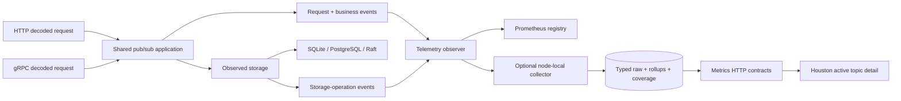

# Stable Queue-Backed Pub/Sub v1 Implementation Plan

> **For agentic workers:** REQUIRED SUB-SKILL: Use superpowers:subagent-driven-development (recommended) or superpowers:executing-plans to implement this plan task-by-task. Steps use checkbox (`- [ ]`) syntax for tracking.

**Goal:** Stabilize PlainQ's existing queue-backed publish/subscribe v1 across gRPC, HTTP, and the CLI; give Prometheus and PlainQ telemetry complete, non-duplicated pub/sub coverage; and show delivery outcomes plus active subscriptions in Houston.

**Architecture:** Keep the published six-method `v1.PlainQService` schema and existing HTTP routes. Both transports enter one validated pub/sub application boundary, which owns request and business events; an observed-storage decorator keeps its distinct storage-call metrics. SQLite, PostgreSQL, and Raft return typed internal mutation effects so cascade deletions and partial fan-out remain measurable without changing public responses. One observer fans events to process-wide Prometheus and an optional node-local collector. The collector stores typed, half-open time series, closed-bucket rollups, coverage, and reset-aware counters; Houston consumes exact telemetry contracts and never converts missing samples into zero.

**Tech Stack:** Go 1.26.4, protobuf/gRPC 1.83, Buf, Chi, SQLite/database/sql, PostgreSQL/pgx v5, HashiCorp Raft, VictoriaMetrics metrics, Astro 6, React 19, Recharts 3, TypeScript 5.9, and Bun 1.3.13.

## Global Constraints

- The approved contract is `docs/superpowers/specs/2026-08-25-stable-pubsub-design.md`; do not substitute the future append-only cursor model.
- Preserve all existing `v1.PlainQService` pub/sub RPC names, message names, field names, field numbers, HTTP paths, success statuses, and successful JSON/protobuf response shapes.
- Preserve queue-backed fan-out: topics retain no bodies, subscriptions bind existing queues, and consumers continue through `Receive` plus `Delete`.
- A publish snapshots the selected subscriptions, attempts every destination, and returns an error after all attempts if any destination fails. Accepted queue copies remain and a retry may duplicate them.
- Do not claim atomic fan-out, exactly-once delivery, idempotent publish, cursors, push delivery, topic consume, topic acknowledge, partitions, filtering, or ordering keys.
- Decode failures remain transport-only. Every decoded request, including a decoded invalid request, enters the shared boundary and records exactly one request outcome. It produces at most one outer storage operation.
- Request families and storage-operation families stay separate. HTTP and gRPC handlers must not emit a second business event.
- In cluster mode, request, outer storage, publish, and lifecycle counters use `backend="cluster"` on the ingress node only. Follower apply and restore reconcile gauges only.
- Every removed binding increments the subscription-deleted lifecycle counter after commit, including explicit unsubscribe, topic cascade, and queue cascade.
- Prometheus remains available when internal telemetry is disabled. Telemetry write failures never change a pub/sub result.
- Internal telemetry is node-local. Houston labels it **This node** in cluster mode; Prometheus performs cluster aggregation across scrape targets.
- Metric timestamps and ranges are Unix milliseconds. Requests are half-open `[from,to)` and no response includes an unfinished or future bucket.
- Typed aggregate values are fixed: gauge=`last`, counter=`increase`, rate/event=`avg`. The legacy `metrics_5m` table remains untouched and is never automatically selected.
- Missing samples remain absent. APIs use nullable summaries and explicit missing ranges; TypeScript chart rows use `number | null`; Recharts never connects across a declared gap.
- Telemetry collection must be a whole-millisecond divisor of one minute and at least 1ms; cleanup must be positive. Enabled telemetry retention must be at least 24 hours.
- No deployment, schema publication, release, or merge is authorized by this plan. Publishing the BSR module remains a separate approved release action.
- Use test-first development in every task: add the focused test, run it and observe the named failure, implement the narrow change, rerun the focused suite, then commit.
- Keep each task in one reviewable commit. Do not mix unrelated cleanup into these commits.

---

## Preflight and dependency order

Execute Tasks 1-7 in order to establish the stable public and backend event path. Tasks 8-11 then build durable telemetry on that event stream. Tasks 12-13 consume the final API in Houston. Task 14 updates every public explanation and CI gate. Task 15 is the release-readiness verification checkpoint.

Start from a clean implementation branch or worktree:

```bash
git status --short
git switch -c feat/stable-pubsub-v1
make houston
go test ./internal/server/service/queue/... ./internal/cluster/... ./internal/metrics ./internal/server/service/telemetry/collector ./internal/server ./cmd
```

Expected: the baseline test command passes and `git status --short` shows only the approved design/plan commits. If the branch already exists, switch to it instead of creating a second branch.

The event and data flow implemented by this plan is:



## File map

### Public contract and CLI

- Modify `schema/v1/schema.proto` and `Makefile`; reuse the tracked internal Go generator template unchanged.
- Add `schema/buf.docs.gen.yaml` and `internal/server/schema/v1/schema_contract_test.go`.
- Regenerate `internal/server/schema/v1/schema.pb.go`, `schema.pb.json.go`, `schema_grpc.pb.go`, `schema_vtproto.pb.go`, and `schema/docs/index.html`.
- Modify `.github/workflows/schema-pr.yaml` and `.github/workflows/schema-release.yaml` for generated-artifact drift checks.
- Modify `internal/client/client.go` and `internal/client/client_test.go`.
- Add `cmd/topic.go` and `cmd/topic_test.go`; modify `cmd/main.go`, `cmd/output.go`, `cmd/output_test.go`, `cmd/grpcerror.go`, `cmd/cli_test.go`, and `cmd/args_test.go`.

### Domain, storage, transports, and cluster

- Modify `internal/shared/pqerr/errors.go`, `transport.go`, and `transport_test.go`.
- Modify `internal/server/service/queue/pubsub.go`, `validation.go`, `service.go`, `observability.go`, and their tests.
- Add `internal/server/service/queue/pubsub_fanout.go`, `pubsub_fanout_test.go`, `pubsub_application.go`, and `pubsub_application_test.go`.
- Modify `internal/server/service/queue/pubsub_http.go`, `http_transport.go`, `grpc_transport.go`, `pubsub_http_test.go`, `http_transport_test.go`, and `grpc_transport_test.go`.
- Modify SQLite and PostgreSQL pub/sub/storage/error files and add backend contract tests.
- Modify cluster store/FSM/peer/node/status files and tests; add `internal/cluster/health.go` plus its tests for permanent-until-recovery replica quarantine.
- Modify `cmd/server.go` and `internal/server/server.go` to split local and logical observers and to bind worker lifetimes to the server context.

### Prometheus and PlainQ telemetry

- Modify `internal/metrics/pubsub.go`, `metrics.go`, and `metrics_test.go`.
- Modify `internal/server/service/telemetry/observer.go`; add `observer_test.go`.
- Modify `internal/server/service/telemetry/collector/collector.go`, `metrics.go`, `store.go`, `store_test.go`, and `topic_test.go`.
- Add collector `series.go`, `series_store.go`, `series_store_test.go`, `rollup_store.go`, `rollup_store_test.go`, and `worker_test.go`.
- Add `internal/server/mutations/telemetry/4_stable_pubsub_rollups.sql`; modify telemetry migration tests.
- Add `internal/server/metrics_contract.go` and `metrics_contract_test.go`; modify `metrics_handler.go`, `metrics_handler_test.go`, `routes_test.go`, and route mounting in `server.go`.

### Houston, docs, and CI

- Modify Houston `src/lib/types.ts`, `api-client.ts`, `metrics.ts`, `metrics.test.ts`, shared lifecycle/chart files, and active Pub/Sub topic-detail files.
- Add `components/metrics/series-chart.test.tsx`, `components/pubsub/topic-telemetry.tsx`, `components/pubsub/telemetry.test.ts`, and `components/pubsub/topic-telemetry.test.tsx`.
- Modify canonical pub/sub, CLI, gRPC, observability, Houston, configuration, and troubleshooting docs plus the existing website CLI/configuration mirrors.
- Add `docs/release-notes.md` with an Unreleased stable-pubsub entry and link it from `docs/README.md`.
- Add `cmd/documentation_test.go` for canonical/website command, configuration, and stable-claim drift.
- Modify `.github/workflows/pr.yml` and `.github/workflows/main.yml` so Houston tests run in CI.

---

## Task 1: Lock and regenerate the stable protobuf contract

**Files:**

- Modify: `schema/v1/schema.proto`
- Add: `schema/buf.docs.gen.yaml`
- Modify: `Makefile`
- Modify: `.github/workflows/schema-pr.yaml`
- Modify: `.github/workflows/schema-release.yaml`
- Add: `internal/server/schema/v1/schema_contract_test.go`
- Regenerate: `internal/server/schema/v1/schema.pb.go`
- Regenerate: `internal/server/schema/v1/schema.pb.json.go`
- Regenerate: `internal/server/schema/v1/schema_grpc.pb.go`
- Regenerate: `internal/server/schema/v1/schema_vtproto.pb.go`
- Regenerate: `schema/docs/index.html`

**Contract:** comments become authoritative without changing descriptors. Local generation uses `schema/` as its source rather than the last published BSR image.

- [ ] **Step 1: Add the descriptor contract test**

Add a descriptor test that pins the six methods and every existing pub/sub field number:

```go
package v1

import (
	"testing"

	"google.golang.org/protobuf/reflect/protoreflect"
)

func TestStablePubSubDescriptor(t *testing.T) {
	t.Parallel()

	service := File_v1_schema_proto.Services().ByName("PlainQService")
	if service == nil {
		t.Fatal("PlainQService descriptor is missing")
	}

	methods := map[protoreflect.Name]bool{
		"ListTopics": false,
		"CreateTopic": false,
		"DeleteTopic": false,
		"Subscribe": false,
		"Unsubscribe": false,
		"Publish": false,
	}
	for name := range methods {
		methods[name] = service.Methods().ByName(name) != nil
	}
	for name, found := range methods {
		if !found {
			t.Errorf("stable method %s is missing", name)
		}
	}

	fields := map[protoreflect.Name]map[protoreflect.Name]protoreflect.FieldNumber{
		"Topic": {"topic_id": 1, "topic_name": 2, "created_at": 3, "subscriptions": 4},
		"Subscription": {"subscription_id": 1, "topic_id": 2, "queue_id": 3, "queue_name": 4, "created_at": 5},
		"ListTopicsResponse": {"topics": 1},
		"CreateTopicRequest": {"topic_name": 1},
		"CreateTopicResponse": {"topic_id": 1},
		"DeleteTopicRequest": {"topic_id": 1},
		"SubscribeRequest": {"topic_id": 1, "queue_id": 2},
		"SubscribeResponse": {"subscription_id": 1},
		"UnsubscribeRequest": {"topic_id": 1, "subscription_id": 2},
		"PublishMessage": {"body": 1},
		"PublishRequest": {"topic_id": 1, "messages": 2},
		"PublishResponse": {"topic_id": 1, "queue_ids": 2, "message_ids": 3, "delivered_count": 4},
	}
	for messageName, wantFields := range fields {
		message := File_v1_schema_proto.Messages().ByName(messageName)
		if message == nil {
			t.Errorf("stable message %s is missing", messageName)
			continue
		}
		for fieldName, wantNumber := range wantFields {
			field := message.Fields().ByName(fieldName)
			if field == nil || field.Number() != wantNumber {
				t.Errorf("%s.%s number = %v, want %d", messageName, fieldName, field, wantNumber)
			}
		}
	}
}
```

Generated Go descriptors omit protobuf `SourceCodeInfo`, so test authoritative comments from the checked-in proto source rather than calling `SourceLocations`. In the same file, add this source-comment contract, which is intentionally red against the current short comments:

```go
func leadingProtoComment(source, declaration string) (string, bool) {
	offset := strings.Index(source, declaration)
	if offset < 0 {
		return "", false
	}

	lines := strings.Split(source[:offset], "\n")
	comments := make([]string, 0)
	for i := len(lines) - 1; i >= 0; i-- {
		line := strings.TrimSpace(lines[i])
		if line == "" && len(comments) == 0 {
			continue
		}
		if !strings.HasPrefix(line, "//") {
			break
		}
		comments = append([]string{strings.TrimSpace(strings.TrimPrefix(line, "//"))}, comments...)
	}

	return strings.Join(comments, " "), true
}

func TestStablePubSubDocumentation(t *testing.T) {
	t.Parallel()

	_, filename, _, ok := runtime.Caller(0)
	if !ok {
		t.Fatal("resolve schema contract test path")
	}
	protoPath := filepath.Clean(filepath.Join(filepath.Dir(filename), "../../../../schema/v1/schema.proto"))
	sourceBytes, err := os.ReadFile(protoPath)
	if err != nil {
		t.Fatalf("read %s: %v", protoPath, err)
	}
	source := string(sourceBytes)

	cases := []struct {
		name string
		declaration string
		phrases []string
	}{
		{"topic", "message Topic {", []string{"XID", "unique", "stores no message bodies"}},
		{"subscription", "message Subscription {", []string{"XID", "(topic_id, queue_id)", "unique"}},
		{"publish", "rpc Publish(", []string{"zero subscriptions", "attempts every selected destination", "non-atomic across queues", "retry may duplicate"}},
	}

	for _, test := range cases {
		t.Run(test.name, func(t *testing.T) {
			comments, found := leadingProtoComment(source, test.declaration)
			if !found {
				t.Fatalf("declaration %q is missing", test.declaration)
			}
			for _, phrase := range test.phrases {
				if !strings.Contains(comments, phrase) {
					t.Errorf("comments %q do not contain %q", comments, phrase)
				}
			}
		})
	}
}
```

Add `os`, `path/filepath`, `runtime`, and `strings` to the imports.

- [ ] **Step 2: Run the test and confirm the current discovery gap**

Run: `go test ./internal/server/schema/v1 -run 'TestStablePubSub(Descriptor|Documentation)' -count=1`

Expected: `TestStablePubSubDescriptor` passes for the existing shape and `TestStablePubSubDocumentation` fails on the missing stable-semantics phrases.

- [ ] **Step 3: Make local schema generation deterministic**

Add the docs-only template:

```yaml
version: v2
plugins:
  - remote: buf.build/community/pseudomuto-doc:v1.5.1
    out: docs
```

Replace the current BSR-only Make target with these targets:

```make
.PHONY: schema schema-local schema-public-check schema-published schema-check
schema: schema-local

schema-local:
	buf generate schema --template internal/server/schema/buf.gen.yaml --output internal/server/schema
	cd schema && buf generate . --template buf.docs.gen.yaml

schema-public-check:
	@tmp=$$(mktemp -d); \
	trap 'rm -rf "$$tmp"' EXIT; \
	buf generate schema --template schema/buf.gen.yaml --output "$$tmp"; \
	test -s "$$tmp/go/v1/schema.pb.go"; \
	test -s "$$tmp/go/v1/schema.pb.json.go"; \
	test -s "$$tmp/go/v1/schema.pb.validate.go"; \
	test -s "$$tmp/go/v1/schema_grpc.pb.go"; \
	test -s "$$tmp/go/v1/v1connect/schema.connect.go"; \
	cd "$$tmp/go"; \
	go mod init github.com/plainq/go; \
	go mod tidy; \
	go test ./...

schema-published:
	cd internal/server/schema && buf generate buf.build/plainq/schema

schema-check: schema-local schema-public-check
	git diff --exit-code -- internal/server/schema/v1 schema/docs
```

The tracked `schema/buf.gen.yaml` regenerates and compile-checks public Go, gRPC, Connect, validation, and JSON artifacts in an isolated temporary module. Those consumer outputs are published by the BSR rather than checked into this server repository; internal server bindings and HTML docs remain tracked and drift-checked. Keep `schema-published` only for an explicit published-consumer check. `build` continues to depend on `schema`, which now uses the checked-out source.

- [ ] **Step 4: Expand protobuf comments without changing fields**

In `schema/v1/schema.proto`, document:

- topic and subscription IDs are XIDs;
- topic names and `(topic_id, queue_id)` bindings are unique;
- a topic **stores no message bodies**;
- publishing with zero subscriptions succeeds with zero deliveries;
- fan-out is synchronous, best-effort, **attempts every selected destination**, and is **non-atomic across queues**;
- a failed publish may have retained copies and retry may duplicate them;
- `queue_ids` and `message_ids` are flattened identifiers without a positional relational guarantee.

Do not add, remove, reserve, renumber, or rename fields in this task.

- [ ] **Step 5: Add generated-drift CI**

In both schema workflows, add a job after checkout and Buf setup:

```yaml
  generated:
    runs-on: ubuntu-latest
    steps:
      - uses: actions/checkout@v4
      - uses: bufbuild/buf-setup-action@v1
      - uses: actions/setup-go@v5
        with:
          go-version-file: go.mod
      - name: regenerate bindings, clients, validation, Connect, and docs
        run: make schema-check
```

`schema-public-check` runs `go mod tidy` and `go test`, so both generated jobs must install the repository's Go 1.26.4 toolchain from `go.mod` rather than relying on the runner image. Make the release `push` job depend on `generated`, `breaking`, and `lint`.

- [ ] **Step 6: Regenerate and verify compatibility**

Run:

```bash
make schema-local schema-public-check
buf lint schema
buf breaking schema --against 'https://github.com/marsolab/plainq.git#branch=main,subdir=schema'
go test ./internal/server/schema/v1 -run 'TestStablePubSub(Descriptor|Documentation)' -count=1
git diff --check
```

Expected: all commands pass; tracked changes are limited to proto comments plus regenerated internal bindings and HTML documentation, while temporary public Go/gRPC/Connect/validation/JSON artifacts compile successfully. Do not run `buf push`.

- [ ] **Step 7: Commit**

```bash
git add schema internal/server/schema/v1 Makefile .github/workflows/schema-pr.yaml .github/workflows/schema-release.yaml
git commit -m "schema: lock stable pubsub v1 contract"
```

---

## Task 2: Add shared validation, typed partial failure, and attempt-all fan-out

**Files:**

- Modify: `internal/shared/pqerr/errors.go`
- Modify: `internal/shared/pqerr/transport.go`
- Modify: `internal/shared/pqerr/transport_test.go`
- Modify: `internal/server/service/queue/pubsub.go`
- Modify: `internal/server/service/queue/validation.go`
- Modify: `internal/server/service/queue/validation_test.go`
- Add: `internal/server/service/queue/pubsub_fanout.go`
- Add: `internal/server/service/queue/pubsub_fanout_test.go`

**Contract:** domain validation happens before storage; one destination batch is atomic; every selected destination is attempted; a partial result is retained internally while public transport mapping stays Internal/500.

- [ ] **Step 1: Add failing validation and fan-out tests**

Add table tests named:

- `TestValidateTopicIDRejectsMalformedXID`
- `TestValidateSubscriptionIDRejectsMalformedXID`
- `TestValidateCreateTopicRejectsBlankName`
- `TestValidatePublishRejectsEmptyBatch`
- `TestFanOutSucceedsWithNoSubscriptions`
- `TestFanOutAttemptsEverySelectedDestination`
- `TestFanOutRetainsSuccessfulCopiesAfterFailure`
- `TestPartialFanoutAlwaysMapsToInternal`

The attempt-all regression must arrange `queue-a` success, `queue-b` failure, and `queue-c` success, then assert the sender call order is all three queues, delivered count includes `queue-a` plus `queue-c`, failed deliveries equal one full batch, and the error matches `pqerr.ErrPartialFanout` but no transport sentinel.

- [ ] **Step 2: Run the narrow suite and observe failure**

Run:

```bash
go test ./internal/shared/pqerr ./internal/server/service/queue \
  -run 'TestValidate.*Topic|TestValidate.*Subscription|TestValidate.*Publish|TestFanOut|TestPartialFanout' -count=1
```

Expected: FAIL because topic/subscription validation, the typed error, and the attempt-all helper do not exist.

- [ ] **Step 3: Add domain result and error types**

Add `pqerr.ErrPartialFanout`:

```go
// ErrPartialFanout means at least one selected destination rejected a publish
// after another destination may already have accepted its queue copies.
ErrPartialFanout Error = "partial topic fan-out"
```

Make `transportSentinel` check it before nested destination errors:

```go
case errors.Is(err, ErrPartialFanout):
	return nil
```

Add these internal types to `queue/pubsub.go`; public transports never serialize `PublishOutcome` or `PublishDeliveryFailure`:

```go
type PublishDeliveryFailure struct {
	QueueID  string `json:"queueId"`
	Messages uint64 `json:"messages"`
	Cause    string `json:"cause"`
}

type PublishOutcome struct {
	Response           *PublishResponse         `json:"response"`
	SelectedQueues     uint64                   `json:"selectedQueues"`
	FailedDeliveries   uint64                   `json:"failedDeliveries"`
	DeliveryFailures   []PublishDeliveryFailure `json:"deliveryFailures"`
}

type PartialPublishError struct {
	Outcome PublishOutcome
	Causes  []error
}

func (e *PartialPublishError) Error() string {
	return fmt.Sprintf("%s: %d queue messages failed across %d destinations",
		pqerr.ErrPartialFanout, e.Outcome.FailedDeliveries, len(e.Outcome.DeliveryFailures))
}

func (e *PartialPublishError) Unwrap() []error {
	errs := make([]error, 0, len(e.Causes)+1)
	errs = append(errs, pqerr.ErrPartialFanout)
	errs = append(errs, e.Causes...)
	return errs
}
```

- [ ] **Step 4: Add shared validators**

Use the existing XID rule for topic and subscription IDs. Add these functions to `validation.go`:

```go
func validateTopicID(id string) error {
	if err := idkit.ValidateXID(strings.ToLower(id)); err != nil {
		return fmt.Errorf("%w: invalid topic id %q", pqerr.ErrInvalidID, id)
	}
	return nil
}

func validateSubscriptionID(id string) error {
	if err := idkit.ValidateXID(strings.ToLower(id)); err != nil {
		return fmt.Errorf("%w: invalid subscription id %q", pqerr.ErrInvalidID, id)
	}
	return nil
}

func validateCreateTopicRequest(input *CreateTopicRequest) error {
	if input == nil || strings.TrimSpace(input.TopicName) == "" {
		return fmt.Errorf("%w: topic name is required", pqerr.ErrInvalidInput)
	}
	return nil
}

func validatePublishRequest(topicID string, input *PublishRequest) error {
	if err := validateTopicID(topicID); err != nil {
		return err
	}
	if input == nil || len(input.Messages) == 0 {
		return fmt.Errorf("%w: at least one publish message is required", pqerr.ErrInvalidInput)
	}
	return nil
}
```

Add these composed validators rather than leaving transport-specific checks:

```go
func validateListTopicsRequest(input *ListTopicsRequest) error
func validateDeleteTopicRequest(topicID string) error
func validateSubscribeRequest(topicID string, input *SubscribeRequest) error
func validateUnsubscribeRequest(topicID, subscriptionID string) error
```

`validateListTopicsRequest(nil)` is `ErrInvalidInput`; subscribe validates both the topic XID and `input.QueueID` with the existing queue-ID rule; delete validates the topic XID; unsubscribe validates both XIDs. Create/publish nil handling remains in the explicit functions above. A byte body may be empty; the batch itself may not be empty.

- [ ] **Step 5: Implement the shared fan-out algorithm**

Add `pubsub_fanout.go` with this API and behavior:

```go
type BatchSender func(context.Context, *v1.SendRequest) (*v1.SendResponse, error)

func FanOut(
	ctx context.Context,
	topicID string,
	subscriptions []Subscription,
	messages []PublishMessage,
	send BatchSender,
) (*PublishResponse, error) {
	response := &PublishResponse{
		TopicID: topicID,
		QueueIDs: make([]string, 0, len(subscriptions)),
		MessageIDs: []string{},
	}
	for _, subscription := range subscriptions {
		response.QueueIDs = append(response.QueueIDs, subscription.QueueID)
	}

	failures := make([]PublishDeliveryFailure, 0)
	causes := make([]error, 0)
	for _, subscription := range subscriptions {
		batch := make([]*v1.SendMessage, 0, len(messages))
		for _, message := range messages {
			batch = append(batch, &v1.SendMessage{Body: message.Body})
		}

		sent, err := send(ctx, &v1.SendRequest{QueueId: subscription.QueueID, Messages: batch})
		if err != nil {
			failures = append(failures, PublishDeliveryFailure{
				QueueID: subscription.QueueID,
				Messages: uint64(len(messages)),
				Cause: err.Error(),
			})
			causes = append(causes, fmt.Errorf("publish to queue %q: %w", subscription.QueueID, err))
			continue
		}

		response.MessageIDs = append(response.MessageIDs, sent.GetMessageIds()...)
		response.DeliveredCount += len(sent.GetMessageIds())
	}

	if len(failures) == 0 {
		return response, nil
	}

	return response, &PartialPublishError{
		Outcome: PublishOutcome{
			Response: response,
			SelectedQueues: uint64(len(subscriptions)),
			FailedDeliveries: uint64(len(failures) * len(messages)),
			DeliveryFailures: failures,
		},
		Causes: causes,
	}
}
```

Do not log message bodies or put them into errors.

- [ ] **Step 6: Run the focused suite**

Run the Step 2 command again.

Expected: PASS; the error still matches nested causes for diagnostics but `pqerr.AsTransport` leaves partial fan-out unclassified, producing Internal/500.

- [ ] **Step 7: Commit**

```bash
git add internal/shared/pqerr internal/server/service/queue/pubsub.go \
  internal/server/service/queue/validation.go internal/server/service/queue/validation_test.go \
  internal/server/service/queue/pubsub_fanout.go internal/server/service/queue/pubsub_fanout_test.go
git commit -m "feat: define stable pubsub validation and fanout"
```

---

## Task 3: Normalize backend semantics and return transactional mutation effects

**Files:**

- Modify: `internal/server/service/queue/service.go`
- Modify: `internal/server/service/queue/service_test.go`
- Modify: `internal/server/service/queue/pubsub.go`
- Modify: `internal/server/service/queue/observability.go`
- Modify: `internal/server/service/queue/observability_test.go`
- Modify: `internal/server/service/queue/litestore/pubsub.go`
- Modify: `internal/server/service/queue/litestore/pubsub_test.go`
- Modify: `internal/server/service/queue/litestore/storage.go`
- Modify: `internal/server/service/queue/litestore/storage_test.go`
- Modify: `internal/server/service/queue/litestore/error.go`
- Modify: `internal/server/service/queue/litestore/error_test.go`
- Modify: `internal/server/service/queue/pgstore/pubsub.go`
- Add: `internal/server/service/queue/pgstore/pubsub_test.go`
- Modify: `internal/server/service/queue/pgstore/storage.go`
- Modify: `internal/server/service/queue/pgstore/error.go`
- Add: `internal/server/service/queue/pgstore/error_test.go`
- Modify: `internal/server/service/queue/pubsub_http.go`
- Modify: `internal/server/service/queue/pubsub_http_test.go`
- Modify: `internal/server/service/queue/http_transport.go`
- Modify: `internal/server/service/queue/http_transport_test.go`
- Modify: `internal/server/service/queue/grpc_transport.go`
- Modify: `internal/server/service/queue/grpc_transport_test.go`
- Modify: `internal/server/service/queue/validation.go`
- Modify: `internal/server/service/queue/validation_test.go`
- Add: `internal/server/service/queue/grpc_delete_test.go`
- Modify: `internal/cluster/store.go`
- Add: `internal/cluster/store_test.go`
- Modify: `internal/cluster/fsm/fsm.go`
- Modify: `internal/cluster/fsm/fsm_test.go`

**Contract:** duplicate/missing/temporary conditions use typed domain errors; topic and queue deletes return every binding removed by their transaction; the two SQL backends call one fan-out algorithm.

- [ ] **Step 1: Add backend conformance failures**

Add the same behavior cases to SQLite and PostgreSQL tests:

- blank topic name → `pqerr.ErrInvalidInput`;
- duplicate topic name → `pqerr.ErrAlreadyExists`;
- missing topic/queue on subscribe → `pqerr.ErrNotFound`;
- duplicate topic/queue binding → `pqerr.ErrAlreadyExists`;
- missing topic/subscription delete → `pqerr.ErrNotFound`;
- zero-subscription publish succeeds with zero deliveries;
- multi-subscription publish reaches every queue;
- first destination failure does not prevent a later success;
- deleting a topic returns all removed bindings;
- deleting a queue returns bindings grouped by their original topics;
- a rolled-back delete returns no mutation effects.

Also add a cluster test proving the FSM/store round trip preserves both topic-delete and queue-delete mutation effects.

Gate PostgreSQL cases behind `PLAINQ_TEST_POSTGRES_DSN`. A missing variable must produce an explicit test skip message naming `PLAINQ_TEST_POSTGRES_DSN` and remain a release gate in Task 15.

- [ ] **Step 2: Run backend tests and observe current failures**

Run:

```bash
go test ./internal/server/service/queue/litestore ./internal/server/service/queue/pgstore \
  -run 'Test.*Topic|Test.*Subscription|Test.*Publish|Test.*Cascade|Test.*PubSubError' -count=1
```

Expected: FAIL on raw database errors, fail-fast publish, missing PostgreSQL coverage, and absent cascade results.

- [ ] **Step 3: Add internal mutation/state types and storage signatures**

Add:

```go
type TopicInventory struct {
	TopicsExist int64
	SubscriptionCounts map[string]int64
}

type DeleteTopicResult struct {
	RemovedSubscriptions []Subscription `json:"removedSubscriptions"`
}

type DeleteQueueResult struct {
	RemovedSubscriptions []Subscription `json:"removedSubscriptions"`
}
```

Change internal `Storage` methods to:

```go
DeleteQueue(context.Context, *v1.DeleteQueueRequest) (*DeleteQueueResult, error)
DeleteTopic(context.Context, string) (*DeleteTopicResult, error)
TopicInventory(context.Context) (TopicInventory, error)
```

The public HTTP and gRPC layers continue returning their existing empty delete responses. `ObservedStorage.TopicInventory` delegates without emitting a storage operation, because reconciliation is maintenance rather than a seventh public topic operation. The distinct name avoids colliding with the existing snapshot record `queue.TopicState`.

Update every direct implementer and consumer in this task so the commit compiles on its own:

- SQLite, PostgreSQL, `ObservedStorage`, and cluster `Store` return the internal delete result;
- cluster `Store.TopicInventory` applies the configured read barrier and delegates to its local replica, while `ObservedStorage.TopicInventory` remains an unmeasured maintenance read;
- the FSM serializes `DeleteQueueResult` and `DeleteTopicResult`, and cluster `Store` decodes them rather than discarding them;
- HTTP and gRPC adapters discard the internal result and construct the unchanged public `DeleteQueueResponse`/`DeleteTopicResponse`;
- queue and cluster test doubles adopt the new signatures.

This moves delete-effect transport through Raft into the same commit as the interface change. Task 6 verifies those effects while adding partial-publish and reconciliation semantics; it must not introduce a temporary empty-result adapter.

- [ ] **Step 4: Normalize expected SQL conditions without parsing text**

For create and subscribe, use `ON CONFLICT DO NOTHING` (`INSERT OR IGNORE` on SQLite), inspect rows affected, and run exact existence checks inside the same transaction to distinguish missing topic, missing queue, and duplicate binding. Use rows affected for delete misses.

Add typed driver classifiers:

```go
type pubSubErrorContext string

const (
	pubSubListTopics pubSubErrorContext = "list_topics"
	pubSubCreateTopic pubSubErrorContext = "create_topic"
	pubSubDeleteQueue pubSubErrorContext = "delete_queue"
	pubSubSubscribe pubSubErrorContext = "subscribe"
	pubSubDeleteTopic pubSubErrorContext = "delete_topic"
	pubSubUnsubscribe pubSubErrorContext = "unsubscribe"
	pubSubPublish pubSubErrorContext = "publish"
	pubSubInventory pubSubErrorContext = "topic_inventory"
)

func normalizePubSubError(err error, operation pubSubErrorContext) error
```

SQLite classifies `sqlite3.Error` constraint codes as `AlreadyExists` or `NotFound` according to the explicit operation context and busy/locked codes as `pqerr.ErrUnavailable`. PostgreSQL classifies `*pgconn.PgError` by SQLSTATE/constraint name plus the explicit operation context and maps connection shutdown/timeouts to `pqerr.ErrUnavailable`. The Turso/libSQL path uses conflict-do-nothing plus rows-affected/existence checks for expected domain conditions and maps exported `context`/`database/sql`/`database/sql/driver` connection sentinels to `ErrUnavailable`; opaque upstream Hrana errors remain Internal because the driver exposes them as untyped errors. Unknown errors remain unknown and therefore map to Internal. Do not infer the operation by parsing driver error text.

Exercise every context—list, create, delete queue/topic, subscribe, unsubscribe, publish, and inventory—in SQLite/PostgreSQL tests, plus a Turso-compatible fake-driver test for conflict and exported connection failures. Update `mockStorage` in `service_test.go`, including both delete callbacks and `TopicInventory`, in this same commit.

- [ ] **Step 5: Capture cascade effects transactionally**

Before a topic or queue delete, select the affected subscription rows inside the same write transaction. Perform the delete, verify rows affected, commit, then return the captured rows. Never infer lifecycle effects from a later `ListTopics` call.

For SQLite queue deletion, insert the capture into the existing delete transaction before `DELETE FROM queue_properties`. For PostgreSQL, begin a transaction and use the same ordering. On rollback, return no result.

- [ ] **Step 6: Replace both backend publish loops with `FanOut`**

Each backend must:

1. verify the topic exists;
2. read the complete subscription slice once;
3. call `FanOut` with its atomic `Send` method;
4. record queue `Sent` events only for successful destination batches;
5. return the non-nil internal response alongside `*PartialPublishError`.

The selected queue list is fixed before the first send. Do not re-read subscriptions between destinations.

Both SQL subscription queries order by `created_at, subscription_id`, so equal timestamps cannot change fan-out or deterministic identifier assignment order between replicas.

- [ ] **Step 7: Add exact state reads**

Implement `TopicInventory` with one grouped query that returns every topic, including zero-subscription topics. Initialize each topic count to zero, then fill grouped counts. `TopicsExist` is the number of returned topic IDs.

- [ ] **Step 8: Run backend and decorator tests**

Run:

```bash
go test ./internal/server/service/queue/litestore ./internal/server/service/queue/pgstore \
  ./internal/server/service/queue ./internal/cluster ./internal/cluster/fsm \
  -run 'Test.*Topic|Test.*Subscription|Test.*Publish|Test.*Cascade|TestObservedStorage|Test.*Delete.*Result' -count=1
```

Expected: SQLite and available PostgreSQL cases pass; `ObservedStorage` records one storage operation and preserves non-nil partial outcomes/effects.

- [ ] **Step 9: Commit**

```bash
git add internal/server/service/queue internal/cluster/store.go internal/cluster/store_test.go \
  internal/cluster/fsm/fsm.go internal/cluster/fsm/fsm_test.go
git commit -m "feat: normalize pubsub storage semantics"
```

---

## Task 4: Add Prometheus request families and one observer event stream

**Files:**

- Modify: `internal/metrics/pubsub.go`
- Modify: `internal/metrics/metrics_test.go`
- Modify: `internal/server/service/telemetry/observer.go`
- Add: `internal/server/service/telemetry/observer_test.go`
- Modify: `internal/server/service/queue/observability.go`
- Modify: `internal/server/service/queue/observability_test.go`
- Modify: `docs/guides/observability.md`

**Contract:** one elapsed duration and result feed both sinks; public-request and storage-operation metrics stay distinct; publish fan-out uses selected destinations, not successful deliveries. Backend labels are exactly `sqlite|turso|postgres|cluster`, operation labels are the six public topic operations, results are `ok|error`, and neither request nor storage families carry a topic label.

- [ ] **Step 1: Add failing Prometheus and observer tests**

Add:

- `TestRecordTopicRequestIsSeparateFromStorageOperation`
- `TestRecordTopicRequestExportsClassicDurationHistogram`
- `TestRecordPublishUsesSelectedDestinationWidth`
- `TestRecordPublishObservesZeroFanout`
- `TestSubscriptionLifecycleDoesNotImplicitlyMutateGauge`
- `TestObserverFansTopicEventsToBothSinks`
- `TestObserverReplaysKnownTopicStateWhenRecorderAttaches`
- `TestObserverDoesNotReplayUnknownTopicState`
- `TestObserverAcceptsQueueOnlyRecorder`
- `TestObserverDoesNotReplayUnknownQueueState`
- `TestObserverInvalidatesTopicStateWithoutChangingLifecycle`
- `TestObserverCopiesReconciledAndReplayedTopicMaps`
- `TestObserverRecorderAttachAndReplayIsLinearizedWithEvents`
- `TestObserverUnavailableRetainsPriorMapForLaterRemoval`
- `TestTopicMetricVocabularyRejectsUnknownValues`
- `TestTopicRequestAndStorageDefinitionsHaveNoTopicLabel`
- `Test_Catalog_isFullyDocumented`

Scrape assertions must include the VictoriaMetrics name-only `# HELP <family>`
line, `# TYPE`, classic histogram `le` buckets, and the exact bounded labels.
VictoriaMetrics metadata enablement is process-global, so these scrape tests
must be serial and restore its prior setting; do not call `t.Parallel` around
registry or metadata assertions. The declaration prose is asserted through
`Catalog()` and `docs/guides/observability.md`, not against the name-only HELP
line emitted by the pinned writer.

- [ ] **Step 2: Run and observe missing families**

Run:

```bash
go test ./internal/metrics ./internal/server/service/telemetry ./internal/server/service/queue \
  -run 'TestRecordTopic|TestSubscriptionLifecycle|TestObserver' -count=1
```

Expected: FAIL because request families and recorder fan-out do not exist.

- [ ] **Step 3: Declare the request metrics and make operation APIs explicit**

Add:

```go
var topicRequests = NewCounterVec(Definition{
	Name: Namespace + "_topic_requests_total",
	Help: "Decoded topic requests by outcome.",
	Labels: []string{labelBackend, labelOperation, labelResult},
})

var topicRequestDuration = NewHistogramVec(Definition{
	Name: Namespace + "_topic_request_duration_seconds",
	Help: "How long a decoded topic request took at the application boundary.",
	Labels: []string{labelBackend, labelOperation},
}, LatencyBuckets)
```

Use explicit elapsed values so both sinks see the same measurement:

```go
func RecordTopicRequest(backend, operation, result string, elapsed time.Duration)
func RecordTopicOperation(backend, operation, result string, elapsed time.Duration)
func RecordPublish(topicID string, messages, bytes, destinations, delivered, failed uint64)
func RecordSubscriptionCreated(topicID string)
func RecordSubscriptionDeleted(topicID string)
func SetTopicSubscriptions(topicID string, current int64)
func SetTopicsExist(count int64)
func ResetTopic(topicID string)
```

`RecordPublish` always observes `destinations`, including zero. Lifecycle counters no longer mutate gauges implicitly.

Add exported backend constants `BackendSQLite`, `BackendTurso`,
`BackendPostgres`, and `BackendCluster`, plus the six existing operation
constants and the two result constants as the only accepted values at the
Observer/metrics boundary. Unknown values are programming errors and fail a
focused test instead of silently creating a new Prometheus label. The request
definitions remain `{backend,operation,result}` and `{backend,operation}`; the
storage definitions retain those same bounded dimensions. Do not add `topic` to
either family.

- [ ] **Step 4: Define observer event records and recorder methods**

Add:

```go
type TopicOperationEvent struct {
	Backend string
	Operation string
	Result string
	TopicID string
	Duration time.Duration
}

type TopicPublishEvent struct {
	TopicID string
	Messages uint64
	Bytes uint64
	Destinations uint64
	Delivered uint64
	Failed uint64
}

type TopicStateEvent struct {
	TopicsExist int64
	Subscriptions map[string]int64
}
```

Keep the existing queue `Recorder` interface unchanged so the collector continues to compile before Task 8. Add an optional topic capability:

```go
type TopicRecorder interface {
	RecordTopicRequest(TopicOperationEvent)
	RecordTopicOperation(TopicOperationEvent)
	RecordTopicPublish(TopicPublishEvent)
	RecordTopicSubscriptionCreated(topicID string)
	RecordTopicSubscriptionDeleted(topicID string)
	RecordTopicState(TopicStateEvent)
	RecordTopicStateUnavailable()
}
```

Every topic Observer method type-asserts `o.sink` to `TopicRecorder`; a queue-only recorder remains valid and receives queue events as before. `SetRecorder` replays known topic state only when the attached recorder implements `TopicRecorder`. Add Observer methods:

```go
func (o *Observer) TopicRequest(operation, topicID string, started time.Time, err error)
func (o *Observer) TopicOperation(operation, topicID string, started time.Time, err error)
func (o *Observer) Published(TopicPublishEvent)
func (o *Observer) TopicSubscriptionCreated(topicID string)
func (o *Observer) TopicSubscriptionDeleted(topicID string)
func (o *Observer) ReconcileTopicState(TopicStateEvent)
func (o *Observer) TopicStateUnavailable()
```

The Observer owns exactly one mutex covering its recorder pointer, queue
known/value state, topic known/map state, and recorder callback ordering. Every
method takes that mutex, updates Prometheus and the current recorder in one
linear order, and releases it only after the callback returns; recorder methods
must not call back into the Observer. `SetRecorder` swaps the pointer and replays
known queue/topic state before unlocking, so no event overtakes attachment and
no post-swap event reaches the old recorder.

Reconciliation defensively copies the caller's subscription map before storing
it, sets zero for topics removed since the retained prior map, updates current
gauges and `topics_exist`, and sends another defensive copy to the collector.
`SetRecorder` also replays a fresh copy, never the Observer-owned map.
`TopicStateUnavailable` clears only the known bit while retaining the prior map
for a later exact removed-topic comparison, and tells an optional
`TopicRecorder` to stop covering exact gauges; it never changes a Prometheus
gauge or lifecycle counter and never replays the retained-but-unknown map.

Add the same known-state rule to the existing queue count: `NewObserver` starts with `queuesKnown=false`, `SetQueues` stores the exact count and sets it true, and `SetRecorder` calls `SetQueuesExist` only when it is true. Queue mutations may update an already-known count but must not turn an unknown zero into an authoritative replay. This prevents a newly created logical cluster observer from overwriting the collector's known local queue count.

- [ ] **Step 5: Keep `ObservedStorage` storage-only**

Pass topic IDs into `TopicOperation`. Successful create attributes storage to the returned ID; failed create and list use an empty topic ID; all other operations use their requested topic ID. Remove business `Published` emission from `ObservedStorage`; the application boundary will own it in Task 5.

- [ ] **Step 6: Verify exposition and event separation**

Run the Step 2 command again, then:

```bash
go test ./internal/metrics -run 'Test_exposition_carriesTypeMetadata|Test_Catalog_isCompleteAndConsistent|Test_Catalog_isFullyDocumented' -count=1
```

Expected: PASS. `plainq_topic_requests_total` and
`plainq_topic_operations_total` move independently, every pub/sub family is in
the runtime catalog and observability guide, and raw exposition has the pinned
VictoriaMetrics HELP/TYPE form.

- [ ] **Step 7: Commit**

```bash
git add internal/metrics internal/server/service/telemetry internal/server/service/queue/observability.go internal/server/service/queue/observability_test.go docs/guides/observability.md
git commit -m "feat: unify pubsub prometheus events"
```

---

## Task 5: Route HTTP and gRPC through one pub/sub application boundary

**Files:**

- Add: `internal/server/service/queue/pubsub_application.go`
- Add: `internal/server/service/queue/pubsub_application_test.go`
- Modify: `internal/server/service/queue/service.go`
- Modify: `internal/server/service/queue/service_test.go`
- Modify: `internal/server/service/queue/pubsub_http.go`
- Modify: `internal/server/service/queue/pubsub_http_test.go`
- Modify: `internal/server/service/queue/http_transport.go`
- Modify: `internal/server/service/queue/http_transport_test.go`
- Modify: `internal/server/service/queue/grpc_transport.go`
- Modify: `internal/server/service/queue/grpc_transport_test.go`
- Modify: `cmd/server.go`
- Modify: `internal/server/server.go`
- Modify: `internal/server/routes_test.go`

**Contract:** successfully decoded transport requests enter one boundary before domain validation. The boundary records one request, makes one measured outer storage operation, may perform one unmeasured post-commit `TopicInventory` reconciliation read, records logical effects only when the committed outcome is known, and returns transport-neutral domain errors. An indeterminate `ErrCommitUnknown` records request/storage error but no fabricated business or lifecycle event; later exact reconciliation heals gauges.

- [ ] **Step 1: Add application and transport parity tests**

Add:

- `TestPubSubApplicationInvalidDecodedRequestRecordsRequestOnly`
- `TestPubSubApplicationMalformedTopicIDRecordsSystemRequestOnly`
- `TestPubSubApplicationValidTopicInvalidPayloadRecordsTopicRequest`
- `TestPubSubApplicationSuccessfulRequestRecordsRequestAndStorage`
- `TestPubSubApplicationPartialPublishRecordsOutcomeOnce`
- `TestPubSubApplicationCountsEveryCascadeBinding`
- `TestPubSubHTTPAndGRPCHaveStatusParity`
- `TestUndecodableHTTPBodyDoesNotRecordBusinessRequest`
- `TestDeleteQueueRecordsSubscriptionCascadeWithoutTopicRequest`
- `TestCommitUnknownDoesNotFabricatePublishOrLifecycleEffects`
- `TestDeleteQueueForceFalseMapsToHTTP409AndGRPCFailedPrecondition`
- `TestSubscribeAndDeleteQueueNormalizeMalformedQueueID`
- `TestServiceRejectsNilObserver`

The recorder spy must assert exact operation, topic attribution, result, duration presence, messages, bytes, selected destinations, successful deliveries, failed deliveries, lifecycle count, final gauge state, and exact public response shapes (including empty delete responses and partial publish errors).

- [ ] **Step 2: Run the tests and observe duplicated transport logic**

Run:

```bash
go test ./internal/server/service/queue \
  -run 'TestPubSubApplication|TestPubSubHTTPAndGRPC|TestUndecodableHTTP|TestDeleteQueueRecordsSubscriptionCascade' -count=1
```

Expected: FAIL because each transport currently calls storage and telemetry independently.

- [ ] **Step 3: Build the shared application object**

Add:

```go
type pubSubApplication struct {
	storage Storage
	observer *telemetry.Observer
	logger *slog.Logger
}

func newPubSubApplication(storage Storage, observer *telemetry.Observer, logger *slog.Logger) *pubSubApplication {
	return &pubSubApplication{storage: storage, observer: observer, logger: logger}
}
```

Implement the six public topic methods with named error returns, plus one internal queue-delete cascade helper:

```go
listTopics(context.Context, *ListTopicsRequest) (*ListTopicsResponse, error)
createTopic(context.Context, *CreateTopicRequest) (*CreateTopicResponse, error)
deleteTopic(context.Context, string) error
subscribe(context.Context, string, *SubscribeRequest) (*SubscribeResponse, error)
unsubscribe(context.Context, string, string) error
publish(context.Context, string, *PublishRequest) (*PublishResponse, error)
deleteQueue(context.Context, *v1.DeleteQueueRequest) (*DeleteQueueResult, error)
```

Each of the six topic methods captures `started := time.Now()` first and defers exactly one `observer.TopicRequest`, using a local `attributedTopicID` initialized to empty. Validation runs before the first storage call. For delete/subscribe/unsubscribe/publish, validate the topic XID first and set `attributedTopicID=topicID` only after that succeeds; a malformed attacker-controlled ID records system request telemetry only. Later validation failures, such as a valid topic with an empty publish batch or invalid subscription/queue ID, remain attributable to that valid topic. Successful create sets attribution to the returned topic ID; failed create and list remain system-only. `deleteQueue` is not a seventh public topic method and never calls `TopicRequest`; it only preserves committed subscription-cascade effects for the existing queue request path.

Make the validation order explicit in table tests. Normalize malformed queue IDs
for both subscribe and delete-queue through `pqerr.ErrInvalidID` in
`validation.go`; neither path may leak the raw XID parser error. DeleteQueue's
`force=false` non-empty precondition is `pqerr.ErrFailedPrecondition`: HTTP must
return 409, while gRPC must return `codes.FailedPrecondition`. Because the pinned
Servekit mapper does not honor that status through the generic hook, install the
explicit `ctxkit` gRPC error hook and cover it in `grpc_delete_test.go`; do not
assume `pqerr.AsTransport` alone provides the gRPC code.

- [ ] **Step 4: Reconcile gauges and emit committed lifecycle effects**

Add:

```go
func (a *pubSubApplication) reconcileTopicState(ctx context.Context) {
	state, err := a.storage.TopicInventory(ctx)
	if err != nil {
		a.observer.TopicStateUnavailable()
		a.observer.StorageError("topic_inventory")
		a.logger.WarnContext(ctx, "reconcile topic telemetry", slog.String("error", err.Error()))
		return
	}
	a.observer.ReconcileTopicState(telemetry.TopicStateEvent{
		TopicsExist: state.TopicsExist,
		Subscriptions: state.SubscriptionCounts,
	})
}
```

After a successful topic create, reconcile so `plainq_topics_exist` and its internal exact gauge advance. After a successful subscribe, emit one created lifecycle event and reconcile. After explicit unsubscribe, emit one deleted event and reconcile. After topic delete, emit one deleted event per `DeleteTopicResult.RemovedSubscriptions`, using each effect's exact `TopicID`, then reconcile exactly once.

The typed `deleteQueue` application helper is shared by HTTP and gRPC. It emits no topic request metric, but after a successful, known queue deletion it emits one deleted lifecycle event per `DeleteQueueResult.RemovedSubscriptions`, attributed to each effect's exact `TopicID`, and reconciles exact topic state once. Both transports discard that internal result and return their unchanged public empty response. An indeterminate commit has no durable effect handoff in v1, so it emits no lifecycle event; exactly-once effect recovery is explicitly out of scope.

Reconciliation errors are logged and increment existing Prometheus `plainq_storage_errors_total{operation="topic_inventory"}` through `Observer.StorageError`; they do not claim a telemetry-store write failure and never turn a successful customer mutation into an error. The last known internal gauge timestamp remains unchanged until a later exact reconciliation succeeds.

- [ ] **Step 5: Record publish business outcomes once**

After storage returns, emit publish business data only for a definite success or
a typed `*PartialPublishError`. For a partial with a nil direct response, fall
back to `partial.Outcome.Response`. Never interpret an arbitrary non-nil response
beside a generic error—and especially `ErrCommitUnknown`—as a known outcome.
Compute body bytes once. For a definite fan-out outcome call:

```go
a.observer.Published(telemetry.TopicPublishEvent{
	TopicID: topicID,
	Messages: uint64(len(input.Messages)),
	Bytes: publishedBodyBytes(input.Messages),
	Destinations: selectedDestinations(output, err),
	Delivered: deliveredCount(output),
	Failed: failedDeliveries(err),
})
```

A valid publish to an existing topic with zero subscriptions has a non-nil response and records messages, bytes, zero destinations, zero deliveries, and zero failures. A missing topic returns no fan-out outcome and does not increment publish business counters. The deferred request and observed-storage operation still record their errors.

Make the helper semantics explicit so partial outcomes cannot be inferred from only the successful queue IDs:

```go
func selectedDestinations(output *PublishResponse, err error) uint64
func deliveredCount(output *PublishResponse) uint64
func failedDeliveries(err error) uint64
```

`selectedDestinations` returns `partial.Outcome.SelectedQueues` when `errors.As(err, &partial)` succeeds, otherwise `len(output.QueueIDs)` for a non-nil successful output, otherwise zero. `deliveredCount` returns `uint64(output.DeliveredCount)` for every non-nil output, including the partial response; queue count and message-delivery count are not interchangeable. `failedDeliveries` returns `partial.Outcome.FailedDeliveries` and zero for every other error. `publishedBodyBytes` sums `len(message.Body)` exactly once and does not include JSON/base64 framing. Add table cases for full success, zero subscribers, partial success with two delivered messages and one failed delivery, and missing topic.

- [ ] **Step 6: Make Service require the logical observer**

Change construction to:

```go
func NewService(
	cfg *config.Config,
	logger *slog.Logger,
	storage Storage,
	observer *telemetry.Observer,
) *Service
```

Store `pubsub *pubSubApplication` on `Service`. Remove `TopicMetricsRecorder`, `SetTopicMetricsRecorder`, transport-level record helpers, and post-mutation observed `ListTopics` scans.

Update every constructor call in `cmd/server.go` and queue/server tests in this same step. Production passes the **same pointer** to `NewObservedStorage` and `NewService` until Task 6 deliberately splits local and logical observers. Audit every constructor/wiring call; `NewService` rejects a nil observer, tests create an explicit one, and no compatibility constructor or hidden global observer is added. Remove `internal/server/server.go`'s `SetTopicMetricsRecorder` call atomically with deleting that method.

- [ ] **Step 7: Make transports adapters only**

HTTP handlers decode/close bodies, copy URL IDs into domain arguments, call the application method, translate with `pqerr.AsTransport`, and render the unchanged success status/body. HTTP list supplies `&ListTopicsRequest{}`. An undecodable body returns before the application call.

gRPC handlers convert protobuf/domain messages, call the same application method, translate with `pqerr.AsTransport`, and map the successful domain response back to the existing protobuf. A nil `ListTopicsRequest` remains nil through conversion and enters the application, so every decoded/nil-request validation outcome is measured consistently.

- [ ] **Step 8: Run the focused transport suite**

Run:

```bash
go test ./internal/server/service/queue \
  -run 'TestPubSubApplication|TestPubSubHTTPAndGRPC|TestUndecodableHTTP|TestDeleteQueueRecordsSubscriptionCascade|Test.*Topic.*Handler|Test.*Topic.*GRPC' -count=1
go test ./internal/server/service/queue -count=1
go test ./cmd ./internal/server -run 'Test.*Server|Test_NewServer_mountsRoutes' -count=1
```

Expected: PASS; recorder spies prove no protocol-dependent double count.

- [ ] **Step 9: Commit**

```bash
git add internal/server/service/queue cmd/server.go internal/server/server.go internal/server/routes_test.go
git commit -m "feat: share stable pubsub application boundary"
```

---

## Task 6: Preserve internal outcomes and exact gauges through Raft

**Files:**

- Modify: `internal/cluster/store.go`
- Modify: `internal/cluster/store_test.go`
- Modify: `internal/cluster/consensus/raft/raft.go`
- Add: `internal/cluster/consensus/raft/raft_test.go`
- Add: `internal/cluster/health.go`
- Add: `internal/cluster/health_test.go`
- Modify: `internal/cluster/fsm/fsm.go`
- Modify: `internal/cluster/fsm/fsm_test.go`
- Modify: `internal/cluster/fsm/snapshot.go`
- Modify: `internal/cluster/peer/peer.go`
- Modify: `internal/cluster/peer/peer_test.go`
- Modify: `internal/cluster/node.go`
- Modify: `internal/cluster/status.go`
- Modify: `internal/cluster/status_test.go`
- Modify: `internal/cluster/metrics.go`
- Modify: `internal/cluster/metrics_test.go`
- Modify: `internal/cluster/cluster_test.go`
- Modify: `internal/metrics/cluster.go`
- Modify: `internal/metrics/metrics_test.go`
- Modify: `cmd/server.go`
- Add: `cmd/server_test.go`
- Modify: `internal/server/config/config.go`
- Modify: `internal/server/server.go`
- Modify: `internal/server/routes_test.go`
- Modify: `internal/server/system_handler_test.go`
- Modify: `internal/server/service/telemetry/observer.go`
- Modify: `internal/server/service/telemetry/observer_test.go`
- Modify: `deploy/helm/plainq/templates/_pod.tpl`
- Modify: `deploy/helm/plainq/values.yaml`
- Modify: `operator/api/v1alpha1/defaults.go`
- Modify: `operator/internal/render/args.go`
- Modify: `operator/internal/render/workload.go`
- Modify: `operator/internal/render/render_test.go`

**Contract:** a committed partial publish remains an apply success with an internal partial outcome; ingress reconstructs the public Internal error. Every typed partial quarantines the replica that observed it, the one durable health latch gates Store and peer data paths, and restart cannot clear it. Every replica reconciles exact gauges after state changes/restore, while only ingress records logical counters. `/live` is process liveness; `/health` is storage/quorum/quarantine readiness.

- [ ] **Step 1: Add cluster regression tests**

Add:

- `TestStoreLeaderReturnsPartialPublishOutcomeAndError`
- `TestStoreFollowerPreservesPartialPublishOutcomeAndError`
- `TestFSMPartialPublishIsCommittedOutcomeNotApplyFailure`
- `TestFSMReconcilesTopicStateAfterEveryMutation`
- `TestFSMRestoreReconcilesTopicStateWithoutLifecycleEvents`
- `TestClusterIngressUsesClusterBackend`
- `TestFollowerApplyDoesNotDuplicateLogicalTopicCounters`
- `TestPeerPreservesUnavailableClass`
- `TestReplicaLocalPartialMarksNodeUnhealthy`
- `TestFollowerOnlyNotFoundPartialAlsoQuarantinesReplica`
- `TestDifferentReplicaFailuresNeverServeDivergedState`
- `TestQuarantinedStoreRejectsEveryPublicOperation`
- `TestQuarantineRaceCannotReturnACompletedLocalRead`
- `TestQuarantinedLeaderRejectsForwardedWrites`
- `TestPeerForwardGateRunsBeforeApply`
- `TestPeerForwardGatePreservesUnavailableClass`
- `TestNodeHealthAndStatusFailWhileReplicaIsQuarantined`
- `TestReplicaQuarantineHasDistinctPrometheusGauge`
- `TestReplicaQuarantineMetricCatalogAndMetadata`
- `TestReplicaQuarantineMarkerSurvivesRestart`
- `TestReplicaApplyGuardMissingOnRestartQuarantines`
- `TestExistingRaftGuardVersionWithAllSidecarsMissingQuarantines`
- `TestPreGuardRaftStoreInitializesVersionExactlyOnce`
- `TestReplicaQuarantineMarkerWriteFailureStaysUnreadyAfterRestart`
- `TestReplicaApplyGuardBeginFailureTerminatesBeforeStorage`
- `TestReplicaApplyGuardFinishFailureTerminatesWithDirtyGuard`
- `TestSuccessfulPublishRestoresReplicaApplyGuard`
- `TestSuccessfulSnapshotRestoreClearsReplicaQuarantine`
- `TestLivenessStaysHealthyWhileQuarantinedReadinessFails`
- `TestHelmUsesSeparateLivenessAndReadinessRoutes`
- `TestOperatorUsesSeparateLivenessAndReadinessRoutes`
- `TestStartupInventoryReplaysBeforeCollectorAttachment`
- `TestTursoUsesTursoTelemetryBackend`

The follower test must use the peer encoder/decoder path, not call the leader store directly.

- [ ] **Step 2: Run cluster tests and observe lost outcomes**

Run:

```bash
go test ./internal/cluster/... ./internal/metrics ./cmd ./internal/server \
  -run 'Test.*PartialPublish|Test.*ReconcileTopic|Test.*ClusterBackend|Test.*LogicalTopic|TestPeerPreservesUnavailable|Test.*Replica|Test.*Quarantined|Test.*NodeHealth|Test.*SnapshotRestore|Test.*Liveness|Test.*Helm|Test.*Operator|Test.*StartupInventory|TestTursoUsesTurso' -count=1
cd operator && go test ./internal/render -run 'Test.*Liveness|Test.*Readiness|TestServeArgs' -count=1
```

Expected: FAIL because the FSM returns only a partial error, forwarded responses lose the outcome, and the process has one backend-labelled observer.

- [ ] **Step 3: Encode publish outcomes as successful Raft responses**

In the FSM publish branch, convert `*queue.PartialPublishError` into its `PublishOutcome` response and a nil apply error:

```go
if err := f.applyGuard.BeginPublishApply(); err != nil {
	f.abortApply(fmt.Errorf("begin publish apply guard: %w", err))
}

response, err := f.storage.Publish(ctx, cmd.Target, req)
if err == nil {
	if guardErr := f.applyGuard.FinishPublishApply(); guardErr != nil {
		f.abortApply(fmt.Errorf("finish publish apply guard: %w", guardErr))
	}
	return &queue.PublishOutcome{
		Response: response,
		SelectedQueues: uint64(len(response.QueueIDs)),
	}, nil
}

var partial *queue.PartialPublishError
if errors.As(err, &partial) {
	_ = f.reportReplicaFault(err)
	return &partial.Outcome, nil
}

if errors.Is(err, pqerr.ErrNotFound) {
	if guardErr := f.applyGuard.FinishPublishApply(); guardErr != nil {
		f.abortApply(fmt.Errorf("finish non-mutating publish apply guard: %w", guardErr))
	}
	return nil, err
}

_ = f.reportReplicaFault(err)
return nil, err
```

This is a committed business partial outcome, not a failed state-machine apply. It therefore travels as HTTP 200 plus internal JSON across peer forwarding.

Every `*queue.PartialPublishError` produced while applying a replicated command invokes `ReplicaFaultReporter` before returning its outcome. This is unconditional: do not inspect `FailedDeliveries`, whitelist a nested domain sentinel, or treat a leader's partial differently from a follower's. A follower-only `NotFound` inside a partial can mean that replica already lacks a subscribed queue even when every other node succeeds. Only a top-level `pqerr.ErrNotFound` returned before any destination mutation is contractually non-mutating and may restore the clean guard. Causes remain diagnostic, but any partial or unclassified replica-local result is proof that this state-machine application may not be deterministic on that node. Durably quarantine it, fail its public read/write readiness gate, and require a verified snapshot restore or explicit wipe/reseed before it serves again, while still returning the conservative partial outcome on the applying leader. A process restart alone never clears quarantine. Add leader/follower fault-injection cases for full and partial outcome shapes, different failed destinations, follower-only `NotFound`, and a partial whose nested cause is `Unavailable`.

Add one shared quarantine in `internal/cluster/health.go`. Its in-memory latch closes the serving race immediately. A write-ahead clean/apply guard beside the Raft log, plus a diagnostic quarantine marker, makes the state survive even when writing the diagnostic marker itself fails:

```go
type replicaFault struct{ err error }

type replicaHealth struct {
	fault atomic.Pointer[replicaFault]
	cleanPath string
	dirtyPath string
	quarantinePath string
}

func newReplicaHealth(dataDir string, stable hraft.StableStore) (*replicaHealth, error)
func (h *replicaHealth) BeginPublishApply() error
func (h *replicaHealth) FinishPublishApply() error
func (h *replicaHealth) Fail(error) error
func (h *replicaHealth) Check() error
func (h *replicaHealth) Recover() error
```

The sidecar files are `<cluster.DataDir>/replica-apply-clean`, `<cluster.DataDir>/replica-apply-dirty`, and `<cluster.DataDir>/replica-quarantined`. The permanent guard-version bit is **not another sidecar**: store key `plainq/replica-apply-guard-version` with value `1` in the existing fsynced HashiCorp Raft stable store (`raft.db`). Add `raftengine.WithStableStore(dataDir, func(hraft.StableStore) error) error`, which opens the same Bolt store before `hraft.NewRaft`, invokes the callback, and closes it; the engine opens it normally only after the callback succeeds.

`NewNode` uses that pre-start callback to construct `newReplicaHealth(dataDir, stableStore)` before creating the FSM or consensus engine. If the stable key is absent, this is the one pre-guard upgrade initialization: while no FSM apply can run, reject dirty/quarantine sidecars, write/fsync/rename clean, sync the directory, then set the stable key. If clean exists because a crash interrupted the stable-key write, repeat only the key step. Once the Raft-stable key exists, a missing clean sidecar or presence of dirty/quarantine always means quarantined startup; recovery never removes the stable key. Unknown key values and any `Get`/`Set`/`Stat` error fail startup. Because the version survives in `raft.db`, loss of all three sidecars while existing Raft state remains cannot masquerade as a first upgrade. Tests seed a Raft stable key plus log metadata, delete every sidecar, and assert quarantine/startup refusal rather than clean reinitialization.

Immediately before the FSM calls replicated storage for a publish, `BeginPublishApply` atomically renames clean to dirty and syncs the parent directory. Storage mutation is forbidden until that succeeds. On a deterministic full success, or on a contractually non-mutating domain error, `FinishPublishApply` atomically renames dirty back to clean and syncs before the apply returns. A partial outcome or an unknown storage error never calls `FinishPublishApply`; the missing clean marker is already durable, so restart quarantines even if every later diagnostic write fails.

A begin/finish durability failure is not returned as an ordinary `FSM.Apply` value, because Raft could continue later log entries. Add a required, production-owned `FatalApply(error)` callback to the FSM: it latches health, logs the exact guard phase, and terminates the process without returning from `Apply`; tests inject a panic sentinel instead of exiting. If begin failed before rename, no storage call occurred and the unreturned committed entry is replayed after restart. If rename or mutation occurred, dirty is present and restart quarantines. This fatal callback is safety wiring constructed by `NewNode` and cannot be replaced by callers.

Centralize this path as `f.abortApply(err)`: call the required callback and immediately `panic("cluster FatalApply returned")` if a faulty callback returns. Production supplies a package-level `processExit = os.Exit` seam and exits non-zero after logging; tests replace only that seam or construct the FSM with the panic sentinel. No apply test may use a no-op fatal callback.

`Fail` atomically latches the first cause before doing file I/O, then best-effort writes a same-directory temporary diagnostic file with mode `0600`, calls `Sync`, renames it to the quarantine marker, and syncs the parent directory. It returns any persistence error while keeping the in-memory latch closed. The FSM logs that failure at error level; safety still comes from the already-durable absence of the clean marker. Never put message bodies in either file. Tests inject failure specifically into the diagnostic-marker write after a durable `BeginPublishApply`, restart `newReplicaHealth`, and assert the replica remains quarantined.

`Recover` runs only after verified snapshot commit and inventory. It writes and syncs a fresh clean marker, removes the quarantine/dirty markers, syncs the parent directory, and only then clears the in-memory latch. If any write, removal, or directory sync fails, it returns an error and remains quarantined. A normal restart with a quarantine marker or without the clean marker stays unready; a successful snapshot restore is the only in-process path to `Recover`. The markers share the Raft data directory's durability boundary—operators must place that directory on durable storage and wipe/reseed the entire replica, not create/delete individual markers, for manual recovery.

`NewNode` creates exactly one `replicaHealth` and shares it with the FSM, cluster `Store`, peer server, `Node.Health`, and `Node.Status`. The first fault wins until recovery. Add an internal `WithReplicaHealth(*replicaHealth)` store option and a small `ensureServing()` helper. Start `Store.readBarrier`, `Store.apply`, and `Store.countSubscribers` with `ensureServing`; make Task 3's `TopicInventory` use `readBarrier` too. After every local read (`DescribeQueue`, `ListQueues`, `Peek`, `ListTopics`, `TopicInventory`, and the subscriber-count read), call `ensureServing` again before returning/using the result so a concurrent fault cannot leak local state after the latch closes. This covers every public read, every local/forwarded write entry, publish's preliminary subscriber count, and the leader sweeper. A call already applying when the fault is discovered may return its conservative partial result; every call that begins after the latch closes returns typed `Unavailable`.

The peer server bypasses `Store`, so add `ForwardGate func() error` to
`peer.ServerConfig` and check it at the start of `/v1/forward`, before decoding
or invoking the consensus applier. `NewNode` supplies the same
`replicaHealth.Check` used by Store. Join, leave, and status remain available
for repair. A node that successfully applied while another replica failed may
remain healthy; the invariant is that every replica which observed a local
non-deterministic failure quarantines itself and cannot serve or lead new
application writes. Tests race a read completion with `Fail`, exercise every
Store entry point plus follower forwarding, and prove that no successful local
result escapes after the latch closes.

Change cluster `Store.Publish` to decode `queue.PublishOutcome`. When `FailedDeliveries > 0`, return `outcome.Response` plus a reconstructed `PartialPublishError` that matches `pqerr.ErrPartialFanout`; otherwise return the successful response.

- [ ] **Step 4: Verify delete effects survive cluster responses**

Keep the `jsonResponse[queue.DeleteQueueResult]` and `jsonResponse[queue.DeleteTopicResult]` path introduced with the storage signature in Task 3. Add follower/leader tests proving both cascade result types survive FSM serialization and cluster-store decoding. The public service still discards the result after lifecycle accounting and returns the existing empty protobuf/JSON object.

- [ ] **Step 5: Add gauge-only FSM reconciliation**

Add:

```go
type TopicStateReconciler func(*queue.TopicInventory)
type ReplicaApplyGuard interface {
	BeginPublishApply() error
	FinishPublishApply() error
}
type FatalApply func(error)
type ReplicaFaultReporter func(error) error
type ReplicaRecoveryReporter func() error

type Option func(*FSM)

func WithTopicStateReconciler(reconcile TopicStateReconciler) Option {
	return func(f *FSM) { f.reconcileTopicState = reconcile }
}

func WithReplicaFaultReporter(report ReplicaFaultReporter) Option {
	return func(f *FSM) { f.reportReplicaFault = report }
}

func WithReplicaRecoveryReporter(report ReplicaRecoveryReporter) Option {
	return func(f *FSM) { f.reportReplicaRecovery = report }
}
```

Make constructor propagation explicit:

```go
// internal/cluster/fsm
func New(
	storage queue.ReplicatedStorage,
	logger *slog.Logger,
	applyGuard ReplicaApplyGuard,
	fatalApply FatalApply,
	opts ...Option,
) *FSM

// internal/cluster
func NewNode(cfg Config, local queue.ReplicatedStorage, logger *slog.Logger, opts ...NodeOption) (*Node, error)
func WithTopicStateReconciler(reconcile fsm.TopicStateReconciler) NodeOption
```

`NewNode` constructs the durable health latch before the FSM/consensus engine, passes it through the required `applyGuard` constructor parameter, passes the production terminator through required `fatalApply`, always passes `replicaHealth.Fail` and `replicaHealth.Recover` into the FSM, and returns an error if marker initialization fails. There is no option or default that can omit/replace the guard or terminator; direct FSM tests must supply explicit fakes. `initClusterNode` passes only the topic-state node option. After successful create topic, delete topic, subscribe, unsubscribe, and delete queue dispatch, call `storage.TopicInventory` and invoke the callback with `&inventory`. On a reconciliation read failure, log and invoke the callback with `nil` without changing the committed command response. After `CommitRestore`, run the same reconciliation before reporting restore completion. Call `Recover` only after both `CommitRestore` and this exact inventory read succeed, and propagate a recovery-marker error from restore; a failed restore, failed inventory, or failed marker removal leaves the node quarantined.

`NewNode` also installs its non-replaceable `replicaHealth` as the FSM `ReplicaApplyGuard` and its production process terminator as `FatalApply`. The publish apply branch calls `BeginPublishApply` before `storage.Publish`; it calls `FinishPublishApply` only after a full success or a typed, contractually non-mutating precondition error. Partial/unknown outcomes call `Fail` and deliberately leave the clean guard absent. Tests assert begin happens before the first storage mutation, finish happens after the last mutation, a begin failure performs no storage call or ordinary Apply return, and diagnostic-marker failure still produces a quarantined restart.

The callback maps non-nil inventory only to `Observer.ReconcileTopicState`; nil calls `Observer.TopicStateUnavailable`. It never calls request, operation, publish, or lifecycle methods.

- [ ] **Step 6: Preserve typed temporary unavailability over peer forwarding**

Add an `unavailable` peer error class for `pqerr.ErrUnavailable`, map it to HTTP 503, and reconstruct it on the calling node. This same class carries a quarantined leader's `ForwardGate` rejection. Keep `partial fan-out` in the successful internal outcome path so it remains public Internal rather than 503 even when a nested destination cause was unavailable.

Make `Node` implement `hc.HealthChecker`:

```go
func (n *Node) Health(ctx context.Context) error {
	if err := n.replicaHealth.Check(); err != nil {
		return err
	}
	if err := n.localHealth.Health(ctx); err != nil {
		return fmt.Errorf("cluster replica storage: %w", err)
	}
	if !n.Status().Healthy {
		return fmt.Errorf("%w: cluster has no reachable write quorum", pqerr.ErrUnavailable)
	}
	return nil
}
```

Retain `local queue.ReplicatedStorage`, a required `localHealth hc.HealthChecker`, and `replicaHealth *replicaHealth` on `Node`. During construction, assert the replicated storage also implements `hc.HealthChecker` and reject it otherwise; do not silently skip physical health. `Node.Health` calls `localHealth.Health` directly.

Keep `Status.Healthy` and `plainq_cluster_healthy` with their current consensus leader/quorum meaning. Add `ReplicaQuarantined bool \`json:"replicaQuarantined"\`` to `Status` plus `ReplicaQuarantined bool` to `metrics.ClusterSample`, and expose:

```text
plainq_cluster_replica_quarantined{node_id}
```

as a gauge with help **1 when this replica is quarantined after a non-deterministic state-machine result and must not serve data; 0 otherwise.** Register it beside the existing cluster gauges and add it to the metric catalog/exposition tests. This avoids silently changing `plainq_cluster_healthy` semantics while making the safety state directly alertable.

The exposition assertion follows the pinned VictoriaMetrics behavior from Task
4: `# HELP plainq_cluster_replica_quarantined` is name-only, while the exact
sentence above is asserted from `metrics.Catalog()` and the observability guide;
`# TYPE ... gauge` and the `node_id` label are asserted from the scrape.

- [ ] **Step 7: Split local and logical observers in server wiring**

Map physical drivers into the fixed metric-label vocabulary:

```go
func telemetryBackend(driver string) string {
	switch driver {
	case storageDriverSQLite:
		return metrics.BackendSQLite
	case storageDriverTurso:
		return metrics.BackendTurso
	case storageDriverPostgres:
		return metrics.BackendPostgres
	default:
		panic("unsupported storage driver: " + driver)
	}
}
```

Then use:

```go
localObserver := telemetry.NewObserver(telemetryBackend(backend.driver))
queueStorage, queueClose, err := initQueueStorage(&cfg, &clusterCfg, logger, backend, localObserver)

logicalObserver := localObserver
if clusterCfg.Enabled {
	logicalObserver = telemetry.NewObserver(metrics.BackendCluster)
}
```

Pass this adapter into the cluster FSM/node:

```go
func(inventory *queue.TopicInventory) {
	if inventory == nil {
		localObserver.TopicStateUnavailable()
		return
	}
	localObserver.ReconcileTopicState(telemetry.TopicStateEvent{
		TopicsExist: inventory.TopicsExist,
		Subscriptions: inventory.SubscriptionCounts,
	})
}
```

Wrap the final standalone/cluster storage with `ObservedStorage(..., logicalObserver)` and construct `queue.Service` with `logicalObserver`.

Preserve a reference to the physical replicated storage. After `clusterNode.Start` (or immediately in standalone mode) and before collector attachment, call `TopicInventory` directly on that physical storage and reconcile the local observer. Do not call startup inventory through the cluster `Store`: in strong-consistency mode a healthy follower's public read barrier correctly rejects the read. A pre-populated standalone or clustered replica therefore has exact local topic/subscription gauges before recorder attachment; a physical inventory failure calls `TopicStateUnavailable`, records `storage_errors_total{operation="topic_inventory"}`, and aborts startup rather than publishing a known zero. Later FSM apply/restore callbacks keep the local observer current as a follower catches up.

Replace `WithObserver` with:

```go
func WithTelemetryObservers(local, logical *telemetry.Observer) Option
```

When the pointers are identical (standalone), attach the collector once as the full recorder. When cluster mode supplies distinct observers, attach the collector fully to the local observer and attach `telemetry.NewStateSuppressingRecorder(collector)` to the logical observer. The wrapper forwards request, storage, publish, lifecycle, and queue message counters but overrides queue exact-count mutations plus `RecordTopicState`/`RecordTopicStateUnavailable` as no-ops. Local FSM reconciliation is the sole source of internal exact queue/topic gauges; a logical strong-follower reconciliation failure therefore cannot erase known local collector state. Prometheus remains directly driven by both observers, and `TopicStateUnavailable` still leaves its last exact Prometheus gauges unchanged. Add wrapper tests for event forwarding, state suppression, pointer deduplication, and unknown-state attachment. Collector worker context/join behavior remains wholly owned by Task 10.

Keep the concrete `*hc.MultiServiceChecker` in `cmd/server.go` when health is enabled. After storage/cluster initialization, register exactly one service: `healthServices.AddService("cluster", clusterNode)` in cluster mode, otherwise assert the physical queue storage implements `hc.HealthChecker` and register it as `"storage"`. Return a startup error rather than silently installing an empty readiness report when that assertion fails. The cluster registration covers quorum, the physical replica, and quarantine; the cluster `Store` gate protects public operations even when the HTTP health endpoint is disabled.

Preserve `--health.route=/health` as the dependency/readiness endpoint and add `--health.liveness.route=/live` with `HealthLivenessRoute` in config. Validate that both enabled routes start with `/`, are non-empty, and differ. Mount both routes on the returned `httpkit.ListenerHTTP` rather than using Servekit's built-in health reporter: the pinned JSON/HTML reporter writes HTTP 200 on checker failure. A local `readinessHandler` preserves plain/JSON/HTML bodies but always writes 503 before the body when `checker.Health` fails; GET and HEAD must have the same status. A separate liveness handler always returns 200 once the HTTP process is serving and never calls the dependency checker. Preserve health access-log/self-metric flags as middleware on both routes.

Update Helm args/config and set only `livenessProbe.httpGet.path=/live`; readiness stays `/health`. Add `DefaultLivenessRoute = "/live"` to the operator defaults, emit `-health.liveness.route=/live`, and render distinct default probes while preserving explicit pod probe overrides. Test default/plain/JSON/HTML readiness failures plus both Helm and operator routes. This prevents orchestration from erasing a quarantine through a liveness restart. Task 14 documents both routes and the durable-recovery rule.

- [ ] **Step 8: Run cluster and server wiring tests**

Run the Step 2 command again, then:

```bash
go test -race ./internal/cluster/... ./internal/server ./cmd -count=1
cd operator && go test -race ./... -count=1
```

Expected: PASS with exact follower gauges and one ingress logical event.

- [ ] **Step 9: Commit**

```bash
git add internal/cluster internal/metrics cmd/server.go cmd/server_test.go internal/server/config \
  internal/server/server.go internal/server/routes_test.go internal/server/system_handler_test.go \
  deploy/helm/plainq operator/api/v1alpha1/defaults.go operator/internal/render
git commit -m "feat: reconcile pubsub telemetry across cluster"
```

---

## Task 7: Add all six `plainq topic` commands

**Files:**

- Modify: `internal/client/client.go`
- Modify: `internal/client/client_test.go`
- Add: `cmd/topic.go`
- Add: `cmd/topic_test.go`
- Modify: `cmd/main.go`
- Modify: `cmd/client.go`
- Modify: `cmd/output.go`
- Modify: `cmd/output_test.go`
- Modify: `cmd/grpcerror.go`
- Modify: `cmd/cli_test.go`
- Modify: `cmd/args_test.go`

**Contract:** one nested non-interactive command group exposes list/create/delete/subscribe/unsubscribe/publish with standard address/JSON behavior, exact text output, local usage failures, and topic-specific NotFound advice.

- [ ] **Step 1: Add client and command-tree tests**

Add tests for:

- six internal client wrappers invoking the matching RPC;
- all six `topic` leaves in help and `schema -target=cli`;
- effect classification and required positional arguments;
- flags before/after positionals with one or two dashes;
- malformed topic/subscription/queue IDs exiting 2 before dialing;
- empty publish input exiting 2;
- exact text output and raw JSON output;
- result-only stdout, with usage/runtime errors returned for the existing top-level stderr reporter;
- `-h`/`-help` showing arguments, flags, effects, examples, and exit codes;
- repeatable message, file, stdin, and mixed publish input;
- topic NotFound advice saying `plainq topic list`;
- a 4 MiB line accepted and a larger line rejected.

- [ ] **Step 2: Run and observe the missing command group**

Run:

```bash
make houston
go test ./internal/client ./cmd \
  -run 'Test.*Topic|TestSchemaCoversEveryCommand|TestNormalizeArgs|TestCollectMessageBodies' -count=1
```

Expected: FAIL because the client wrappers and `topic` command group do not exist.

- [ ] **Step 3: Add internal client wrappers**

Add methods with the existing wrapper pattern and `grpc.CallOption` variadics:

```go
ListTopics(context.Context, *v1.ListTopicsRequest, ...grpc.CallOption) (*v1.ListTopicsResponse, error)
CreateTopic(context.Context, *v1.CreateTopicRequest, ...grpc.CallOption) (*v1.CreateTopicResponse, error)
DeleteTopic(context.Context, *v1.DeleteTopicRequest, ...grpc.CallOption) (*v1.DeleteTopicResponse, error)
Subscribe(context.Context, *v1.SubscribeRequest, ...grpc.CallOption) (*v1.SubscribeResponse, error)
Unsubscribe(context.Context, *v1.UnsubscribeRequest, ...grpc.CallOption) (*v1.UnsubscribeResponse, error)
Publish(context.Context, *v1.PublishRequest, ...grpc.CallOption) (*v1.PublishResponse, error)
```

Each wrapper adds an operation-specific `%w` context and preserves gRPC status extraction.

Also add `func (c *Client) Close() error` delegating to the owned gRPC connection, with a client test. Topic commands close every client they open; no leaf logs an error that it also returns.

- [ ] **Step 4: Extract transport-neutral message input**

Refactor queue send input into:

```go
func collectMessageBodies(messages []string, file string, stdin io.Reader) ([][]byte, error)
func readMessageBodyLines(path string, stdin io.Reader) ([][]byte, error)
```

Keep the 64 KiB initial scanner buffer, ignored empty lines, explicit `-file=-` stdin, no implicit stdin, and combined repeated flags/file behavior. Configure the scanner buffer above 4 MiB, then explicitly reject `len(line) > 4*1024*1024`; an exactly 4 MiB line is accepted. Queue send in `cmd/client.go` maps returned bodies to `v1.SendMessage`; topic publish maps them to `v1.PublishMessage`.

- [ ] **Step 5: Add topic-specific gRPC error advice**

Refactor to:

```go
func grpcErrorWithListHint(addr, operation, listCommand string, err error) error
```

Keep the existing `grpcError(addr, operation, err)` as a compatibility wrapper that calls `grpcErrorWithListHint(addr, operation, "plainq list", err)`, so unrelated queue/message callers do not need a mechanical rewrite. Topic leaves pass `plainq topic list`. `InvalidArgument` remains a usage error/exit 2. All server/runtime errors remain exit 1.

- [ ] **Step 6: Implement the command tree**

Register `topicCommand()` in `rootCommand`. Its leaves are exactly:

```text
plainq topic list
plainq topic create <topic-name>
plainq topic delete <topic-id>
plainq topic subscribe <topic-id> <queue-id>
plainq topic unsubscribe <topic-id> <subscription-id>
plainq topic publish <topic-id> -message=...
```

Every leaf registers `-grpc.addr` and `-json`, includes self-describing long help and examples, and renders:

```text
<topic-id> | <topic-name>
<new-topic-id>
deleted\t<topic-id>
<new-subscription-id>
unsubscribed\t<subscription-id>
delivered\t<count>
```

For `-json`, pass the unmodified protobuf response to `encodeJSON`.

Construct commands through an injectable seam used by deterministic tests:

```go
type topicCommandDeps struct {
	open func(context.Context, string) (topicClient, io.Closer, error)
	stdin io.Reader
	stdout io.Writer
}

func newTopicCommand(deps topicCommandDeps) *commandSpec
```

`topicCommand()` supplies the existing `internal/client.New` dialer, process streams, and a client closer; tests supply fakes and never dial or mutate global stdin/stdout. Each leaf uses `signal.NotifyContext` consistently with the existing client commands, writes only result data to `deps.stdout`, and returns usage/runtime errors to `main`'s existing `reportError` stderr/exit-code boundary. Join an operation error with `Close` using `errors.Join` so every close result is checked without duplicate logging. Keep all flags inside the leaf's `SetFlags`; no library package reads global flags or calls `os.Exit`.

- [ ] **Step 7: Verify CLI discovery and request construction**

Run the Step 2 command again, then:

```bash
go run ./cmd schema -target=cli -json | jq '.cli.commands[] | select(.name == "topic") | .subcommands | map(.name)'
```

Expected JSON value: `["list","create","delete","subscribe","unsubscribe","publish"]` in command-tree order.

- [ ] **Step 8: Commit**

```bash
git add internal/client cmd
git commit -m "feat: add stable pubsub cli commands"
```

---

## Task 8: Add typed telemetry storage, coverage, and closed-bucket rollups

**Files:**

- Add: `internal/server/mutations/telemetry/4_stable_pubsub_rollups.sql`
- Modify: `internal/server/mutations/mutations_test.go`
- Add: `internal/server/service/telemetry/collector/series.go`
- Add: `internal/server/service/telemetry/collector/series_store.go`
- Add: `internal/server/service/telemetry/collector/series_store_test.go`
- Add: `internal/server/service/telemetry/collector/rollup_store.go`
- Add: `internal/server/service/telemetry/collector/rollup_store_test.go`
- Modify: `internal/server/service/telemetry/collector/collector.go`
- Modify: `internal/server/service/telemetry/collector/metrics.go`
- Modify: `internal/server/service/telemetry/collector/store.go`
- Modify: `internal/server/service/telemetry/collector/store_test.go`
- Modify: `internal/server/service/telemetry/collector/topic_test.go`

**Contract:** raw samples carry a metric kind; rollups retain first/last/min/max/weighted sum/count/reset-aware increase; coverage identifies absent recording; only closed buckets are idempotently rolled up.

- [ ] **Step 1: Add migration-upgrade and typed-rollup tests**

Add:

- `TestTelemetryMigration4UpgradesSeededVersion3Database`
- `TestTelemetryMigration4IsSkippedAfterVersionAdvance`
- `TestSaveAndQueryTypedRawSeriesUsesHalfOpenRange`
- `TestGaugeRollupValueIsLast`
- `TestCounterRollupUsesResetAwareIncrease`
- `TestCounterRollupDoesNotBridgeInterveningCoverageGap`
- `TestRateRollupUsesWeightedAverage`
- `TestEventRollupPreservesWeightedFanout`
- `TestRollupProcessesClosedBucketsOnly`
- `TestRollupIsIdempotentAndDoesNotReplaceCompleteBucketWithTail`
- `TestRollupCatchesUpRetainedBucketsFromCheckpoint`
- `TestCoverageIsPerResolutionSubjectAndSeries`
- `TestLegacyFiveMinuteTableRemainsReadableButNeverSelected`
- `TestSeededVersion3NullableRollupIsNotCoalescedToZero`
- `TestRollupIdentityIncludesMetricKindAfterUpgrade`
- `TestRollupIdentityAllowsLegacyGaugeBesideNewTypedRow`
- `TestTypedRollupIndexesIncludeMetricKind`
- `TestCounterRollupCountsCrossChildIncreaseAndResetExactlyOnce`
- `TestRateRollupWeightsDifferentWindowMS`
- `TestQuerySeriesReadsPointsCoverageAndPriorFromOneSnapshot`
- `TestQuerySubjectCoverageNeverReturnsSeriesCoverage`
- `TestResetRawIntervalPurgesRowsAndCoverageAtomically`
- `TestResetRawIntervalPurgesUncoveredLegacyRowsOnMetadataUpgrade`
- `TestResetRawIntervalPurgesUncoveredRowsWhenGridChanges`
- `TestSaveMetricAndCoverageRollsBackTogether`
- `TestTerminalStateEnqueueIsDurableAndBounded`
- `TestTerminalStateCompletionIsAtomicAndIdempotent`
- `TestCollectorStoreInterfaceCompilesDuringTypedMigration`

Counter reset fixtures are explicit: with a covered prior point `90` immediately before the bucket and in-bucket values `100, 3, 8`, complete increase is `18`; with no prior (or a prior lacking exact-series coverage) and in-bucket values `90, 100, 3, 8`, the visible increase is also `18` but counter coverage is incomplete because the leading delta is unknown. Neither case may produce `-82`, `8`, `100`, or an increase from implicit zero. Gauge fixture must have an average different from the final value and assert `Value == LastValue`.

- [ ] **Step 2: Run and observe schema/query failures**

Run:

```bash
go test ./internal/server/mutations ./internal/server/service/telemetry/collector \
  -run 'TestTelemetryMigration4|TestSaveAndQueryTyped|TestSaveMetricAndCoverage|Test.*Rollup|TestCoverage|TestLegacyFiveMinute|TestQuerySeries|TestQuerySubjectCoverage|TestResetRawInterval' -count=1
```

Expected: FAIL because the schema has no metric kind, coverage, checkpoint, or typed aggregate fields.

- [ ] **Step 3: Add the additive telemetry migration**

Create `4_stable_pubsub_rollups.sql`:

```sql
ALTER TABLE metrics_raw ADD COLUMN metric_kind TEXT NOT NULL DEFAULT 'gauge';
ALTER TABLE metrics_raw ADD COLUMN window_ms INTEGER NOT NULL DEFAULT 0;

ALTER TABLE metrics_1m ADD COLUMN metric_kind TEXT NOT NULL DEFAULT 'gauge';
ALTER TABLE metrics_1m ADD COLUMN first_value REAL;
ALTER TABLE metrics_1m ADD COLUMN last_value REAL;
ALTER TABLE metrics_1m ADD COLUMN increase_value REAL;
ALTER TABLE metrics_1m ADD COLUMN window_ms INTEGER NOT NULL DEFAULT 0;

ALTER TABLE metrics_1h ADD COLUMN metric_kind TEXT NOT NULL DEFAULT 'gauge';
ALTER TABLE metrics_1h ADD COLUMN first_value REAL;
ALTER TABLE metrics_1h ADD COLUMN last_value REAL;
ALTER TABLE metrics_1h ADD COLUMN increase_value REAL;
ALTER TABLE metrics_1h ADD COLUMN window_ms INTEGER NOT NULL DEFAULT 0;

ALTER TABLE metrics_1d ADD COLUMN metric_kind TEXT NOT NULL DEFAULT 'gauge';
ALTER TABLE metrics_1d ADD COLUMN first_value REAL;
ALTER TABLE metrics_1d ADD COLUMN last_value REAL;
ALTER TABLE metrics_1d ADD COLUMN increase_value REAL;
ALTER TABLE metrics_1d ADD COLUMN window_ms INTEGER NOT NULL DEFAULT 0;

ALTER TABLE rate_snapshots ADD COLUMN window_ms INTEGER NOT NULL DEFAULT 1000;
UPDATE rate_snapshots SET window_ms = window_seconds * 1000;

DROP INDEX IF EXISTS idx_metrics_1m_unique;
CREATE UNIQUE INDEX idx_metrics_1m_unique
    ON metrics_1m (bucket_start, queue_id, metric_name, labels, metric_kind);
DROP INDEX IF EXISTS idx_metrics_1m_composite;
CREATE INDEX idx_metrics_1m_composite
    ON metrics_1m (metric_name, queue_id, labels, metric_kind, bucket_start);
DROP INDEX IF EXISTS idx_metrics_1h_unique;
CREATE UNIQUE INDEX idx_metrics_1h_unique
    ON metrics_1h (bucket_start, queue_id, metric_name, labels, metric_kind);
DROP INDEX IF EXISTS idx_metrics_1h_composite;
CREATE INDEX idx_metrics_1h_composite
    ON metrics_1h (metric_name, queue_id, labels, metric_kind, bucket_start);
DROP INDEX IF EXISTS idx_metrics_1d_unique;
CREATE UNIQUE INDEX idx_metrics_1d_unique
    ON metrics_1d (bucket_start, queue_id, metric_name, labels, metric_kind);
DROP INDEX IF EXISTS idx_metrics_1d_composite;
CREATE INDEX idx_metrics_1d_composite
    ON metrics_1d (metric_name, queue_id, labels, metric_kind, bucket_start);
DROP INDEX IF EXISTS idx_metrics_raw_composite;
CREATE INDEX idx_metrics_raw_composite
    ON metrics_raw (metric_name, queue_id, labels, metric_kind, timestamp);

CREATE TABLE IF NOT EXISTS telemetry_rollup_state (
    resolution TEXT PRIMARY KEY,
    last_completed_bucket INTEGER NOT NULL
);

CREATE TABLE IF NOT EXISTS telemetry_collection_state (
    singleton INTEGER PRIMARY KEY CHECK (singleton = 1),
    raw_sample_interval_ms INTEGER NOT NULL CHECK (raw_sample_interval_ms > 0)
);

CREATE TABLE IF NOT EXISTS telemetry_coverage (
    resolution TEXT NOT NULL,
    bucket_start INTEGER NOT NULL,
    subject_id TEXT NOT NULL DEFAULT '',
    metric_name TEXT NOT NULL DEFAULT '',
    labels TEXT NOT NULL DEFAULT '',
    metric_kind TEXT NOT NULL DEFAULT '',
    sample_interval_ms INTEGER NOT NULL,
    PRIMARY KEY (resolution, bucket_start, subject_id, metric_name, labels, metric_kind)
);

CREATE INDEX IF NOT EXISTS idx_telemetry_coverage_subject
    ON telemetry_coverage (subject_id, metric_name, labels, metric_kind, resolution, bucket_start);

CREATE TABLE IF NOT EXISTS telemetry_terminal_state (
    subject_id TEXT PRIMARY KEY,
    observed_at INTEGER NOT NULL,
    target_bucket INTEGER,
    sample_interval_ms INTEGER
);
```

Do not drop or rewrite `metrics_5m`. The migration runner's version table makes the migration apply once; the repeat test must reopen/run migrations rather than execute raw `ALTER TABLE` twice.

- [ ] **Step 4: Move and extend the typed series contracts**

Move the existing `DataPoint` declaration from `collector.go` into the new `series.go`; do not declare a second type with the same package name. Preserve its existing JSON field names/tags for queue telemetry, then add the typed fields. Define the remaining contracts beside it:

Add:

```go
type MetricKind string

const (
	MetricKindCounter MetricKind = "counter"
	MetricKindGauge MetricKind = "gauge"
	MetricKindRate MetricKind = "rate"
	MetricKindEvent MetricKind = "event"
)

type Resolution string

const (
	ResolutionRaw Resolution = "raw"
	Resolution1m Resolution = "1m"
	Resolution1h Resolution = "1h"
	Resolution1d Resolution = "1d"
)

type MetricSample struct {
	Timestamp int64
	SubjectID string
	MetricName string
	Kind MetricKind
	Value float64
	Labels string
	WindowMS int64
}

type DataPoint struct {
	Timestamp int64 `json:"timestamp"`
	Value float64 `json:"value"`
	Min float64 `json:"min,omitempty"`
	Max float64 `json:"max,omitempty"`
	Avg float64 `json:"avg,omitempty"`
	Sum float64 `json:"sum,omitempty"`
	Count int64 `json:"count,omitempty"`
	First float64 `json:"first,omitempty"`
	Last float64 `json:"last,omitempty"`
	Increase float64 `json:"increase,omitempty"`
	Source string `json:"source,omitempty"`
	WindowMS int64 `json:"windowMs,omitempty"`
}

type CoverageBucket struct {
	Resolution Resolution
	BucketStart int64
	SubjectID string
	MetricName string
	Labels string
	Kind MetricKind
	SampleIntervalMS int64
}

type SeriesQuery struct {
	MetricName string
	SubjectID string
	Labels string
	Kind MetricKind
	Resolution Resolution
	From int64
	To int64
	CarryForward bool
}

type SubjectCoverageQuery struct {
	SubjectID string
	Resolution Resolution
	From int64
	To int64
}

type SeriesResult struct {
	DataPoints []DataPoint
	Coverage []CoverageBucket
	Prior *DataPoint
	PriorCoverage []CoverageBucket
}

type TerminalState struct {
	SubjectID string
	ObservedAt int64
	TargetBucket *int64
	SampleIntervalMS *int64
}
```

`Value` is selected from kind: raw=`metric_value`; aggregate gauge=`last_value`; aggregate counter=`increase_value`; aggregate rate/event=`avg_value`.

Coverage is series-specific. A row with non-empty `MetricName` covers exactly
`(subject_id, metric_name, labels, metric_kind)`; labels use the same canonical
JSON string stored on the sample. A row with empty `MetricName`, empty `Labels`,
and empty `Kind` is subject-wide collector coverage and cannot by itself make
any metric series complete. `WindowMS` is positive only for derived rate
samples. Raw rate rows preserve the actual elapsed window; aggregate rate rows
store the sum of child windows and use it as their averaging weight. Other
metric kinds keep it zero.

- [ ] **Step 5: Implement typed raw writes and half-open queries**

Add:

```go
func (s *SQLiteStore) SaveMetric(context.Context, MetricSample) error
func (s *SQLiteStore) SaveCoverage(context.Context, CoverageBucket) error
func (s *SQLiteStore) SaveMetricAndCoverage(context.Context, MetricSample, CoverageBucket) error
func (s *SQLiteStore) QuerySeries(context.Context, SeriesQuery) (SeriesResult, error)
func (s *SQLiteStore) QuerySubjectCoverage(context.Context, SubjectCoverageQuery) ([]CoverageBucket, error)
func (s *SQLiteStore) SaveRateSnapshot(context.Context, int64, string, string, float64, int64) error
func (s *SQLiteStore) SaveRateSnapshotAndMetric(context.Context, int64, string, string, float64, int64, MetricSample) error
func (s *SQLiteStore) Rollup(context.Context, Resolution, int64) error
func (s *SQLiteStore) ResetRawInterval(context.Context, int64) (bool, error)
func (s *SQLiteStore) EnqueueTerminalState(context.Context, string, int64, int) (bool, error)
func (s *SQLiteStore) ListTerminalStates(context.Context) ([]TerminalState, error)
func (s *SQLiteStore) AssignTerminalBucket(context.Context, string, int64, int64) error
func (s *SQLiteStore) CompleteTerminalState(context.Context, string, MetricSample, CoverageBucket) error
```

The final `SaveRateSnapshot` argument is exact `windowMS`, replacing
`windowSeconds int`; reject non-positive values. Its insert populates
`window_ms` and also writes
`window_seconds = max(1, round(windowMS/1000))` as a compatibility
approximation. Existing rows are backfilled from their actual legacy
`window_seconds`, not blindly defaulted to one second. All new calculations and
APIs read `window_ms`. The same exact value is stored on the corresponding
typed raw rate sample, and rollups weight rate averages by summed `window_ms`
rather than by the number of samples. Update the existing compatibility caller
in `metrics.go` in this task to pass `1000` milliseconds and add tests for
`window_ms=1000`/`window_seconds=1` plus a 1500ms window; leaving its old integer
literal `1` would compile but silently mean one millisecond. Task 10 replaces
that compatibility path with actual elapsed milliseconds.

`SaveRateSnapshotAndMetric` validates that the rate, timestamp, subject,
metric name, and positive `windowMS` agree with the typed `MetricKindRate`
sample, then writes the compatibility snapshot and typed raw row in one
transaction. Task 10 uses this method for every derived rate; a failure cannot
leave the two histories disagreeing.

`Rollup` is the typed entry point used by the later coordinator. In Task 8 add
it and the new methods to the collector `Store` interface **without removing**
`Aggregate1m/1h/1d`: the old worker still calls those methods until Task 10.
Task 10 atomically migrates those callers, disables the old workers, and only
then removes the three compatibility methods. This ordering keeps the package
compiling at the end of Tasks 8 and 9 and prevents a compatibility writer from
running beside the typed coordinator. Update every existing store fake,
including `recordingStore` in `topic_test.go`, in this task. Move the existing
`DataPoint` declaration—delete it from `collector.go` and add the extended
definition to `series.go` in the same edit. Never redeclare a second
package-level `DataPoint`.

All SQL range predicates are `timestamp >= ? AND timestamp < ?` or `bucket_start >= ? AND bucket_start < ?`. Initialize returned slices to empty non-nil slices. `QuerySeries` opens one read-only transaction and reads in-range points, exact coverage, prior point, and prior coverage from that same SQLite snapshot; collection cannot slip a coverage row between two handler queries and falsely make a missing point complete. Scan nullable migrated `first_value`, `last_value`, and `increase_value` through `sql.NullFloat64`; skip an aggregate whose kind-selected value is null and never coalesce a legacy null to zero. When `CarryForward` is true, query one last covered, kind-valid value before `From` and return it separately as `Prior`; also return exact-series `PriorCoverage` from the prior point's bucket through `From`. API code decides whether that complete pre-range coverage permits carrying it.

`QuerySeries` reads coverage only for the requested
`(subject_id, metric_name, labels, metric_kind)`. `QuerySubjectCoverage` reads
only empty-metric/empty-label/empty-kind rows for its subject and half-open
range; it is for telemetry-health/overview use and never satisfies a series
query. `QuerySeries` is added to the collector `Store` interface in this task,
not first introduced by the HTTP handler, so Tasks 8–10 and their fakes compile
against one storage boundary.

`SaveMetricAndCoverage` validates that sample and coverage have the same subject,
metric, labels, kind, raw resolution, and bucket start, then inserts both in one
write transaction. Any coverage failure rolls back the raw insert.

`EnqueueTerminalState` uses one immediate transaction to deduplicate by subject,
enforce the 65,536-row cap, and durably insert `observed_at`; it returns
`accepted=false,nil` only for a new row over the cap. `AssignTerminalBucket`
sets `target_bucket` and `sample_interval_ms` only when they are null and rejects
a conflicting retry. `CompleteTerminalState` verifies that the sample/coverage
match that stable assignment, then inserts the terminal zero and exact coverage
and deletes the pending row in one transaction. If the row is already absent it
is an idempotent success. A failed statement rolls back all three effects.
Tasks 9–10 use this durable protocol so restart, commit acknowledgement loss, or
coverage retry cannot forget, move, or duplicate a terminal zero.

`ResetRawInterval(ctx, sampleIntervalMS)` runs in one write transaction and treats `telemetry_collection_state(singleton=1)` as the authoritative raw grid, independent of coverage success. Reset when the singleton is absent (first v4 startup), its interval differs, or any retained raw coverage row disagrees. A reset deletes **all** `metrics_raw` rows and raw `telemetry_coverage` rows, upserts the singleton to `sampleIntervalMS`, commits, and returns `true`; otherwise it changes nothing and returns `false`. This deliberately removes uncovered legacy/orphan raw rows too, preventing off-grid rows from entering a later covered rollup. It leaves completed rollup tiers/checkpoints and compatibility rate snapshots intact. Task 10 calls it only after startup rollup catch-up, making the interval-change boundary an explicit uncovered raw gap instead of mixing grids under one API `sampleIntervalMs`.

Keep current `GetMetrics` and `GetRateHistory` as compatibility wrappers while queue telemetry callers are migrated. `QuerySeries` and every automatic selector reject resolution `5m`; the legacy `GetMetrics(..., "5m")` branch remains a direct read of `metrics_5m` for database compatibility and is never called by the new typed handlers.

- [ ] **Step 6: Implement deterministic aggregation in Go inside one transaction**

Use ordered source rows and group by `(subject_id, metric_name, labels, metric_kind, target_bucket)`. For each group compute:

```go
type aggregate struct {
	Kind MetricKind
	First float64
	Last float64
	Min float64
	Max float64
	Sum float64
	Count int64
	Increase float64
	Previous *float64
	WindowMS int64
	WeightedRateSum float64
}

func (a *aggregate) Add(value float64) {
	if a.Count == 0 {
		a.First, a.Last, a.Min, a.Max = value, value, value, value
		a.Sum = value
		a.Count = 1
		if a.Kind == MetricKindCounter && a.Previous != nil {
			if value >= *a.Previous {
				a.Increase = value - *a.Previous
			} else {
				a.Increase = value
			}
		}
		return
	}
	if a.Kind == MetricKindCounter {
		if value >= a.Last {
			a.Increase += value - a.Last
		} else {
			a.Increase += value
		}
	}
	a.Last = value
	a.Min = math.Min(a.Min, value)
	a.Max = math.Max(a.Max, value)
	a.Sum += value
	a.Count++
}
```

For raw counter input, a baseline is valid only when the same `(subject_id, metric_name, labels)` has a kind-valid point in the **immediately preceding source bucket** and exact-series coverage is uninterrupted from that bucket through the target start. Do not use an arbitrary older covered point across a skipped/uncovered bucket; that would smear a multi-bucket delta into the target and falsely mark it complete. If no adjacent covered prior exists, compute only the reset-aware deltas visible inside the bucket and withhold series coverage for that counter aggregate because the leading delta is unknown. A covered adjacent prior `90` followed by in-bucket `100, 3, 8` stores complete increase `18`; no adjacent prior followed by in-bucket `90, 100, 3, 8` stores visible increase `18` without coverage. Add a regression with an older covered `90`, one intervening uncovered source bucket, and target `100, 3, 8`; it must not bridge the gap or write counter coverage. Never treat the first observed cumulative value as an increase.

For counter sources, the transition from an immediately adjacent predecessor is
owned by the later complete child. Raw-to-1m computes that leading transition
from the covered prior raw point. A complete 1m/1h child therefore already
includes its boundary delta: normal growth contributes `child.first -
previous.last`, while a reset contributes `child.first`. When the source is a
rollup, take chronological first/last and sum complete child
`increase_value`; never add the boundary again at the parent. A fixture with
prior `90`, child one `first=100,last=110,increase=20`, and child two reset to
`first=3,last=8,increase=8` must produce `28`, not `18`, `31`, or a negative
value. If any child or its required predecessor coverage is incomplete, retain
the visible aggregate row for diagnostics but withhold parent counter coverage.

For non-counter rollup sources, combine `sum_value`/`count` and take
chronological first/last and global min/max; never average child averages. Rate
rows additionally sum child `window_ms` and
`avg = sum(child.avg_value * child.window_ms) / sum(child.window_ms)`. Event
rows use `sum(sum_value)/sum(count)`. Child counter coverage must be complete
before parent counter coverage is written.

`Rollup(ctx, resolution, closedThrough)` begins one transaction, reads the checkpoint, starts from the next target bucket or earliest retained source bucket, processes only target buckets whose end is `<= closedThrough`, and upserts complete aggregate rows. Enumerate the union of source sample identities and source coverage identities, so a fully covered event series with zero source rows propagates coverage without fabricating an aggregate point. Derive coverage independently for every `(subject_id, metric_name, labels, metric_kind)` only when every expected source-coverage bucket for that series exists; write subject-wide coverage only when all expected series for that subject are complete. Then advance the checkpoint to the last completed target bucket and commit. Re-running the same bound makes no changes. The recreated unique and query indexes include `metric_kind`; tests inspect `PRAGMA index_info` so a legacy gauge row cannot collide with or satisfy a typed counter/rate query.

- [ ] **Step 7: Update test setup to run real migrations**

Replace the helper that reads only migration 3 with the embedded telemetry mutation runner. Add an upgrade fixture that runs versions 1-3, seeds raw/rate/rollup rows, then runs version 4 and verifies every original row plus new defaults.

- [ ] **Step 8: Run typed storage tests**

Run the Step 2 command again.

Then run the full affected packages so the moved type and expanded Store interface cannot leave an existing fake uncompilable:

```bash
go test ./internal/server/mutations ./internal/server/service/telemetry/collector -count=1
```

Expected: PASS; no query or selector reads `metrics_5m`, and a second rollup cannot overwrite a complete bucket with a partial tail.

- [ ] **Step 9: Commit**

```bash
git add internal/server/mutations internal/server/service/telemetry/collector
git commit -m "feat: add typed pubsub telemetry rollups"
```

---

## Task 9: Teach the internal collector every pub/sub event

**Files:**

- Modify: `internal/server/service/telemetry/collector/collector.go`
- Modify: `internal/server/service/telemetry/collector/metrics.go`
- Modify: `internal/server/service/telemetry/collector/topic_test.go`
- Modify: `internal/metrics/telemetry.go`
- Modify: `internal/metrics/metrics_test.go`

**Contract:** the collector implements the complete Observer recorder contract, keeps system and attributable topic series, preserves event samples, and never lets topic cardinality create unbounded pending memory.

- [ ] **Step 1: Add failing collector matrix tests**

Add:

- `TestTopicRequestsPersistSystemAndAttributableSeries`
- `TestTopicStorageOperationsRemainSeparate`
- `TestTopicPublishPersistsBytesFailuresAndFanoutEvents`
- `TestTopicLifecyclePersistsCreatedAndDeletedCounters`
- `TestTopicReconciliationDoesNotFabricateLifecycle`
- `TestTopicRemovalQueuesTerminalZeroBeforeStateRemoval`
- `TestTerminalStateBufferReportsOverflowAndStaysBounded`
- `TestTopicStatePersistsTopicsExist`
- `TestTopicStateUnavailableWithholdsGaugeCoverage`
- `TestTopicEventBufferReportsOverflow`
- `TestTopicEventDirtyIntervalsStayBoundedAcrossManyBuckets`
- `TestTopicEventAtCutoverBoundaryStaysForNextBucket`
- `TestBlockedEnqueueCannotArriveBehindCoverage`
- `TestTerminalStateSurvivesCollectorRestart`

The recording store spy implements the typed Store methods from Task 8 and must retain metric kind, labels, timestamp, value, and event count. Assert canonical JSON label strings exactly.

- [ ] **Step 2: Run and observe incomplete recorder implementation**

Run:

```bash
go test ./internal/server/service/telemetry/collector ./internal/metrics \
  -run 'TestTopic|Test.*EventBuffer|TestTerminalStateBuffer|Test.*Telemetry.*Dropped' -count=1
```

Expected: FAIL because the collector only knows publish/delivery totals, two rates, and a subscription gauge.

- [ ] **Step 3: Add every stable metric constant and in-memory field**

Add constants for:

```text
plainq_topic_requests_total
plainq_topic_request_duration_seconds
plainq_topic_operations_total
plainq_topic_operation_duration_seconds
plainq_topic_messages_published_total
plainq_topic_published_bytes_total
plainq_topic_deliveries_total
plainq_topic_delivery_failures_total
plainq_topic_subscriptions_created_total
plainq_topic_subscriptions_deleted_total
plainq_topic_subscriptions_current
plainq_topics_exist
plainq_topic_publish_rate
plainq_topic_delivery_rate
plainq_topic_delivery_failure_rate
plainq_topic_published_bytes_rate
plainq_topic_subscriptions_created_rate
plainq_topic_subscriptions_deleted_rate
plainq_topic_fanout
plainq_telemetry_event_buffer_dropped_total
plainq_telemetry_terminal_state_dropped_total
```

Extend per-topic and system structs with cumulative counters, previous values for rate deltas, exact gauges/known bits, last-updated timestamps, and fixed-label operation counter maps. The only label vocabularies are four backends (`sqlite|turso|postgres|cluster`), six operations, and `ok|error`.

- [ ] **Step 4: Implement the optional `TopicRecorder` capability**

For request/storage events, always update the system subject (`""`) and additionally update the topic subject when `TopicID != ""`. The Task 5 application boundary guarantees that a non-empty request attribution is a validated XID; malformed decoded IDs arrive here as empty and can never become unbounded subject keys. Store counter snapshots cumulatively. Queue duration and fan-out as individual event samples. Publish updates per-topic and system messages, bytes, deliveries, failures, and one fan-out event. Lifecycle updates per-topic and system counters. Reconciliation updates gauges only. `RecordTopicStateUnavailable` clears the per-topic/system gauge-known bits without deleting counters; Task 10 then withholds gauge samples and exact-series coverage until a later reconciliation.

Canonical labels are emitted by dedicated structs in fixed field order:

```go
type operationResultLabels struct {
	Backend string `json:"backend"`
	Operation string `json:"operation"`
	Result string `json:"result"`
}

type operationDurationLabels struct {
	Backend string `json:"backend"`
	Operation string `json:"operation"`
}
```

- [ ] **Step 5: Add a bounded event queue**

Use one FIFO capped at 65,536 `MetricSample` entries for duration and fan-out events. Its mutex is also the Task 10 boundary-cutover mutex. Enqueue reads the clock **after acquiring that mutex** and stamps `max(c.now().UnixMilli(), eventWatermark)`, where `eventWatermark` is the most recently closed boundary. At boundary `B`, collection takes the same mutex, advances `eventWatermark` to `B`, partitions samples with `timestamp < B` into the due batch, retains every sample with `timestamp >= B`, and unlocks. It never drains an open/future bucket. An enqueue already blocked on the cutover lock is therefore stamped at least `B` and cannot arrive behind coverage; a timestamp exactly equal to `B` belongs to the next bucket.

Persist due entries separately, grouped by their captured raw bucket. A delayed pass may store event rows from older skipped buckets, but Task 10 writes event coverage only for the latest just-closed bucket; older skipped buckets remain honestly uncovered. On overflow, drop the newest event and extend a fixed per-metric dirty interval `{fromBucket,toBucket}` using min/max. Task 10 conservatively withholds that event family's exact and subject-wide coverage for every subject in every intersecting bucket. A persistence failure likewise withholds coverage for the failed series and its subject; an uncovered row may remain for diagnosis but Task 11 suppresses it from stable responses. The dirty map is keyed only by the fixed duration/fan-out metric names, never by bucket or topic, and each value is two integers. Also increment a new process-wide Prometheus collector-health family:

```text
plainq_telemetry_event_buffer_dropped_total{metric}
```

This health counter and dirty-interval map remain fixed-size even if collection is stalled while traffic overflows across arbitrarily many wall-clock buckets. They must be added to the runtime catalog/documentation in Task 14 and must not recursively enqueue telemetry about themselves. No event contains request bodies or raw IDs other than the bounded topic subject already required by telemetry. At cutover `B`, an interval whose `toBucket < B` is cleared after those buckets are deliberately left uncovered; an interval extending into retained/future time is advanced to start at `B` and kept. Dropping an event can never produce a complete bucket. The overflow test sends many unique topic IDs while advancing the fake clock through many buckets without draining, then asserts the FIFO, metric-key count, and interval state stay bounded.

- [ ] **Step 6: Preserve terminal topic state**

Use Task 8's durable `telemetry_terminal_state` table, capped at 65,536
deduplicated topic rows, as the source of pending terminal work. When exact
reconciliation removes a topic, call `EnqueueTerminalState` with the occurrence
time captured under the same cutover mutex **before** removing its current-state
entry. A successful durable enqueue marks that entry terminal so normal
periodic gauge sampling excludes it. A store failure is reported through
collector health and keeps the in-memory entry terminal/pending for retry;
telemetry failure never changes the customer mutation. `accepted=false` means
the durable cap dropped a new transition: remove the stale current entry, write
no zero or coverage, and increment the terminal-drop counter.

At the first closed boundary `B` with `observedAt < B`, assign the row the
latest just-closed `target_bucket=B-collectionInterval` and the current interval
exactly once. Persist exactly one
`plainq_topic_subscriptions_current=0` point at that stable target plus its
exact-series coverage and remove the pending row through
`CompleteTerminalState`. A failed transaction inserts/deletes nothing and every
retry, including after restart or a minute boundary, uses the same target. The
ordered coordinator must stop before any dependent rollup can advance past an
assigned terminal target. A successful transaction removes the retained current
entry before the rollup proceeds. Tests restart between assignment and
completion and inject a coverage-statement failure, then assert exactly one zero
plus one coverage row reaches raw and coarse history at the original target.

If a new terminal transition would exceed the durable cap, drop that newest transition, immediately remove its stale current-state entry, write neither its zero nor coverage, and increment the unlabeled process-wide Prometheus counter:

```text
plainq_telemetry_terminal_state_dropped_total
```

The absent coverage makes the loss visible as `notRecorded`; no zero is fabricated. The overflow counter does not recursively enter the internal collector. Recreating a dropped topic later creates fresh known state normally. `plainq_topics_exist` still comes from the authoritative count, and reconciliation never increments create/delete lifecycle counters.

- [ ] **Step 7: Run the collector tests**

Run the Step 2 command again.

Expected: PASS; system and topic copies, canonical labels, terminal zero, overflow visibility, and dirty-bucket tracking are exact.

- [ ] **Step 8: Commit**

```bash
git add internal/server/service/telemetry/collector internal/metrics
git commit -m "feat: collect complete pubsub telemetry"
```

---

## Task 10: Wire honest collection, retention, catch-up, and worker lifecycle

**Files:**

- Modify: `internal/server/service/telemetry/collector/collector.go`
- Modify: `internal/server/service/telemetry/collector/metrics.go`
- Add: `internal/server/service/telemetry/collector/worker_test.go`
- Modify: `internal/server/service/telemetry/collector/topic_test.go`
- Modify: `internal/server/service/telemetry/collector/store.go`
- Modify: `cmd/server.go`
- Modify: `cmd/server_test.go`
- Modify: `internal/server/config/config.go`
- Modify: `internal/server/server.go`
- Add: `internal/server/telemetry_listener.go`
- Add: `internal/server/telemetry_listener_test.go`
- Modify: `internal/server/routes_test.go`
- Modify: `internal/server/system_handler_test.go`

**Contract:** rates use actual elapsed time and are dual-written; raw samples align to configured wall-clock buckets; configured cleanup/retention controls real workers; shutdown cancels all workers.

- [ ] **Step 1: Add worker/configuration failures**

Add:

- `TestCalculateRatesDividesByActualElapsedSeconds`
- `TestCalculateRatesTreatsCounterResetAsNewEpoch`
- `TestCalculateRatesRequiresKnownBaseline`
- `TestCalculateRatesPreservesNonWholeSecondWindowMS`
- `TestFailedRateWriteDoesNotCommitBaseline`
- `TestSuccessfulRateWriteCommitsBaselineOnce`
- `TestFailedRateWriteLeavesGapWithoutSmearingNextBucket`
- `TestRateWritesSnapshotAndTypedRawHistoryTogether`
- `TestCollectionAlignsToConfiguredWallClockBucket`
- `TestCollectionRetainsFutureBucketEvents`
- `TestEventAtBoundaryCannotArriveBehindCoverage`
- `TestCoverageWritesOnlyAfterSuccessfulCollection`
- `TestAggregationCatchesUpBeforeWaitingForNextBoundary`
- `TestAggregationCatchUpRunsSourceBeforeDependentTier`
- `TestAggregationFailureStopsDependentTiersAndCleanup`
- `TestStartupRollupFailureDoesNotResetRawInterval`
- `TestFailedRawIntervalResetBlocksNewGridCollection`
- `TestPersistentCoordinatorFailureUsesBoundedRetry`
- `TestCollectionClosesRawBeforeMinuteCheckpointAdvances`
- `TestCleanupCannotRaceOrderedRollups`
- `TestDelayedCoordinatorLeavesSkippedRawBucketsUncovered`
- `TestDirtyEventBucketNeverGetsCoverage`
- `TestDirtyEventIntervalAdvancesWithoutGrowingAcrossCutover`
- `TestTerminalTopicPersistsZeroAndCoverageBeforeRemoval`
- `TestTerminalTopicAtomicRetryDoesNotDuplicateZero`
- `TestTerminalTopicFailureAcrossMinuteDoesNotRetarget`
- `TestTerminalTopicRetryKeepsOriginalBucketAcrossMinuteBoundary`
- `TestAssignedTerminalFlushesBeforeStartupRollup`
- `TestRawIntervalChangeCatchesUpThenCreatesExplicitGap`
- `TestSameRawIntervalRestartPreservesGridAndHistory`
- `TestCleanupUsesConfiguredIntervalAndTierCutoffs`
- `TestCleanupRetainsOneCompletedSourceBucket`
- `TestCleanupRetainsLegacyFiveMinuteCompatibilityWindow`
- `TestCleanupPreservesLatestRateSnapshotPerSeries`
- `TestCleanupAndCoverageDeleteAtomically`
- `TestWorkersStopWithContext`
- `TestTelemetryListenerBindsCollectorToServeContext`
- `TestTelemetryDBClosesAfterCollectorStops`
- `TestTelemetryConfigRejectsNonPositiveIntervals`
- `TestTelemetryConfigRejectsSubMillisecondCollection`
- `TestTelemetryConfigRejectsFractionalMillisecondCollection`
- `TestTelemetryConfigRejectsCollectionThatDoesNotTileMinute`
- `TestTelemetryConfigRequiresAtLeastTwentyFourHoursRetention`
- `TestServerPassesTelemetryConfigToCollector`

Use a fake clock/timer or direct `calculateRatesAt` calls; no test sleeps for a minute or day.

- [ ] **Step 2: Run and observe ignored configuration**

Run:

```bash
go test ./internal/server/service/telemetry/collector ./cmd ./internal/server \
  -run 'TestCalculateRates|TestFailedRateWrite|TestRateWrites|TestCollection|TestEventAtBoundary|TestCoverageWrites|TestAggregation|TestDirtyEvent|TestTerminalTopic|TestRawInterval|TestCleanup|TestDelayedCoordinator|TestPersistentCoordinator|TestWorkersStop|TestTelemetryListener|TestTelemetryDB|TestTelemetryConfig|TestServerPassesTelemetry' -count=1
```

Expected: FAIL because rates assume one second, flags are not passed to the collector, cleanup is fixed at ten minutes, and startup uses a detached background context.

- [ ] **Step 3: Add complete Collector options**

Keep the existing `WithCollectionInterval`; add/update the complete option set to be:

```go
func WithCollectionInterval(d time.Duration) Option
func WithCleanupInterval(d time.Duration) Option
func WithRetentionPeriod(d time.Duration) Option
func WithClock(now func() time.Time) Option

func (c *Collector) CollectionInterval() time.Duration
func (c *Collector) RetentionPeriod() time.Duration
```

Use the CLI defaults of 10 seconds collection, 10 minutes cleanup, and 14 days retention in production wiring. Remove the unused snapshot interval option unless a live worker consumes it.

- [ ] **Step 4: Compute rates from actual elapsed time**

Implement:

```go
func counterDelta(current, previous uint64) uint64 {
	if current >= previous {
		return current - previous
	}
	return current
}

func rate(delta uint64, elapsed time.Duration) float64 {
	seconds := elapsed.Seconds()
	if seconds <= 0 {
		return 0
	}
	return float64(delta) / seconds
}
```

`calculateRatesAt(ctx, now)` uses the real duration since the last successfully
committed baseline. It passes exact `elapsed.Milliseconds()` to Task 8's
`SaveRateSnapshotAndMetric(..., windowMS, MetricSample)` transaction; the typed
rate sample carries the same `WindowMS`. It writes counter snapshots as
`MetricKindCounter`, exact known state as `MetricKindGauge`, and queued
duration/fan-out samples as `MetricKindEvent`.

Track a `known` bit, value, and observation timestamp for every rate baseline.
The first counter observation writes the cumulative counter snapshot but no
derived rate sample or rate-series coverage; commit it as a baseline only after
that snapshot write succeeds. For later observations, advance the in-memory
baseline/timestamp only after the snapshot+typed-rate transaction succeeds. On
failure, keep the prior baseline and mark the whole elapsed rate interval dirty.
The next successful sample therefore carries the honest longer `window_ms`; it
is retained for diagnostics/latest-value compatibility but receives no exact
coverage when its window spans a skipped/dirty bucket. After that successful
commit, the following normal interval can become covered again. This avoids
both silently losing a counter delta and smearing a multi-interval rate into one
apparently complete bucket. After process restart the first-observation rule
applies again. A later counter decrease is a known reset and contributes the new
value through `counterDelta`.

- [ ] **Step 5: Align collection and coverage**

The first timer fires at `now.Truncate(collectionInterval).Add(collectionInterval)`. At boundary `B`, periodic counter/gauge/rate samples and coverage use `bucketStart := B.Add(-collectionInterval).UnixMilli()`, representing the just-closed `[B-collectionInterval,B)` bucket; no periodic point is stamped `B` before that bucket closes. Build the expected bounded series matrix for the system subject and every tracked topic, including fixed backend/operation/result label combinations.

Use the Task 9 cutover mutex as a watermark protocol. While holding it, set `eventWatermark=B.UnixMilli()`, partition queued events and terminal transitions with captured timestamp `<B` into a due batch, and retain entries at or after `B`. Every enqueue under that mutex stamps `max(c.now().UnixMilli(), eventWatermark)`, so a fake/slow recorder cannot append an event behind already-written coverage. Persist due duration/fan-out rows grouped by their actual containing bucket. Only the latest `bucketStart=B-collectionInterval` is eligible for event-series coverage; rows from older skipped buckets remain uncovered under the delayed-coordinator rule. For each fixed metric dirty interval, withhold coverage when it intersects the latest bucket; after cutover clear it when `toBucket < B`, otherwise clamp `fromBucket` to at least `B` and retain it for future buckets. Never allocate a dirty entry per bucket or topic.

For each scheduled counter, known gauge, or rate sample, write the sample first
and then write raw coverage for that exact
`(subject_id, metric_name, labels, metric_kind)`. An unknown topic gauge writes
neither a point nor coverage. A rate sample is coverable only when its positive
`window_ms` equals the collection interval and its elapsed interval has no
dirty/skipped bucket. For duration and fan-out event series, persist every due
entry for the latest closed bucket and then write exact series coverage even
when the event count is zero; no events plus coverage means measured zero
activity. If any enqueue overflow or sample/snapshot/coverage write fails, or a
bounded family dirty marker intersects the bucket, do not cover that exact
series or its subject-wide row. An uncovered raw row is allowed for diagnosis
but cannot enter stable APIs. Write the empty-metric subject-wide coverage row
only after every expected series for that subject succeeds. Continue
independent subjects/series and report every store error through collector
health metrics.

Exclude every terminal-pending topic from normal periodic active-subscription
sampling. Load durable pending rows before each rollup chain. Assign each newly
due row the latest `bucketStart` once; every retry calls
`CompleteTerminalState` with that stored bucket/interval. On failure the
transaction rolls back zero, coverage, and deletion, the coordinator stops
before dependent rollups, and the same target remains durable across restart.
On success, remove pending/current state before running the same-pass rollups.
This gives exactly one terminal point and prevents a recovered retry from
landing behind a minute checkpoint. An overflow-dropped terminal is absent from
the expected matrix, writes no sample or coverage, and therefore remains an
explicit gap.

- [ ] **Step 6: Coordinate collection and dependent rollups in order**

Replace the three independent aggregation workers and the independent cleanup
worker with one coordinator that owns collection, durable terminal flush,
1m/1h/1d rollups, raw-grid reset, and cleanup in that strict order. At startup,
capture `startupNow := c.now().UTC()`. First flush every terminal row that
already has an assigned old-grid target; stop on failure so no checkpoint can
pass it. Then call `c.store.Rollup(ctx, Resolution1m,
startupNow.Truncate(time.Minute).UnixMilli())`, 1h, and 1d to catch up retained
source tiers. Stop on the first error, report it through collector health, leave
startup initialization due, arm a retry, and run **no** dependent tier, cleanup,
raw reset, or new-grid collection until the entire chain succeeds.

Only after assigned terminals and all three old-grid catch-up calls succeed,
call `c.store.ResetRawInterval(ctx, c.collectionInterval.Milliseconds())`. If
the independent collection-state singleton is absent/different or retained raw
coverage disagrees, that single store transaction removes all raw rows/coverage
—including uncovered rows—stores the new interval, and logs one structured
reset notice; completed rollups remain. An unchanged interval preserves the raw
grid/history byte-for-byte. A failed reset likewise leaves initialization due
and blocks collection until retry succeeds, so old/new grids can never mix.
Unassigned terminal rows are assigned only after the active grid is known. This
is telemetry-only degradation: public pub/sub continues and Prometheus remains
live while internal collector health exposes the failure. The first successful
new-grid collection starts fresh raw history, and the API exposes the boundary
as `notRecorded` rather than advertising mixed sample grids under one
`sampleIntervalMs`.

On wake, advance a late collection deadline to the latest closed raw boundary
`B` and collect once for `[B-collectionInterval,B)`. Do not fabricate points or
coverage for skipped raw buckets; the rate uses actual elapsed time and a
long-window point stays uncovered. Complete/flush every due terminal at its
stable bucket next. Then run each due rollup strictly in 1m, 1h, 1d order. Each
call receives that UTC-truncated bound as Unix milliseconds in `closedThrough`,
and its persisted checkpoint performs database catch-up. Stop the chain on the
first collection, terminal, or rollup error: do not run dependent tiers or
cleanup, do not mark that bound attempted, and keep the failed bound/deadline due
for retry. Only after every due dependent tier succeeds may a due cleanup run;
a cleanup failure also leaves its deadline due. Advance a deadline to its first
future value only after its work succeeds.

Failure must not create a past-deadline busy loop. Keep the logical work due but set `retryAt = now + min(30*time.Second, max(time.Second, collectionInterval))`; arm the context-aware timer for `min(retryAt, earliest future successful deadline)`. Reset the retry delay after a successful chain. There is no initial `time.Sleep`, extra interval before startup catch-up, or second goroutine that can delete a source tier between dependent rollups.

- [ ] **Step 7: Apply exact retention and cleanup intervals**

For retention `R`, compute:

```go
rawKeep := minDuration(time.Hour, R)
minuteKeep := minDuration(24*time.Hour, R)
legacy5mKeep := minDuration(7*24*time.Hour, R)
hourKeep := minDuration(30*24*time.Hour, R)
dayKeep := R
```

Keep the existing five-cutoff `CleanupOldMetrics(ctx, rawBefore, m1Before, m5Before, h1Before, d1Before)` interface. Delete raw rows older than `now-rawKeep-collectionInterval`, 1m rows older than `now-minuteKeep-time.Minute`, legacy directly-readable 5m rows older than `now-legacy5mKeep-5*time.Minute`, 1h rows older than `now-hourKeep-time.Hour`, and 1d rows older than `now-dayKeep-24*time.Hour`. Apply the four produced-tier cutoffs to coverage; there is no 5m coverage tier.

For `rate_snapshots`, delete rows older than the raw cutoff except the newest row for each `(queue_id, metric_name)`—use the row `id` as the deterministic tie-breaker. This retains recent compatibility history plus one current-value cache row even after a series goes idle. Queue stats use the raw cutoff. Run cleanup on `TelemetryLiteGCTimeout`.

`CleanupOldMetrics` performs every tier-row delete, the matching coverage delete, old queue-stat delete, and rate-snapshot pruning in one SQLite write transaction. A `QuerySeries` read snapshot can therefore observe either all pre-cleanup data/coverage or all post-cleanup data/coverage, never coverage without its point or vice versa. Roll back the whole cleanup on any statement failure. `TestCleanupAndCoverageDeleteAtomically` blocks a reader at the transaction boundary and injects a late delete failure to prove both visibility and rollback.

- [ ] **Step 8: Validate and wire server configuration**

Add `validateTelemetryConfig(cfg config.Config) error`. When telemetry is enabled:

- collection interval >= 1ms;
- collection interval is exactly representable in integer milliseconds;
- `time.Minute % collectionInterval == 0`;
- cleanup interval > 0;
- retention >= 24h.

Construct the collector with all three values. `collector.Start(ctx)` starts the single collection/ordered-rollup/cleanup coordinator, records it in a `sync.WaitGroup`, and returns. `collector.Stop()` cancels once and joins that group idempotently. Add a compile-time-safe Servekit adapter:

```go
type telemetryWorker interface {
	Start(context.Context)
	Stop()
}

type telemetryListener struct{ worker telemetryWorker }

func (l *telemetryListener) Serve(ctx context.Context) error {
	l.worker.Start(ctx)
	defer l.worker.Stop()
	<-ctx.Done()
	return nil
}
```

When telemetry is configured, `NewServer` registers `&telemetryListener{worker: pq.metricsCollector}` with `server.RegisterListener("telemetry", ...)` and removes the constructor-time `go pq.metricsCollector.Start(context.Background())`. The adapter blocks for the same serving context as HTTP/gRPC and does not return until `Stop` joins the coordinator.

Immediately after a successful `initTelemetryDB` in `cmd/server.go`, install a defer that calls `telemetryDB.Close()` and logs a close error. Because `plainqServer.Serve(ctx)` waits for the telemetry listener before returning, the command-level defer closes the database only after collector shutdown; construction errors also close it. No worker owns `context.Background()` or an uninterruptible sleep.

- [ ] **Step 9: Run worker and race tests**

Run the Step 2 command again, then:

```bash
go test -race ./internal/server/service/telemetry/collector ./internal/server ./cmd -count=1
```

Expected: PASS with no goroutine surviving context cancellation.

- [ ] **Step 10: Commit**

```bash
git add internal/server/service/telemetry/collector internal/server/config cmd/server.go cmd/server_test.go internal/server
git commit -m "feat: wire reliable telemetry workers"
```

---

## Task 11: Implement exact pub/sub telemetry HTTP contracts

**Files:**

- Add: `internal/server/metrics_contract.go`
- Add: `internal/server/metrics_contract_test.go`
- Modify: `internal/server/metrics_handler.go`
- Modify: `internal/server/metrics_handler_test.go`
- Modify: `internal/server/server.go`
- Modify: `internal/server/routes_test.go`
- Modify: `internal/server/service/telemetry/collector/store.go`
- Modify: `internal/server/service/telemetry/collector/series_store.go`
- Modify: `internal/server/service/telemetry/collector/series_store_test.go`

**Contract:** delivery rates, active subscription history, topic summaries, and system overview expose exact half-open metadata, coverage, nullability, missing ranges, and fixed ordering.

- [ ] **Step 1: Add exact JSON contract tests**

Add tests for:

- requested versus effective half-open range;
- unaligned requests preserve legacy embedded `from`/`to` as requested while calculations use aligned effective bounds;
- future-only and sub-bucket requests produce a canonical empty effective range without negative counts;
- `raw <=1h`, `1m <=24h`, `1h <=30d`, then `1d` selection;
- explicit `5m` rejection and coarser-resolution acceptance;
- uncovered pre-migration rows suppressed from typed responses;
- no unfinished/future bucket;
- expected/returned point counts and nullable first/last timestamps;
- contiguous `notRecorded` and `outsideRetention` missing ranges;
- a physically retained support bucket remains `outsideRetention` and is never returned;
- observed/aggregated/carriedForward source values;
- aggregate zero fields remaining present;
- delivery rate series ordered publish/delivery/failure;
- subscription series ordered active/created-rate/removed-rate;
- gauge carry-forward stopping at a coverage gap;
- gauge carry-forward deduplication when the effective-start bucket already has a covered point;
- incomplete summary values encoded `null`;
- raw event/rate summary normalization and mixed raw/rollup weighted averages;
- reset-at-boundary counters, missing baselines, unequal-count weighted averages, and null-on-gap summaries;
- empty slices encoded `[]`;
- topic operation summaries ordered backend then fixed operation order;
- request and storage operation summaries remain separate, independently covered, and range-queryable;
- overview system summaries including list/create requests;
- authenticated `/subscriptions` route discovery.
- production/test `MetricsHandlerConfig` constructor wiring.

Use a fixed `generatedAt`, collection interval, and retention so byte-for-byte JSON fixtures are deterministic.

- [ ] **Step 2: Run and observe the old envelope**

Run:

```bash
go test ./internal/server -run 'TestMetricsContract|TestGetTopic|TestTopicMetricsRoute|TestSelectResolution' -count=1
```

Expected: FAIL because rates read only the snapshot cache, failure/subscription series are absent, and the response has no effective range or coverage metadata.

- [ ] **Step 3: Define the exact response records**

Add these core records in `metrics_contract.go`:

```go
type MissingRange struct {
	From int64 `json:"from"`
	To int64 `json:"to"`
	Reason string `json:"reason"`
}

type SampleMetadata struct {
	ExpectedPointCount int64 `json:"expectedPointCount"`
	ReturnedPointCount int64 `json:"returnedPointCount"`
	FirstSampleAt *int64 `json:"firstSampleAt"`
	LastSampleAt *int64 `json:"lastSampleAt"`
	Complete bool `json:"complete"`
	MissingRanges []MissingRange `json:"missingRanges"`
}

type MetricDataPoint struct {
	Timestamp int64 `json:"timestamp"`
	Value float64 `json:"value"`
	Source string `json:"source"`
	Min *float64 `json:"min,omitempty"`
	Max *float64 `json:"max,omitempty"`
	Avg *float64 `json:"avg,omitempty"`
	Sum *float64 `json:"sum,omitempty"`
	Count *int64 `json:"count,omitempty"`
}

type MetricSeriesResponse struct {
	MetricName string `json:"metricName"`
	TopicID string `json:"topicId"`
	Kind string `json:"kind"`
	Unit string `json:"unit"`
	Interpolation string `json:"interpolation"`
	TimeRange TimeRange `json:"timeRange"`
	Resolution string `json:"resolution"`
	Samples SampleMetadata `json:"samples"`
	DataPoints []MetricDataPoint `json:"dataPoints"`
}

type TopicSeriesResponse struct {
	TopicID string `json:"topicId"`
	Metrics []MetricSeriesResponse `json:"metrics"`
	TimeRange TimeRange `json:"timeRange"`
	EffectiveTimeRange TimeRange `json:"effectiveTimeRange"`
	Resolution string `json:"resolution"`
	SampleIntervalMS int64 `json:"sampleIntervalMs"`
	GeneratedAt int64 `json:"generatedAt"`
}
```

Add the exact nullable contracts:

```go
type TopicSubscriptionSummary struct {
	SubscriptionsCurrent *int64 `json:"subscriptionsCurrent"`
	CreatedDuringWindow *int64 `json:"createdDuringWindow"`
	RemovedDuringWindow *int64 `json:"removedDuringWindow"`
	AvgCreateRate *float64 `json:"avgCreateRate"`
	AvgRemoveRate *float64 `json:"avgRemoveRate"`
	MaxCreateRate *float64 `json:"maxCreateRate"`
	MaxRemoveRate *float64 `json:"maxRemoveRate"`
	UpdatedAt *int64 `json:"updatedAt"`
}

type TopicSubscriptionsResponse struct {
	TopicID string `json:"topicId"`
	Summary TopicSubscriptionSummary `json:"summary"`
	Metrics []MetricSeriesResponse `json:"metrics"`
	TimeRange TimeRange `json:"timeRange"`
	EffectiveTimeRange TimeRange `json:"effectiveTimeRange"`
	Resolution string `json:"resolution"`
	SampleIntervalMS int64 `json:"sampleIntervalMs"`
	GeneratedAt int64 `json:"generatedAt"`
}

type DurationSummary struct {
	Min float64 `json:"min"`
	Max float64 `json:"max"`
	Avg float64 `json:"avg"`
	Sum float64 `json:"sum"`
	Count int64 `json:"count"`
}

type OperationSummary struct {
	Backend string `json:"backend"`
	Operation string `json:"operation"`
	OK int64 `json:"ok"`
	Error int64 `json:"error"`
	DurationSeconds DurationSummary `json:"durationSeconds"`
}

type TopicMetricsResponse struct {
	*collector.TopicMetricsSummary
	CurrentPublishRate float64 `json:"currentPublishRate"`
	CurrentDeliveryRate float64 `json:"currentDeliveryRate"`
	TimeRange TimeRange `json:"timeRange"`
	TotalPublishedBytes *uint64 `json:"totalPublishedBytes"`
	TotalDeliveryFailures *uint64 `json:"totalDeliveryFailures"`
	AverageFanout *float64 `json:"averageFanout"`
	MaxFanout *float64 `json:"maxFanout"`
	SubscriptionsCreatedDuringWindow *int64 `json:"subscriptionsCreatedDuringWindow"`
	SubscriptionsRemovedDuringWindow *int64 `json:"subscriptionsRemovedDuringWindow"`
	EffectiveTimeRange TimeRange `json:"effectiveTimeRange"`
	Resolution string `json:"resolution"`
	GeneratedAt int64 `json:"generatedAt"`
	OperationSummaries *[]OperationSummary `json:"operationSummaries"`
	StorageOperationSummaries *[]OperationSummary `json:"storageOperationSummaries"`
}
```

Extend existing overview records with these exact fields:

```go
type TopicDashboardOverviewResponse struct {
	SystemMetrics TopicSystemMetricsData `json:"systemMetrics"`
	TopicMetrics []TopicMetricsData `json:"topicMetrics"`
	TimeRange TimeRange `json:"timeRange"`
	EffectiveTimeRange TimeRange `json:"effectiveTimeRange"`
	Resolution string `json:"resolution"`
	UpdatedAt int64 `json:"updatedAt"`
}

type TopicSystemMetricsData struct {
	PublishRate float64 `json:"publishRate"`
	DeliveryRate float64 `json:"deliveryRate"`
	MessagesPublished uint64 `json:"messagesPublished"`
	PublishedBytes uint64 `json:"publishedBytes"`
	Deliveries uint64 `json:"deliveries"`
	DeliveryFailures uint64 `json:"deliveryFailures"`
	SubscriptionsCurrent *int64 `json:"subscriptionsCurrent"`
	SubscriptionsCreated uint64 `json:"subscriptionsCreated"`
	SubscriptionsDeleted uint64 `json:"subscriptionsDeleted"`
	TopicsExist int64 `json:"topicsExist"`
	OperationSummaries *[]OperationSummary `json:"operationSummaries"`
	StorageOperationSummaries *[]OperationSummary `json:"storageOperationSummaries"`
}
```

Pointer-to-slice is intentional: nil encodes `null`, while a non-nil pointer to an empty slice encodes `[]`. Do not add `omitempty` to required nullable fields.

- [ ] **Step 4: Parse one authoritative metrics query**

Add:

```go
type MetricsQuery struct {
	TimeRange TimeRange
	EffectiveTimeRange TimeRange
	Resolution collector.Resolution
	SampleIntervalMS int64
	GeneratedAt int64
	RetentionFrom int64
}

type MetricsHandlerConfig struct {
	CollectionInterval time.Duration
	RetentionPeriod time.Duration
	Now func() time.Time
}

func NewMetricsHandler(
	c *collector.Collector,
	store MetricsStore,
	cfg MetricsHandlerConfig,
) *MetricsHandler
```

Replace the handler's store boundary with this exact interface and update every fake in `metrics_handler_test.go` and `routes_test.go` in the same step:

```go
type MetricsStore interface {
	GetMetrics(context.Context, string, string, int64, int64, string) ([]collector.DataPoint, error)
	GetRateHistory(context.Context, string, string, int64, int64) ([]collector.DataPoint, error)
	GetMetricsSummary(context.Context, string, int64, int64) (*collector.MetricsSummary, error)
	QuerySeries(context.Context, collector.SeriesQuery) (collector.SeriesResult, error)
	QuerySubjectCoverage(context.Context, collector.SubjectCoverageQuery) ([]collector.CoverageBucket, error)
}
```

Add shared signed-millisecond helpers `floorTo`, `ceilTo`,
`canonicalEmptyRange`, `summarizeCounterIncrease`,
`summarizeDistribution`, and `summarizeOperations`. Unit-test each helper at an
aligned boundary, an unaligned boundary, an empty/future range, a counter reset,
a coverage gap, and mixed raw/rollup input; handlers must not reimplement their
math independently.

The first three methods remain only for existing queue telemetry endpoints. Remove `GetTopicMetricsSummary` from `MetricsStore`; stable pub/sub handlers must not read the legacy snapshot/inclusive-range summary path.

Store `cfg` on the handler; if `Now` is nil, default it to `time.Now`.
Production `server.go` constructs `MetricsHandlerConfig` from
`collector.CollectionInterval()` and `collector.RetentionPeriod()` and passes
the real clock. Every constructor call in `metrics_handler_test.go` and
`routes_test.go` passes a deterministic config; add a wiring test that changes
both values and observes the resulting `sampleIntervalMs` and retention bound.

`parseMetricsQuery` validates custom bounds, selects the resolution, computes:

```text
effective.from = ceil(request.from / interval) * interval
effective.to   = min(floor(request.to / interval) * interval,
                     floor(generatedAt / interval) * interval)
expected       = (effective.to - effective.from) / interval
```

Compute the normal candidates first. If `candidateTo <= candidateFrom`, return a canonical empty effective range with `from == to == max(request.from, min(request.to, closedThrough))` and `expected=0`; never subtract inverted bounds. Use the shared floor/ceil helpers rather than Go's truncating integer division. `RetentionFrom` uses the selected public tier horizon, excluding the extra physical support bucket: raw=`generatedAt-min(1h,R)`, 1m=`generatedAt-min(24h,R)`, 1h=`generatedAt-min(30d,R)`, and 1d=`generatedAt-R`, each aligned up to its interval.

Return `400` when `from >= to`, the resolution is unknown/`5m`, or a requested override is finer than the automatic retained tier.

- [ ] **Step 5: Build series from typed data and coverage**

Query `metrics_raw`/rollups, never `rate_snapshots`, for history. Suppress any periodic or aggregate point whose exact series bucket lacks coverage; this prevents pre-migration rows with defaulted `metric_kind` from masquerading as typed pub/sub history. Also intersect returned points with `[RetentionFrom,effective.to)`: the physically retained support bucket is excluded from data/returned counts and remains `outsideRetention` even if its row and coverage exist. Convert covered in-horizon raw points to `source="observed"` with `count:1`; rollups to `source="aggregated"` with non-nil min/max/avg/sum/count even when zero. Select aggregate `value` by metric kind.

Compare coverage for the exact `(subject_id, metric_name, labels, metric_kind)` against every expected bucket. The empty-metric subject-wide row is telemetry-health context only and never fills a series gap. Group consecutive gaps with the same reason. Buckets before the selected tier's `RetentionFrom` are `outsideRetention`; other absent coverage is `notRecorded`. Compute `complete = expectedPointCount > 0 && len(missingRanges) == 0`; a canonical empty effective range has zero expected/returned points, empty missing ranges, and `complete:false` exactly as the approved JSON examples require.

For active subscriptions, query the prior gauge sample plus `PriorCoverage`. Emit `carriedForward` at effective start only when coverage for that exact gauge series from the prior sample's bucket through the start is uninterrupted **and no covered in-range point already exists at `effective.from`**. Never emit two points with the same timestamp or count a carry point in addition to an observed/aggregate start point. Never carry across a missing range. A counter increase or derived rate also remains incomplete until its own per-series baseline/coverage is present; subject-wide coverage cannot hide an initial missing baseline.

- [ ] **Step 6: Implement the rates and subscription handlers**

`GET /api/v1/metrics/topic/{id}/rates` always returns publish, delivery, and delivery-failure rate series in that order.

Add `GET /api/v1/metrics/topic/{id}/subscriptions` returning active gauge, creation rate, and removal rate in that order plus:

- exact current subscriptions/updated timestamp when known;
- reset-aware created/removed increase when baseline and coverage suffice;
- average/maximum create/remove rates when coverage suffices;
- `null` for each insufficient value.

Mount the new route beside `/rates`.

- [ ] **Step 7: Extend topic summary and overview**

Topic summary bytes, delivery failures, lifecycle increases, fan-out average/max, effective metadata, and both operation-summary fields are range-scoped. Topic `operationSummaries` reads attributable request series; `storageOperationSummaries` independently reads attributable storage-operation outcome/duration series. In the overview, `publishedBytes`, `deliveryFailures`, and `topicsExist` are current process values like its existing totals; both system operation-summary fields are range-scoped and include system list/create calls. No graph consumes the storage field.

`GetTopicMetrics` no longer calls `GetTopicMetricsSummary`. Construct the embedded `collector.TopicMetricsSummary` from the same typed `QuerySeries` results: reset-aware published/delivery counter increases, weighted publish/delivery rate averages, maxima, and the latest covered exact subscription gauge. Preserve the old field meaning exactly: `summary.From` and `summary.To` equal `MetricsQuery.TimeRange.From/To` (the requested bounds), while calculations and the additive `effectiveTimeRange` use only aligned closed bounds. Add an unaligned-request byte-for-byte JSON fixture pinning all four values. The preserved non-null numeric fields keep their compatibility zero when their calculation is unavailable; every new nullable field remains `null`, and tests pin this legacy fallback so it is never confused with a covered measured zero. Keep or deprecate the old store method only as a compatibility helper outside the stable handler; it may not appear in `MetricsStore` or any topic route call graph.

Use shared range helpers. Raw counter totals require a covered point immediately before the effective range, apply reset-aware deltas through the last covered in-range point, and return nil when baseline/coverage is missing. Aggregate counter totals sum covered `increase_value`. Normalize each covered raw event/rate point to `sum=value`, `count=1`, `min=value`, and `max=value`; aggregate rows use their stored sum/count/min/max. Duration, fan-out, and rate summaries then combine `sum(sum)/sum(count)`, max of child maxima, min of child minima, and summed counts across raw, rollup, or mixed support rows; never average bucket averages. Any relevant gap returns the nullable summary field/array as nil rather than using a partial range.

For each of the two fields, operation summary ordering is backend `sqlite`,
`turso`, `postgres`, `cluster`, then operations `list_topics`, `create_topic`,
`delete_topic`, `subscribe`, `unsubscribe`, `publish`. Complete coverage with no
matching operations encodes `[]`; insufficient coverage for that family encodes
`null` without forcing the other field to null. Tests query an arbitrary
half-open range containing both a request event and its storage call, assert the
two counts/durations land only in their respective fields, and cover
topic-attributed plus system list/create ordering.

- [ ] **Step 8: Run handler and route tests**

Run the Step 2 command again, then:

```bash
go test ./internal/server/service/telemetry/collector ./internal/server -run 'Test.*Series|Test.*Summary|Test.*Missing|Test.*Topic' -count=1
```

Expected: PASS and all arrays/nulls match the approved contract.

- [ ] **Step 9: Commit**

```bash
git add internal/server/metrics_contract.go internal/server/metrics_contract_test.go \
  internal/server/metrics_handler.go internal/server/metrics_handler_test.go internal/server/server.go \
  internal/server/routes_test.go internal/server/service/telemetry/collector
git commit -m "feat: expose exact pubsub telemetry contracts"
```

---

## Task 12: Make Houston's shared chart missing-data safe

**Files:**

- Modify: `internal/houston/ui/src/lib/types.ts`
- Modify: `internal/houston/ui/src/lib/metrics.ts`
- Modify: `internal/houston/ui/src/lib/metrics.test.ts`
- Modify: `internal/houston/ui/src/components/metrics/lifecycle.tsx`
- Modify: `internal/houston/ui/src/components/metrics/series-chart.tsx`
- Add: `internal/houston/ui/src/components/metrics/series-chart.test.tsx`
- Modify fixtures in existing metrics component tests when the stricter shared types require it

**Contract:** null is unavailable, zero is measured zero, rate lines are linear, active-count lines are step-after, and no chart/table/summary bridges a declared gap.

- [ ] **Step 1: Add missing-data and interpolation tests**

Add tests that assert:

- response types accept observed/aggregated/carried-forward points;
- missing ranges materialize null rows at every missing bucket;
- a real zero stays numeric zero;
- `SeriesChart` passes `connectNulls={false}`;
- each series uses its declared interpolation;
- tooltip/table render `Unavailable` for null;
- averages and peaks exclude null;
- a series with no known values is described as unavailable rather than average zero.

- [ ] **Step 2: Run and observe current zero coercion**

Run:

```bash
cd internal/houston/ui
bun test src/lib/metrics.test.ts src/components/metrics/series-chart.test.tsx
```

Expected: FAIL because `ChartRow` forbids null, the table and summary use `?? 0`, and interpolation is hard-coded.

- [ ] **Step 3: Add exact TypeScript telemetry types**

Add:

```ts
export type MetricSource = "observed" | "aggregated" | "carriedForward";
export type MetricInterpolation = "linear" | "stepAfter";
export type MetricKind = "counter" | "gauge" | "rate" | "event";

export interface MissingRange {
  from: number;
  to: number;
  reason: "notRecorded" | "outsideRetention";
}

export interface TopicMetricDataPoint {
  timestamp: number;
  value: number;
  source: MetricSource;
  min?: number;
  max?: number;
  avg?: number;
  sum?: number;
  count?: number;
}

export interface MetricSeriesResponse {
  metricName: string;
  topicId: string;
  kind: MetricKind;
  unit: string;
  interpolation: MetricInterpolation;
  timeRange: TimeRange;
  resolution: "raw" | "1m" | "1h" | "1d";
  samples: {
    expectedPointCount: number;
    returnedPointCount: number;
    firstSampleAt: number | null;
    lastSampleAt: number | null;
    complete: boolean;
    missingRanges: MissingRange[];
  };
  dataPoints: TopicMetricDataPoint[];
}

export interface TopicSeriesResponse {
  topicId: string;
  metrics: MetricSeriesResponse[];
  timeRange: TimeRange;
  effectiveTimeRange: TimeRange;
  resolution: "raw" | "1m" | "1h" | "1d";
  sampleIntervalMs: number;
  generatedAt: number;
}

export interface TopicSubscriptionSummary {
  subscriptionsCurrent: number | null;
  createdDuringWindow: number | null;
  removedDuringWindow: number | null;
  avgCreateRate: number | null;
  avgRemoveRate: number | null;
  maxCreateRate: number | null;
  maxRemoveRate: number | null;
  updatedAt: number | null;
}

export interface TopicSubscriptionsResponse extends TopicSeriesResponse {
  summary: TopicSubscriptionSummary;
}

export interface DurationSummary {
  min: number;
  max: number;
  avg: number;
  sum: number;
  count: number;
}

export interface OperationSummary {
  backend: "sqlite" | "turso" | "postgres" | "cluster";
  operation: "list_topics" | "create_topic" | "delete_topic" | "subscribe" | "unsubscribe" | "publish";
  ok: number;
  error: number;
  durationSeconds: DurationSummary;
}

export interface TopicMetricsSummary {
  topicId: string;
  from: number;
  to: number;
  totalPublished: number;
  totalDeliveries: number;
  avgPublishRate: number;
  avgDeliveryRate: number;
  maxPublishRate: number;
  maxDeliveryRate: number;
  subscriptions: number | null;
  currentPublishRate: number;
  currentDeliveryRate: number;
  timeRange: TimeRange;
  totalPublishedBytes: number | null;
  totalDeliveryFailures: number | null;
  averageFanout: number | null;
  maxFanout: number | null;
  subscriptionsCreatedDuringWindow: number | null;
  subscriptionsRemovedDuringWindow: number | null;
  effectiveTimeRange: TimeRange;
  resolution: "raw" | "1m" | "1h" | "1d";
  generatedAt: number;
  operationSummaries: OperationSummary[] | null;
  storageOperationSummaries: OperationSummary[] | null;
}

export interface TopicMetricsOverview {
  systemMetrics: {
    publishRate: number;
    deliveryRate: number;
    messagesPublished: number;
    publishedBytes: number;
    deliveries: number;
    deliveryFailures: number;
    subscriptionsCurrent: number | null;
    subscriptionsCreated: number;
    subscriptionsDeleted: number;
    topicsExist: number;
    operationSummaries: OperationSummary[] | null;
    storageOperationSummaries: OperationSummary[] | null;
  };
  topicMetrics: TopicMetricsRow[];
  timeRange: TimeRange;
  effectiveTimeRange: TimeRange;
  resolution: "raw" | "1m" | "1h" | "1d";
  updatedAt: number;
}

export type ChartRow = { t: number } & Record<string, number | null>;
```

Replace the existing topic interfaces with these complete forms while retaining the unchanged `TopicMetricsRow`. Keep the existing queue `MetricDataPoint` and the queue `MetricsChartResponse`/`MultiMetricsChartResponse` contracts unchanged; the new required `source` field belongs only to `TopicMetricDataPoint`, because legacy queue JSON does not send it. Do not rely on TypeScript interface merging, weaken legacy queue response types, or make newly required topic fields optional.

Make `@/lib/types` the canonical `ChartRow` declaration. In `series-chart.tsx`, remove its existing `Record<string, number>` declaration, import the nullable type, and re-export it so the current modules that import `ChartRow` from `./series-chart` continue to compile without a repository-wide import rewrite:

```ts
import type { ChartRow } from "@/lib/types";
export type { ChartRow } from "@/lib/types";
```

- [ ] **Step 4: Normalize server-declared gaps**

Add:

```ts
export function transformTopicSeries(
  response: TopicSeriesResponse,
  keys: Readonly<Record<string, string>>,
): ChartRow[]
```

Overlay returned data points first. Then, for every series and every declared missing range, iterate timestamps from `from` through `< to` in `sampleIntervalMs` steps and set that series key to `null`, so a stray server point can never reopen a declared gap. Sort by timestamp. Do not infer intervals from the resolution string and do not fill absent keys with zero.

- [ ] **Step 5: Make the shared chart honor null and interpolation**

Extend `SeriesSpec`:

```ts
export interface SeriesSpec {
  key: string;
  label: string;
  tone: LifecycleTone;
  interpolation?: MetricInterpolation;
  dashed?: boolean;
}
```

Render lines with:

```tsx
<Line
  type={entry.interpolation ?? "linear"}
  connectNulls={false}
  dataKey={entry.key}
  name={entry.label}
  stroke={toneColor(tokens, entry.tone)}
  strokeWidth={2}
  strokeDasharray={entry.dashed ? "5 3" : undefined}
  dot={false}
  activeDot={{ r: 3, strokeWidth: 0 }}
  isAnimationActive={false}
/>
```

Tooltip and table display `Unavailable` for null/absent values. `describeSeries` filters to `typeof value === "number"`; it never uses zero as a fallback.

- [ ] **Step 6: Run shared chart tests and type checks**

Run:

```bash
cd internal/houston/ui
bun test src/lib/metrics.test.ts src/components/metrics/series-chart.test.tsx
bun run check
```

Expected: PASS, including existing queue/topic chart fixtures.

- [ ] **Step 7: Commit**

```bash
git add internal/houston/ui/src/lib internal/houston/ui/src/components/metrics
git commit -m "fix: preserve missing telemetry in houston charts"
```

---

## Task 13: Add delivery-failure and active-subscription graphs to the active topic detail

**Files:**

- Modify: `internal/houston/ui/src/lib/api-client.ts`
- Modify: `internal/houston/ui/src/lib/metrics.ts`
- Modify: `internal/houston/ui/src/lib/metrics.test.ts`
- Modify: `internal/houston/ui/src/components/pubsub/telemetry.ts`
- Add: `internal/houston/ui/src/components/pubsub/telemetry.test.ts`
- Add: `internal/houston/ui/src/components/pubsub/topic-telemetry.tsx`
- Add: `internal/houston/ui/src/components/pubsub/topic-telemetry.test.tsx`
- Modify: `internal/houston/ui/src/components/pubsub/topic-detail.tsx`
- Add: `internal/houston/ui/src/components/pubsub/topic-detail.test.tsx`

**Contract:** the active `/pubsub` topic detail shows publish/success/failure rates and active subscriptions with one range selector, honest state handling, accessible summaries, legends, and tables.

- [ ] **Step 1: Add active-component state and rendering tests**

Cover:

- initial loading skeletons;
- telemetry disabled skips both API calls;
- ready delivery graph with publish, success, and retry-tone failure series;
- ready active-subscription graph with step-after series;
- created/removed/current range summary values;
- true empty range distinct from measured zero;
- refresh keeps and marks last-good data stale;
- refresh error retains last-good data and shows an error;
- refresh-time typed 404/503 retains last-good data in the unavailable state;
- a range change never displays last-good data from the prior range under the new range label;
- initial error with no data;
- shared 5m/15m/1h/6h/24h range changes both requests;
- chart/table toggles;
- accessible chart descriptions and labelled legends;
- `This node` scope copy.
- the active `TopicDetail` mounts `TopicTelemetry` and no longer renders the legacy inline rate plot.

- [ ] **Step 2: Run and observe the absent active component coverage**

Run:

```bash
cd internal/houston/ui
bun test src/lib/metrics.test.ts
bun test src/components/pubsub/telemetry.test.ts src/components/pubsub/topic-telemetry.test.tsx
bun test src/components/pubsub/topic-detail.test.tsx
```

Expected: FAIL because the active detail has only two rate series, no subscription history, and no last-good state.

- [ ] **Step 3: Add the subscription API client**

Add:

```ts
topicSubscriptions: (id: string, range = "1h") =>
  apiFetch<TopicSubscriptionsResponse>(`/metrics/topic/${id}/subscriptions?range=${range}`)
```

Change topic overview/rates types to the exact additive contracts. Replace `lib/metrics.ts`'s message-regex telemetry-disabled detection with `err instanceof ApiRequestError && (err.status === 404 || err.status === 503)` and update `metrics.test.ts` to use typed errors; unrelated plain `Error` text must not classify as disabled.

- [ ] **Step 4: Build independent last-good loaders**

Extract a `loadTopicTelemetry` function that requests rates and subscriptions. Move/export the existing five-value range union as `TopicTelemetryRange`. Maintain each result independently so one endpoint can display last-good data while the other fails. Make range provenance part of every retained value:

```ts
type Ranged<T> = { data: T; range: TopicTelemetryRange };

type SeriesLoad<T> =
  | { status: "loading"; lastGood?: Ranged<T> }
  | ({ status: "ready" } & Ranged<T>)
  | ({ status: "refreshing" } & Ranged<T>)
  | { status: "unavailable"; lastGood?: Ranged<T> }
  | { status: "error"; message: string; lastGood?: Ranged<T> };
```

When telemetry is disabled before initial load, do not issue either request. During a same-range `metricsKey` refresh, a typed 404/503 transitions each affected result to `unavailable` while retaining range-tagged `lastGood`; render the stale data with unavailable guidance instead of discarding it. When the selected range changes, discard prior-range last-good values and enter loading for the new range, so a 1h payload can never appear under a 24h selector/summary. Fix guidance to the actual flag `--telemetry.enable`.

- [ ] **Step 5: Implement `TopicTelemetry`**

Use one shared range selector and these series:

```ts
const DELIVERY_SERIES: readonly SeriesSpec[] = [
  { key: "publish", label: "Published", tone: "send", interpolation: "linear" },
  { key: "delivery", label: "Delivered", tone: "receive", interpolation: "linear" },
  { key: "failure", label: "Failed delivery", tone: "retry", interpolation: "linear", dashed: true },
];

const SUBSCRIPTION_SERIES: readonly SeriesSpec[] = [
  { key: "active", label: "Active subscriptions", tone: "acknowledge", interpolation: "stepAfter" },
];
```

The first panel title is **Publish and delivery outcomes**. The second is **Active subscriptions**. Both use `SeriesChart`, `SeriesLegend`, `SeriesTable`, response `sampleIntervalMs`, and null-safe summaries. Show current, created, and removed subscription values from the server summary; display unavailable for null.

Show a small **This node** label beside telemetry scope. This remains truthful on a standalone node and prevents cluster mode from being mistaken for a cluster aggregate.

- [ ] **Step 6: Mount it in the active `TopicDetail`**

Remove the inline legacy `Publish vs delivery` section from `topic-detail.tsx` and mount `TopicTelemetry`. Keep connected-queue management and top figures. Pass `topicId`, `metricsKey`, and telemetry-enabled state. Do not modify the unused `topic-rate-chart.tsx` or `topic-metrics-dashboard.tsx` beyond fixture/type compatibility.

- [ ] **Step 7: Verify active UI states and build**

Run:

```bash
cd internal/houston/ui
bun test src/components/pubsub/telemetry.test.ts src/components/pubsub/topic-telemetry.test.tsx
bun test
bun run check
bun run build
```

Expected: PASS. The generated bundle contains the active topic telemetry component.

- [ ] **Step 8: Commit**

```bash
git add internal/houston/ui/src/lib/api-client.ts internal/houston/ui/src/lib/metrics.ts \
  internal/houston/ui/src/lib/metrics.test.ts internal/houston/ui/src/components/pubsub \
  internal/houston/ui/src/lib/types.ts
git commit -m "feat: graph stable pubsub telemetry in houston"
```

---

## Task 14: Publish the stable contract in docs and enforce frontend tests in CI

**Files:**

- Modify: `README.md`
- Modify: `docs/README.md`
- Add: `docs/release-notes.md`
- Modify: `docs/guides/advanced.md`
- Modify: `docs/guides/troubleshooting.md`
- Modify: `docs/guides/cli.md`
- Modify: `docs/reference/cli.md`
- Modify: `docs/guides/grpc-api.md`
- Modify: `docs/guides/observability.md`
- Modify: `docs/guides/houston.md`
- Modify: `docs/guides/configuration.md`
- Modify: `docs/reference/configuration.md`
- Modify: `website/src/content/docs/docs/guides/cli.md`
- Modify: `website/src/content/docs/docs/reference/cli.md`
- Modify: `website/src/content/docs/docs/guides/configuration.md`
- Modify: `website/src/content/docs/docs/reference/configuration.md`
- Add: `cmd/documentation_test.go`
- Modify: `.github/workflows/pr.yml`
- Modify: `.github/workflows/main.yml`

**Contract:** no public page calls the live surface experimental or HTTP-only; operators can discover semantics, commands, RPCs, metrics, retention, graphs, security boundaries, and the one intentional fan-out change.

- [ ] **Step 1: Add documentation drift assertions**

Extend tests so:

- every Prometheus catalog family, including request families and collector event-buffer health, appears in `observability.md`;
- CLI command schema contains all topic leaves;
- canonical and website CLI topic command headings match;
- canonical and website telemetry defaults match;
- forbidden old pub/sub claims are absent from advanced/troubleshooting/gRPC docs.

Implement the new cross-file checks in `cmd/documentation_test.go` as `TestTopicCommandDocumentationMirrorsCanonicalHeadings`, `TestTelemetryConfigurationDocumentationMirrorsDefaults`, and `TestStablePubSubDocumentationHasNoExperimentalClaims`. Resolve files from the repository root with a test helper; compare normalized heading/default sets rather than brittle full-file text. Keep the existing metric-catalog and command-schema assertions in `internal/metrics/metrics_test.go` and `cmd/cli_test.go`.

- [ ] **Step 2: Run drift tests and observe old claims**

Run:

```bash
make houston
go test ./internal/metrics ./cmd -run 'Test_Catalog_isFullyDocumented|TestSchemaCoversEveryCommand|Test.*Documentation' -count=1
rg -n 'experimental|HTTP-only|no gRPC/CLI' docs/guides/advanced.md docs/guides/troubleshooting.md docs/guides/grpc-api.md
```

Expected: tests or `rg` expose missing metric/command documentation and the old experimental/HTTP-only statements.

- [ ] **Step 3: Rewrite the stable usage contract**

Update `advanced.md` with:

- queue-backed topic/subscription mental model;
- all HTTP routes, six gRPC methods, and six CLI commands;
- CLI-first create queues → create topic → subscribe → publish → receive/ack example;
- zero-subscriber success;
- synchronous attempt-all partial failure and duplicate-prone retries;
- topic/queue cascade behavior;
- at-least-once boundary;
- server authentication versus absent per-resource topic authorization.

Replace the troubleshooting experimental answer with production operational caveats and exact commands.

- [ ] **Step 4: Document CLI and gRPC discovery**

Add the full `topic` group, flags, outputs, file/stdin rules, exit codes, and queue receive/ack workflow to canonical CLI guide/reference and their existing website mirrors. Update gRPC guide and `docs/README.md` from eight RPCs to the complete current service, naming all six pub/sub methods and linking generated schema docs.

- [ ] **Step 5: Document observability and Houston**

List every Prometheus pub/sub family with kind/labels/help, request-versus-storage meaning, lifecycle cascade counting, cardinality overflow, `# HELP`/`# TYPE`, and node/cluster scope. Add PromQL examples:

```promql
sum by (topic) (rate(plainq_topic_messages_published_total[5m]))
sum by (topic) (rate(plainq_topic_delivery_failures_total[5m]))
sum by (operation, result) (rate(plainq_topic_requests_total[5m]))
histogram_quantile(0.95, sum by (le, operation) (rate(plainq_topic_request_duration_seconds_bucket[5m])))
```

Document internal typed retention/resolution, missing ranges, telemetry health, the two active Houston graphs, failure retry tone, step-after subscriptions, and **This node** cluster scope. Explain that authenticated topic/overview responses expose request `operationSummaries` and storage `storageOperationSummaries` as separate range-scoped fields, while Houston graphs neither conflate nor plot the storage family. Include `plainq_cluster_replica_quarantined`, `plainq_telemetry_event_buffer_dropped_total`, and `plainq_telemetry_terminal_state_dropped_total`, explaining that the last two are process-wide Prometheus health counters and are intentionally not recursively stored by the internal collector.

- [ ] **Step 6: Document telemetry configuration and release behavior**

Explain the legacy `collection.timeout` name is the collection interval; it must be a whole-millisecond divisor of one minute and at least 1ms; GC must be positive; enabled retention must be at least 24h; default retention is 14 days. Mirror the configuration table changes in the existing website copies.

Document `/live` as process liveness and `/health` as storage/cluster/readiness. Explain that replica quarantine survives restart through the durable apply guard, liveness deliberately stays healthy, and recovery requires verified snapshot restore or full replica wipe/reseed—operators must never create/delete guard files individually. Also explain that changing the collection interval first rolls old raw data into completed tiers, then resets the retained raw tier; the transition appears as `notRecorded` rather than mixing sample grids.

Add `docs/release-notes.md` with an **Unreleased — Stable queue-backed pub/sub v1** entry that states:

- wire/API shapes remain compatible;
- CLI/metrics/Houston are additive;
- failed publish now attempts destinations after the first failure;
- an errored publish may therefore reach more queues than an older binary;
- retained copies make retries duplicate-prone;
- new historical failure/lifecycle series begin at upgrade and are not backfilled.

Link release notes from `docs/README.md` and README documentation navigation.

- [ ] **Step 7: Run Houston tests in both CI workflows**

In the PR Houston job, add after install:

```yaml
      - name: test houston
        working-directory: internal/houston/ui
        run: bun test
```

In the main workflow, remove the `internal/houston/ui` path ignore and add `bun test` after `make houston`. Keep Astro check and Go tests.

- [ ] **Step 8: Verify docs and sites**

Run:

```bash
go test ./internal/metrics ./cmd -run 'Test_Catalog_isFullyDocumented|TestSchemaCoversEveryCommand|Test.*Documentation' -count=1
if rg -n 'experimental|HTTP-only|no gRPC/CLI' docs/guides/advanced.md docs/guides/troubleshooting.md docs/guides/grpc-api.md; then exit 1; fi
cd internal/houston/ui && bun test && bun run check && bun run build
cd ../../../website && bun install --frozen-lockfile && bun run check && bun run build
```

Expected: all commands pass and the forbidden-claim scan prints nothing.

- [ ] **Step 9: Commit**

```bash
git add README.md docs website/src/content/docs cmd/documentation_test.go \
  .github/workflows/pr.yml .github/workflows/main.yml
git commit -m "docs: publish stable pubsub v1"
```

---

## Task 15: Run release-readiness verification and record external gates

**Files:**

- Modify only files required to correct failures found by the commands below
- Do not change behavior merely to silence a test; return to the owning task when a contract failure is found

**Contract:** generated artifacts, compatibility, Go, Prometheus, internal telemetry, Houston, website, and formatting all pass from a clean tree. Unavailable PostgreSQL/release infrastructure is explicitly reported.

- [ ] **Step 1: Verify generated schema and compatibility**

Run:

```bash
make schema-check
buf lint schema
buf breaking schema --against 'https://github.com/marsolab/plainq.git#branch=main,subdir=schema'
buf breaking schema --against 'buf.build/plainq/schema'
go test ./internal/server/schema/v1 -run TestStablePubSubDescriptor -count=1
```

Expected: PASS. The second breaking check is a release gate against immutable BSR history; do not publish.

- [ ] **Step 2: Run focused pub/sub correctness suites**

Run:

```bash
make houston
go test -race ./internal/shared/pqerr ./internal/metrics ./internal/server/service/telemetry/... \
  ./internal/server/service/queue/... ./internal/cluster/... ./internal/client ./internal/server ./cmd -count=1
cd operator && go test -race ./... -count=1
```

Expected: PASS, including the nested operator module. Any skipped PostgreSQL integration case must name the missing DSN and be copied into the final handoff as an unverified release gate.

- [ ] **Step 3: Run the complete Go and lint gates**

Run:

```bash
go test -race -cover ./...
golangci-lint run --timeout=3m
```

Expected: PASS with no race reports or lint errors.

- [ ] **Step 4: Run Houston and website gates**

Run:

```bash
cd internal/houston/ui
bun install --frozen-lockfile
bun test
bun run check
bun run build
cd ../../../website
bun install --frozen-lockfile
bun run check
bun run build
```

Expected: PASS.

- [ ] **Step 5: Build the product and verify Prometheus metadata tests**

Run from the repository root:

```bash
make build
go test ./internal/metrics -run 'Test_exposition_carriesTypeMetadata|TestRecordTopic|Test_Catalog' -count=1
```

Expected: PASS; the built binary embeds the tested Houston bundle.

- [ ] **Step 6: Verify repository hygiene and contract scans**

Run:

```bash
git diff --check
if rg -n 'experimental|HTTP-only|no gRPC/CLI' docs/guides/advanced.md docs/guides/troubleshooting.md docs/guides/grpc-api.md; then exit 1; fi
if rg -n 'T[O]DO|T[B]D|implement[ ]later|fill[ ]this[ ]in' docs/superpowers/plans/2026-08-25-stable-pubsub-v1-implementation.md; then exit 1; fi
git status --short
```

Expected: no whitespace, forbidden-claim, or incomplete-instruction failures. Status contains only intentional implementation changes or is clean after task commits.

- [ ] **Step 7: Review the final diff against the approved specification**

Check every section of `docs/superpowers/specs/2026-08-25-stable-pubsub-design.md` against code/tests. In particular verify:

- six stable RPCs/routes/commands;
- attempt-all partial fan-out;
- all request/storage/business/lifecycle Prometheus families;
- complete internal metric matrix and typed values;
- configured retention/catch-up/worker cancellation;
- exact rates/subscriptions/summary/overview API envelopes;
- active Houston delivery and subscription graphs;
- stable public docs and release note.

- [ ] **Step 8: Commit verification-only corrections**

If verification required corrections, commit them with the owning subsystem in the message. If no corrections were required, do not create an empty commit.

- [ ] **Step 9: Hand off without deployment**

Report:

- commit list;
- exact commands passed;
- PostgreSQL or network-dependent checks skipped;
- whether BSR release comparison passed;
- no deployment, merge, schema push, or release performed.

Do not mark the implementation complete while a required available gate is failing.

---

## Specification coverage matrix

| Approved design section | Implementation tasks |
| --- | --- |
| Stable domain and attempt-all publish | 2, 3, 5, 6 |
| Stable protobuf and HTTP schema | 1, 5, 15 |
| Validation and error mapping | 2, 3, 5, 6 |
| CLI contract | 7, 14 |
| One event stream and cluster attribution | 4, 5, 6, 8 |
| Prometheus families and metadata | 4, 8, 14, 15 |
| Internal telemetry matrix | 8, 9, 10 |
| Retention, resolution, and rollups | 9, 10, 11 |
| Houston data APIs | 11 |
| Missing-data-safe shared charts | 12 |
| Active Houston Pub/Sub graphs | 13 |
| Documentation and rollout caveat | 14 |
| Full verification | 15 |
